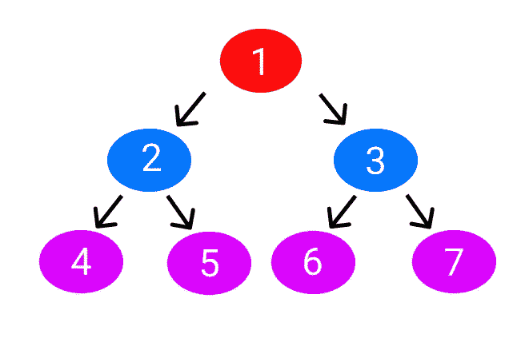

# 想学 Redux？这是给你的最简单的指南

> 原文：<https://javascript.plainenglish.io/want-to-learn-redux-so-here-is-the-easiest-guide-for-you-2b935075e897?source=collection_archive---------11----------------------->

## 管理状态的最简单方法之一。


source: [pexels](https://www.pexels.com/photo/woman-sitting-in-front-of-macbook-313690/)

这里有一个简短的帖子，我会用最简单的方法教你 redux。

它实际上会是一系列的片段。这是我将描述 redux 以及如何尽可能简单地使用它的第一部分。

让我们开始吧。

在学习新东西之前，我会不断考虑它能解决什么，它能轻松解决什么问题，或者它能如何帮助我。

也就是说，让我们首先检查为什么我们应该使用 Redux。

假设您有七页，如下所示。



Source: Author

并且您希望您的用户信息(如您的用户名和电子邮件地址)出现在第一、第四和第七页上。

你有什么计划？在第一页上填写您的用户详细信息，然后将道具从第一页传递到第二页，最后传递到第四页。同理，从第一页到第三页，再到第七页。

真的有这么难吗？

假设你的应用程序有一个中等或巨大的代码库，这意味着你可能有几个组件，这将更难发送下来的道具。

这个道具钻探问题会使你的应用程序更难操作，消耗更多的资源，降低速度。

那么，解决办法是什么呢？解决方法是使用 Redux。

什么时候应该使用 Redux？正确的解决方案来自 redux 文档，该文档指出在以下情况下应该使用 Redux:

*   您有大量的应用程序状态，应用程序中的许多地方都需要它们
*   应用状态经常更新
*   更新该状态的逻辑可能很复杂
*   该应用程序有一个中型或大型代码库，可能会有很多人在工作
*   您需要了解这种状态是如何随着时间的推移而更新的

因此，如果你的应用属于这些类别，你必须利用 Redux。

到目前为止，你已经了解了很多关于 Redux 的知识，比如为什么以及何时使用它，但是我们还没有了解 Redux 是什么。

它是一个开源的 JavaScript 工具包/包，用于管理和集中应用程序状态。

“国家”一词的确切含义是什么？它通常指商店管理的状态或值。状态可以是我们希望更新或显示的任何东西，比如特定的数字、用户或其他任何东西。

Redux 包将因为存储、缩减、动作和分派而工作。

是的，就这些。你只需要理解这四个简单的概念就可以开始了。

激动吗？让我们开始吧。

*   一个*存储库*仅仅是一个保存所有状态的状态容器。
*   一个动作，顾名思义，会导致某事发生。简单来说，就是说要做什么。
*   Reducer 知道如何执行动作。
*   最后， *dispatch* 是一个分派动作的函数。

再读一遍。当我们使用一个例子时，不要紧张；你会理解得更好。

最后，我们来看一个将数字加 1 的基本例子。

这可以理解。

你需要为此开发一个应用程序。

```
npx create-react-app myapp
```

创建应用程序后，更改目录，即

```
cd myapp
```

现在让我们安装需求。

```
npm install redux react-redux
```

Redux 和 React Redux 将作为依赖项安装。Redux 是一个状态管理工具，react-redux 会把你的 react 项目和 redux 连接起来。

这就是它的全部；现在，您已经准备好编写第一个 redux 示例了。

你还记得商店的定义吗？存储只是一个保存所有状态的状态容器。

让我们从创建商店开始，是的，你必须包装你的应用程序。为此，请将代码粘贴到 src 文件夹中的 index.js 文件中。

```
import React from 'react';
import ReactDOM from 'react-dom';
import App from './App';import { createStore } from "redux";
import { Provider } from "react-redux";let store = createStore();ReactDOM.render(
<Provider store={store}>
  <App />
</Provider>,
document.getElementById("root")
);
```

如果你读了上面的代码，你会很容易理解。我们创建了一个商店，并将其连接到我们的应用程序。

商店将由 createStore()创建，商店将由 Provider 提供给我们。

这不是很简单吗？

减压器会被店家拿走，但我们会在后面具体说明。

现在，让我们谈谈行动。记住定义:一个动作，顾名思义，会做一些事情。简单地说，它告诉我们该做什么。

因此，在 src 文件夹中创建两个文件夹。第一是行动，第二是减速器。

然后在 action 文件夹中创建一个名为 index.js 的文件。

```
export const increment = () => {
return {
 type: "INCREMENT",
};
};
```

它是一个指示减速器增加的函数，而且它确实是一个动作。

在 reducers 文件夹中创建一个名为 add.js 的文件。

这里将实现递增状态的逻辑。另外，我们定义初始状态为 0。

简单地说，我们已经定义了一个条件，它将状态增加 1。

你听说过吧？Reducer 了解如何执行活动。

```
const add = (state = 0, action) => {switch (action.type) {
  case "INCREMENT": return state + 1;
  default: return state;
}};export default add;
```

现在，在 reducers 文件夹中，创建一个 index.js 文件并粘贴下面的代码。

```
import add from "./add";
import { combineReducers } from "redux";const everyReducers = combineReducers({
add: add
});export default everyReducers;
```

我们在这里导入了 add reducer。

但是为什么是这个特殊的文件？聚集所有减速器并将其存储在一个文件中。

简单说，你必须通过全球商店内的减速器。但是如果你有很多减速器呢？那你就要这样进行下去。

让我们现在把减速器递给商店。

index.js 文件可以在 src 文件夹中找到。只需导入减速器，并将其传递给商店。

```
import React from 'react';
import ReactDOM from 'react-dom';
import App from './App';import { createStore } from "redux";
import { Provider } from "react-redux";
**import everyReducers from "./reducers/index";****let store = createStore(everyReducers);**ReactDOM.render(
<Provider store={store}>
  <App />
</Provider>,
document.getElementById("root")
);
```

最后，我们会在我们的应用程序上显示它。

App.js 文件可能位于您的 src 文件夹中。打开它，粘贴下面的代码。

```
import React from "react";
import { useSelector, useDispatch } from "react-redux";
import { increment } from "./action/index";
import "./App.css";function App() {
const add = useSelector((state) => state.add);
const dispatch = useDispatch();return (
<div className="App">
  <h1> Increment the count {add} </h1>
  <button onClick={() => **dispatch(increment())**}>+</button>
</div>
);}export default App;
```

如前所述，dispatch 是一个将分派动作的函数。

```
dispatch(increment())
```

最后，useSelector()函数将从存储中检索最近的状态，并将其显示在 h1 标记中。

```
const add = useSelector((state) => state.add);<h1> Increment the count {add} </h1>
```

这是你的输出。

## 让我们结束吧

希望对你有帮助。

更具体地说，您可以使用诸如 Context API、Easy-Peasy、Redux Toolkit 等库来管理状态。但是首先，我想向您展示如何以最基本的形式使用 redux。

在下面的文章中，我们将更深入地研究 Redux Toolkit。还有，不要着急；我将在随后的帖子中提供更多的例子，这样你可以更有效地学习。

如果可能的话，再读一遍这篇文章来澄清任何困惑。如果你有任何进一步的问题，请在评论区留下，我会尽力回答。

关注我，这样你就可以轻松获得下一个帖子。

就这样——谢谢。

如果你愿意，你可以免费甚至花很少的钱得到我的电子书。

[*如果你喜欢看这样的故事，并想帮助我成为一名作家，可以考虑成为一名中等会员*](https://nitinfab.medium.com/membership) *。它每月花费 5 美元，给你* [*无限制访问媒体内容*](https://nitinfab.medium.com/membership) *。如果你通过我的链接注册，我会得到一点佣金。*

*更多内容看* [***说白了就是***](https://plainenglish.io/) *。报名参加我们的* [***免费周报***](http://newsletter.plainenglish.io/) *。关注我们* [***推特***](https://twitter.com/inPlainEngHQ) *和*[***LinkedIn***](https://www.linkedin.com/company/inplainenglish/)*。查看我们的* [***社区不和谐***](https://discord.gg/GtDtUAvyhW) *加入我们的* [***人才集体***](https://inplainenglish.pallet.com/talent/welcome) *。*