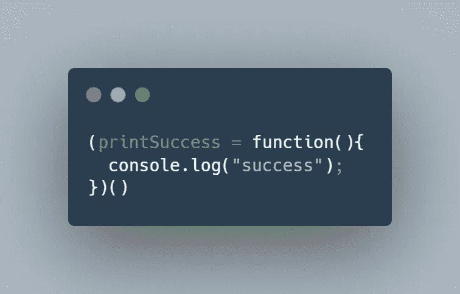

# 想了解立即调用的函数表达式(IIFEs)吗？你现在可以开始了

> 原文：<https://javascript.plainenglish.io/want-to-understand-immediately-invoked-function-expressions-you-can-start-now-9afb9dc460c8?source=collection_archive---------21----------------------->

## Javascript 有三种类型的函数:命名函数、匿名函数和生活函数。你知道区别吗？


Photo by [Rod Long](https://www.instagram.com/rodlong/)

立即调用函数表达式，或 IIFE，顾名思义。它们是在您定义它们之后立即被调用的函数。

以下面的示例代码为例:


这是名为 `printSuccess`的*的函数声明。在这种情况下，除非您提供函数调用`printSuccess()`，否则函数`printSuccess`不会运行。*

但是如果我们想让`printSuccess`立即运行呢？编译器一遇到函数声明，我们就希望函数在没有函数调用的情况下执行。


这是我们实现这一目标的方法。如你所见，我们将一个*匿名*，未命名的函数放在括号中，后面跟着`();`

当编译器遇到这个样本代码时，它会立即执行，并将`success`打印到控制台。但是如果我们真的想一遍又一遍地使用这个函数呢？因为现在，上面的生命只会执行一次。



这就是我们如何实现这一目标。当编译器遇到这一行代码时，仍然会立即调用函数，并将`success`打印到控制台。然而，这也将允许我们通过调用`printSuccess();`来重用该函数

# 找出问题所在

这里有一个快速练习:

最近，我在构建一个随机报价生成器，我使用一个 API 来生成这些报价。


上面的代码代表了这个函数最初的样子。如您所见，我提供了一个函数定义，紧接着是一个函数调用。这似乎是一个生活的好机会。


最初，我是这样做的。但出于某种原因，它不起作用。你能发现问题吗？

**注意**:我们保留了最后一行，因为我们希望`generateQuote`函数可以重用。当用户点击一个按钮时，我们希望用户能够生成新的报价，这意味着我们将不得不一次又一次地调用这个函数。

你能想出快速解决办法吗？


这也不是答案。会出现错误。为什么？


这就是答案。在本例中，`generateQuote`将被立即调用。并且在函数声明之后，我们可以随时重用`generateQuote`函数。

# 示例代码

这里有一些您可以使用的示例代码。

```
(generateQuote = function (){
    console.log("trip")
})();/*
   **prints:**
   trip
*/(  foo = function (){
    let x =2;
    let y =5;
    console.log(x+y)
})();foo();
/*
   **prints:**
   7
   7
*/(function (){
    let x =2;
    let y =5;
    console.log(x*y)
})();
/*
   **prints:**
   7
*/(function (x = 0){
    let y =5;
    console.log(x*y)
})();
/*
   **prints:**
   0
*/(sum = function (x = 4){
    let y =5;
    console.log(x*y)
})();sum(10);
/*
   **prints:**
   20
   50
*/let x = 4;
let y = 2;
(sum = function (){
    let x = 0;
    let y =5;
    console.log(x*y)
})();sum();/*
    **prints**:
    0
    0
*/
```

*更多内容看* [*说白了。报名参加我们的*](http://plainenglish.io/) [*免费每周简讯*](http://newsletter.plainenglish.io/) *。在我们的* [*社区*](https://discord.gg/GtDtUAvyhW) *获得独家写作机会和建议。*