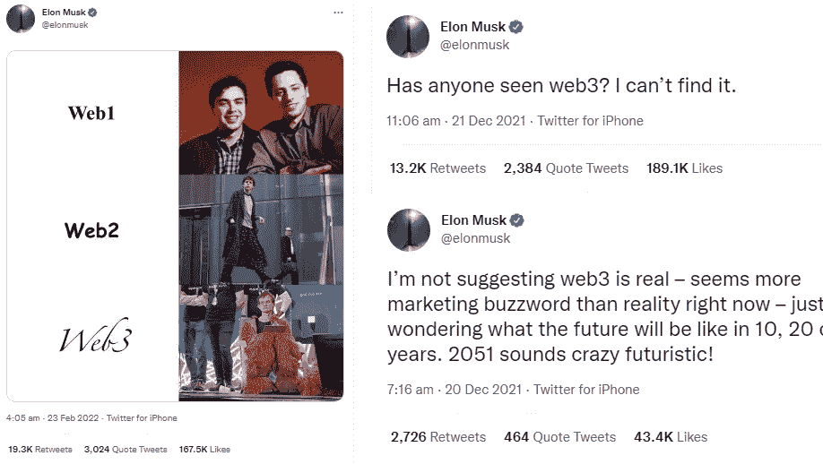

# Web 3.0 只是“加密兄弟”的炒作吗？

> 原文：<https://javascript.plainenglish.io/was-web-3-0-just-hype-created-by-crypto-bros-e1348085daa7?source=collection_archive---------14----------------------->

## 从开发人员的角度来看，这是一个诚实的、未经过滤的观点。

Photo by [Tanja Cotoaga](https://unsplash.com/@tarafuco?utm_source=medium&utm_medium=referral) on [Unsplash](https://unsplash.com?utm_source=medium&utm_medium=referral)

过去几个月，加密货币下跌了 35%—40 %,成为最不稳定的投资资产。

那么，该不该投资“加密货币”和“买 dip”呢？答案是，这完全取决于你的看法，你应该根据自己的知识行事。

我不是一个可以告诉你是否投资于不稳定资产的财务顾问，也不是在推广任何类型的加密货币。

此外，由于加密货币的巨大垮台，Web 3.0 的“可信度”急剧下降。加密货币是在 Web 3.0 中使用的令牌，用于进行任何类型的交易，这促进了没有统治者的分散系统的格言。

对于“Web 3.0 只是一场炒作吗？”——一个大大的不。

我不是在宣传 Web 3.0，也不打算卖给你我的 NFTs，但是，Web 3.0 不仅仅是一个炒作。

## 埃隆·马斯克对 Web 3.0 有什么看法？

埃隆·马斯克(Elon Musk)用各种可能的方式淹没了他的 Twitter 账户，贬低 Web 3.0。来自一个拥有数百万崇拜者的人的这种推文引发了大量关于第三代互联网存在的问题。

Tweets from Twitter handle([at]elonmusk)

Web 3.0 正处于发展的早期阶段，毫无疑问，它肯定需要一些时间来稳定自己。但这并不意味着区块链的技术有缺陷。

## 下一步是什么？

很多人把 Web 3.0 和名人购买的昂贵的 NFT 联系在一起，让自己感到困惑。使用它不需要投资 Web 3.0。

为更多受众实施 Web 3.0 后的 3 大转变—

*   经营互联网的大玩家将被淘汰
*   新一波的内容创作者将会接手。(就像因 Tik Tok 而成为大名人的内容创作者一样)
*   安全可靠的互联网源于技术(区块链)

不管 Cryptos 是涨是跌，开发者们押注的是 Web 3.0 给用户带来的技术。

我已经听了几百次“NFT 是人类历史上最大的骗局”，就个人而言，如果你花高价买了一个没有用例或者根本没有需求的 NFT，那么你就是被骗了。

但重要的是 NFT 给用户的技术。NFT 用区块链把所有权给了它的主人(这是革命性的)。

每个人都可以在网上看到谁拥有存储在区块链上的无法复制的东西。

## 最后的话

我们真正应该支持的是 Web 3.0 承诺的技术，尽管事实上许多人正在创建没有实际用途的不同令牌。

关于我——我是*科技*和*自我提升* [*的顶级作家点击这里*](https://aniketz.medium.com/) *阅读更多我的文章。*

就这样，这是文章的结尾。希望它对你有价值。如果你喜欢这篇文章，点击这里订阅我的邮件列表。我会通过电子邮件给您发送技术相关的文章。

 [## 通过我的推荐链接加入 Medium-Aniket

### 作为一个媒体会员，你的会员费的一部分会给你阅读的作家，你可以完全接触到每一个故事…

aniketz.medium.com](https://aniketz.medium.com/membership) 

[**通过电子邮件获取我的文章点击这里**](https://aniketz.medium.com/subscribe) **|** [**购买 5 美元中等会员资格**](https://aniketz.medium.com/membership)

**(推荐链接，当你使用这个链接购买会员资格时，我将获得一小笔佣金)**

*更多内容看* [***说白了就是***](http://plainenglish.io/) *。报名参加我们的* [***免费周报***](http://newsletter.plainenglish.io/) *。在我们的* [***社区不和谐***](https://discord.gg/GtDtUAvyhW) *获得独家获取写作机会和建议。*