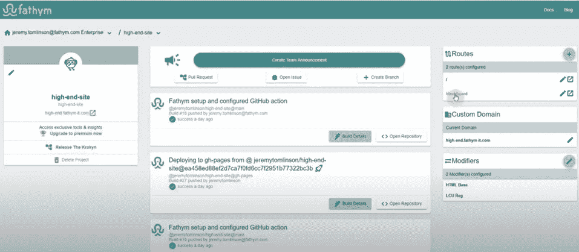
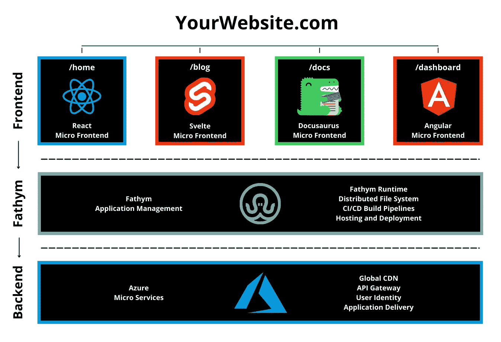

# 观看并学习如何模块化你的整体

> 原文：<https://javascript.plainenglish.io/watch-learn-how-to-modularize-your-monolith-4f928549d514?source=collection_archive---------9----------------------->

六月初，我们结束了第二次 Discord 现场会议。我们应该报告它是成功的。

当我们继续向世界展示微前端是多么有用时，我们决定从通常的起点开始:从一个整体到一个更加模块化的方法。在我们的直播中，我们演示了如何做到这一点。

以下是我们对 Fathym 完全模块化微前端的直观展示:

当你用 Fathym 模块化你的 monolith 时，对最终用户来说，所有的路线(定价，文档等。)似乎一切都是在同一个框架中编写的。但是，最终用户不知道它是否有反应、角度等。这为开发人员提供了使用新技术的可能性，并根据每个页面/应用程序的需要进行更好的调整。

如果你还在使用 monolith，并且你的主机是 Fathym，你可以从一次打开一个页面开始。这使您可以从小处着手，并按照自己的速度沿着模块化的道路继续前进。这段视频展示了如何做到这一点:

关于这个话题的更多阅读，请点击这里查看我们的[模块化你的 monolith 前端博客。](https://www.fathym.com/blog/articles/2022/may/2022-05-31-modularize-your-monolith-one-page)请务必[注册一个免费账户](https://www.fathym.com/dashboard)从今天开始使用我们的微前端。

【https://www.fathym.com】最初发表于**。**

**更多内容请看*[***plain English . io***](https://plainenglish.io/)*。报名参加我们的* [***免费周报***](http://newsletter.plainenglish.io/) *。关注我们关于*[***Twitter***](https://twitter.com/inPlainEngHQ)*和*[***LinkedIn***](https://www.linkedin.com/company/inplainenglish/)*。查看我们的* [***社区不和谐***](https://discord.gg/GtDtUAvyhW) *加入我们的* [***人才集体***](https://inplainenglish.pallet.com/talent/welcome) *。**