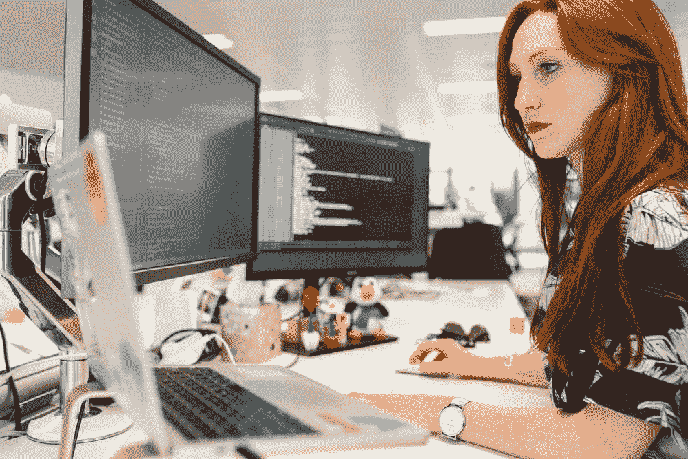

# 小心开发者:DeepMind AI 现在可以像普通程序员一样编写代码

> 原文：<https://javascript.plainenglish.io/watch-out-developers-deepmind-ai-can-now-write-code-as-well-as-the-average-programmer-48001c0c6e73?source=collection_archive---------20----------------------->

## 在不久的将来，编程工作可能会减少。

Photo by [Possessed Photography](https://unsplash.com/@possessedphotography?utm_source=medium&utm_medium=referral) on [Unsplash](https://unsplash.com?utm_source=medium&utm_medium=referral)

软件编程始于 200 多年前阿达·洛芙莱斯对查尔斯·巴贝奇的分析引擎的贡献。继 Lovelace 在 19 世纪的开创性工作之后，对软件编程的潜在影响和开发人员编程简易性的改进稳步但缓慢。直到 150 多年后的 1954 年，第一种被广泛接受的高级编程语言 Fortran 首次向开发者展示。

然而现在，突然之间，当编程刚刚进入鼎盛时期时，DeepMind 向我们展示了 AlphaCode，这种人工智能不仅可以编写垃圾代码，还可以编写比一些人类开发人员更好的代码。

不相信我？从 DeepMind 自己那里听到的。

“AlphaCode 通过解决需要综合运用批判性思维、逻辑、算法、编码和自然语言理解的新问题，在编程竞赛的参与者中排名前 54%。”——[*deep mind*](https://www.deepmind.com/blog/article/Competitive-programming-with-AlphaCode)

# 这对今天有抱负的开发者意味着什么？

Image by [ThisisEngineering RAEng](https://unsplash.com/@thisisengineering) on [Unsplash](https://unsplash.com/)

当然，这是目前每个人脑海中价值百万美元的问题——当我读到 DeepMind 最近的成就时，它肯定在我的脑海中爆发了。

然而，事实是，这个问题特别难回答，并且引发了一场持续的辩论，这场辩论从编程开始以来就一直在持续。没有人能绝对肯定地告诉你开发者会变成什么样。

然而，即使我们假设最坏的情况——软件开发将在不久的将来成为过去的职业道路——我们也可以从两件事情中得到安慰:

1.  AlphaCode 令人印象深刻，但还不足以撼动编程行业。
2.  历史一次又一次地证明，通常当工作岗位流失时，新的工作岗位就会产生。

尽管如此，关于第一点，技术发展的[摩尔定律](https://www.synopsys.com/glossary/what-is-moores-law.html#:~:text=Moore's%20law%20is%20a%20term,doubles%20about%20every%20two%20years.)可能表明，像 AlphaCode 这样的人工智能能力的进步将比我们准备的更快。

此外，关于第二点，一旦不再需要人类程序员，就会创造一些其他好工作，这实际上可能不是真的。在《纽约时报》的畅销书《21 世纪的 21 个教训》中，尤瓦尔·诺亚·哈拉里(Yuval Noah Harari)确实为人工智能革命创造新工作的速度可能不会与它主宰现有工作的速度相同提供了一个强有力的案例。用一句话概括，他指出了一个我们都想否认的显而易见的事实。

*“没有一份剩余的人类工作会免受自动化的威胁，因为机器学习和机器人技术将会继续进步”——哈拉里*

**长话短说，编程可能很快就会成为过去的工作，就像保龄球馆的排瓶机或人类闹钟一样。**

感谢您的阅读！请随意分享对这一新的人工智能进步的任何想法和意见。

如果你想阅读更多关于人工智能的新闻，请考虑下面的文章:

 [## 人工智能可以很快从你的 DNA 中认出你的脸

### 自动面部识别最早是由数学家伍德罗·布莱索和计算机科学家海伦·陈·沃尔夫在 20 世纪 60 年代开创的

medium.com](https://medium.com/@thecoderhaven/ai-could-soon-recognize-your-face-from-just-your-dna-8672f2d27d36) 

要了解更多关于 AlphaCode 的信息，它是如何创建的，以及用来测试其能力的编程挑战，请随时查看 DeepMind 关于其成就的官方帖子:

 [## 用 AlphaCode 进行竞争性编程

### 使用 AlphaCode 解决新问题的竞争性编程，并在竞争性编程中树立新的里程碑…

www.deepmind.com](https://www.deepmind.com/blog/article/Competitive-programming-with-AlphaCode) 

*更多内容请看**[***说白了。报名参加我们的***](http://plainenglish.io/) **[***免费周报***](http://newsletter.plainenglish.io/) *。在我们的* [***社区不和谐***](https://discord.gg/GtDtUAvyhW) *获得独家获取写作机会和建议。****