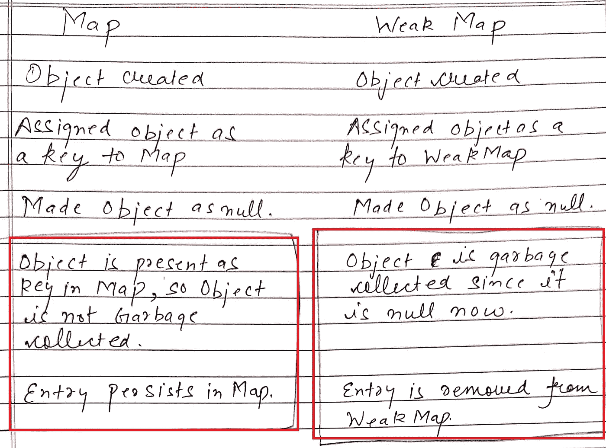

# JavaScript 中的 WeakMap

> 原文：<https://javascript.plainenglish.io/weakmap-in-javascript-1c8f6e6412b9?source=collection_archive---------11----------------------->

## JavaScript 中的 WeakMap 是什么？它是如何工作的，WeakMap 与 Map 有何不同？


Photo by [Mohammad Rahmani](https://unsplash.com/@afgprogrammer?utm_source=medium&utm_medium=referral) on [Unsplash](https://unsplash.com?utm_source=medium&utm_medium=referral)

在本文中，我们将研究 JavaScript 的一种更高级的数据结构，即 WeakMap。

我假设你在深入 WeakMap 之前对地图有一些基本的了解。如果没有，你可以浏览我解释过[地图](/an-introduction-to-map-in-javascript-for-beginners-347a97da936a)的文章。

综上所述——***地图是一种特殊类型的对象，可以有原始数据类型，也可以有对象作为关键字*** 。

在 WeakMap 中，不允许将原始数据类型作为键。相反，只允许对象作为键。

但你一定想知道，如果这是 Map 和 WeakMap 之间的唯一区别，为什么要使用另一种数据结构？我们将很快达到这一部分。

让我们通过一个例子来理解它——

```
let map = new Map();let obj1 = {topic: 'Map',};map.set(obj1, 'This is a map tutorial');console.log(map); // Map { { topic: 'Map' } => 'This is a map tutorial' }obj1 = null;console.log(map);  // Map { { topic: 'Map' } => 'This is a map tutorial' }
```

正如您在上面的示例中看到的，即使我们将键(obj1)设置为空，map 中仍然存在该特定键的条目。

现在，我们将使用 WeakMap 尝试相同的示例。

```
let weakMap = new WeakMap();let obj1 = {topic: 'Weak Map',};weakMap.set(obj1, 'This is a weak map tutorial');console.log(weakMap); // Map { { topic: 'Map' } => 'This is a weak map tutorial' }obj1 = null;setTimeout(() => {console.log(weakMap); // WeakMap {}},100000)
```

在这里，观察我们什么时候使 WeakMap 的键为空。一旦我们这样做了，相应的条目也会从 WeakMap 中删除。为什么这样

**因为 WeakMap 中的键引用与对象的链接很弱，即如果对象从内存中移除(我们在这里通过将 obj1 设为 null 来完成)，则相应的 WeakMap 条目也将被移除。**

如果您尝试运行上面的 WeakMap 代码，它可能不会给出预期的输出。

主要原因是这个 obj1 仍然在内存中，还没有被垃圾收集器收集。

这就是为什么我们使用 setTimeout 来可视化用例。在正常使用中，您可以使用 WeakMap 而没有任何超时，垃圾收集器将负责从内存中删除对象。

**weak Map 优于 Map-**

WeakMap 相对于 Map 的最大优势之一是 ***防止内存泄漏*** 。

在 Map 的情况下，键是紧密链接的。因此，即使我们从内存中删除对象的引用，在 Map 的情况下，对象也不会被垃圾收集，因为作为 Map 的键，它具有很强的链接性。

与此相反，WeakMap 中的键是弱链接的，即只要对象的引用为空，其对应的条目就会从 WeakMap 中删除，从而该对象被垃圾收集器收集。

与地图不同，WeakMap 仅支持少数属性。

1.  set 方法用于在弱映射中设置值，其中第一个参数是 key，它应该始终是 object 类型。

```
weakMap.set(obj1, 'This is a weak map tutorial');
```

2.get 方法用于获取作为参数传入的特定键值。

```
console.log(weakMap.get(obj1)); // This is a weak map tutorial
```

3.has 方法基于作为参数传入的属性返回一个布尔值，该参数是否作为键存在。

```
console.log(weakMap.has(obj1));  // true
```

4.delete 方法用于从弱映射中删除一个属性，如果该属性存在于弱映射中并被成功删除，则该方法返回布尔值。

```
console.log(weakMap.delete(obj1));  // true
```

简而言之，这就是 WeakMap。

希望你现在对 WeakMap 有了更好的了解。如果您有任何疑问或反馈，请在回复中告诉我。

为了更清楚地图和 WeakMap 之间的区别，请参考下面的快照。



Difference between Map and Weak Map

你可以在这里阅读我的其他文章[，另外，你可以订阅我的时事通讯，获取我发表的最新文章。](https://medium.com/@avinash.dev21987)

*更多内容看* [***说白了。报名参加我们的***](https://plainenglish.io/) **[***免费周报***](http://newsletter.plainenglish.io/) *。关注我们关于*[***Twitter***](https://twitter.com/inPlainEngHQ)*和*[***LinkedIn***](https://www.linkedin.com/company/inplainenglish/)*。加入我们的* [***社区***](https://discord.gg/GtDtUAvyhW) *。***