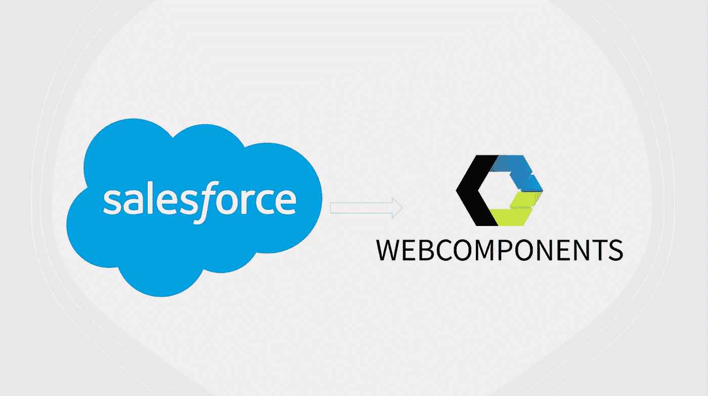
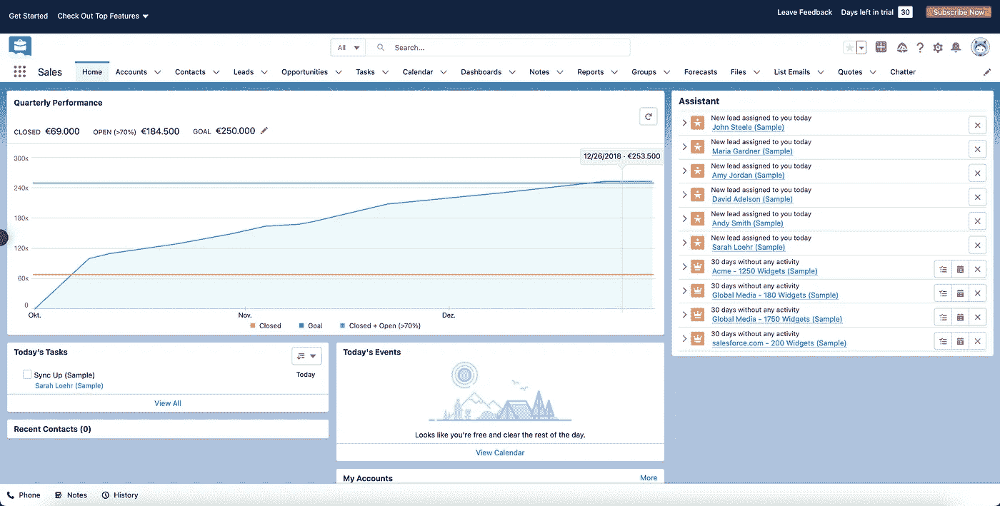
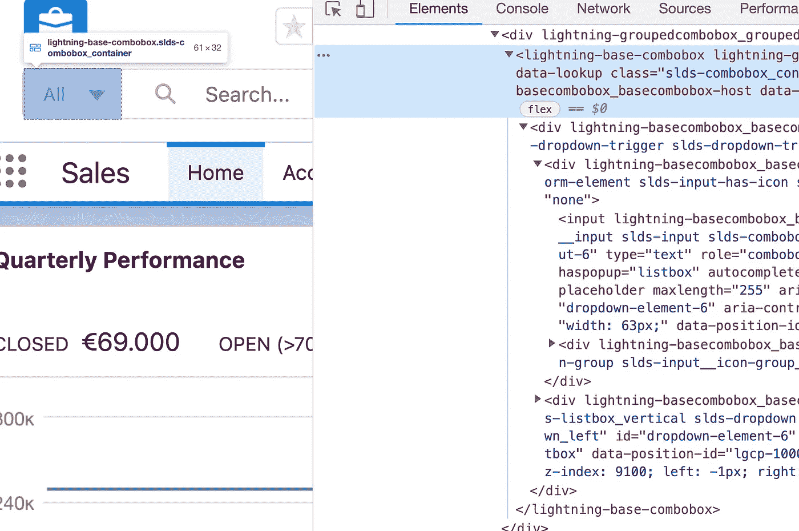
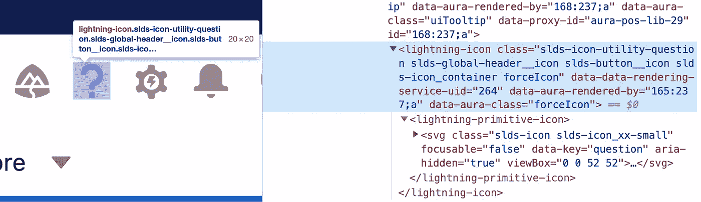

# 大型科技公司的 Web 组件:Salesforce

> 原文：<https://javascript.plainenglish.io/web-components-at-big-tech-companies-salesforce-89a8a4c97d04?source=collection_archive---------4----------------------->

## 如果企业可以部署 web 组件，那么您也可以！



今天不想讨论[Web 组件是否会取代前端框架](https://medium.com/@mariusbongarts/will-web-components-replace-frontend-frameworks-535891d779ba)。此外，我并不急于讨论前端框架是否是 Web 开发的未来，正如我不想讨论 Web 组件是否已经死亡的。在接下来的文章中，我将重点关注已经涉足 Web 组件领域的大型科技公司。

我们已经了解了[Github 如何使用 Web 组件](https://medium.com/p/812e632e1650)来使其代码库更加健壮和灵活。在下面的文章中，我们也来看看不同的公司: [**YouTube**](https://levelup.gitconnected.com/web-components-at-big-tech-companies-youtube-84266bb507fd) **、SAP、**和其他*。*他们都决定以不同的方式依赖 Web 组件，有些更多，有些更少。我们将发现为什么这些公司依赖 Web 组件，以及他们是如何实现它的。本文将深入研究 Salesforce，分析他们在现有的整体代码库中使用 Web 组件的方法。我想强调的是，我不为 **Salesforce** 工作，不了解他们的内部基础设施。因此，如果您碰巧在那里工作，如果我正确理解和再现了 Salesforce 的技术现实，请随时给我反馈。

如果你是第一次接触 **Web 组件**这个话题，我建议你先阅读[这篇文章](https://medium.com/@mariusbongarts/will-web-components-replace-frontend-frameworks-535891d779ba)，了解什么是 Web 组件。如果您想更深入地了解技术细节，可以关注我的系列文章之一:

*   [完整的 Web 组件指南](https://medium.com/@mariusbongarts/the-complete-web-component-guide-part-1-custom-elements-a627af805df8)
*   [使用 Web 组件构建自己的博客组合](https://medium.com/@mariusbongarts/showcase-your-medium-articles-with-web-components-part-1-basics-d2c6618e9482)

[](https://levelup.gitconnected.com/web-components-at-big-tech-companies-github-812e632e1650) [## 大型科技公司的网络组件:Github

### 如果企业可以部署 web 组件，那么您也可以！

levelup.gitconnected.com](https://levelup.gitconnected.com/web-components-at-big-tech-companies-github-812e632e1650) 

# 销售力量

Salesforce 是一家基于云的软件公司，提供客户关系管理(CRM)服务。根据 Salesforce 的调查，各行各业超过 150，000 家公司正在通过 Salesforce 发展业务。此类公司使用 Salesforce 完全可定制的服务来构建其企业应用程序。公司可以使用自己的软件创建自己的组件、对象和用户界面。人们可以想象，在这样的规模上，构建有弹性且持久的前端架构可能极具挑战性。

> 如果我们的客户今天编写了一个组件，它必须在未来十年内都可以工作。”——[迭戈·费雷罗·瓦尔](https://www.youtube.com/watch/?v=iFp-P2UJT_Y)

大约六年前，Salesforce 有机会从头开始构建新的前端架构。[T4 Salesforce](https://twitter.com/diervo?lang=en)的首席架构师 Diego Ferreiro Val 在 [WebComponentsSF](https://twitter.com/webcomponentssf?lang=en) 上表示，sales force 的开发人员当时并不开心。他们现有的用户界面已经有八年的历史了，但是技术已经非常专有。他们想要一个现代的解决方案，同时，**标准化**来构建他们可以在其他地方重复使用的东西。

> 如果我们重新开始，我们会做什么？— [迭戈·费雷罗·瓦尔](https://www.youtube.com/watch/?v=iFp-P2UJT_Y)

他们花了几个月的时间调查不同的框架，分析业内最好的技术公司如何设计他们的前端架构。经过深思熟虑，他们得出了一个有趣的观察结果:**网络平台在没有破坏任何人的情况下得以发展**。

> 我们的目标是永远不让我们的客户失望— [迭戈·费雷罗·瓦尔](https://www.youtube.com/watch/?v=iFp-P2UJT_Y)

Salesforce 总结道，面向未来的最佳方式是尽可能与标准保持一致。满足这些需求的最佳技术是 **Web 组件**。Web 组件有四个显著的好处:

*   **互操作性**
*   **封装**
*   **未来的证明**
*   **向后兼容性**

通过建立在标准之上，Salesforce 为长期发展做好了准备，并使其平台**面向未来**。Web 组件提供了很好的**封装**，并使组件**能够在不同的应用程序之间互操作**，而不管使用的前端框架是什么。

> 我们花了一段时间才得出这个结论，但这是我们正在建设的核心。— [迭戈·费雷罗瓦尔](https://www.youtube.com/watch/?v=iFp-P2UJT_Y)

但是，Salesforce 在企业范围内应用 Web 组件时也遇到了许多挑战。Ferreiro 和他的团队观察到，web 组件标准提供了一个太低级的 API，不能直接向 Salesforce 客户公开。这就是为什么他们创建了 **Lightning Web Components** 来在其上添加他们自己的语法糖，并解决使用 Web 组件时常见的陷阱和问题。

## Lightning Web 组件

Lightning Web Components (LWC)使用核心 Web 组件标准，并且仅提供在 Salesforce 支持的浏览器中运行良好所需的内容。因为 Lightning Web Components 构建在浏览器中本地运行的代码上，所以它是轻量级的，并且提供了卓越的性能。它在现有标准的基础上增加了更好的**人体工程学**、[、**可访问性**、](https://medium.com/@mariusbongarts/4-simple-steps-to-make-your-website-accessible-a29ec305da1e)、**性能**、**浏览器兼容性**。

费雷罗在 2019 年表示，当时已经有 100 万个组件是使用 Lightning Web 组件创建的。此外，95 %的开发人员认为 web 组件是正确的方向。

在网络标准方面，自 2019 年费雷罗发表以来，发生了很多事情。web 组件标准在不断改进。尤其是在浏览器兼容性方面发生了很多事情。随着 Salesforce 平台的成熟，他们可以利用越来越多的**原生 API，这提高了**的性能。这就是为什么 Salesforces 的目标不是永远依赖 LWC。在某种程度上，他们希望只建立在 web 标准上，完全独立于外部库。

> 我们的目标是让 LWC 最终消失！迭戈·费雷罗·瓦尔

## Salesforce 组件示例

Salesforce 的一个优点是你可以免费试用他们的平台。因此，让我们看看它和源代码，以找到一些自定义元素的例子。这是他们的平台在开始新的免费试用后的样子:



Salesforce platform

让我们检查源代码，找到一些[自定义元素](https://medium.com/@mariusbongarts/the-complete-web-component-guide-part-1-custom-elements-a627af805df8)。因为 lightning web 组件遵循一个惯例，总是以`<lightning-`开头，所以很容易找到它们。如果我们仔细观察前面有下拉菜单的搜索栏，我们可以在源代码中看到,`lightning-base-combobox`用于设置搜索过滤器:



Lightning Base Combobox

现在，让我们看一下搜索栏的右边。这里我们可以看到 Salesforce 使用了`lightning-icon`和`lightning-primitive-icon`自定义元素的一些图标:



Lightning Icons

您可以在平台上找到更多自定义元素。我希望这能让您感受到 Salesforce 是如何在平台中使用其 Web 组件的。

## 开源组件库

Salesforce 已经在 npm 上发布了其基础 Lightning web 组件**。[NPM 包](https://www.npmjs.com/package/lightning-base-components/v/1.14.3-alpha)包括可在 Salesforce 平台上或 Salesforce 平台外运行的基本 Lightning web 组件。这意味着您可以在项目运行中轻松使用它们:**

```
// with npm
npm install lightning-base-components

// with yarn
yarn add lightning-base-components
```

它为您提供了各种用户界面组件，如手风琴、按钮、旋转木马等等。当然，我们还可以在这里找到`lightning-combox`和`lightning-icon`元素，Salesforce 在其平台中包含了这些元素。这里有一个[代码沙箱](https://codesandbox.io/s/happy-silence-pqqd8?fontsize=14&hidenavigation=1&theme=dark)来检查如何在项目中添加那些组件。

[](https://levelup.gitconnected.com/web-components-at-big-tech-companies-youtube-84266bb507fd) [## 大型科技公司的网络组件:Youtube

### 今天，我不想讨论 Web 组件是否会取代前端框架。还有，我不急于讨论…

levelup.gitconnected.com](https://levelup.gitconnected.com/web-components-at-big-tech-companies-youtube-84266bb507fd) 

# 最后的想法

像许多其他公司一样，Salesforce 决定越来越关注网络标准。将他们现有代码库的一部分封装到更小的、通用的、灵活的 Web 组件中，使得他们现有的代码库耦合性更低。最重要的是，这些组件可以在任何 web 环境中重用，独立于任何前端框架。这确保了提取的组件对任何基础设施变化都有弹性。到那时，Salesforce 已经为长期发展做好了准备，不管 Web 组件是否会成为未来或者前端框架是否会继续存在。

我总是乐于回答问题，并乐于接受批评。随时欢迎联系我！通过**[**LinkedIn**](https://www.linkedin.com/in/marius-bongarts-6b3638171/)**，**关注我**[**Twitter**](https://twitter.com/MariusBongarts)或 [**订阅**](https://medium.com/subscribe/@mariusbongarts) 通过电子邮件获取我的故事。****

****[**这里是无限制访问**](https://medium.com/@mariusbongarts/membership) 媒体上每一个内容的链接。如果你注册使用这个链接，我会赚一小笔钱，不需要你额外付费。****

****[](https://medium.com/@mariusbongarts/membership) [## 通过我的推荐链接加入 Medium-Marius bong arts

### 作为一个媒体会员，你的会员费的一部分会给你阅读的作家，你可以完全接触到每一个故事…

medium.com](https://medium.com/@mariusbongarts/membership)**** 

# ****关于作者****

****我是埃森哲软件工程分析师宋。我们一直在寻找最好的开发人员，所以如果你有兴趣加入我们，请随时联系我们！****

****最驱动我的是我想创造一些对他人有帮助和改变生活的东西的冲动🙌比如你是否厌倦了浏览自己的历史来寻找前几天看到的信息？我的 [**网站重点介绍 Chrome 扩展**](https://chrome.google.com/webstore/detail/web-highlights-%20-bookmark/hldjnlbobkdkghfidgoecgmklcemanhm) 覆盖了你，并将通过以结构化和高效的方式组织你的研究来提高你的生产力。就像你在书和文章上做的那样，突出显示任何网页或 PDF 上的文本。你的精彩片段会直接同步到 web-highlights.com 的网络应用上，你可以在任何地方找到它们。****

****[](https://chrome.google.com/webstore/detail/web-highlights-pdf-web-hi/hldjnlbobkdkghfidgoecgmklcemanhm) [## Web 亮点— PDF 和 Web 荧光笔

### 在每个网站或 PDF 上创建亮点、书签、标签和文件夹。以结构化的方式组织您的想法和研究…

chrome.google.com](https://chrome.google.com/webstore/detail/web-highlights-pdf-web-hi/hldjnlbobkdkghfidgoecgmklcemanhm)**** 

# ****进一步阅读****

****[](https://medium.com/@mariusbongarts/will-web-components-replace-frontend-frameworks-535891d779ba) [## Web 组件会取代前端框架吗？

### 它们是为解决不同的问题而构建的。

medium.com](https://medium.com/@mariusbongarts/will-web-components-replace-frontend-frameworks-535891d779ba) [](https://levelup.gitconnected.com/are-web-components-dead-12e404e0f4b0) [## Web 组件死了吗？

### 最近，我发表了一篇关于类似主题的不同问题的文章:Web 组件会取代前端吗…

levelup.gitconnected.com](https://levelup.gitconnected.com/are-web-components-dead-12e404e0f4b0) [](https://medium.com/@mariusbongarts11/my-journey-to-the-first-9-99-with-my-side-project-3edc13dd1f2d) [## 我的第一个 9.99 美元之旅与我的副业

### Chrome 扩展带来的被动收入

medium.com](https://medium.com/@mariusbongarts11/my-journey-to-the-first-9-99-with-my-side-project-3edc13dd1f2d) 

*更多内容请看*[***plain English . io***](https://plainenglish.io/)*。报名参加我们的* [***免费周报***](http://newsletter.plainenglish.io/) *。关注我们关于*[***Twitter***](https://twitter.com/inPlainEngHQ)*和*[***LinkedIn***](https://www.linkedin.com/company/inplainenglish/)*。查看我们的* [***社区不和谐***](https://discord.gg/GtDtUAvyhW) *加入我们的* [***人才集体***](https://inplainenglish.pallet.com/talent/welcome) *。*****