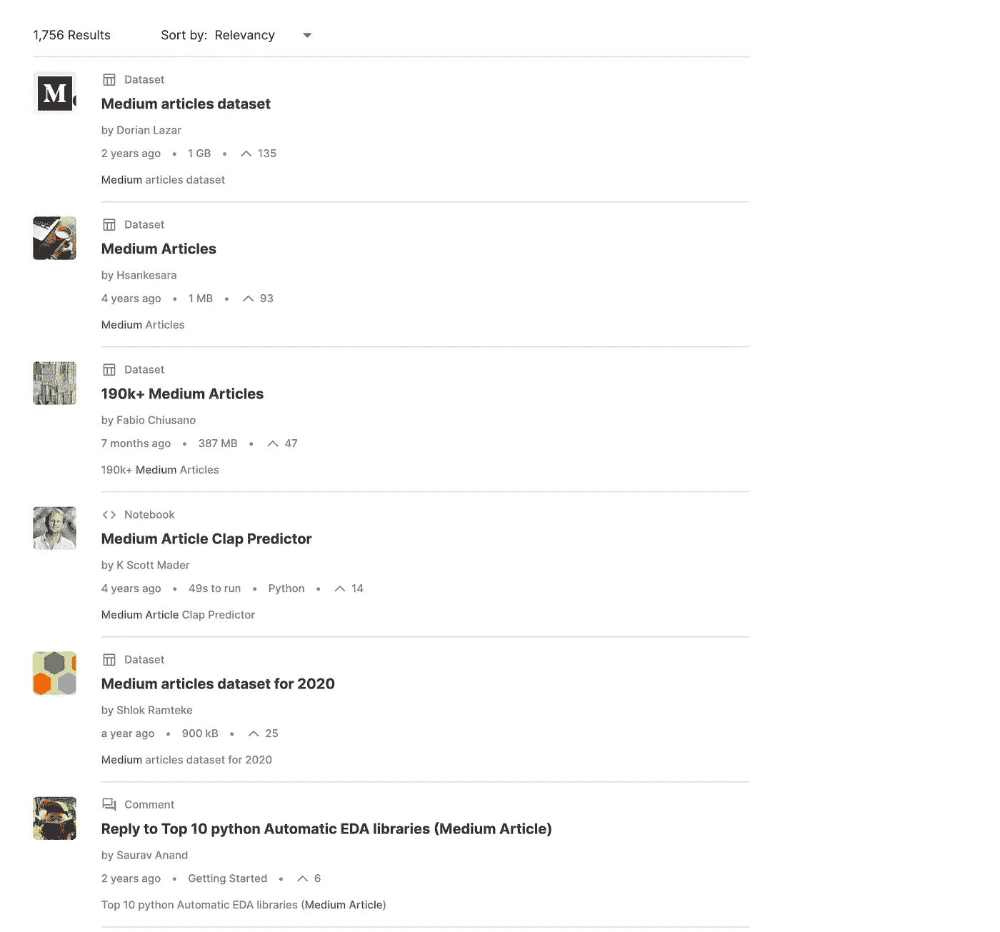
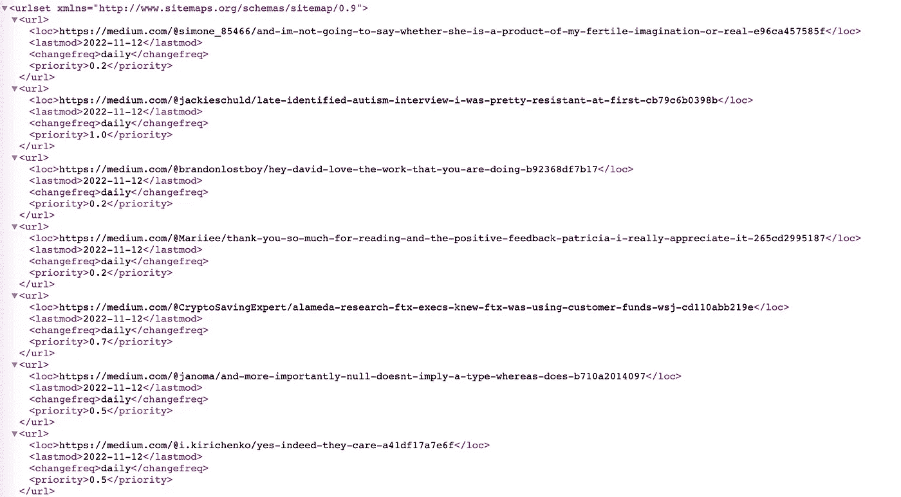

# 使用 JavaScript 的网络爬虫——这些简单的步骤帮助我获得中等文章的数据

> 原文：<https://javascript.plainenglish.io/web-crawler-javascript-these-easy-steps-help-me-get-medium-articles-data-3b9e9e76594?source=collection_archive---------6----------------------->

## 检索文章的有价值信息以供进一步分析

Photo by [Carlos Muza](https://unsplash.com/@kmuza?utm_source=medium&utm_medium=referral) on [Unsplash](https://unsplash.com?utm_source=medium&utm_medium=referral)

数据分析让我们深入了解这个领域。然而，官方并不总是能够获得这些数据。在这种情况下，抓取网站是一种替代解决方案。本文旨在为读者提供从 Medium 网站抓取数据的分步说明。

最终，我们将得到一个类似这样的数据集:

[Example dataset](https://gist.github.com/ddkhoa/6197a03aa7b8850fb23824e128de1742)

您可以运行以下分析:

*   回答以下关于平台的问题:作家什么时候发表作品？谁是最好的作者？帕累托原理适用于中等吗？…
*   探究数据中的关系:关注人数和鼓掌次数之间是否存在相关性？中等会员的文章比非中等会员的文章更受关注吗？…

例如，下面是我对 180 000 篇中型文章的分析:

 [## 出于好奇，我分析了大约 18 万篇关于媒体的文章

### 了解领先的博客平台之一

medium.com](https://medium.com/@ddkhoa.blogging/of-curiosity-i-analyzed-180-000-articles-on-medium-53f359ecdecc) 

在本教程中，我们使用自底向上的方法构建一个爬虫。首先，我们来看看一个典型的中型网页。然后，我们将看看如何收集大量文章来创建数据集。每个步骤都包含代码。

开始吧！

# 1 —从 1 篇文章中获取信息

## **1.1 —浏览页面并找到数据**

以一个典型的中型职位，打开它在一个新的标签，然后打开控制台标签。

 [## 作为一名初级开发人员，我学到了人生重要的一课

### 四年前，我毕业的时候，我知道我是大三。现在，我明白为什么我是这样的人。这给了我…

medium.com](https://medium.com/@ddkhoa.blogging/being-a-junior-developer-taught-me-the-important-life-lesson-8ad73582d912) 

我们看到了什么？

*   URL 的最后一部分是文章的 id。我们可以忽略 URL 中的其他部分。这个网址会给我们相同的页面:[https://medium.com/p/8ad73582d912](https://medium.com/p/8ad73582d912)
*   在控制台中键入`__APOLLO_STATE__`并按回车键。您将看到关于文章的所有信息。这次我们走运了。不是所有的网站都将页面数据存储在一个可见的变量中。在这种情况下，我们必须单独选取页面上的元素来提取数据。

## **1.2 —考虑实施选择和影响**

现在我们有两个提取数据的选项

**选项 1** :访问页面，将`__APOLLO_STATE__`变量的整个值保存到本地文件。然后，从中提取信息。

**选项 2** :访问页面，获取值`__APOLLO_STATE__`变量，然后只提取必要的数据并保存到本地文件。

第一个选项会产生一个额外的大文件。然而，它有一个明显的优势:如果我们需要更多的信息，我们可以从本地文件中提取，而不是重新访问页面，这必然会更慢。我选择第一个选项。

## **1.3 —编码**

这是一项简单的任务。我们首先需要下载页面。然后，我们使用`[node-html-parser](https://www.npmjs.com/package/node-html-parser)`库来解析结果。然后，我们可以抓取包含变量`__APOLLO_STATE__`的元素。

Get __APOLLO_STATE__ variable from the page

接下来，我们从变量`__APOLLO_STATE__`中提取必要的信息。我邀请你检查变量结构。它会帮助你理解下面的代码。

Extract information from __APOLLO_STATE__ variable

现在，我们添加两个实用函数来读取和写入 CSV 文件的数据。我用`[csv-stringify](https://www.npmjs.com/package/csv-stringify)`写数据，用`[csv-parse](https://www.npmjs.com/package/csv-parse)`从 CSV 文件中读取数据。

Helper functions to read/write data.

小纸条。我花了 1 个小时弄清楚为什么`writeToCSV`函数完成了，而没有运行“finish”事件中的块。

**永远不要忘记结束流！** `stringifier.end()`

现在，我们可以结合上面的功能来创建爬虫的第一个工作版本。

The pipeline.

**步骤 1 的恢复**

在这一步中，我们从 URL 中提取了一篇中型文章所需的数据。恭喜你！

在管道代码中，我将变量`urls`声明为一个数组，尽管它只有一个元素。我们进入下一步:获取文章的 URL 列表，以提供给`urls`数组。

# **2 —获取文章列表**

在这一步中，我们将得到一个 URL 列表，这是上一步的输入。我们有不同的方法来得到这个列表。

## **2.1 —考虑实施选择和影响**

**选项 1** : **使用可用的数据集**

我们可以搜索可用的数据集。Kaggle 是数据科学领域的一个热门网站。它有许多不同领域的数据集。下面是我在 Kaggle 上搜索中型文章数据的结果。

Medium article dataset on [Kaggle](https://www.kaggle.com/).

**选项二** : **通过媒体站点地图获取文章**

Medium 和其他网站一样，使用站点地图来索引其内容。这里有一个例子:

> [https://medium.com/sitemap/posts/2022/posts-2022-11-12.xml](https://medium.com/sitemap/posts/2022/posts-2022-11-12.xml)

网站地图包含 2022 年 11 月 12 日发表的文章。我们可以实现一个函数来获取某个日期或某个时间段的文章的 URL。

Medium sitemap structure

**选项 3** : **从出版物存档页面**获取文章

每个出版物还有一个存档页面，上面有所有发表的文章。比如 JavaScript 的存档页面，说白了就是 https://javascript.plainenglish.io/archive。

我们可以实现一个函数来获取存档页面，然后获取 URL。

要选择一个选项，我们**必须**考虑数据集在未来将如何被使用。每个解决方案都会产生一个具有独特特征的数据集。如果我们使用[这个 Kaggle 数据集](https://www.kaggle.com/datasets/fabiochiusano/medium-articles)，我们应该意识到数据并不是随机分散在时间上的。我们只接收选项 2 下在 Medium.com 上发表的文章，不接收在其他域名上发表的文章。当我们只从特定的出版物中收集数据时，选项 3 是相反的情况。如果您使用选项 2 或选项 3 对数据进行爬网，并且您不是中级成员，您将无法获得整篇文章的内容。

[在我的分析](https://medium.com/@ddkhoa.blogging/of-curiosity-i-analyzed-180-000-articles-on-medium-53f359ecdecc)中，我使用了包含来自 Kaggle 的大约 195，000 篇文章的数据集。在本教程中，我将向你展示如何使用 sitemap 页面获得中型文章。

## 2.2 —编码

我们将实现两个函数。第一个将获得某一天的 URL。第二个函数将根据第一个函数获取一段时间内的 URL。

Extract articles’ URLs from a sitemap

为了获取一段时间内的数据，我们生成一个包含日期在`startDate`和`endDate`之间的数组。接下来，我们调用上面的函数来获取数组中每个日期的数据，然后将它们组合成最终结果。

Extract articles’ URLs between 2 dates

现在，我们将两个步骤的结果结合起来，创建一个管道，从给定时期发表的媒体文章中提取数据。

有一点需要注意，我们不能使用有数千个元素的数组`urls`然后调用`*Promise*.all(urls.map(*item* => getMediumArticleDatadump(*item*)))`。你可能会被禁止进入该域，因为滥用了速率限制。否则，服务器也无法正常响应。我们将按块处理。

Extract Medium data in a given period.

每天都有许多文章发表在媒体上。因此，代码将需要一些时间来完成，这显然取决于机器的容量。

为了简单起见，我已经在这里完成了我的教程。当然，还有许多改进的机会。这里有几个例子；这不是一个详尽的列表。

*   将获取代码 URL 的步骤与下载和提取数据的步骤分开。例如，如果您想提取整个月的中等数据，您将有很多 URL。所以，最好创建一个从`csv`文件中读取`urls`的函数。您可以逐步处理数据。
*   构建 CLI。CLI 可以将开始日期和结束日期作为参数，然后运行 crawler。
*   去云吧！您可以将代码打包到一个容器中，然后在云上运行。

# 简历

在本文中，我们使用 Node.js 构建了一个爬虫来从 Medium 中提取文章数据。

*   **利用** `**csv-stringify**` **和** `**csv-parse**` **。**
*   **数据爬虫方法的影响。**我们应该根据数据集用例选择正确的方法。
*   浏览网站时要有耐心。先看`<script>`标签，再看 HTML 内容。

希望文章有帮助。感谢您的阅读！

*更多内容看* [***说白了就是***](https://plainenglish.io/) *。*

*报名参加我们的* [***免费每周简讯***](http://newsletter.plainenglish.io/) *。关注我们关于* [***推特***](https://twitter.com/inPlainEngHQ) ，[***LinkedIn***](https://www.linkedin.com/company/inplainenglish/)*，*[***YouTube***](https://www.youtube.com/channel/UCtipWUghju290NWcn8jhyAw)*，* [***不和***](https://discord.gg/GtDtUAvyhW)*****。*****

***有兴趣缩放你的软件启动*** *？检查出* [***电路***](https://circuit.ooo?utm=publication-post-cta) *。*