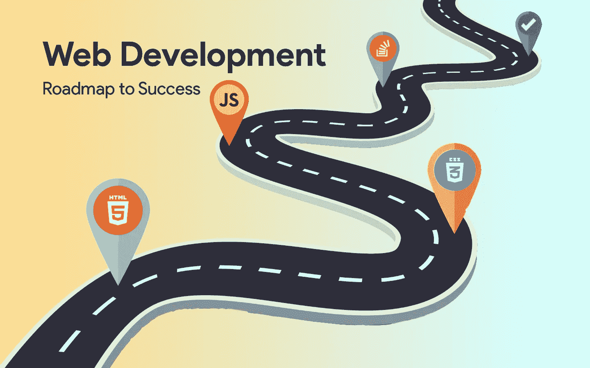
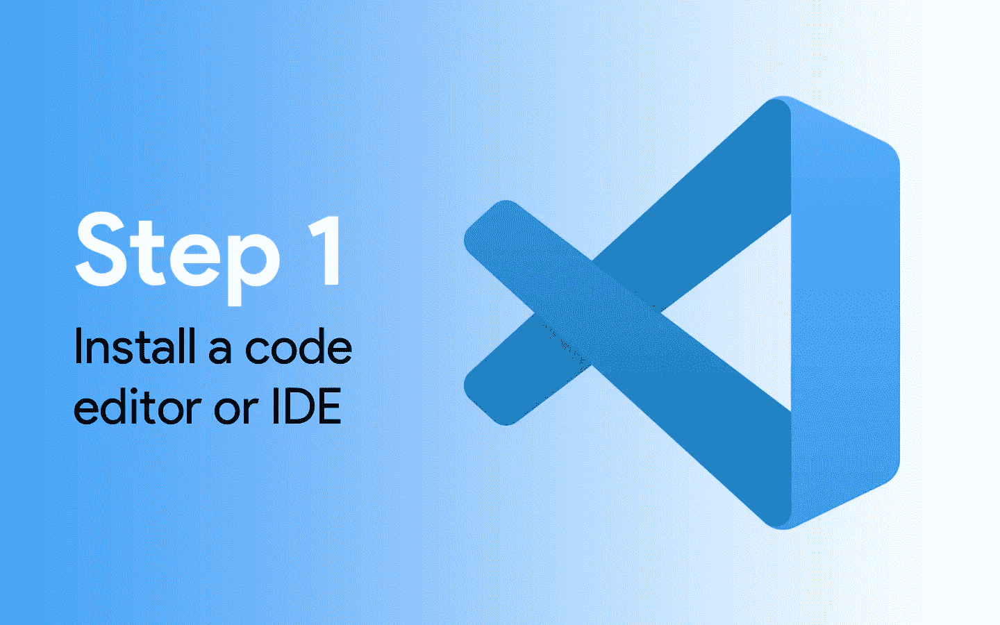
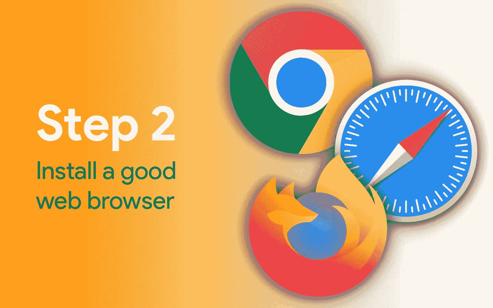
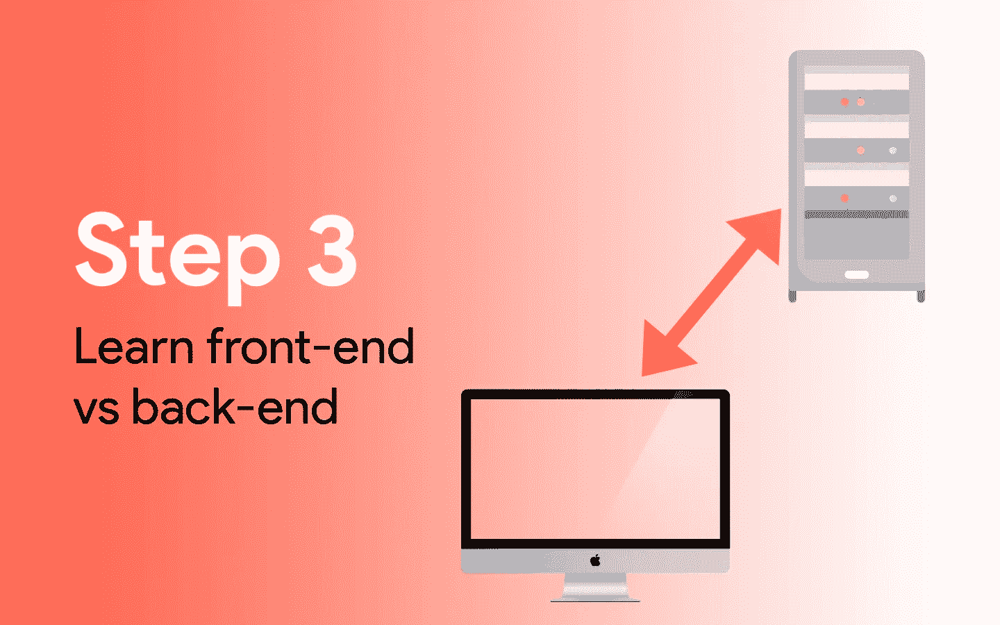
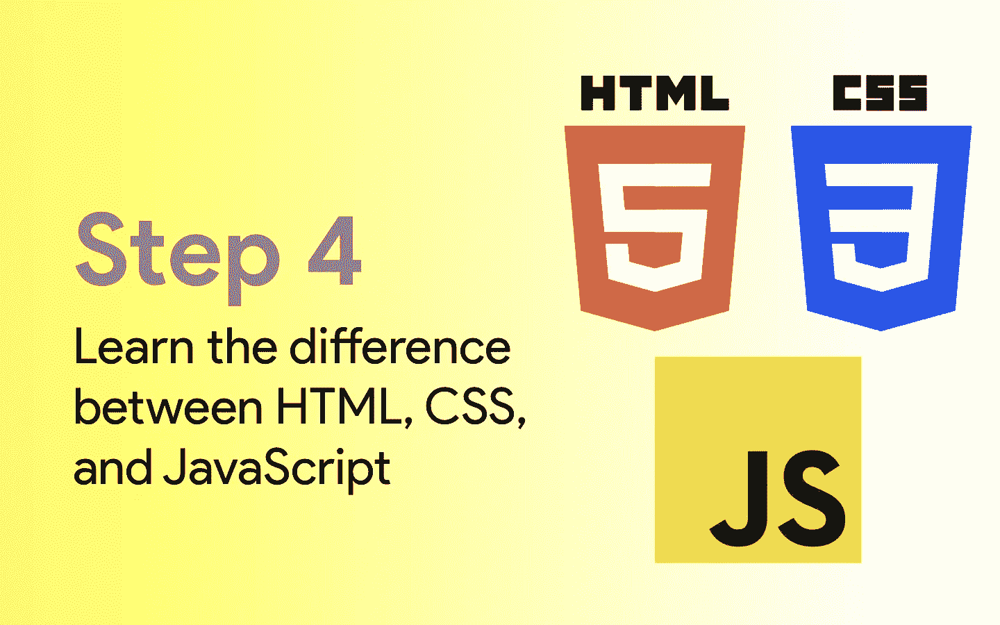
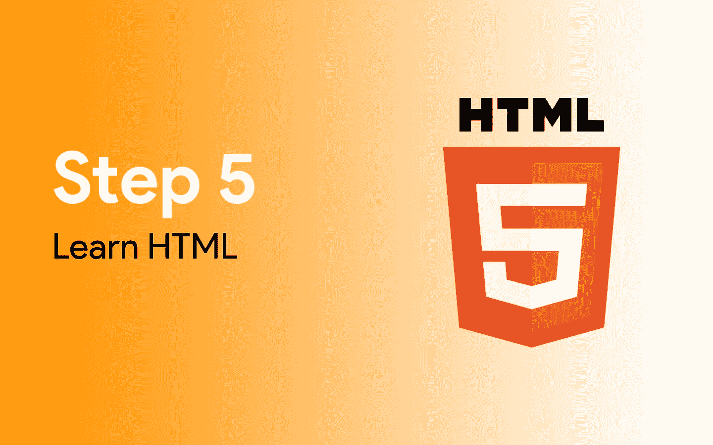
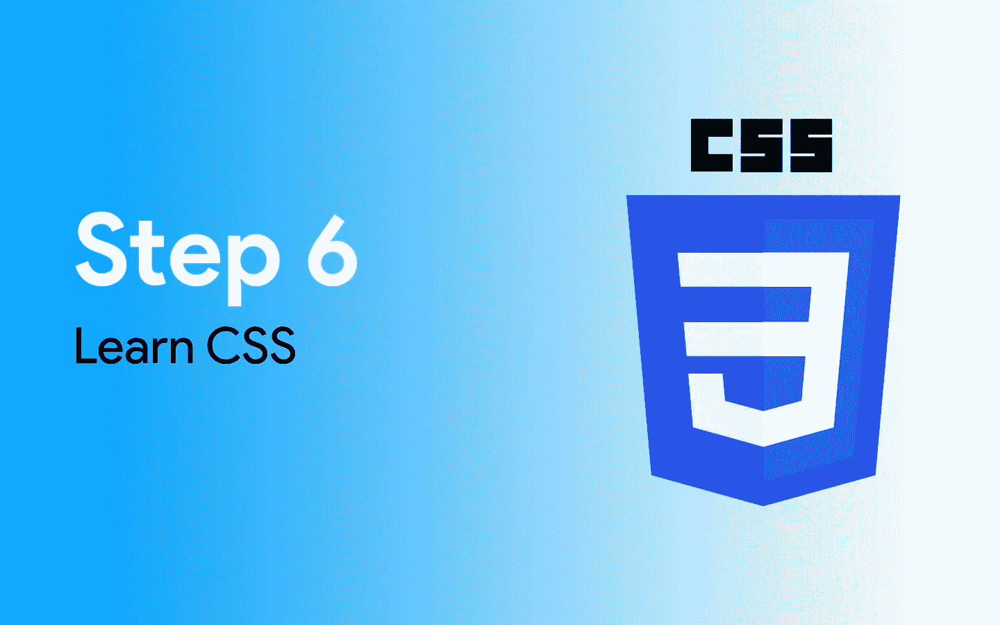
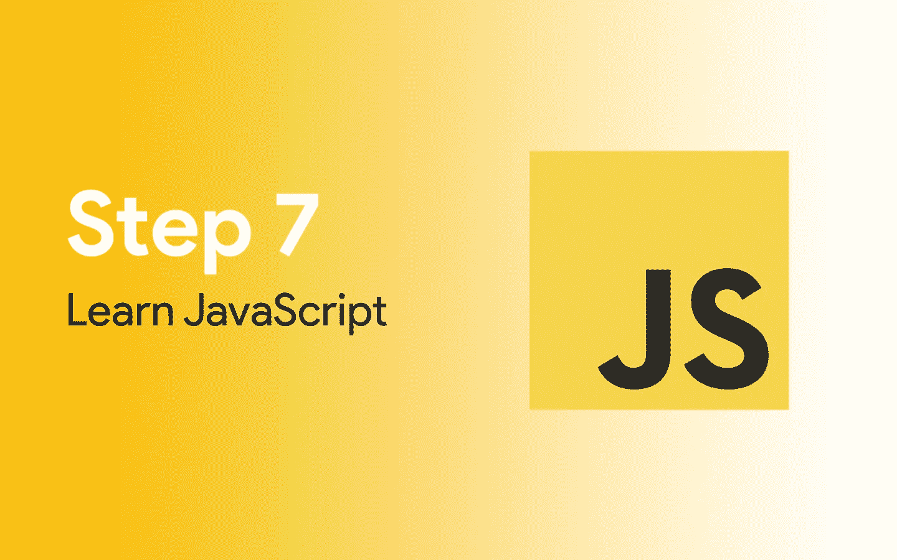
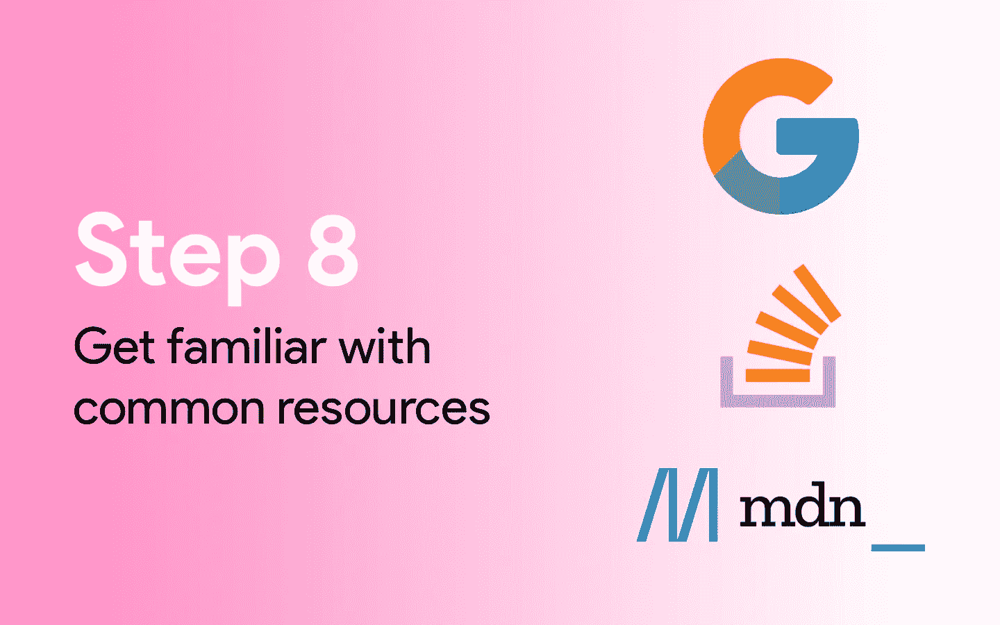

# Web 开发:成功的路线图

> 原文：<https://javascript.plainenglish.io/web-development-a-roadmap-to-success-5ed8439c72a2?source=collection_archive---------10----------------------->

## 成为一名优秀的 web 开发人员只需要十个步骤。这很简单，我会告诉你怎么做。

你可能有朋友或家人以编程为生，开发商业软件、移动应用程序、网站等。你想参与其中，学习如何编程。软件工程是一个非常赚钱的职业——但是你不知道如何编程。

你很幸运，你找到了这篇文章。网络开发的门槛很低，因为你可以从你的电脑上学习你需要知道的一切。这篇文章不会教你如何创建你的网站(但是我有很多其他的文章可以教你)。我的目标是为您提供互联网上学习 web 开发的最佳资源——它们都是免费的。

# 第一步

在你开始之前，你需要一些东西。Web 开发需要专门的软件，你应该用最好的工具来学习。

## 安装代码编辑器

没有[代码编辑器](https://www.hostinger.com/tutorials/best-code-editors)是学不会编码的。代码编辑器是专门用于编写代码的文本编辑器。像微软 Word 这样的应用还不够好，因为文字处理器只能创建文档。

代码编辑器有无数有价值的特性，这些特性使得编写程序变得简单而有趣。我最喜欢的编辑器(最流行的一个)是[微软 Visual Studio 代码](https://code.visualstudio.com)。

 [## Visual Studio 代码-代码编辑。重新定义的

### Visual Studio Code 是一个重新定义和优化的代码编辑器，用于构建和调试现代 web 和云…

code.visualstudio.com](https://code.visualstudio.com) 

如果你也学会了如何使用 VS 代码，那会很有帮助。微软为使用 VS 代码创建了一个简单的初学者教程:

Learn Visual Studio Code in 7min (Official Beginner Tutorial) by Visual Studio Code on YouTube

## 安装一个好的网络浏览器

这应该是给定的，但是我不知道你的情况。你可能正在网络浏览器上阅读这篇文章——但是是哪一个呢？我真正想问你的是，你在运行**浏览器**吗？

Internet Explorer 不支持 HTML、CSS 和 JavaScript(您将学习的编程语言)的许多新功能。它已经过时了，甚至微软为了支持[微软 Edge](https://www.microsoft.com/en-us/edge) 而杀了它。

以下是开发和测试网站时可以使用的浏览器列表:

 [## 谷歌浏览器-从谷歌下载快速、安全的浏览器

### 下载 Chrome For Windows 10/8.1/8/7 32 位。适用于 64 位 Windows 11/10/8.1/8/7。这台电脑将不再接收…

www.google.com](https://www.google.com/chrome/)  [## 下载史上最快的火狐浏览器

### 没有见不得人的隐私政策或广告商的后门。只是一个不会出卖你的快如闪电的浏览器。砰的一声…

www.mozilla.org](https://www.mozilla.org/en-US/firefox/new/)  [## 旅行队

### Safari 可以无缝运行，并在 Mac、iPad、iPhone 和…上同步您的密码、书签、历史记录、标签页等

www.apple.com](https://www.apple.com/safari/) 

> 无论你选择哪种浏览器，都不要使用 Internet Explorer。

上面列出的浏览器提供了一组称为“开发者工具”的特性，这些特性将帮助您调试代码和检查 HTML/CSS。现在还不要担心这个——它将来会帮助你的。

## 了解前端和后端 Web 开发的区别

当你开始建立你的网站时，你将在“前端”工作然后，稍后，您会想要添加更多的功能，这将需要后端编程。

**两者有什么区别？**

当您访问一个公共网站时，您向服务器发送一个请求。你要求服务器把网页“输入”给你。当页面加载时，您会看到前端(它是面向前端的站点)。

通常情况下，前置站点是不够的。您可能需要将用户信息存储在数据库中，从第三方服务获取信息，处理信用卡交易等。所有这些任务都在服务器上执行，也称为后端。

一般来说，学习前端 web 开发更容易，并且会为编写后端代码做好准备。

> 前端是用户看到的，后端是用户看不到的。后端是处理用户请求的服务器。前端是你的用户可以直接与之交互的部分。

# 蘸你的脚趾

当第一次学习 web 开发时，不要期望在第一个月就能创建一个改变世界的电子商务网站。可能需要一些时间来学习你需要知道的一切。你可以通过使用最好的资源来加快学习一切的时间。

## 了解 HTML、CSS 和 JavaScript 之间的区别

**HTML** 代表**超文本标记语言**。它是用来构建你的网页的语言。你可以使用文本、标题、按钮、图片，将你的网站分成不同的部分。

**CSS** 代表**级联样式表**。你用这个来设计你的网站。如果你学会了如何写好 CSS，你就可以制作出性感的网站。您可以修改颜色、边框、边距、间距，并向站点添加动画。

JavaScript 是一种脚本语言，旨在让你的网站具有交互性。您可以在用户点按按钮时让某些事情发生，更改网页的某些部分，等等。当您进入后端开发时，您也可以使用 JavaScript 编写您的服务器。

> 你应该知道这三种主要的编程语言来创建一个网站。

## 学习 HTML

有一个名为 [W3Schools](https://www.w3schools.com) 的网站，提供与 web 开发相关的一切教程和指南。这对新手来说是一个极好的资源——我就是在那里学会如何编码的。

除了用 W3Schools 学习，连专业人士都用。偶尔，你会忘记一些小细节或者需要快速复习。W3Schools 为最有经验的 web 开发人员提供了一个很好的参考点。我和许多其他人都喜欢 W3Schools，因为他们没有废话；他们的教程简短扼要。

从使用他们的 HTML 资源开始。

 [## HTML 简介

### HTML 是创建网页的标准标记语言。HTML 代表超文本标记语言。

www.w3schools.com](https://www.w3schools.com/html/html_intro.asp) 

记住，你不需要一下子学会所有的东西。坚持使用基本的例子，让自己熟悉所有的东西。稍后，您会想要构建一个实际的应用程序——这是您可以应用、实践和改进您的技能的地方。

此外，请查看 CodeCademy

如果 W3Schools 不为你做这件事，那么 [CodeCademy](https://www.codecademy.com) 是学习建立网站的另一个极好的选择。他们提供循序渐进的指导和互动的学习环境。

走这条路比用 W3Schools 要花更长的时间。不要气馁；人们学习的方式不同，CodeCademy 是你工具箱里的另一个工具。

 [## 免费学习编码| Codecademy

### 欢迎初学者来试试吧。我们的动手学习环境意味着您将从…

www.codecademy.com](https://www.codecademy.com) 

# 学习 CSS 和 JavaScript

## 学习 CSS

CSS 允许你为你的网站定义样式。HTML 本身只适合创建难看的网站。所有文本都是黑色的，所有链接都带下划线和蓝色，背景是白色，字体是浏览器的默认字体(Times New Roman)。

当你学习 CSS 的时候，你可以让你的网站变得真正漂亮。它也是一种容易学习的语言。但是要小心；学 HTML 之前学不了 CSS。CSS 只能样式化 HTML 代码；它不是一种独立的语言。

 [## CSS 简介

### CSS 是我们用来设计网页风格的语言。CSS 代表级联样式表 CSS 描述了 HTML 元素如何…

www.w3schools.com](https://www.w3schools.com/css/css_intro.asp) 

> 如果你喜欢 CodeCademy，他们也提供 CSS 方面的帮助。

## 学习 JavaScript

HTML 和 CSS 都很棒。你可以使用 HTML 和 CSS 构建漂亮的前端。但是如果用户点击一个按钮呢？您可能希望显示一个弹出窗口或请求用户输入。JavaScript 非常适合这一点。

JavaScript 允许你给你的站点增加交互性，并控制 HTML 文档的不同部分。JavaScript 也可以改变网页上的某些样式，但它不会取代 CSS。

 [## JavaScript 教程

### JavaScript 是世界上最流行的编程语言。JavaScript 是网络的编程语言…

www.w3schools.com](https://www.w3schools.com/js/default.asp) 

# 熟悉好的资源

当您构建真正的应用程序时，您将需要帮助。你不需要什么都自己做。一个由优秀开发人员组成的完整社区就在那里——他们提供了很好的建议。

你会遇到你不知道如何解决的错误，或者你可能想学习如何做一些新的事情。这里有几个很好的资源供你在学习过程中使用——作为一名程序员，你将永远在学习。

## 谷歌

通常，你的答案是简单的谷歌搜索。只需将您的问题复制并粘贴到谷歌搜索栏。通常，你的答案可以在前几个链接中找到。偶尔，你可能需要滚动或者编辑你的问题——你几乎总能在谷歌上找到你的答案。

如果你遇到任何错误，复制错误信息并粘贴到谷歌。如果有些事情不正常，制定一个简短的问题，问谷歌。谷歌可能会成为你最好的朋友之一。

## StackOverflow

[StackOverflow](https://stackoverflow.com) 是一个专门为程序员设计的论坛。如果您有问题、bug 或其他问题，可能在您之前已经有人遇到过同样的问题。

StackOverflow 是一个软件开发人员的社区，他们发布问题，其他软件开发人员回答问题。社区会投票选出最佳答案，所以你会先看到。如果还没有人问这个问题，你可以自己提出来。

看看这个。这是一个很好的资源。

 [## 堆栈溢出-开发者学习、分享和建立职业生涯的地方

### 自 2008 年以来，一名开发人员从使用 Stack 的公司那里获得了帮助

stackoverflow.com](https://stackoverflow.com) 

## Mozilla 开发者网络

自成立以来，Mozilla 一直是网络的先锋。即使你不使用 Mozilla Firefox，你也每天都在使用 Mozilla 软件——即使是在谷歌 Chrome 中。

他们帮助定义 web 标准，并拥有完整的 HTML、JavaScript 和 CSS 文档。他们的 HTML、JavaScript 和 CSS 文档存放在他们网站的一个名为[MDN(Mozilla 开发者网络)](https://developer.mozilla.org/en-US/)的部分。如果您想了解一些东西是如何工作的，如何使用一些东西，或者需要一个快速参考，MDN 可以帮助您。

 [## MDN Web 文档

### 记录网络技术，包括 CSS，HTML 和 JavaScript，从 2005 年开始。曼陀罗../../ ../../ ../../ ../../…

developer.mozilla.org](https://developer.mozilla.org/en-US/) 

# 构建一些应用程序

软件开发不是你可以仅仅阅读、练习和忘记的事情。你需要磨砺你的技能，练习，并学习更多。当你开始创建真正的应用程序时，你会遇到你从来不知道存在的问题。

你在构建应用程序和网站时遇到的困难不应该被视为失败；他们不是。你遇到的每一个错误或问题都将有助于磨练你的技能。你会更好地学习事物是如何运作的，以及将来如何解决问题。

你不需要建立一个广泛的应用程序，只是一些简单的网站。这里有几个初学者可以使用的应用程序。

*   **主页**——使用 HTML 和 CSS，为自己创建一个简单的主页。列出你的技能，一个“关于我”的部分，和一个“联系”的部分。
*   **计算器**——搭建一个简单的计算器。从一个简单的`<input>`元素和一个显示结果的“计算”按钮开始。然后添加一些按钮，使它看起来像 iOS 计算器应用程序。
*   **待办事项列表** —创建一个简单的待办事项列表应用程序。应该允许用户添加列表项、删除列表项和检查列表项。

# 坚持学习

作为一名开发人员，你永远不会停止学习。总有别的东西可以学。您可能想要添加以前从未构建过的新功能，改进您的代码，或者利用添加到 web 浏览器中的新功能。

软件开发是一生的旅程；如果你停止学习，你的代码将会变得过时，被废弃，甚至无效。了解更多也无妨。

## 在媒体上跟随 TSW

> 请注意:这是我不要脸的塞

如果你想了解最新的编程信息，请通过 Medium 关注我，并通过电子邮件订阅我的文章。我写了很多关于 JavaScript 和 CSS 的东西。你不想错过任何东西。

 [## 湿漉漉的华夫饼-中号

### 阅读介质上潮湿的华夫饼干上的文字。我是一名程序员，我喜欢做很酷的东西。在…查看我的资料

medium.com](https://medium.com/@thesoggywaffle) 

## 学习反应

React 需求量很大——通过学习这个框架，你甚至可以去掉大部分 HTML。React 简化了 web 开发过程，并允许您使用 JavaScript 构建漂亮的用户界面。

 [## react——用于构建用户界面的 JavaScript 库

### React 使得创建交互式 ui 变得不那么痛苦。为应用程序中的每个状态设计简单的视图，并反应…

reactjs.org](https://reactjs.org)  [## 教程:反应简介-反应

### 本教程没有假设任何现有的 React 知识。在本教程中，我们将构建一个小游戏。你可能会…

reactjs.org](https://reactjs.org/tutorial/tutorial.html) 

## 学习 Node.js

[Node.js](https://nodejs.dev) 是浏览器外的 JavaScript。您可以使用 Node.js 来编写桌面应用程序，但是开发人员通常使用它来编写他们的服务器。它有一个不断增长的社区，并且已经在科技行业广泛使用。

 [## 到处运行 JavaScript。

### 欢迎来到 Node.js！

nodejs.dev](https://nodejs.dev)  [## Node.js 简介

### Node.js 入门指南，服务器端 JavaScript 运行时环境。Node.js 构建于 Google 之上…

nodejs.dev](https://nodejs.dev/learn) 

## 学习算法

你最终将不得不学习数据结构和算法来开发严肃的软件。有很多学习算法的好网站(但是要注意，你必须学一点数学)。

学习算法最好的方法就是解决算法问题。一些编程问题比较好的站点有 [LeetCode](https://leetcode.com) 、 [HackerRank](https://www.hackerrank.com) 、 [Project Euler](https://projecteuler.net/archives) 。我会从使用 LeetCode 和 HackerRank 开始，因为它们对用户更友好。Project Euler 有一个很棒的数学难题列表，你可以用代码来解决，但是可能很难使用和验证你的解决方案(尽管它是完全免费的)。

 [## LeetCode -世界领先的在线编程学习平台

### 在 LeetCode，我们的使命是帮助你提升自己，找到你梦想的工作。我们有一个相当大的…

leetcode.com](https://leetcode.com)  [## 黑客银行

### HackerRank 是面向招聘开发人员的市场领先的技术评估和远程面试解决方案。学习如何…

www.hackerrank.com](https://www.hackerrank.com) 

[https://projecteuler.net/archives](https://projecteuler.net/archives)

就是这样。这就是你学习 web 开发的完整路线图。你很快就会成为职业选手。如果你喜欢这篇文章，这里有一些你可能会喜欢的关于 JavaScript 的文章。

 [## 关于 JavaScript Spread 语法您需要知道的一切

### 编辑描述

javascript.plainenglish.io](/everything-you-need-to-know-about-the-javascript-spread-syntax-e87adf90de35)  [## 停止使用 For 循环，改用迭代器

### 编辑描述

javascript.plainenglish.io](/stop-using-for-loops-use-iterators-instead-javascript-62682c74427d)  [## 你从来不知道的 4 个很酷的 JavaScript 控制台功能

### 编辑描述

javascript.plainenglish.io](/4-cool-javascript-console-functions-you-never-knew-about-c769d24d7c18)  [## JavaScript(和 TypeScript)的 7 个伪值

### 编辑描述

javascript.plainenglish.io](/the-7-false-like-values-of-javascript-and-typescript-93df73bda44)  [## TypeScript(和 JavaScript)中的 7 个常见错误

### 编辑描述

javascript.plainenglish.io](/7-common-bugs-in-typescript-and-javascript-5adbad7df5fb)  [## 每个 JavaScript 开发人员都应该知道的 5 个一行程序

### 编辑描述

javascript.plainenglish.io](/5-one-liners-every-javascript-developer-should-know-5e37c42b99cf)  [## CSS 加载动画很容易

### 编辑描述

javascript.plainenglish.io](/css-loading-animations-are-easy-a0e785e3e9b6) 

祝你好运！👍

*更多内容请看*[***plain English . io***](https://plainenglish.io/)*。报名参加我们的* [***免费周报***](http://newsletter.plainenglish.io/) *。关注我们关于*[***Twitter***](https://twitter.com/inPlainEngHQ)*和*[***LinkedIn***](https://www.linkedin.com/company/inplainenglish/)*。查看我们的* [***社区不和谐***](https://discord.gg/GtDtUAvyhW) *加入我们的* [***人才集体***](https://inplainenglish.pallet.com/talent/welcome) *。*