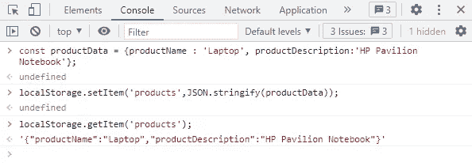

# 网络存储及其类型

> 原文：<https://javascript.plainenglish.io/web-storage-and-its-types-3df7f86b55a4?source=collection_archive---------4----------------------->

## 网络存储及其类型探讨。

在本文中，我们将逐步讨论 Web 存储及其类型。

# **简介**

*   网络存储用于在我们的浏览器中存储数据。
*   Web 存储 API 在客户端以键值格式存储数据。
*   Web 存储也称为 DOM 存储，它提供了许多协议和方法来在浏览器上存储数据。

关键字—数据的标识符

值—存储的与密钥相对应的值。

# **网络存储的类型**

我们经常使用的网络存储有两种类型

1.  局部存储器
2.  会话存储

## **本地存储**

*   本地存储用于在客户端存储数据。
*   存储在本地存储器中的数据没有过期。除非手动或以编程方式删除用户，否则它不会被自动删除。
*   在大多数浏览器中，Web 存储器的大小为 10 Mb，用来存储比 cookie 大的数据，因为在 cookie 中我们只能存储 4 KB 的数据。
*   使用本地存储时，当我们存储数字时，该值必须始终为字符串类型，它会自动转换并被视为字符串。

**如何在本地存储器中存储数据**

存在多种与本地存储相关的方法，例如 setItem()是用于在本地存储中存储数据的方法之一，它有两个参数，一个是键的名称，第二个是字符串类型的值。

打开浏览器并按 F12 键，然后打开那边的检查窗口

如上图所示，我们首先使用本地存储的`setItem()`方法，将产品设置为一个键，将笔记本电脑设置为本地存储中的一个值，然后，我们使用本地存储的`getItem()`获取产品的值，本地存储将键作为一个参数，并返回与键相对应的值。

如果您想查看本地存储中的数据，请打开“检查”窗口，在“应用程序”选项卡和“存储”部分中，您可以看到本地存储部分，如下图所示

如您所见，在“应用程序”选项卡下的“存储”部分中，有一个部分与本地存储以及以键值格式存储的键和值相关。

我们只能在本地存储中存储字符串对象，但是如果我们想在本地存储中存储任何对象，那么有一个叫做`JSON.Stringify()`的方法，它接受一个对象，将其转换成 JSON 格式，然后存储在本地存储中。

如上图所示，我们首先声明一个 const 对象，并在键-值对的帮助下在其中存储一些产品数据，随后，我们使用本地存储的`setItem()`方法来设置本地存储中的数据，您可以看到我们传递了两个参数，第一个是键名，第二个是作为 product data 的对象，然后我们使用`JSON.Stringify()`方法将其转换为 JSON 格式。接下来，使用`getItem()`方法能够看到本地存储中的数据。

如果您想检查本地存储器中的数据，请转到应用程序窗口中的本地存储器，您可以看到下图所示的数据

同样，当我们想要读取字符串化的对象时，我们需要使用`JSON.parse()`方法解析它，该方法将一个参数作为一个对象。

此外，要移除该项，有一个 removeItem()方法，该方法将键作为参数，并针对该键移除键。

如果我们想清除当前网站的本地存储，那么使用本地存储的`clear()`方法，这将清除本地存储中存在的所有数据，如下所示

正如你所看到的,`clear()`方法是删除本地存储器中所有的键值对。

这就是关于本地存储及其使用的全部内容。

## **会话存储**

*   会话存储用于在客户端以键-值对的形式存储数据
*   用户可以在会话存储器中存储最大 5Mb 的数据
*   当当前选项卡打开时，会话存储器中的所有数据都可用。一旦我们关闭选项卡并打开新选项卡，新会话将开始。
*   当您刷新或打开新选项卡并触发某些事件时，会话将过期。

有几种方法可用于会话存储，在语法上几乎类似于本地存储的方法，如下所示:

此外，如果您想查看会话存储数据的保存位置，请在按 F12 后打开“Inspect”选项卡，然后在“Application”选项卡和“Storage”部分中，您可以看到会话存储和存储在其中的数据，如下所示

## **结论**

我们讨论了 Web 存储及其工作方式，然后逐步了解不同类型的 Web 存储，如本地存储和会话存储，并逐一了解其工作方式。

**快乐编码！**

*更多内容请看*[***plain English . io***](https://plainenglish.io/)*。报名参加我们的* [***免费周报***](http://newsletter.plainenglish.io/) *。关注我们关于*[***Twitter***](https://twitter.com/inPlainEngHQ)**和*[***LinkedIn***](https://www.linkedin.com/company/inplainenglish/)*。查看我们的* [***社区不和谐***](https://discord.gg/GtDtUAvyhW) *加入我们的* [***人才集体***](https://inplainenglish.pallet.com/talent/welcome) *。**