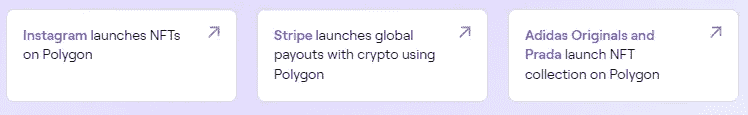
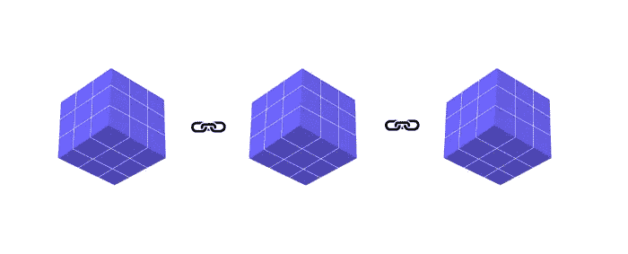

# 你应该知道的网络 3 词汇

> 原文：<https://javascript.plainenglish.io/web3-vocabulary-you-should-be-aware-of-2e886c06a721?source=collection_archive---------7----------------------->

## 你在网上能找到的最简单的解释。

Photo by [Hammer & Tusk](https://unsplash.com/@hammerandtusk?utm_source=medium&utm_medium=referral) on [Unsplash](https://unsplash.com?utm_source=medium&utm_medium=referral)

信不信由你，web3 正变得越来越流行。更多的企业正在进入密码行业。

一些最终采用加密技术的公司包括 Instagram、阿迪达斯和 Stripe。

Source: [Polygon](https://polygon.technology/)

因为比特币和其他加密货币，我们都听说过 web3。

然而，我们大多数人不知道从哪里开始。我们当然可以投资加密货币、DeFi 等等。

我们甚至不知道 web3 的基本原理，因此我今天在这里帮助你。

让我们开始吧。

1.  **Web3:**

这是第三代网络，它建立在去中心化的思想上，这意味着没有人能控制它。

有静态网页，我们只能在第一代 web(即 Web 1.0)上阅读。

在第二代 web(即 Web 2.0)中存在动态网站，用户可以在其中与网站进行交互。例如，我们在 Twitter 上发帖，在 Medium 上写作，在 YouTube 上发布视频。

在这几代人当中，每一代人都接管了网站所有者的控制权。简单来说就是看主人是屏蔽你还是屏蔽我。然而，还有一些问题，如数据泄露和向其他企业出售用户数据。

因为他们有控制力，所以能真正影响观众的心智，影响可能是深远的。

假设我们使用 Twitter，所有者(Twitter 的首席执行官)支持唐纳德·特朗普。结果会怎样？Twitter 本可以以一种极好的方式(对他有利)发布关于唐纳德·特朗普的推文和图片，增加获胜的可能性。

因此，我们需要一个无人能控制的分散系统。

然后还有 Web3.0 要考虑。随着比特币和以太坊价格的上涨，它越来越受欢迎。Web3.0 可以被视为无人能控制的网络进化。是的，它既有积极的一面，也有消极的一面。

在这里你会发现 Dapps，DeFi 和 DAOs。别担心，我们稍后会了解所有这些内容。

**2。加密货币:**

我想我不需要详细说明。

不过，你可能听说过比特币、以太坊、Cardano、Dogecoin，这些都是加密货币。它是一种数字货币，可以用于支付和其他目的。

在创建程序时，您将需要使用加密货币与它们进行交互。

**3。区块链**:

区块链是实现加密货币交易、投资和收益的技术。

Web3 同样受这项技术的控制。简而言之，这是整个 web3 生态系统构建的核心原则。

让我们更深入地研究一下。

区块链是我见过的最基础的技术之一。另一方面，名字传达了真实的意思。

记住区块链这个名词；它只是指一系列链接在一起的块。

如果你不能理解，让我们用一个简单的图像来演示。

上面的插图阐明了区块链对我们的意义。只需要回想一下“区块链”这个术语。块包括保存在块内的数据，并且它们被链接在一起。

更多信息可在[这里](https://medium.com/supportthecrypto/a-simple-blockchain-guide-that-i-want-to-explain-everyone-out-there-cd331096ed7)找到。

**4。智能合约:**

你可能需要作为一名程序员或开发人员来编写程序。在区块链世界，这些程序被称为智能合同。

那是合理的。

因为 web3.0 是去中心化的，所以我们必须创建的智能契约或程序是不可变的。

**5。NFTs**

NFT 是存在于区块链上的一件数字艺术品。它是不可替换令牌的缩写。

您可能不理解不可替换的令牌，所以让我来解释一下。

令牌分为两种类型:

1.  可替换令牌:这些令牌可以交换。考虑比特币或货币。你可以卖掉你的比特币，再买一个，但代币将保持不变。
2.  不可替换的令牌:这些令牌不可互换，因此是唯一的。例如，艺术、音乐等等。

现在，公司甚至个人都在开发无价值的 NFT。

如果处理得当，NFTs 的概念会得到很大的改进。

**6。Dapp**

Dapp 是一个分散的应用程序。你可以使用 Instagram、Twitter 或中型应用，就像有很多分散的区块链应用一样。

dapps 的例子有 Curve、渴望金融、OpenSea、Axie Infinity 等等。

**7。DAOs**

分散自治组织(Dao)是由其成员拥有和管理的组织。

把它看作是一个拥有核心贡献者群体的公司。

**8。定义**

我们都使用由中央机构监管的金融服务。这些银行赚我们的钱。

如果你的银行账户中有 10，000 美元，银行可以投资并保留大部分利润。

我们得到的回报只是我们投入的一分一毫。甚至有些银行不提供有利的回报。而且我们必须依赖银行，透露我们的信息，填写大量的文书工作来获得贷款，等等。

DeFi 就是为了解决这些问题而创立的。

考虑一个分散的银行，意思是没有人控制它。你可以通过各种方式赚钱，比如下注、提供流动性、收益农业等等。

这里有一些帮助你开始使用 Web3 的最佳资源。

希望你喜欢。就这样——谢谢。

[*如果你喜欢阅读这样的故事，并想帮助我成为一名作家，可以考虑成为一名中等会员*](https://nitinfab.medium.com/membership) *。每月花费 5 美元，你可以无限制地访问媒体内容。如果你通过我的链接注册，我会得到一点佣金。*

 [## 7 个你可能不用的黑仔工具可以帮你节省 1000 多美元

### 无论你是学生、朝九晚五的员工还是自由职业者。

medium.com](https://medium.com/swlh/7-killer-tools-youre-probably-not-using-that-could-save-you-1-000-aecd9f37b216)  [## 6 个易于开始的编程副业，每月挣 1000 多英镑——没有废话

### 没有自由职业者，或博客，它不需要前期费用。

medium.com](https://medium.com/geekculture/6-easy-to-start-programming-side-hustle-to-earn-1-000-a-month-no-bs-34e2e8f58a38) 

*更多内容看* [***说白了。报名参加我们的***](https://plainenglish.io/) **[***免费周报***](http://newsletter.plainenglish.io/) *。关注我们上* [***推特***](https://twitter.com/inPlainEngHQ)[***领英***](https://www.linkedin.com/company/inplainenglish/)**和* [***不和谐***](https://discord.gg/GtDtUAvyhW) ***。******