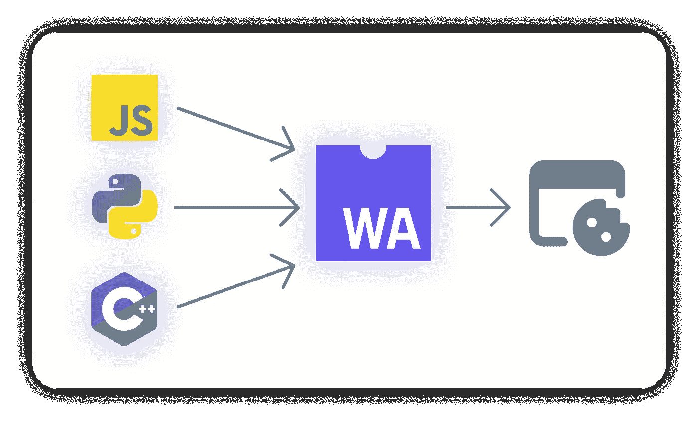

# Web 组装:Web 开发的新时代

> 原文：<https://javascript.plainenglish.io/webassembly-the-new-era-of-web-development-8803c732e3f5?source=collection_archive---------0----------------------->

## web 程序集

## 您将了解什么是 WebAssembly，以及它将如何彻底变革 Web 行业

Illustration Made by Author

我们在日常生活中都会使用浏览器。不管你使用哪一种，它仍然是你寻找东西、学习、互动，甚至是用它来完成特定任务的最简单和最好的方法。但是如果你想做一些更复杂的事情呢？

我说的是视频编辑、照片润饰、使用非常复杂的算法、处理大量信息，以及许多其他重要的事情，你可以通过你的控制台或桌面应用程序轻松完成，但不能在浏览器中完成。

这是因为 web dev 在编程语言之间没有太多的选择，只有 JavaScript 用于前端，还有几个用于后端，这没有那么多像创建游戏或完全工作的应用程序的可能性。当你编写一个桌面应用程序时，你会有一大堆从相同的 JavaScript 开始到 C++结束的变体，c++是世界上最强大的语言之一。几乎你日常使用的每个程序都是用 C++或 Java 编写的，因为它们是低级语言，比我们通常使用的 JavaScript、Python 等有更多的可能性。

# 解决办法

然而，有一个很棒的解决方案叫做 WebAssembly (Wasm ),它可以帮助你在浏览器中使用 C++的所有功能，几乎不费吹灰之力，速度也没有损失。WebAssembly 是一种二进制指令格式，可为您的 web 浏览器应用程序提供接近本机的性能，并使开发人员能够以他们选择的语言(如 C、C++、Rust、JavaScript、C#、Go)创建快速的 web 应用程序。除了我们已经列出的优点之外，它还有几个优点。我们现在就来谈谈它们。

# 可调试和可访问

对于手动编程任务，如调试、测试、实验、优化、学习、教学和构建程序，WebAssembly 以文本格式印刷。在线查看 Wasm 模块的源代码时，将使用文本格式。

# 开放网络平台的一部分

WebAssembly 保留了 web 的无版本、经过功能测试和向后兼容的特性。WebAssembly 模块将可以访问与 JavaScript 相同的 Web APIs，使它们能够访问浏览器功能，并调用 JavaScript 环境。WebAssembly 还支持非 web 嵌入。

# 限制

当然，每项新技术都有一些缺点或局限性。Wasm 也不例外。它有一些限制，不是那么可怕和大，但可能会干扰一些开发人员。

WebAssembly 这样做时只能调用 JavaScript 并传递整数和浮点的原语数据类型；它目前无法直接访问 DOM。因此，要让 WebAssembly 访问任何 Web API，必须先联系 JavaScript，然后才能访问 Web API。

尽管 WebAssembly 在桌面和移动设备上都受支持，但后者有一些主要的限制，使得在移动浏览器上安全地部署许多应用程序很困难。目前，如果不使用 Chrome 特有的解决方案，iOS 上的 Safari 和 Android 上的 Chrome 都无法可靠地分配超过 300MB 的内存。

此外，WebAssembly 没有垃圾收集器，并且不能使用内存。如果你不知道什么是垃圾收集器，那么它就是一个简单的内存恢复特性，自动释放已经分配给程序不再需要的对象的内存空间。

# 应该使用 WebAssembly 吗？

如果这些限制没有让你感到困惑，并且你对所有这些巨大的优势非常满意，那么 Wasm 绝对适合你和其他 98%的开发者和用户。因为它所有的酷功能和出色的性能让你得到了一个新的沙箱，你可以在这里构建任何你想要的东西。从 Premier pro 这样的视频编辑器开始，到在浏览器中结束整个 3a 游戏。想象一下这有多酷吧，你不需要下载或安装任何东西，你只需要进入你的浏览器，直接在里面播放，没有任何速度或性能损失。

# 结论

就是这样，我试图向你们解释和展示网络的新时代。WebAssembly 是一项非常酷的技术，它让开发者和用户都变得更加容易。我没有介绍 Wasm 的所有知识；然而，考虑到这个领域是如此的新鲜和广阔，你肯定会在那里发现一些有趣和新奇的东西。如果你喜欢。如果你喜欢这篇文章，别忘了留下你的掌声并关注我。:)

*更多内容请看*[***plain English . io***](https://plainenglish.io/)*。报名参加我们的* [***免费周报***](http://newsletter.plainenglish.io/) *。关注我们关于*[***Twitter***](https://twitter.com/inPlainEngHQ)[***LinkedIn***](https://www.linkedin.com/company/inplainenglish/)*[***YouTube***](https://www.youtube.com/channel/UCtipWUghju290NWcn8jhyAw)***，以及****[***不和***](https://discord.gg/GtDtUAvyhW) *对成长黑客感兴趣？检查* [***电路***](https://circuit.ooo/) ***。*****