# Webpack (2):使用加载器

> 原文：<https://javascript.plainenglish.io/webpack-2-using-loader-b264f7d295d2?source=collection_archive---------8----------------------->

## 使用加载器的 Webpack:教程


Webpack 主张一切都是一个模块，所有类型的文件(CSS、图片等。)可以被加载器处理成我们的可加载模块。

# 1.装载机安装和配置

安装加载程序的统一方式是:

```
**npm install xxx-loader — save -dev**
```

**-dev** 表示开发时依赖。

**webpack.config.js** 的基本配置方法

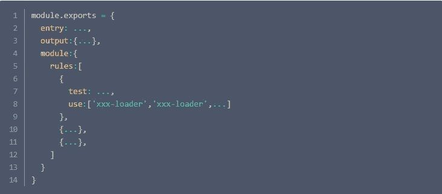

# 2.风格处理

## 2.1 css 加载器和样式加载器

css-loader 是通过 npm 安装的，但是要在 dom 上安装样式，还需要安装样式加载器

通过 **webpack.conifg.js** 配置 css-loader 和 style-loader 注意 webpack 是从右向左读的，写的顺序是必须的。

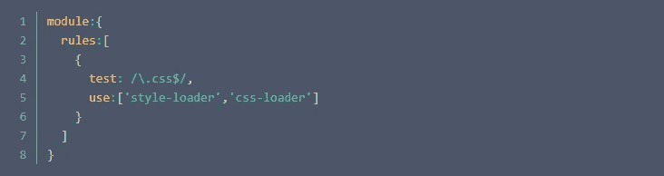

## 2.2 少装载机

类似地，您也可以使用更少的加载器:

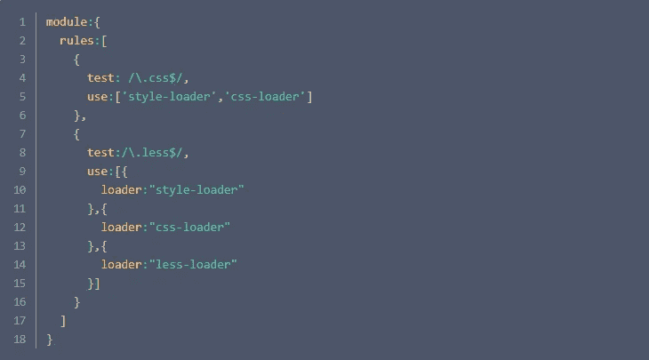

从 npm 3 开始。x，less 不会随着 less-loader 的安装自动为您安装，所以我们需要手动安装 less，也就是完整的命令:

```
**npm install less less-loader — save -dev** 
```

否则后续包装会出错。

# 3.图像包装

两个加载器与图像打包相关，一个是 **url 加载器**，另一个是**文件加载器**。

如果图片太多，会发送很多 HTTP 请求，降低页面性能。所以 **url-loader** 会对导入的图像进行编码，生成一个 **base64 dataURL** ，相当于把图像数据翻译成一串字符，然后把这串字符打包成一个文件。最后，您只需要导入这个文件来访问图像。

当然，如果图像很大，编码会消耗性能，打包文件的大小也会增加，所以 url-loader 提供了一个 **limit** 参数(通常为 8kb)，小于 **limit** 的图像仍然会被转换为 DataURL 大于**限制**的图像将被调用文件加载器复制，并输出到 dist 文件夹。虽然 url-loader 封装了 file-loader，但是在实际测量中，如果没有额外安装 file-loader，当图像尺寸较大时会报错，所以两者都必须安装。

下面的例子显示了当 CSS 或 JS 中使用图像时，加载器是如何处理的。

## 3.1 css 参考

这里我们在 src 下新建一个 img 文件夹，把 test1.jpg 和 tets2.jpg 放进去，一个大于 8kb，一个小于 8kb。在前面的 index.css 文件中，我们像往常一样使用图像作为背景:

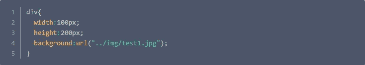

打包后，我们发现了一个错误，所以我们安装了 url-loader 并再次打包。浏览器视图:

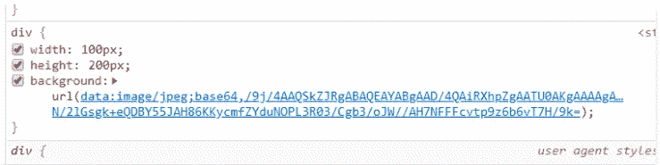

你会发现图片是可以正常引用的，而且是以 dataURL 的形式引用的。

然后测试大于 8kb 的图像(将上面的代码修改为 test2.jpg)。此时，如果您的包是直接的，将会报告一个错误，指出文件加载器丢失，所以让我们在这里安装文件加载器。

再次打包，虽然这次没有报错，但是我们发现浏览器中的图片没有显示出来。看一下控制台:

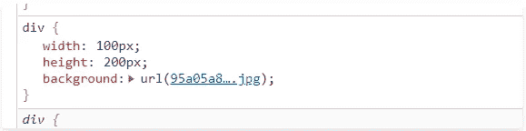

如您所见，该路径是直接引用的图像的名称，您将看到在 dist 文件夹中输出了原始图像的副本。也就是说，其实这个时候 webpack 认为我们的**index.html**文件在 dist 文件夹里，所以我们选择这样的路径引用，但是我们的**index.html**文件其实在外层。同时，我们不想直接在 dist 文件夹中输出。里面最好有个 img 文件夹，先用 **webpack.config.js** 配置一下:

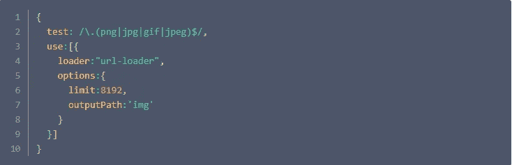

在此设定图像的输出路径。另外，图像默认用 32 位 hash 命名，太长了，我们也不知道是哪个图像，就顺便配置一下图像命名规则:

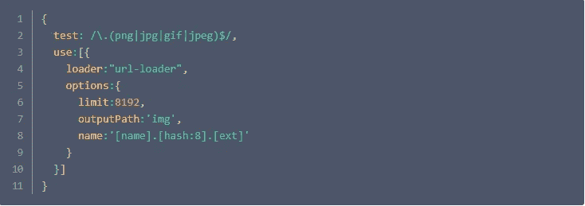

再次打包，打开控制台。

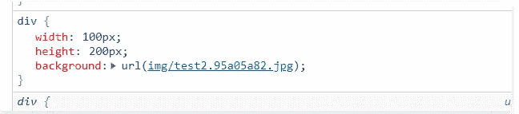

可以看到，命名是正确的，文件输出方式也是正确的(dist 下加了一个 img 文件夹)，但是图像路径还是不对，所以图像没有显示出来。接下来让我们配置图像路径。
我们前面说过，webpack 认为 index.html 在 dist 文件夹中，所以直接通过图像名来引用图像。那么 index.html 实际上在 dist 文件夹之外。对于 index.html 来说，它需要经历**。/dist/img** 成功找到图像。也就是说，我们可以在加上固定前缀(**)的基础上，使用原来的路径(图像名)。/dist/img** )使其正确指向图像位置(。/dist/img/image name)。

而 publicPath 可以用来做到这一点:

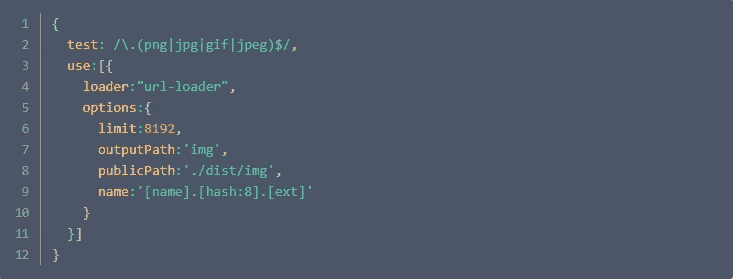

**publicPath** 将为相对路径引用的图像添加统一前缀。比如我们一开始的图像路径是 **img/test2.95a05a82.jpg** ，那么使用 **publicPath** 之后，图像路径就变成了**。/dist/img/test 2.95 a05a 82 . jpg**。通常可以为 publicPath 配置一个 CDN 地址前缀，比如[**https://xxx.cdn.com**](https://xxx.cdn.com)上线时图片会统一使用 CDN 地址。

然后在配置后再次打包，并在浏览器中查看:

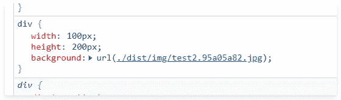

路径正常，画面显示正常。

另外，我们也可以选择配置**。/dist/**for**output . public path**，这样不仅图片，而且相对路径引用的所有静态资源都会以此前缀为前缀。但是注意这个前缀需要加一个 **/** ，不需要图片的 publicPath。

## 3.2 js 参考

在 js 中引用图像需要使用 require，例如:

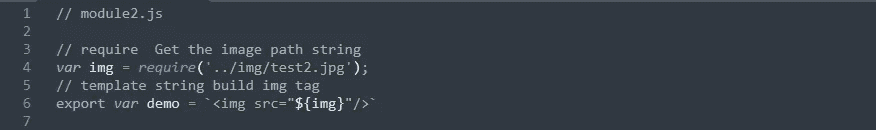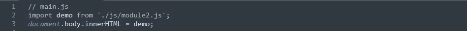

只要按照镜像和 **module2.js** 的路径关系正常导入镜像，后面的路径就会被正确替换。
如果我们之前没有配置 **publicPath** ，我们会发现打包后的路径是 **img/test2.95a05a82.jpg** ，也就是说**index.html**仍然被认为位于 dist 文件夹中。因为我们配置的比较早，所以这里的路径是正确的，最后，图片可以正常显示了:

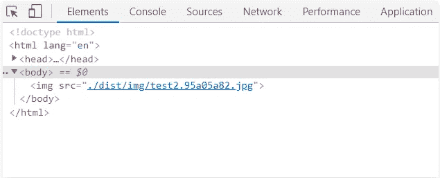

# 4.巴别塔翻译

命令行安装:


配置 webpack.config.js:

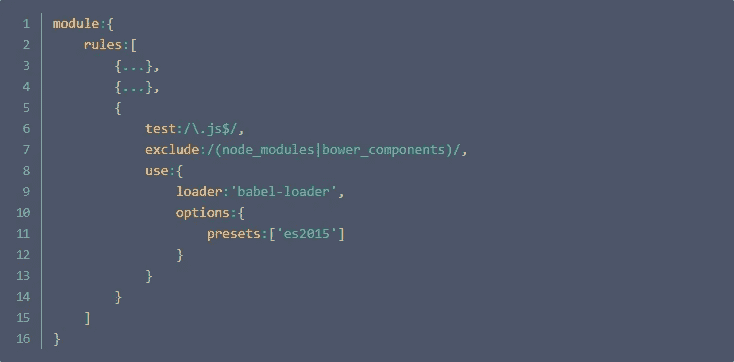

**exclude:/(node _ modules | bower _ components)/**表示不传输 **node_modules** 文件夹中的 js。

## babel-loader 的预设:

```
1.**babel-preset-es2015**, **babel-preset-es2016**, etc.: support for different versions of the ECMAScript specification;2.**babel-preset-latest**: Supports new features in all existing ECMAScript versions, including those in stage 4 (an established specification that will be added next year).3.**babel-preset-env**: But many times we need more flexible presets - for example, most browsers already support a feature of ES6, so we don't actually need to translate this feature, but the presets mentioned above All will be translated. Therefore, babel-preset-env is also provided here, which can select features that it does not support for translation according to the target environment we specify (such as a certain version of the browser).
```

# 5.集成 Vue

请注意，这不是开发时依赖关系:


如果您遇到此错误:

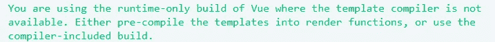

这是因为 Vue 有两个版本:

1.  仅运行时
2.  运行时编译器

其中，仅运行时版本无法编译模板，要么使用 render 函数，要么修改 webpack.config.js 配置使用另一个版本。这里我们先选择后者:

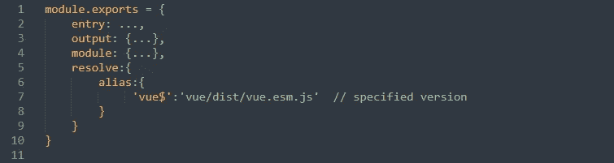

此外，webpack 还需要使用 vue-loader 和 vue-template-compiler 进行加载和解析。vue 文件分别为:

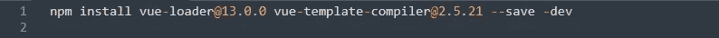

之后，我们就可以编写单文件组件了(如果使用 vscode，强烈建议安装 vetur 插件)。

**注:**

因为我们安装的 vue 版本是 vue@2.5.21，这里的 vue-loader 和 vue-template-compiler 要注意版本对应问题。总之错误信息也写的清清楚楚。

(要说为什么用这么低配版的 Vue，视频里的项目也是用低配版的 Vue 搭建的，那就暂时跟着讲师的步伐走吧=。=)

**下一章:**
Webpack (3)使用插件并构建一个本地服务器

*更多内容请看*[***plain English . io***](https://plainenglish.io/)*。报名参加我们的* [***免费周报***](http://newsletter.plainenglish.io/) *。关注我们关于* [***推特***](https://twitter.com/inPlainEngHQ)[***领英***](https://www.linkedin.com/company/inplainenglish/)**和* [***不和***](https://discord.gg/GtDtUAvyhW) ***。****