# Webpack (3):如何使用插件和构建本地服务器

> 原文：<https://javascript.plainenglish.io/webpack-3-how-to-use-plugins-and-build-local-servers-7635b04c8c2d?source=collection_archive---------14----------------------->

## 使用插件的 Webpack 和构建本地服务器。


# 使用插件

## 横幅插件

Webpack 自带 BannerPlugin，我们只需要在 webpack.config.js 中配置即可:

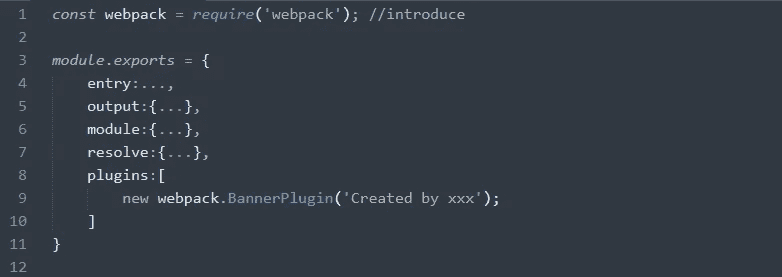

## html-web pack-插件

之前我们的 index.html 在项目的根目录下，这个文件也要打包在最后的 dist 文件夹里。

HtmlWebpackPlugin 可以用 bundle.js 自动生成一个 index.html 到 dist 文件夹中。


但是，这个生成的文件默认没有模板(只有导入的 js)，所以我们需要配置它:

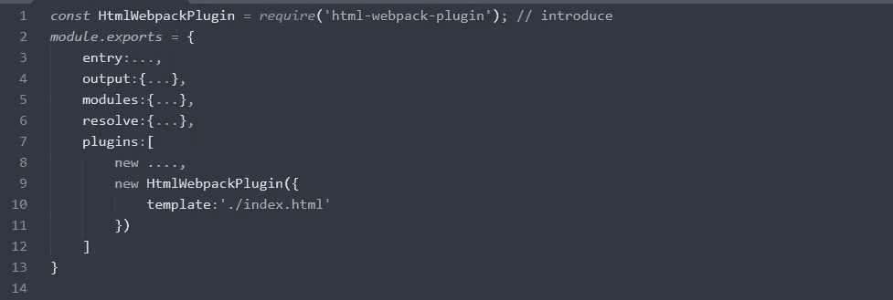

在此之后，webpack 将转到 webpack.config.js 所在的文件夹，找到 index.html 文件(原始的入口文件)，并使用其 html 结构作为新 index.html 的模板。也就是说，初始条目文件只提供一个模板。

注意:

还要注意，正如我们前面所说，webpack 认为 index.html 位于 dist，所以路径是错误的。我们通过配置 output.publicPath 或 url-loader.options.publicPath 来解决这个问题。但是现在 index.html 确实在 dist 中，所以我们也可以将这两个配置改回来。

## uglifyjs-web pack-插件

压缩 js 文件:


要配置:

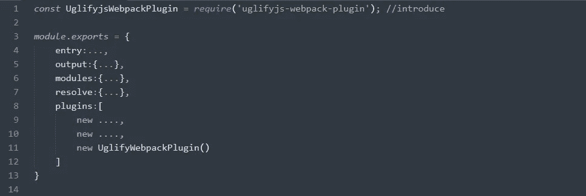

这里再次报告了一个错误，因为版本不匹配。原因是 webpack@3 对应的插件版本是 [@1](http://twitter.com/1) ，所以如果 npm 在安装时没有指定版本，那么将默认安装最新的 [@2](http://twitter.com/2) 版本。打包时会报告一个错误。

# Webapck 构建本地服务器

## 安装

Webpack 提供了可选的本地开发服务器，基于 node.js 构建，内部使用 express 框架，可以实现热更新。

文件缓冲到内存中，在内存中的读取速度比从磁盘中读取速度快很多，然后在执行打包命令时输出到磁盘。

首先，安装它:


注意:还要注意这里对应的是 webpack 的版本。

然后配置它:

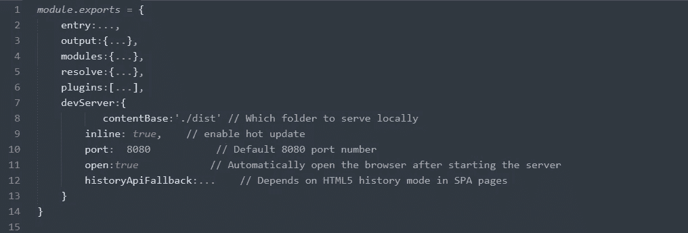

## 处理错误

此时，直接运行 webpack-dev-server 将会报告一个错误:

```
D:\Front-end_learning\Demo\webpack-learning 2>webpack-dev-server 'webpack-dev-server' Not an internal or external command, nor a runnable program or batch file
```

这里的操作试图执行 **webpack-dev-server。项目根目录下的 cmd** ，但是当前目录下没有这个东西，所以报错。此时，您可能会有以下想法:

(1)

首先，webpack-dev-server.cmd 位于 node_modules/中。bin 文件夹。我可以选择执行 node_modules/。直接将 bin/webpack-dev-server 或 cd 放入目录并执行，如下所示:

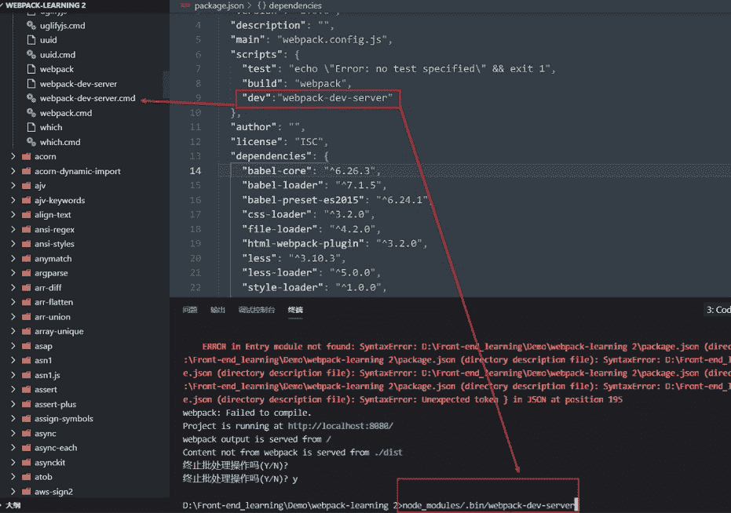

这个想法应该没问题，但是当我这么做的时候，我得到了一个错误:

```
D:\Front-end_learning\Demo\webpack-learning 2>.\node_modules\.bin\webpack-dev-server 'node_modules' Not an internal or external command, nor a runnable program or batch file
```

苦思之后。。。嗯，犯了一个愚蠢的错误:

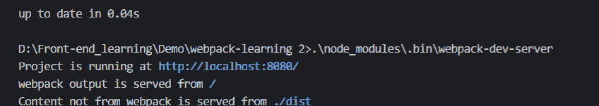

注意上图！！！路径用 **\** 写，而不是 **/** 。。。用 **\** 代替后正常

(2)

第二种方法，全局安装 webpack-dev-server。这当然没问题。在这种情况下，无论我在哪个路径运行该命令，总能找到该命令。但是由于版本冲突，不推荐使用这种方法。

(3)

第三种方法是转到 package.json 并配置命令:

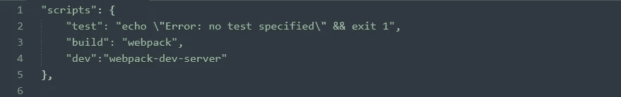

之后，执行 **npm run dev** ，那么 npm 脚本的底层会做一些相应的处理，自动转到 **node_modules/。bin** 文件夹找到对应的 cmd 并执行。

## 更新很慢

打开本地服务器，修改代码后会发现可以自动刷新。酪。。

当我达到这一点时，我发现刷新大约需要 4 到 5 秒。和使用直播服务器时的瞬间刷新感相比，完全不是一个量级。然后把之前安装的 uglifyjs-webpack-plugin 去掉也是正常的，好像是受这个插件的影响。

在这里也可以发现，其实我们只需要在开发完成后，使用这个插件压缩代码即可；相反，webpack-dev-server 是在开发过程中使用的，也就是说，这两样东西的使用场景是不同的。那么，有没有办法根据使用语境把它们分开呢？

## 构型分离

1.  提取通用配置
2.  开发环境配置和生产环境配置的分离

在我们之前安装的插件中，webpack-dev-server 只能在开发期间使用，uglifyjs-webpack-plugin 只能在开发之后使用，其他的都是在开发/生产期间使用。基于此，我们可以在根目录下创建一个新的构建文件夹，并将这些配置写入三种类型的文件:

dev.config.js/prod.config.js/base.config.js

正式分离后，方便我们管理，然后借助插件进行配置合并:


dev.config.js

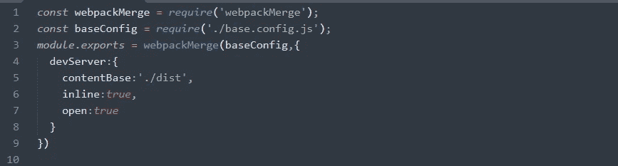

prod.config.js:

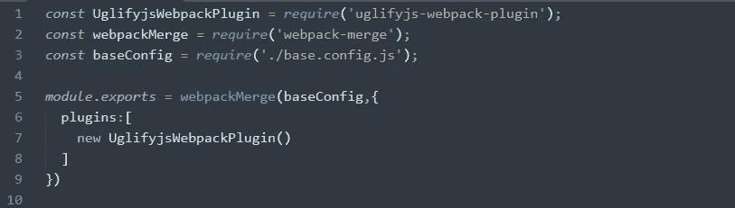

base.config.js:

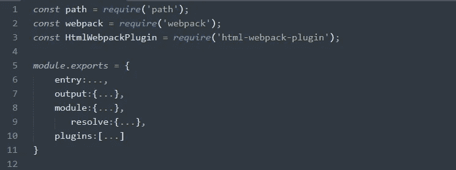

在这之后我们必须解决两个问题:

首先，当前的 config 文件已经被分离，所以可以删除原来的 webpack.config.js。这里我们会发现删除后，原来配置的 npm 脚本命令失效了，所以去 package.json 配置一下:

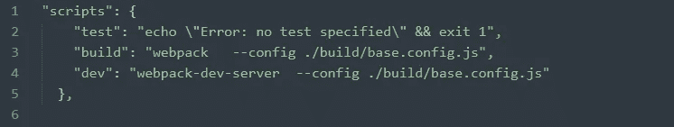

添加—配置。/build/base.config.js，也就是现在盛行的配置文件 base.config.js。

第二个问题，如果我们直接打包，会发现在 build 下输出的是 dist 文件夹，因为我们之前是这样配置 output.path 的:

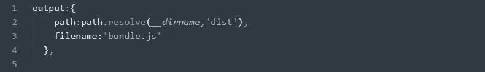

__dirname 之前指向 webpack.config.js 所在的目录，也就是根目录，后面是 dist，意思是打包到根目录下的 dist 文件夹中。现在，__dirname 指向 base.config.js 所在的目录，也就是 build 文件夹，后面跟着 dist，就是 build 下打包的 dist 文件夹。

因此，要修复路径，请更改为:

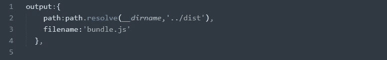

然后就可以正常打包了。当然，对于小型项目，一个配置文件也完全足够了。

*更多内容请看*[***plain English . io***](https://plainenglish.io/)*。报名参加我们的* [***免费周报***](http://newsletter.plainenglish.io/) *。关注我们关于* [***推特***](https://twitter.com/inPlainEngHQ)[***领英***](https://www.linkedin.com/company/inplainenglish/)**和* [***不和***](https://discord.gg/GtDtUAvyhW) ***。****