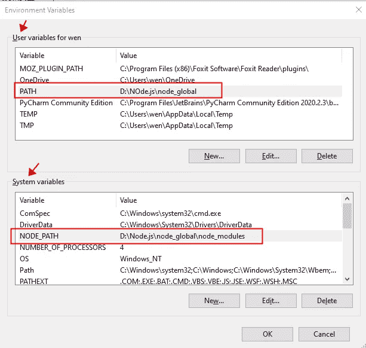

# Webpack(1):安装和基本配置

> 原文：<https://javascript.plainenglish.io/webpack-installation-and-basic-configuration-81d0f1c51880?source=collection_archive---------9----------------------->

记录 webpack 的安装和配置过程，以及将会遇到的各种陷阱。


*环境:win10，webpack@3.6.0*

# 1.Webpack 安装

## 1.1 安装过程

1.在安装 webpack 之前，您必须安装 Node.js(这个过程会自动为您安装 npm)。默认路径是 c 盘，因为强迫症，我安装在了 D 盘。

2.安装 Node.js 后，可以通过 cmd 命令行中的 **node -v** 和 **npm -v** 分别查看版本信息。一般这里没什么问题。

3.之后别忘了配置 Node.js 的环境变量(具体步骤见 1.2)。

4.下一步是安装 webpack 因为练习项目用的是 4.x 之前的版本，我用`**npm install webpack@3.6.0 -g**` 进行全局安装。

5. **webpack -v** 到**到**查看版本信息。

## 1.2 Node.js 环境变量配置

之前急着建博客，装了 Node.js 之后就没在意了。然后，我无法使用 **webpack -v** 命令(提示“webpack 不是内部命令”)，才发现是因为当时忘了配置环境变量。

这可以分两步完成:

**1。修改全局安装位置**

默认情况下，Node.js 为系统环境创建两个环境变量:

```
User variables PATH: C:\Users\Admin\AppData\Roaming\npm
System variable PATH: D:\Nodejs
```

第一个变量指定了全局安装的东西的默认位置，因为我不想把它们放在 c 盘上，所以我必须改变这个默认配置。具体方法是:

```
First, create a new node_global and node_cache folder in the Nodejs folder, which are used to store the global installation package and temporary cache location respectively;Then set the global installation path and the global cache path (that is, the two just now) in cmd:
```


稍后可以用`**npm root -g**`查看。

在这之后，再次安装 webpack，应该会出现在 Nodejs/node_global 文件夹中，不出意外。但是，我们仍然无法检查版本，因为环境变量没有被修改。

**2。修改环境变量**

我的电脑—右键单击属性—高级系统设置—高级—环境变量:

用户变量:将路径修改为 D:\Node.js\node_global

系统变量:添加 NODE_PATH，将值设置为 D:\Node.js\node_global

PS:第二个好像设置为 D:\ node . js \ node _ global \ node _ modules



然后重启 cmd(一定要重启，否则不会生效)，再来一次 webpack -v，这次可以正常使用了。

# 2.基础结构施工

1.要练习，首先创建一个新项目，然后 cd 进入它


从现在开始我会在这个文件夹里做事。

2.创建**index.html**文件和 **src** 文件夹，在打包前存储文件

3.通过生成 **package.json** 文件，用于描述项目信息和依赖配置。一路回到这里真好。

4.通过`**npm install webpack@3.6.0 — save -dev**` **本地安装 webpack 本地**安装允许每个项目有一个独立的包，不受全局包的影响，方便项目的移动、复制、打包。

5.手动创建 **webpack.config.js** 文件，用于配置 webpack 如何运行

现在，项目结构大致如下:


# 3.配置 webpack.config.js 和 package.json

首先，简单地配置 webpack.config.js


这里定义了入口和出口。条目(entry)指示 webpack 应该使用哪个模块文件作为构建内部依赖项的起点。在进入入口点之后，webpack 会找出哪些模块和库依赖于该入口。

Output 告诉 webpack 在哪里输出它创建的包，以及如何命名这些包。

让我们为一个简单的测试创建几个新文件。首先是 module.js


main.js 作为条目文件:


包 main.js:


您将在项目文件夹下找到一个 dist 文件夹，其中包含一个打包并生成的 bundle.js 文件:


然后在 index.html 中直接引用该文件:


运行浏览器，没问题。

但是之前的打包命令太繁琐了，我们来配置 package.json:


之后可以直接通过`**npm run build**`进行封装。

**下一章:使用加载器的 web pack**

*更多内容看* [***说白了。报名参加我们的***](https://plainenglish.io/) **[***免费周报***](http://newsletter.plainenglish.io/) *。关注我们关于*[***Twitter***](https://twitter.com/inPlainEngHQ)[***LinkedIn***](https://www.linkedin.com/company/inplainenglish/)*[***不和***](https://discord.gg/GtDtUAvyhW) ***。******