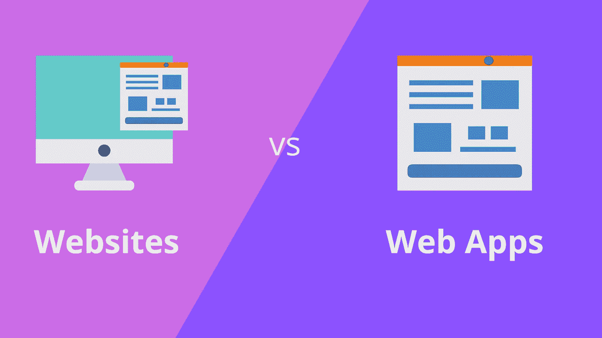

# 网站与网络应用:你需要知道的基本知识

> 原文：<https://javascript.plainenglish.io/websites-vs-web-apps-the-basic-things-you-need-to-know-d5589f9cb4f1?source=collection_archive---------7----------------------->

关于网站和网络应用，用户之间总是有一线困惑。两者都有响应能力，需要互联网连接，并且都可以通过网络浏览器访问。那么，人们如何知道哪些是网站，哪些是网络应用呢？唯一有助于用户区分这两者的是关于这两者的基本知识。

网站和网络应用都有自己的特点、目的和一些基本的用法差异。了解这些常见的东西，可以对网友有用，帮助他们在两者之间进行排序。这篇文章旨在介绍网站和网络应用的基本知识。这不仅有助于他们了解网站与网络应用程序之间的区别，还能帮助他们为自己的业务做出正确的决定(当他们致力于实现数字化时)。

# 什么是网站？

网站是网页的集合，这些网页相互链接，共享一个域，并托管在服务器上。每个网站都有一个唯一的 IP 地址，可以通过稳定的互联网连接访问。网站的内容可以由图像、文本、音频和视频组成。为了让网站更有趣，大多数内容创建者喜欢将所有四种形式结合起来，以一种诱人的方式呈现给访问者。

网站是最基本和最具成本效益的在线展示方式。如果你想给用户的只是信息，那么一个当代设计的网站就可以了。网站既是企业的虚拟代表，也是它们的扩展名片，用户可以从中获得关于其产品和服务的全面信息。

# 网站的特点

一个好的网站是以可展示的和可理解的方式传递相关内容，并为用户提供所有需要的信息。如果提供一个公司的业务相关信息，它应该提供一个全面的服务列表，公司的详细信息和其他相关信息。如果它是一个基于产品的网站，那么它应该有所有网站的适当描述。然而，一个好的网站不仅仅是内容，还应该具备以下特征:

**-良好的速度:**一个网站应该加载得很快，所有的页面都可以随时浏览。

**-安全性:**网站必须为其读者维护标准的安全性。用户应该能够选择是否使用网站 cookies。同样，必须使用 HTTPS 协议。

**-响应性:**网站必须具有响应性，这意味着只要有活跃的互联网连接，就可以在任何设备上浏览。

**-跨平台和多浏览器兼容:**由于今天的网络世界有许多操作系统和多种浏览器可供浏览，一个好的网站必须支持所有这些系统和浏览器。

**- SEO 友好:**一个网站应该被适当地优化为搜索引擎友好，这样用户可以很容易地通过任何搜索引擎找到它。

**-轻松导航:**一个网站可以包含许多页面，这就是为什么它必须具有一个无障碍的导航系统是很重要的，这样用户就可以很容易地找到他们想要的东西。

**-可扩展性:**一个网站可能开始时只有几个页面，但随着业务的不断增长，网站也会不断发展。因此，它必须是可扩展的，并且对未来的升级具有弹性。

这里要注意的重要一点是，尽管大多数功能对于几乎所有的网站都是通用的，但企业或个人可以根据所建网站的类型选择包含或排除某些功能。例如，如果你有一个基本的食品博客网站，那么你需要注意它的响应性、可伸缩性和包括图像在内的内容质量，但是对于一个公司网站来说，搜索引擎优化友好性、导航和安全性更重要。

# 什么是 Web 应用程序？

web 应用程序是软件的一部分，可通过浏览器访问，不需要任何下载。然而，它通常需要用户认证，并且需要一个服务器来管理用户请求。web 应用程序的开发大多采用客户端和服务器端脚本的组合来呈现信息。由于 web 应用涉及到与用户的交互和用户的输入，因此 web 应用还需要强大的数据库系统的支持。

网络应用大多是动态的，它们的主要目的是帮助用户完成某些任务。Spotify 是动态网络应用的一个很好的例子，它帮助用户通过在线流媒体收听音乐。Spotify 的网络应用不需要下载，但为了播放音乐，用户需要登录，然后搜索并播放他们喜欢的音乐。Web 应用程序可以用 HTML 和 JavaScript 之类的语言构建，但大多数都使用了 React、Vue.js、Ember 和 Backbone 之类的现代框架。

# Web 应用程序的功能

web 应用程序开发是一个庞大的学科，因为今天的所有其他网站最终都变成了 web 应用程序。从简单的电子学习平台到高度复杂的电子商务商店，web 应用程序的范围和功能都非常多样化。应用程序越复杂，它的功能就越多。但是，每个优秀的网络应用都必须坚持某些特性。让我们来看看它们。

**-增强的安全性:**web 应用程序必须拥有所有必要的安全认证，并且应该能够保护用户的数据，因为它们涉及到活跃的用户交互，例如，他们的电子邮件、联系号码、地址、支付信息或任何其他个人信息。

**-健壮的后端:**一个好的 web app 必须有一个强大的[后端开发](/8-extremely-handy-node-js-libraries-to-enhance-app-functionality-fdece6b8d545)来支持它的可扩展性。由于一个 web 应用程序可以很快升级，因此必须通过一个健壮的后端框架来高效地处理增加的访问者流量和数据输入。

- **跨平台和多浏览器兼容:**与网站一样，web 应用也支持所有主要的操作系统和浏览器，包括 Safari 和 Opera。

**-响应性:**同样，像网站一样，网络应用也必须具有响应性，这意味着它们可以在任何具有活跃互联网连接的设备上浏览。

**-速度:**速度对 web 应用程序至关重要，因为没有人喜欢使用加载和响应缓慢的应用程序。因此，一个好的 web 应用程序必须快速加载，同时在不影响整体页面速度的情况下快速处理来自用户的数据。

**-吸引人的前端:**大多数 web 应用程序都依赖于活跃的用户交互，这就是为什么一个好的 web 应用程序必须有一个设计良好、吸引人的前端[和一个简单的导航系统、好的内容和精心制作的 UI。](/which-framework-to-consider-angular-or-vue-js-for-your-next-project-96662069e8fc)

现在你已经了解了网站和网络应用的基本构建和功能，让我们来看看它们的核心区别。

# 网站和 Web 应用程序的区别

## **网站**

*   网站通常向访问者提供静态内容。几乎没有来自用户端的交互。
*   网站的信息流动是单向的，因为用户只能阅读或查看内容，而不能操作。
*   网站的开发、集成和部署非常简单。
*   web 应用程序需要在部署之前进行预编译。
*   一个 web 应用程序基本上需要来自最终用户的认证。

## **网络应用**

*   一个 web 应用程序主要涉及到来自用户端的主动交互。
*   在大多数 web 应用程序中，读者可以阅读、查看内容并与之互动，甚至可以操作它。
*   web 应用程序的开发、集成和部署要复杂得多，因为它涉及更多的特性和功能。
*   网站的启动不需要预先编译。
*   因此不需要认证。一些网站最多需要电子邮件地址来订阅或订阅时事通讯。

## 外卖食品

从这个讨论中可以推导出一个简单的观点:web 应用程序远比网站复杂和多面。一个网络应用需要更多的资源和更前沿的技术。鉴于在线业务已经成为企业不可或缺的一部分，人们确实需要在两者之间做出选择。最好的方法是评估你的需求，你的预算，和用户交互的需求，然后进行相应的操作。

*更多内容请看*[***plain English . io***](https://plainenglish.io/)*。报名参加我们的* [***免费周报***](http://newsletter.plainenglish.io/) *。关注我们关于*[***Twitter***](https://twitter.com/inPlainEngHQ)**和*[***LinkedIn***](https://www.linkedin.com/company/inplainenglish/)*。查看我们的* [***社区不和谐***](https://discord.gg/GtDtUAvyhW) *加入我们的* [***人才集体***](https://inplainenglish.pallet.com/talent/welcome) *。**