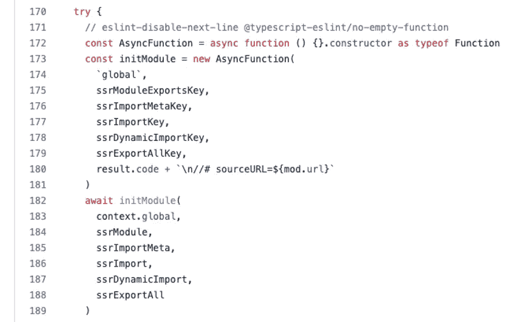

# Vite SSR 呢？

> 原文：<https://javascript.plainenglish.io/what-about-vite-ssr-ef7ccdf58b5?source=collection_archive---------3----------------------->


本文将带你更深入的了解 Vite SSR

网上关于 Vite 的文章主要分为入门教程或者原理分析。本文采用不同的方法，向您展示 Vite 作为 2021 年最热门的构建工具是如何实现 SSR 的

> 这篇文章是时间敏感的，当前的官方版本是 2.7.13

# 为什么要用 SSR？

r，我们来简单介绍一下 SSR

我之前接触的大部分项目都是客户端渲染，客户端渲染也叫 CSR(客户端渲染)。

CSR 采用前后端分离的结构。当客户端请求 HTML 时，服务器只返回“空”HTML

> 空 HTML 是指只包含挂载点和 Vue 运行时，不包含任何页面内容的 HTML

最终客户端通过运行 Vue 运行时动态创建页面 DOM 来呈现完整的 HTML


服务器端渲染也称为 SSR(服务器端渲染)

当客户端请求 HTML 时，服务器将返回完整的 HTML

> 完整的 HTML，包括挂载点、Vue 运行时和页面内容的 HTML


由于完整的 HTML 在服务器端返回，Vue runtime 不需要动态生成 DOM。一方面减轻了客户端渲染的压力(动态创建大量 DOM 会造成一定的滞后)，另一方面让用户更早看到。满足于

这两点最终使得第一个使用 SSR 渲染页面的项目的画图速度非常快

企业社会责任


苏维埃社会主义共和国


> 除了客户端渲染和服务器端渲染，还有一种预渲染技术，SSG (static site generate)。在构建构件时直接生成包含页面内容的 HTML 构件
> 
> SSG 和 SSR 在第一个屏幕上具有相同的优化效果，但比 SSR 更轻、更简单。适用于博客、官网等首屏数据变化不大的项目。
> 
> [*https://nextjs . org/docs/basic-features/pages # static-generation-推荐*](https://nextjs.org/docs/basic-features/pages#static-generation-recommended)

## CSR 与 SSR

企业社会责任

优势

–开发简单，无需担心服务器上运行的代码引起的兼容性问题

–简单部署，仅涉及静态资源服务器

–获取数据的方法很简单，使用 ajax/fetch 获取数据

缺点

–第一个屏幕很慢

–糟糕的搜索引擎优化

苏维埃社会主义共和国

优势

–首屏速度快(浏览器版本越低效果越好)

–搜索引擎优化很好

–可以获得关于请求上下文的附加信息

缺点

–开发很复杂，需要编写 SSR 的服务器端代码

–复杂的部署需要 SSR 服务器和静态资源服务器来进行降级灾难恢复，增加了后期运营和维护成本

–编写代码需要考虑平台兼容性，增加了额外的精神负担

## 要使用的场景

对于后端管理系统、数据中端平台等 toB 项目，由于对首屏要求低，用户数量少，一般采用 CSR 来简化开发流程，快速交付项目。

对于官网首页、电商首页等 toC 项目来说，首屏速度直接关系到用户留存率，而良好的 SEO 也是提高转化率的前提，因此需要依靠 SSR 来探索进一步的可能性

# 项目结构(开发)

以 [*Vite 官方知识库的简化 SSR 项目*](https://github.com/vitejs/vite/blob/main/packages/playground/ssr-vue) 为例

Vite SSR 项目至少包含以下文件

```
├── index.html // template，include SSR client entry
 ├── package.json
 ├── server.js // dev server
 ├── src
 │ ├── App.vue // Vue container
 │ ├── main.js // common entry
 │ ├── entry-client.js // SSR client entry
 │ ├── entry-server.js // SSR server entry
 │ └── pages // page files
 │ └── Home.vue
 └── vite.config.js
```

## index.html

项目模板文件


与 CSR 的区别在于

更多 *<！— app-html — >* ， *<！—预加载-链接— >* 注释

条目文件变成/src/entry-client.js

*哪里来的<！— app-html — >* 是页面内容的占位符，在服务器渲染带有页面内容的 html 字符串后，它将替换 *<！— app-html — >* 占位符

还有 *<！— preload-links — >* 是 preload 节点的占位符，用于生成预渲染的 HTML 字符串，**开发环境没有实质影响**

在构建了 SSR 生产环境之后，您可以选择生成一个 manifest.json 文件，它记录了源文件和构建产品的依赖关系

```
{
   "src/App.vue": [
     "/assets/Inter-Italic.bab4e808.woff2",
     "/assets/Inter-Italic.7b187d57.woff"
   ],
   "vite/preload-helper": [
     "/assets/Inter-Italic.bab4e808.woff2",
     "/assets/Inter-Italic.7b187d57.woff"
   ],
   "src/router.js": [
     "/assets/Inter-Italic.bab4e808.woff2",
     "/assets/Inter-Italic.7b187d57.woff"
   ],
   ...
}
```

从这个清单文件中，生成一个 HTML 字符串进行预渲染，替换掉 *<！—预加载-链接— >* 占位符


> 为什么开发环境不使用预加载占位符？
> 
> 因为开发环境无法获取生成信息，如生成哈希，所以无法生成清单文件。
> 
> 同时，开发环境从生成预加载节点中几乎没有产生利润
> 
> 为什么 CSR 中不需要考虑预加载，SSR 中需要额外处理？
> 
> 因为在构建 CSR 时会自动生成全部预加载代码
> 
> 另一方面，SSR 只允许加载条目所需的预加载节点，因为它可以获得更多的信息，比如用户访问了哪个页面。虽然牺牲了一些便利性，但是获得了灵活创建预加载节点的能力，减少了资源浪费
> 
> [*https://ssr.vuejs.org/en/api/#shouldpreload*](https://ssr.vuejs.org/zh/api/#shouldpreload)

也就是说，返回给客户端的完整 HTML 至少需要包含

模板*index.html*

页面内容 *app-html*

预载节点*预载链接*(开发环境不需要)

模板是静态的，页面内容和预加载信息由服务器为每个请求动态生成

## server.js

**开发环境用于调试**的 SSR 服务器


**该文件不会在生产环境中使用**

**该文件不会在生产环境中使用**

**该文件不会在生产环境中使用**

重要的事情说三遍，打包的产品不会有任何 server.js 相关的代码

> 为什么不把 server.js 放在产品里？
> 
> 请参见下面的“生产环境不能开箱即用”一节
> 
> server.js 的作用是

1.当接收到页面请求时，使用 vite.ssrLoadModule 读取 SSR 服务器条目文件，并返回呈现页面内容的函数(render 函数)

> 为什么需要使用 vite.ssrLoadModule 而不是 require 函数？
> 
> [*动态导入*](http://nodejs.cn/api/esm.html#import-expressions) 用于 vite . ssrloadmodule[](http://nodejs.cn/api/esm.html#import-expressions)*后面，同时兼容 CommonJS 模块和 es 模块*
> 
> *同时，vite.ssrLoadModule 还包含了热更新的能力*

*2.运行 render 函数获取页面内容的 HTML 并替换*

> *Will other static resources (js/css/img) also execute vite.ssrLoadModule?*
> 
> *No, only the html as the entry will trigger vite.ssrLoadModule, other static resource requests will be intercepted and returned in advance by the built-in static resource server in vite.middlewares*

## *main.js*

*public entry file*

**

*In SSR, both the client entry file entry-client.js and the server entry file entry-server.js will execute main.js*

*The difference from CSR is that SSR’s main.js declares a factory function called *bootstrap* ，bootstrap 替换原来的并立即执行。*

> *未指定函数名，入口客户端/入口服务器可以正确找到该函数*

*为每个请求创建一个新的 Vue 实例，通过工厂函数保证每个请求的数据和状态相互独立*

*此外，SSR 使用*createsrapp*来创建 Vue 实例。与 CSR 使用的 *createApp* 不同的是*createsrapp*会根据当前环境实现不同的功能。*

*SSR 客户端:“激活”静态 HTML(下一节解释这是什么意思)*

*SSR 服务器:类似于 *createApp* ，区别在于一个在客户端创建 Vue 实例，另一个在服务器端创建 Vue 实例*

## *条目-客户端. js*

*SSR 客户端条目文件*

**

*服务器返回给客户机的 HTML 包含一个指向 SSR 客户机条目/src/entry-client.js 的脚本标记*

**

*客户端获得入口文件后，执行 main.js 中的*createsrapp*来“[激活](https://vuejs.org/guide/scaling-up/ssr.html#client-hydration) 静态 HTML*

**

*由于服务器会将包含页面内容的完整 HTML 发送给客户端，Vue 不会重新创建 HTML 节点，而是使用*createsrapp*将事件绑定到获取的 HTML 节点，初始化背后 Vue 实例的状态等。，这样它看起来就像由 CSR 呈现的页面一样*

*[](https://github.com/vuejs/core/blob/main/packages/runtime-core/src/apiCreateApp.ts#L298) [## 主 vuejs/core 处的 core/apiCreateApp.ts

### 此文件包含双向 Unicode 文本，其解释或编译可能与下面显示的不同…

github.com](https://github.com/vuejs/core/blob/main/packages/runtime-core/src/apiCreateApp.ts#L298) 

激活后，HTML 完全被客户端接管，行为与 CSR 一致。到目前为止，与 SSR 服务器无关。

本文仅针对最简单的场景。对于 SSR 框架，如 next.js、nuxt.js、remix.js，主张 SSR 客户端与 SSR 服务器集成，水化后也可能与 SSR 服务器通信

## 入门级服务器. js

SSR 服务器条目文件


entry-server.js 需要导出一个生成页面内容的函数

Vue 提供了 *renderToString* ，可以很容易地将 Vue 实例转换成页面内容的 HTML 字符串

此外，示例中的 entry-server.js 还负责动态生成预加载节点(开发环境没有实际作用)

> 对 entry-server.js 的输入参数、输出参数和函数名没有严格的要求，server.js 可以正确的从 entry-server.js 获取渲染函数。
> 
> ctx 对象在 render 函数中的作用是什么？
> 
> 以上注释有详细解释，主要用于 **SSR 服务器**(不能使用 **SSR 客户端)**中服务器与 Vue 组件之间的数据通信
> 
> ctx 可以存储一些只有 SSR 服务器才能获得的数据(cookies、headers ),并将其作为参数传递给 renderToString
> 
> 之后，Vue 组件可以通过 useSSRContext 返回 ctx 对象来获取这些数据


## 流程图


# 项目结构(生产)

生产环境中的产品结构如下

```
├── client *// SSR client files*
 │ ├── assets *// static files*
 │ │ ├── Home.149d59e2.css
 │ │ ├── Home.c041839f.js
 │ │ ├── index.b988c137.css
 │ │ ├── index.cd252472.js
 │ │ └── vendor.9ebeb296.js
 │ ├── index.html *// template，include SSR client entry output*
 │ └── ssr-manifest.json *// output manifest*
 └── server *// SSR server file*
 └── entry-server.js *// SSR server entry*
```

## index.html


SSR 客户端条目文件 entry-client.js 由 Vite 构建，并发展成一个静态资源文件

/assets/vendor.js 包含用于在客户端激活 HTML 的 Vue 运行时

/assets/index.js 包含每个页面的 Vue 组件

*！— app-html - >* 和 *<！—预加载-链接- >* 仍被保留。当 SSR 服务器收到页面请求时，它将动态替换这两个占位符

## ssr-manifest.json

[*生成-预载-指令*](https://vitejs.dev/guide/ssr.html#generating-preload-directives)


当服务器执行 render 函数时，它将额外读取 ssr-manifest.json 并动态生成 preload 节点

## 入门级服务器. js

Vite 还会在构建时将所有 Vue 组件编译到 entry-server.js 中


> 看产品结构可以发现，SSR 客户端生成的静态资源文件和构造时在 entry-server.js 中额外注入的代码实际上代表的是同一个 Vue 组件
> 
> 但是考虑到 SSR 客户端和服务器端的区别，Vite 并没有直接重用客户端的静态资源文件为 entry-server.js，而是一次打包。个人觉得还是有一定的优化空间的。

构建的产品中没有 server.js，验证 server.js 只存在于开发环境中

一般来说， **entry-server.js 是一个只负责返回页面内容的函数**，entry-server.js 单独是无法启动 SSR 服务器的

那么，如何为生产环境启动 SSR 服务器呢？

这里我们需要一个定制服务器，作为生产环境的“server.js”。有关详细信息，请参见“生产环境不能开箱即用”一节。

## 流程图


# 当前问题

截至目前(Vite 2.7.13)，Vite SSR 仍处于实验阶段

Vite 在问题区 正式开设了 [*讨论区*](https://github.com/vitejs/vite/issues/4231)


为什么在 Vue3 发布两年多，Vite 发布一年多之后，Vite SSR 仍然无法正式投入使用？

围绕问题领域的讨论主要分为以下几个问题

## 生产环境不能开箱即用

相关问题:[*https://github . com/vitejs/vite/discussions/4230 # discussion comment-1162698*](https://github.com/vitejs/vite/discussions/4230#discussioncomment-1162698)

如前所述，Vite 只会在开发环境中提供一个服务器，产品中不会存在 server.js。因此，为了使代码在生产环境中正常运行，还需要一个生产服务器。

这里肯定有人要问了，为什么不包 server.js 呢？

结合问题区的讨论，猜测 Vite 的动机

由于市面上基于节点的服务器端框架种类繁多(express、koa、nest、serverless)，一旦 Vite 绑定了某一风格的服务器端框架，其他风格的开发者就不得不跟随

此外，提供开箱即用的服务器也限制了对其进行定制的能力。为了增加框架的通用性，Vite 只是让产品不绑定到任何服务器端框架，而是由开发人员单独进行适配

例如，要在生产环境中部署 SSR 服务器，您需要执行以下操作:

1.构建源代码并将产品上传到 CDN 服务器


2.创建一个单独的代码存储库来存储 SSR 服务器

3.创建一个定制服务器，可以是任何技术堆栈，如 express、koa 等。


4.以 express 框架为例，直接复制 [*官方演示(express 风格)*](https://github.com/vitejs/vite/blob/main/packages/playground/ssr-vue/server.js) 的 server.js 代码


5.将 server.js require 的文件地址指向 CDN(也可以使用 CDN，只要能读取第一步的产品)


6.将 process.env.NODE_ENV 设置为“prod”(server . js 通过 NODE_ENV 区分环境)，运行 *node server.js* ，启动服务器

可以发现，在生产环境中部署服务器还是有一定成本的。社区也意识到了这个痛点，提出了解决方案 [*vite-plugin-node*](https://github.com/axe-me/vite-plugin-node)


这个插件将为 Vite 提供多个主流的服务器端框架适配器。开发者只需要选择其中一个服务器端框架，这样在开发环境中就不再需要 server.js 了(目的只针对开发环境，作者说以后会衍生。到构建侧)


Vite 官方如何回应还有待考证

## 关于外部化的争论

相关问题:

[*https://cn.vitejs.dev/guide/ssr.html#ssr-externals*](https://cn.vitejs.dev/guide/ssr.html#ssr-externals)

[*https://github . com/vitejs/vite/discussions/4230 # discussion comment-997865*](https://github.com/vitejs/vite/discussions/4230#discussioncomment-997865)

[*https://github.com/vitejs/vite/pull/5903*](https://github.com/vitejs/vite/pull/5903)

[https://github.com/vitejs/vite/issues/4340](https://github.com/vitejs/vite/issues/4340)

通过两种产品的区别理解什么是“外部化”

外部化产品


非外部化产品


两者的区别是**代码是否打包**

外部化后，依赖包(vue，vue-router，vuex)以 require 的形式引入，非外部化会对依赖进行打包(类似于 webpack)

外化的好处是不对模块做任何处理，直接引用模块。因此，尽可能将模块外部化将显著优化构建速度和产品量。

但是，对于一些特殊的环境，如 worker、serverless、deno、docker，可能会对节点的本地加载模块(require/import)提供有限的支持。此时，您需要重新打包项目和依赖项，以生成一个不依赖于任何主机环境的 js 文件


有些人认为，在生产环境中，所有模块都应该外部化，以提高性能并避免在打包模块时出现问题

有些人认为所有模块都应该打包，以确保任何平台都能完美运行

所以目前还没有完美的解决方案，甚至连外化的判断条件都不稳定。


## 与 CommonJS 模块不兼容

相关问题:[T3【https://github.com/vitejs/vite/issues/5424】T5](https://github.com/vitejs/vite/issues/5424)

Vite 的模块加载器( *vite.ssrLoadModule* 加载的模块，一旦 CommonJS 模块被引入到**项目本身**中，就会出现如下错误


原因是 Vite 的加载器由新的[*async function*](https://github.com/vitejs/vite/blob/main/packages/vite/src/node/ssr/ssrModuleLoader.ts#L173)+[*动态导入*](https://github.com/vitejs/vite/blob/3f27d58036/packages/vite/src/node/utils.ts#L634) 组成



我们知道，当使用 node 运行一个 js 文件时，node 运行时会将文件包装成一个函数，并注入一些特定的参数


Vite SSR 借鉴 node 的实现，通过一个新的 AsyncFunction 包装文件，使用 *global* 作为上下文，传入 *ssrModule* 、 *ssrImportMeta* 等参数。


但是 Vite 并没有注入 require 函数，所以一旦执行 require 函数，就会提示找不到变量

server.js 不属于 Vite 接手的代码，可以用 require

官方的解释是，Vite 应该在 ESM 模块环境下运行，ESM 模块默认不支持 CommonJS 语法


所以 Vite 理论上不允许出现 require、module.exports 这样的语法

> 但是为了适应 npm 社区中大量的 CommonJS 模块，对于 npm 包，Vite 还是会通过 [*预捆绑将 CommonJS 转换为 ESM，所以上面的场景只是针对项目本身的代码*](https://cn.vitejs.dev/guide/dep-pre-bundling.html)

当然，ESM 为 CommonJS 预留了“后门”。通过 [*createRequire*](https://nodejs.org/api/module.html#modulecreaterequirefilename) ，可以在 ESM 模块中动态创建一个 CommonJS 模块加载器。


# 总结

SSR 是指在服务器端生成完整 HTML 内容的技术，可以提高首屏时间，增加 SEO。适用于用户量大，对首屏要求高的系统。

SSR 同时涉及客户端和服务器端，需要编写兼容两端的代码，部署还需要额外的 SSR 服务器。

Vite SSR 还处于实验性质，产品的结构以及如何与 npm 生态系统兼容还需要进一步探讨。

*更多内容看* [***说白了。报名参加我们的***](https://plainenglish.io/) **[***免费周报***](http://newsletter.plainenglish.io/) *。关注我们关于*[***Twitter***](https://twitter.com/inPlainEngHQ)*和*[***LinkedIn***](https://www.linkedin.com/company/inplainenglish/)*。加入我们的* [***社区***](https://discord.gg/GtDtUAvyhW) *。****