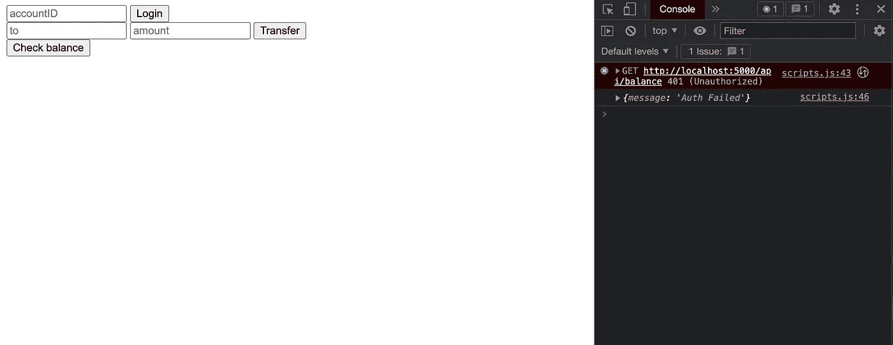
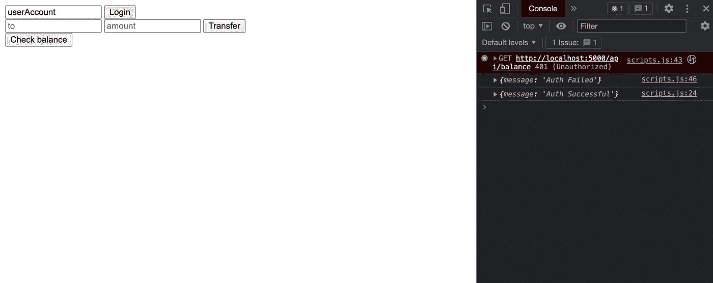
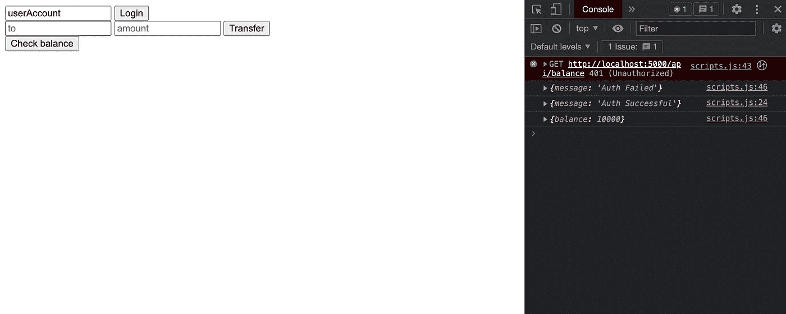
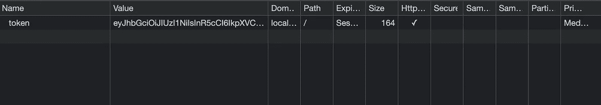
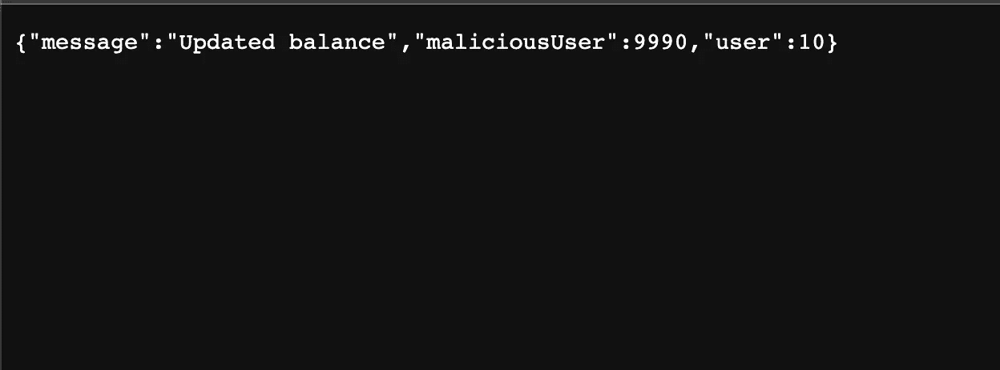
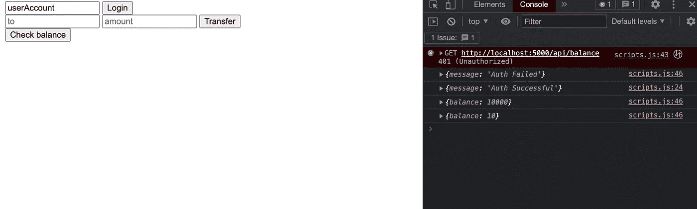

# 什么是跨站点请求伪造(CSRF)攻击

> 原文：<https://javascript.plainenglish.io/what-are-cross-site-request-forgery-csrf-attacks-4fe5f5670c08?source=collection_archive---------11----------------------->

## 通过创建模拟应用程序了解 CSRF 攻击。

Photo by [Kaique Rocha](https://www.pexels.com/@kaiquestr/) on [pexels](https://www.pexels.com/photo/person-wearing-adidas-hoodie-during-daytime-171945/)

当我第一次开始我的 web 开发之旅时，我有很多关于令牌管理和认证的问题。我心中的主要问题是，我如何在客户端管理令牌。通过在线阅读，我看到了许多参考了[跨站脚本(XSS)攻击](https://owasp.org/www-community/attacks/xss/)的文章。阅读了关于 XSS 的文章后，我得出结论，将令牌存储为 HTTP-only cookie 可以解决我的所有问题，因为在客户端无法通过 JavaScript 访问它。虽然 HTTP-only 标志有助于抵御 XSS，但它使我的应用程序容易受到[跨站请求伪造(CSRF)攻击](https://owasp.org/www-community/attacks/csrf)。

在这篇博客中，我将通过一个非常简单的模拟应用程序来展示 CSRF 是如何工作的。由于代码库很大，所以我不会在这篇博客中一一介绍。我将只强调关键部分，以解释是什么使应用程序容易受到 CSRF 的攻击。如果你想回顾所有的代码，你可以在这里找到它[。](https://github.com/hanskrohn/CSRF-example)

*免责声明:我不是安全专家，而是对学习感兴趣的人。如果你注意到这篇文章中的错误或者可以改进的地方，请在评论中提出来。帮助我和其他人继续学习。*

## 了解 CSRF 以及我们将如何实施攻击

首先，让我们快速讨论一下 CSRF 攻击是如何工作的。CSRF 的目的是欺骗受害者提交一个不想要的请求。这些攻击还侧重于改变服务器的状态，而不是接收信息。为了使这些攻击起作用，受害者必须以这样的方式被认证，即服务器不能知道是谁在发出请求。在我们的应用程序中，我们将管理用于身份验证的 JWT 令牌，并将它们存储为 cookies。将认证作为 cookie 来管理的问题是，cookie 是在每个请求时[发送的。这是一个主要的设计缺陷，因为任何请求都会被服务器认为是合法的。](https://developer.mozilla.org/en-US/docs/Web/HTTP/Cookies)

幸运的是，有一些方法可以帮助防止这种攻击。首先是使用`same-origin policy`。在应用程序中，你会注意到我指定 CORS 允许来自任何来源的请求。通过允许来自任何来源的请求，攻击者可以通过网络钓鱼技术诱骗受害者提交不想要的/未知的请求。通过限制来自同一来源的请求，我们可以保证客户端只提交通过我们的应用程序可用的请求(除非您的应用程序有 XSS 漏洞，在这种情况下，可以发起 CSRF 攻击。但是如果是这样的话，你的网站就有更大的问题要担心了。).另一个解决方案是实现一个刷新和认证令牌系统。我的朋友写了一篇博客，解释了如何使用 NodeJS 和 React 实现这个系统。你可以在这里查看。

## 构建应用程序

如前所述，我将只讨论关键细节，以展示这个模拟应用程序如何容易受到 CSRF 的攻击。如果你想看完整的代码库，你可以点击这里。

这款应用试图模仿一家银行。它有一些非常简单的功能。登录功能、获取余额功能和转账功能。它也只有两个客户端。一个真正的用户，他将充当我们的受害者，和一个恶意用户。下面你可以看到账户信息。

接下来，我们将检查应用程序的功能。如前所述，有三个端点。它们都写得非常简单，我没有太多的验证。例如，您会注意到，我在完成转账之前不会检查是否有足够的资金。我还通过检查有效的用户 id 来执行登录功能。这只是为了简单起见。如果您通过密码进行身份验证，这个逻辑同样适用。需要注意的关键信息是，`login`函数创建了一个 JWT 令牌，它作为一个 HTTP-only cookie 存储在客户端，并且`getBalance`和`transfer`端点通过认证中间件得到保护。

最后，我在下面包括了认证中间件。这只是在继续处理请求之前做一个快速检查，以确保 JWT 令牌有效。

接下来，我们获得了银行应用程序的客户端代码。还是那句话，超级简单。按下按钮的响应将记录在浏览器控制台中。

最后，我们得到了我们将发起 CSRF 攻击的网站的代码。在这个例子中，一个站点只是一个带有提交按钮的空表单，它向我们的传输端点发送一个`POST`请求。

请记住，CSRF 攻击不仅限于形式，攻击者可以非常有创意地欺骗受害者提交不需要的请求。

## 运行这段代码并观察它的运行

接下来，我将运行这段代码，从受害者的角度展示会发生什么。

当我们第一次打开网站时，我们将进入一个类似这样的页面。如果我尝试检查我的余额，您会注意到由于身份验证失败，请求被阻止。这很好，表明我们的受保护终端正在按预期工作。

Request to protected endpoint blocked

接下来，我将登录并尝试检查我的余额。这一次，我们应该能够看到我们的请求成功，并返回我们的银行余额 10，000。检查 application 选项卡，我们还可以看到我们的身份验证令牌实际上被正确地存储为一个 HTTP-only cookie。

Successful Authentication

Displaying Balance

Token being stored as HTTP-only cookie

接下来，我会想象我通过电子邮件链接被钓鱼。当我访问攻击者的网站时，我点击了提交按钮，这触发了一个代表我的不必要的请求。同样，由于身份验证是通过 cookie 管理的，服务器认为我的请求是有效的请求，并将我的钱转移到攻击者的帐户。下面你可以看到攻击者的网站显示什么。

After submitting displays my banks JSON response. Transfer succeeded

回到官方网站，我们可以看到我的平衡是如何由于 CSRF 的成功攻击而改变的。

After checking balance again, we can see 9990 was transferred out of my account.

同样，如果我犯了一个错误，或者如果这篇文章有改进的地方，请留下评论，帮助我和其他人继续学习。下次见。编码快乐！

*更多内容请看*[***plain English . io***](https://plainenglish.io/)*。报名参加我们的* [***免费周报***](http://newsletter.plainenglish.io/) *。关注我们关于*[***Twitter***](https://twitter.com/inPlainEngHQ)*和*[***LinkedIn***](https://www.linkedin.com/company/inplainenglish/)*。查看我们的* [***社区不和谐***](https://discord.gg/GtDtUAvyhW) *加入我们的* [***人才集体***](https://inplainenglish.pallet.com/talent/welcome) *。*