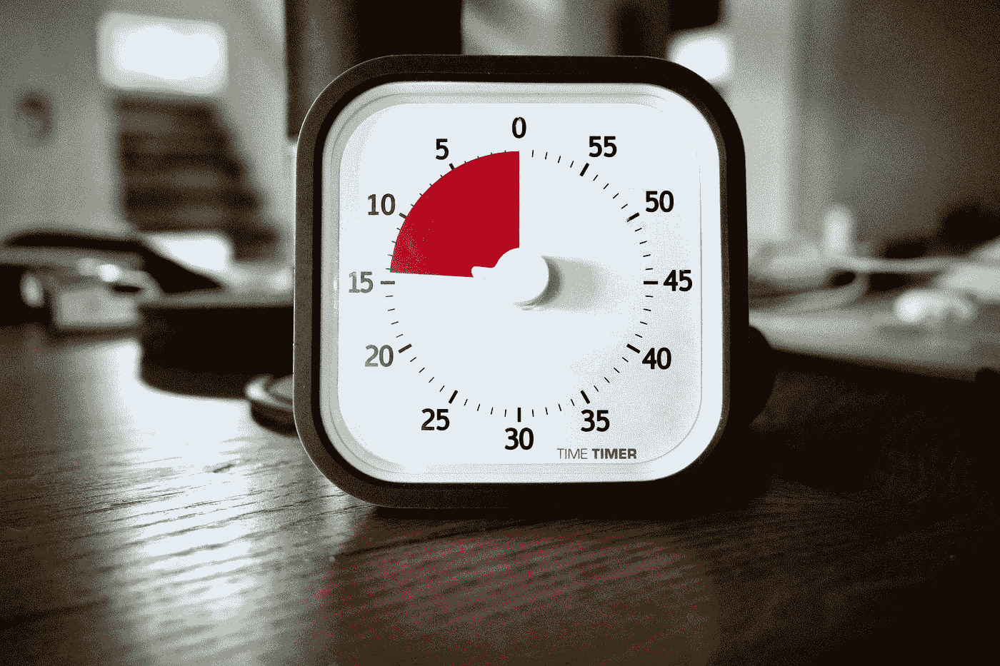

# 什么是去抖和节流？

> 原文：<https://javascript.plainenglish.io/what-are-debounce-and-throttle-8908dc7c5a62?source=collection_archive---------11----------------------->

## 如何在 TypeScript 中编码去抖和节流



Photo by [Ralph Hutter](https://unsplash.com/@pixelfreund?utm_source=medium&utm_medium=referral) on [Unsplash](https://unsplash.com?utm_source=medium&utm_medium=referral)

在一些前端教程中，你可能听说过去抖和节流，那么在哪些情况下使用呢？为什么要用？

事实上，它们都是为了防止高频操作触发可能的性能问题。

在触发事件后的`N`秒内，仅执行一次去抖，如果在`N`秒内再次触发，将重新开始计时。

以下是 JavaScript 代码:

```
const debounce = (func, ms) => {
  let timer;
  return (...args) => {
    if (timer) clearTimeout(timer);
    timer = setTimeout(() => {
      func(...args);
    }, ms);
  };
};
```

我们在这里巧妙的使用了闭包，把`setTimeout`的返回值保存在闭包里，然后返回一个新的函数。当这个新函数被频繁调用时，它会检查是否有有效的`timer`，如果有，清除上一个定时器，然后重新生成定时器。

注意，我们返回的函数是一个箭头函数，也就是说它的`this`不变，所以当我们调用`func`时，它也被直接调用。如果您希望在调用时改变原始函数`this`的点，您可以这样做:

```
const debounce = (func, ms) => {
  let timer;
  return function (...args) {
    if (timer) clearTimeout(timer);
    timer = setTimeout(() => {
      func.apply(this, ...args);
    }, ms);
  };
};
```

看一下上面的代码，我们返回一个传统的函数，这意味着它的`this`取决于你如何调用它。然后我们用`func.apply(this, ...args);`把这个`this`传递给原函数。但是注意，如果你的原函数是一个箭头函数，那么这个就不行。

综上所述，我会推荐使用第一种方式，使用箭头函数定义原函数。这样,`this`指向的所有函数都是明确的，你的代码也更加简洁易懂。

这是添加了一点魔法的打字稿:

```
const debounce = <F extends (...args: any[]) => void>(func: F, ms: number) => {
  let timer: ReturnType<typeof setTimeout>;
  return (...args: Parameters<F>) => {
    if (timer) clearTimeout(timer);
    timer = setTimeout(() => {
      func(...args);
    }, ms);
  };
};
```

接下来说一下节流，它只会在`N`秒内执行一次，在`N`秒内重新触发也不会有影响。也就是说，它只是稀释了执行频率。

```
const throttle = (func, ms) => {
  let timer;
  return (...args) => {
    if (timer) return;
    timer = setTimeout(() => {
      func(...args);
      timer = null;
    }, ms);
  };
};
```

可以看出，它和去抖的区别在于，如果有一个有效的定时器，函数就会退出，而去抖是清除最后一个定时器。

`this`的问题也是一样，这里就不赘述了，不过还是建议用箭头函数。

这是添加了一点魔法的打字稿:

```
const throttle = <F extends (...args: any[]) => void>(func: F, ms: number) => {
  let timer: ReturnType<typeof setTimeout> | null;
  return (...args: Parameters<F>) => {
    if (timer) return;
    timer = setTimeout(() => {
      func(...args);
      timer = null;
    }, ms);
  };
};
```

最后说一下哪些情况下可以用。在实时修改编辑器的情况下可以使用去抖动，如果有修改，将重新计时。或者当调整浏览器窗口大小时，监听器功能可以去抖。节流可用于浏览器滚动监听器事件或视频回放事件，例如，每隔`1s`计算一次。

不是中等会员？[在这里支持我](https://medium.com/@hibrandonevans/membership)成为其中一员。

感谢阅读！

*更多内容尽在* [***说白了. io***](https://plainenglish.io/) *。报名参加我们的* [***免费周报***](http://newsletter.plainenglish.io/) *。关注我们关于* [***推特***](https://twitter.com/inPlainEngHQ) ，[***LinkedIn***](https://www.linkedin.com/company/inplainenglish/)*，*[***YouTube***](https://www.youtube.com/channel/UCtipWUghju290NWcn8jhyAw)*，* [***不和***](https://discord.gg/GtDtUAvyhW) *。*