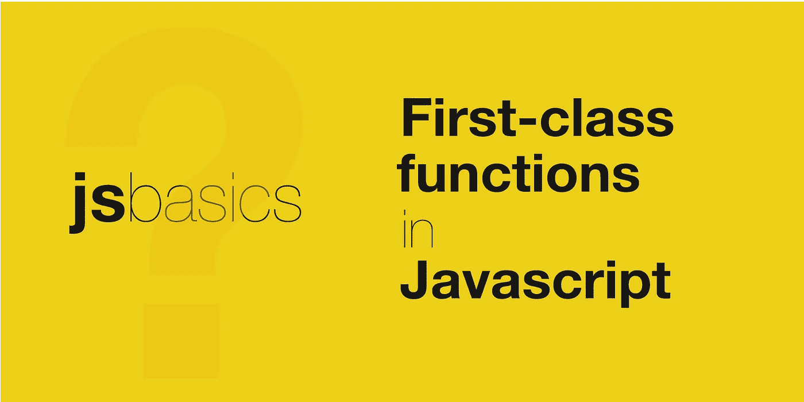

# JavaScript 中的一级函数是什么？

> 原文：<https://javascript.plainenglish.io/what-are-first-class-functions-in-javascript-6af46d5ae18d?source=collection_archive---------18----------------------->

## 了解什么是一级函数，以及它们如何融入 JavaScript。

按照 MDN 的定义，

> JavaScript 是一种轻量级、解释型或即时编译的编程语言，具有一流的功能

在这篇文章中，让我们试着探索什么是一级函数，以及它在 JavaScript 中的位置。

编程语言领域包括许多实体，如条件、类型、循环、函数等。，它们中的每一个都满足设计解决方案、构建应用程序的不同需求。然而，并非所有的实体都是相同的。适用于一个实体的选项可能不适用于其他实体。

**一等公民**是指支持其他实体通常可获得的所有操作的实体。这些操作中的一些是分配变量、修改、作为参数传递、从函数返回等等。

任何将函数视为一等公民的编程语言都被称为拥有**一等函数**。

在 JavaScript 中，一个函数可以赋给一个变量，它可以作为参数传递给另一个函数，可以作为另一个函数的结果返回，这使得 JavaScript 成为一种具有一流函数的语言。

一级函数是 JavaScript 中实现函数式编程的关键特性。在函数式编程中，高阶函数是一种标准做法，这是可能的，因为函数可以被传递一个参数&作为一个值返回。

请在下面找到一些代码示例，演示它们的用法:

希望它能帮助你理解 JavaScript 中的一级函数。请分享你的想法。

关注我，获取更多关于 JavaScript Web 开发的有趣帖子。还有，请给个 [*跟着*](https://twitter.com/jsbasics_dev) *上推特。*

*更多内容请看*[*plain English . io*](http://plainenglish.io/)*。报名参加我们的* [*免费每周简讯*](http://newsletter.plainenglish.io/) *。在我们的* [*社区不和谐*](https://discord.gg/GtDtUAvyhW) *获得独家获得写作机会和建议。*