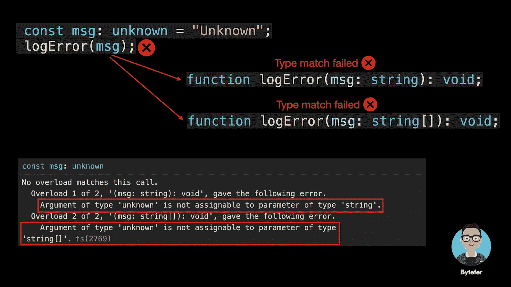

# 什么是 TypeScript 中的函数重载？

> 原文：<https://javascript.plainenglish.io/what-are-function-overloads-in-typescript-abcc06af42cb?source=collection_archive---------3----------------------->

## 对 TypeScript 中函数重载的简单解释有助于您理解重载签名和实现签名。


Photo by [Billy Huynh](https://unsplash.com/@billy_huy?utm_source=medium&utm_medium=referral) on [Unsplash](https://unsplash.com?utm_source=medium&utm_medium=referral)

欢迎来到**掌握打字稿**系列。本系列将以动画的形式介绍打字稿**的核心知识和技巧。让我们一起学习吧！以前的文章如下:**

*   [**TypeScript 泛型中的 K、T、V 是什么？**](https://medium.com/frontend-canteen/what-are-k-t-and-v-in-typescript-generics-9fabe1d0f0f3)
*   [**使用 TypeScript 像 Pro 一样映射类型**](/using-typescript-mapped-types-like-a-pro-be10aef5511a)
*   [**使用 TypeScript 条件类型像亲**](/use-typescript-conditional-types-like-a-pro-7baea0ad05c5)
*   [**使用 TypeScript 交集类型像亲**](/using-typescript-intersection-types-like-a-pro-a55da6a6a5f7)
*   [**使用打字稿推断像亲**](https://levelup.gitconnected.com/using-typescript-infer-like-a-pro-f30ab8ab41c7)
*   [**使用 TypeScript 模板字面类型像亲**](https://medium.com/javascript-in-plain-english/how-to-use-typescript-template-literal-types-like-a-pro-2e02a7db0bac)
*   [**可视化打字稿:15 种最常用的实用类型**](/15-utility-types-that-every-typescript-developer-should-know-6cf121d4047c)
*   [**关于类型脚本类你需要知道的 10 件事**](https://levelup.gitconnected.com/10-things-you-need-to-know-about-typescript-classes-f58c57869266)
*   [](/purpose-of-declare-keyword-in-typescript-8431d9db2b10)**中‘declare’关键字的用途**
*   **[**不再混淆打字稿的‘任何’和‘未知’**](/no-more-confusion-about-typescripts-any-and-unknown-98c4b53f8924)**

**你知道为什么下图定义了这么多`ref`函数，它们是做什么的吗？如果你还不清楚，看完这篇文章的内容，也许你就明白了。**

****

**这是一个简单的`logError`函数，接受一个字符串类型参数，用于输出错误信息。**

```
function logError(msg: string) {
  console.error(`Error occurred: ${msg}`);
}logError("Missing required field.");
```

**现在问题来了，如果我们想让`logError`函数以数组的形式支持多个错误消息呢？给你几秒钟时间考虑，你想出答案了吗？**

****

**Photo by [Aron Visuals](https://unsplash.com/@aronvisuals?utm_source=medium&utm_medium=referral) on [Unsplash](https://unsplash.com?utm_source=medium&utm_medium=referral)**

**解决方案之一是使用**联合类型**:**

```
function logError(msg: string | string[]) {
  if (typeof msg === "string") {
    console.error(`Error occurred: ${msg}`);
  } else if (Array.isArray(msg)) {
    console.error(`Errors occurred: ${msg.join("\n")}`);
  }
}logError("Missing required field.");
logError(["Missing required field.", "The length cannot be less than 6."]);
```

**另一个解决方案是使用函数重载，使用函数重载技术，我们需要定义**重载签名**和**实现签名**。**

****

**重载签名定义函数中每个参数的类型和函数的返回值类型，但不包含函数体。**一个函数可以有多个重载签名。****

****

**实现签名的参数类型和返回值类型需要使用更通用的类型，还包含实现签名的函数体。**一个函数只能有一个实现签名**。**

****

**在组合重载签名和实现签名之后，我们实现了上面提到的功能:**

****

****注意，只有重载签名是可调用的**。当 TypeScript 编译器处理函数重载时，它会查找重载列表并尝试使用第一个重载定义。如果匹配，则立即返回。**

********

**当使用与实现签名对应的类型的参数调用实现签名函数时，会发生错误。**

****

**除了重载函数，我们还可以重载类中的方法。方法重载(Method overloading)是一种调用同一个类中同名不同参数(参数类型不同，参数个数不同，或者参数个数相同时参数顺序不同)的方法，选择与之匹配的方法按照实参数的形式执行操作的技术。**

**让我们看一个方法重载的例子:**

```
class Calculator {
  add(a: number, b: number): number;
  add(a: string, b: string): string;
  add(a: string, b: number): string;
  add(a: number, b: string): string;
  add(a: string | number, b: string | number) {
  if (typeof a === 'string' || typeof b === 'string') {
    return a.toString() + b.toString();
  }
    return a + b;
  }
}const calculator = new Calculator();
const result = calculator.add('Bytefer', ' Kakuqo');
```

**看完这篇文章，你应该知道在 Vue3 反应性模块的 ref 函数后面使用了函数重载技术。**

**如果你想学习打字稿，那么就不要错过**掌握打字稿**系列。**

**

[字节优先](https://medium.com/@bytefer?source=post_page-----abcc06af42cb--------------------------------)** 

## **掌握打字稿系列**

**[View list](https://medium.com/@bytefer/list/mastering-typescript-series-688ee7c12807?source=post_page-----abcc06af42cb--------------------------------)****47 stories**************

**在 [Medium](https://medium.com/@bytefer) 或 [Twitter](https://twitter.com/Tbytefer) 上关注我，阅读更多关于 TS 和 JS 的内容！**

***更多内容请看*[***plain English . io***](https://plainenglish.io/)*。报名参加我们的* [***免费周报***](http://newsletter.plainenglish.io/) *。关注我们关于*[***Twitter***](https://twitter.com/inPlainEngHQ)[***LinkedIn***](https://www.linkedin.com/company/inplainenglish/)*[***YouTube***](https://www.youtube.com/channel/UCtipWUghju290NWcn8jhyAw)*[***不和***](https://discord.gg/GtDtUAvyhW) *。*****