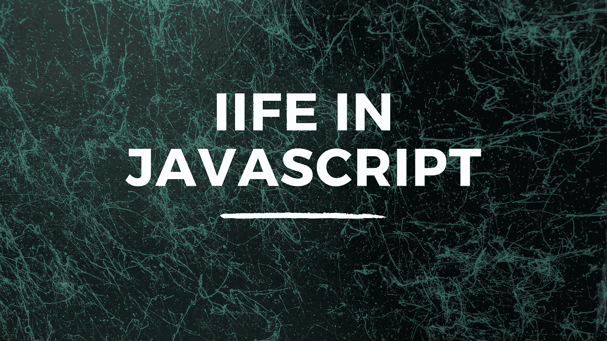

# JavaScript 中的即时调用函数表达式是什么？

> 原文：<https://javascript.plainenglish.io/what-are-immediately-invoked-function-expressions-in-javascript-6f2679c4dd9f?source=collection_archive---------12----------------------->

## JavaScript 中直接调用函数表达式的介绍



## 介绍

立即调用的函数表达式通常被称为 IIFE，简而言之，它们是立即执行的函数。让我们从生命的基本语法开始。

```
(function() {})()
```

因此，为了阐明上面的例子，我们创建了一个函数，它包含在括号内，然后附加另一组括号。这意味着函数被立即执行，因为我们把函数放在括号里，这也意味着函数是一个表达式。由于函数在内部是一个表达式，这意味着我们不必提供名称。如果我们不把函数放在括号内，它就不会工作。如下所示。

```
function() {
}()//Returns ---> Uncaught SyntaxError: Function statements require a function name
```

## 利用生命

我们上面的初始生命在函数体内没有任何东西，所以让我们扩展我们的例子，让它做一些事情。为了清楚起见，我们将从一个标准的函数声明开始，然后再把它转换成一个生命。

```
function sayHello() {
  return "Hello"
}sayHello();//Returns ---> 'Hello'
```

在上面的例子中，我们创建了一个名为 sayHello 的函数声明。在其中，我们返回一个包含文本 Hello 的字符串。稍后，我们调用该函数，带有文本 Hello 的字符串返回给我们。现在，让我们把它变成一种生活。

```
(function sayHello() {
  return "Hello"
})();//Returns ---> 'Hello'
```

这一次我们创造了一种生活。因此，我们将函数放在括号内，然后添加另一组括号来立即调用它。我们不需要调用这个函数。我们收到了返回 Hello 的文本。

## 箭头语法

我们可以在我们的生活中使用箭头语法，这不会有任何不同，但出于可读性的目的，可能更可取。让我们将前面的例子转换成使用箭头语法。

```
(sayHello = () => {
  return "Hello"
})();//Returns ---> 'Hello'
```

对于使用 arrow 语法的未命名生命，语法如下。

```
(() => {})()
```

我希望你喜欢这篇文章。请随时发表任何评论、问题或反馈，并关注我以获取更多内容！

*更多内容请看*[***plain English . io***](https://plainenglish.io/)*。报名参加我们的* [***免费周报***](http://newsletter.plainenglish.io/) *。关注我们关于*[***Twitter***](https://twitter.com/inPlainEngHQ)[***LinkedIn***](https://www.linkedin.com/company/inplainenglish/)*[***YouTube***](https://www.youtube.com/channel/UCtipWUghju290NWcn8jhyAw)***，以及****[***不和***](https://discord.gg/GtDtUAvyhW) *对成长黑客感兴趣？检查* [***电路***](https://circuit.ooo/) ***。*****