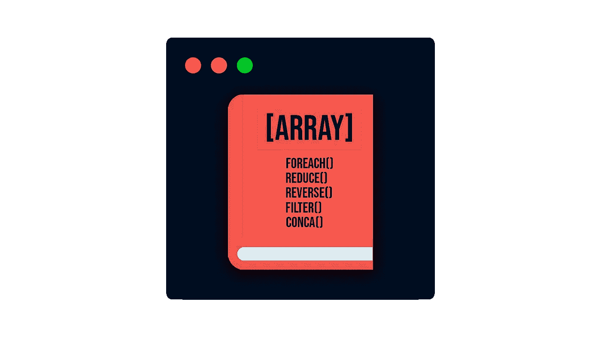

# 什么是 JavaScript 数组方法？

> 原文：<https://javascript.plainenglish.io/what-are-javascript-array-methods-d24d994f636?source=collection_archive---------13----------------------->

## 以及为什么如果你想成为一名优秀的 JavaScript 开发人员，你必须学习它们。

当我开始学习 JavaScript 时，我发现了一个名为*“为什么不应该在代码中使用 for”*的视频。当我读到这个标题时，我震惊了。我是一个初学程序员，在很多情况下使用 for 循环对我来说是必要的。然而，视频中的男子使用了**前肢**。我不知道那是什么，但它看起来很棒。

随着时间的推移，在我成为一名 JavaScript 高手的过程中，我发现这个 *forEach* (以及许多其他方法)是一个**数组方法**。我发现，在大多数情况下，通过使用这些方法，您可以**增加代码的可读性**并且**减少代码的行数**(特别是如果您使用[我在本文中解释的箭头函数](/finally-understanding-the-arrow-functions-in-javascript-a47eb1f4dbae))。所以，如果你能掌握它们，你将会写出更好的代码。



# 如何声明使用这些数组方法？

你没必要这么做！这些方法是 JavaScript 中数组类型对象的一部分。因此，您只需创建一个新数组并调用这些方法。

## JavaScript 中的数组到底是什么？

在 JavaScript 中，**数组**是一个允许我们一次存储多个元素的对象。我们可以用一对方括号来声明一个数组。在数组内部，元素之间用逗号分隔，可以存储不同类型的元素。你可以创建一个字符串数组，数字数组，布尔数组等。你可以创建一个混合了这些类型的数组。例如:


# 数组方法示例

数组方法有很多。如果你想知道全部，你可以查阅官方文件。无论哪种方式，我将向您展示我认为在我的经验中最重要的方法，我不会提及基本的数组方法或属性，如 **push()** 、 **pop()** 、 **sort()** 或 **length** 。

## 反向()

开发人员必须做的一件基本事情是反转数组。这是最基本的，使用 JavaScript，你只需要一条指令就可以做到。


重要的是要考虑到这个方法会修改原始数组。因此，如果您尝试打印上面示例中的数组，您将获得相同的输出[3，2，1]。

如果你不想修改原始数组，你必须使用**扩展操作符(…)**


## concat()

如果你想合并两个数组，你可以忘记使用一个循环和大量的 push()。现在您可以用 concat()来实现。这个方法将复制数组中的元素，我们将这些元素作为参数传递给我们称为 concat()的数组中的元素。我们也可以在嵌套数组中使用它。


## 切片()

使用 slice()方法，您可以在一个新的 array 对象中创建数组的一部分的副本。指令的语法是:

```
arr.slice(**startIndex** , **endIndex**)
```

如果我们不提供 startIndex 或 endIndex，该方法将把 startIndex 的值取为 0，把 endIndex 的值取为 de last index。如果您也想以相反的方式访问第二个参数，您可以对它使用负索引。


## forEach()

使用 forEach()方法，您将能够为每个数组元素提供一个函数。假设您必须将每个元素乘以 2，您可以使用 forEach()。


如果你想创建一个新的数组，你可以使用 **map()** 方法。


## 过滤器()

你是否曾经不得不用满足某个条件的元素创建一个新数组？如果你的答案是肯定的，我敢肯定你创建了一个循环，并使用了 If。好的，这是过去，现在是现在，你必须知道 filter()方法。使用这条指令，您将创建一个新数组，其中所有元素都通过了作为参数传递的条件。


## 减少()

reduce()方法执行 reducer 函数(将当前状态和动作作为参数并返回新状态结果的函数)。语法是:

```
arr.reduce(callback(**accumulator**, **currentValue**), **initialValue**)
```

*   **累加器**:回调返回的累加值。
*   **currentValue** :从数组中传递的当前元素。
*   **initialValue** (可选)。第一次调用时将传递给 callback()的值。例如，如果我们的计数从 10 开始，initialValue 将是 10。


为了不使文章太长，还有很多其他方法我没有在本文中提及。不过，如果你想了解更多一点，我建议你搜索一下 **includes()** 、 **indexOf()** 和 **findIndex()** 。

# 我为什么要考虑学这个？

因为你想成为**更好的开发者**。

您已经看到，使用 JavaScript 数组方法可以**减少我们必须在项目中编写的代码行数**。你可以提高你的代码的可读性，并且你会更加了解 JavaScript 语言。

此外，因为它们是语言的一个固有特性，所以程序员使用它们是很常见的。所以你很少不使用它们，而是用循环填充你的 JavaScript 代码。

你认为哪种方法最有用？你还用 JavaScript 的什么奇怪的特性来改进你的代码？

# 结论👋

谢谢大家！非常感谢您阅读这篇文章。我很想知道你对此的看法，所以别忘了写在评论里，我会读给你听的。

反过来，如果这篇文章对你有帮助，记得可以给它鼓掌，分享给战友们。如果你不想错过我的任何一篇文章，别忘了关注我。

# 关于作者🤓

我的两个爱好是技术和交流，所以我抓住一切机会谈论或写关于技术的东西。

# 想要连接吗？📲

📩**jesuslagaresgalan@gmail.com**

📸[insta gram](https://instagram.com/jesuslagares_)

💼 [**领英**](https://www.linkedin.com/in/jesus-lagares/)

📹 [**Youtube**](https://www.youtube.com/c/Jes%C3%BAsLagares)

🐦 [**推特**](https://twitter.com/jesuslagares_)

谢谢！❣️

*更多内容看* [***说白了。报名参加我们的***](https://plainenglish.io/) **[***免费每周简讯***](http://newsletter.plainenglish.io/) *。关注我们关于* [***推特***](https://twitter.com/inPlainEngHQ) ，[***LinkedIn***](https://www.linkedin.com/company/inplainenglish/)*，*[***YouTube***](https://www.youtube.com/channel/UCtipWUghju290NWcn8jhyAw)*，* [***不和***](https://discord.gg/GtDtUAvyhW) *。***