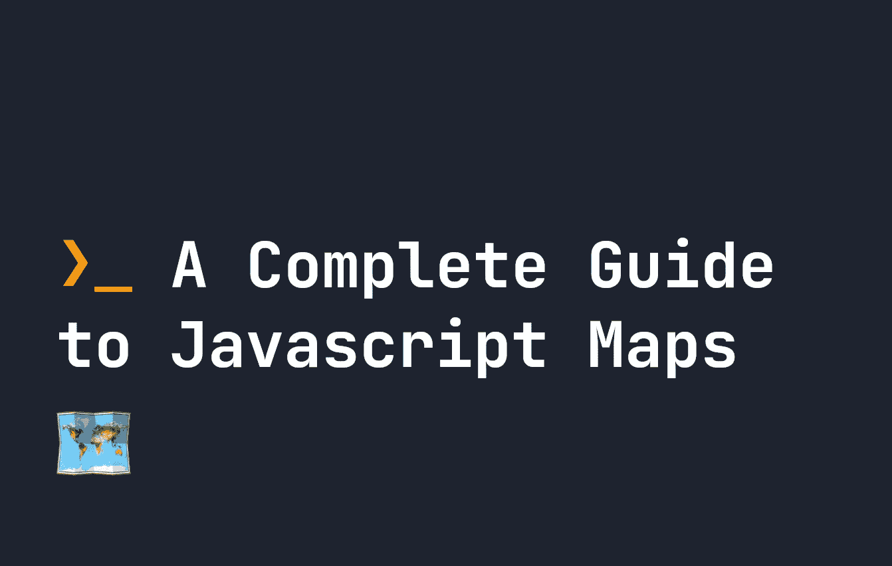

# 什么是 JavaScript 映射以及它们是如何工作的:一个完整的指南

> 原文：<https://javascript.plainenglish.io/what-are-javascript-maps-and-how-do-they-work-a-complete-guide-94ffeaec945c?source=collection_archive---------3----------------------->

## JavaScript 映射是存储数据的好方法，在许多情况下比对象更高效。他们是这样工作的。



你可能对 [JavaScript 对象](https://fjolt.com/article/javascript-objects-introduction)很熟悉——但是你知道在 JavaScript 中还有另外一种创建数据集的方法吗，叫做**映射**？您现在可能正在使用 JavaScript 普通旧对象，而地图可能是您问题的更好解决方案。

JavaScript 映射在几个主要方面与对象不同。虽然`typeof new Map()`回报`object`，但是不要让那个骗了你！以下是对象和贴图之间的一些主要区别:

*   **默认不包含任何键**，不像 objects，它包含一个`prototype`对象。
*   **保证它们按照插入的顺序排序**。如今，物品也是如此，但它们没有同样的保证。
*   **地图的键可以是任何东西**，包括一个功能，甚至是一个对象。而在 JavaScript 中，它必须是字符串或符号。
*   在需要快速或频繁删除或添加数据的任务中，它们比对象具有更好的性能。
*   与对象不同，默认情况下它们是可迭代的。

鉴于地图有如此多的好处，让我们来看看它们是如何工作的。

# JavaScript 映射如何工作的基础知识

JavaScript 中的任何映射都是使用`new Map()`构造函数初始化的。例如，让我们创建一个名为`myFirstMap`的地图:

```
let myFirstMap = new Map();
```

不同之处在于从地图中设置、获取或删除按键，你必须使用`Map`附带的特定方法。所以要用键`firstKey`设置一个新的值`someValue`，我可以运行下面的方法:

```
let myFirstMap = new Map();myFirstMap.set('firstKey', 'someValue');
```

# 删除 JavaScript 地图中的项目

如果我们想删除 JavaScript 映射中的一个键，我们必须调用`delete()`方法:

```
let myFirstMap = new Map();myFirstMap.set('firstKey', 'someValue');
myFirstMap.delete('firstKey');
```

您也可以使用`clear()`删除整个地图，不留下任何项目:

```
let myFirstMap = new Map();myFirstMap.set('firstKey', 'someValue');
myFirstMap.clear();
console.log(myFirstMap); // Returns Map(0)
```

# 获取 JavaScript 映射中的一个键

与其他方法的用法类似，为了获得`firstKey`的值，我们必须使用`get()`:

```
let myFirstMap = new Map();myFirstMap.set('firstKey', 'someValue');myFirstMap.get('firstKey') // 'someValue'
```

# 检查 JavaScript 映射中是否存在键

JavaScript Maps 也有一个名为`has()`的方法，如果我们想检查一个 map 是否有某个键:

```
let myFirstMap = new Map();myFirstMap.set('firstKey', 'someValue');myFirstMap.has('firstKey') // true
```

# 警告:不要在贴图中使用典型的对象属性

JavaScript 充满了怪癖，地图也不例外。奇怪的是，地图也可以支持对象符号。例如，这似乎行得通:

```
let myFirstMap = new Map();myFirstMap['firstKey'] = 'someValue';console.log(myFirstMap); // Map(0) { firstKey: 'someValue' }
```

**但是，你不应该这样做！**这是**而不是**在地图中创建新条目——您只是在创建一个对象。所以你会失去 JavaScript 地图的所有好处。

# 说明 JavaScript 地图有多大

地图比对象更容易使用的另一个有用的地方是找出地图中有多少个键。为此，我们可以使用`size()`方法，该方法返回键的数量:

```
let myFirstMap = new Map();myFirstMap.set('firstKey', 'someValue');myFirstMap.size // 1
```

对于物体，我们通常混合使用`Object.keys()`和`length`来确定物体的大小:

```
let myObj = { "name" : "John" };
let sizeOfObj = Object.keys(myObj).length; // 1
```

# 使用带有非字符串键的地图

正如我提到的，JavaScript 映射允许非常规的键，比如函数和对象，而对象只允许字符串和符号。例如，这在地图中是有效的:

```
let myFirstMap = new Map();
let myFunction = function() { return "someReturn"; }
myFirstMap.set(myFunction, "value");
```

映射键[基于引用，而不是值](https://fjolt.com/article/javascript-by-reference-by-value)。这意味着尽管下面的方法可行:

```
let myFirstMap = new Map();
let myFunction = function() { return "someReturn"; }
myFirstMap.set(myFunction, "value");myFirstMap.get(myFunction); // Returns "someReturn"
```

这不会:

```
let myFirstMap = new Map();
let myFunction = function() { return "someReturn"; }
myFirstMap.set(myFunction, "value");myFirstMap.get(function() { return "someReturn"; }); // Returns undefined
myFirstMap.get('someReturn'); // Returns undefined
```

这是因为虽然`function() { return "someReturn"; }`和`myFunction`的值相同，但是它们在系统内存中的存储位置不同。所以它们并不完全等同。类似地，map 不处理返回值——所以`myFirstMap.get('someReturn')`也返回 undefined。

相同的示例适用于对象，结果相似:

```
let myFirstMap = new Map();
let myObject = { "someKey" : "someValue" }
myFirstMap.set(myObject, "value");myFirstMap.get({ "someKey" : "someValue" }); // Returns undefined
myFirstMap.get(myObject); // Returns 'value'
```

# 合并 JavaScript 地图

如果您想要将多个贴图合并为一个，您可以使用与合并对象相同的方式合并它们，即使用扩展语法。例如，这里我使用扩展语法将`myFirstMap`和`mySecondMap`合并成`myNewMap`:

```
let myFirstMap = new Map();
myFirstMap.set("some", "value");
let mySecondMap = new Map();
mySecondMap.set("someOther", "value");let myNewMap = new Map([...myFirstMap, ...mySecondMap]);console.log(myNewMap);
// Map(2) { some: "value", someOther: "value" }
```

# 在地图上迭代

如前所述，默认情况下，地图是可迭代的。如果我们想要迭代对象，我们通常必须使用像`Object.keys`这样的函数。最终这意味着我们可以在任何地图上使用`forEach`，就像这样:

```
let myFirstMap = new Map();
myFirstMap.set("some", "value");
myFirstMap.set("someOther", "value");myFirstMap.forEach(function(value, key, map) {
    // value -> the value of that key in the map
    // key -> the key for this item in the map
    // map -> the entire map
    console.log(value, key, map);
})
```

# 使用 for 对 JavaScript 映射进行迭代

您还可以使用`for(let ... of )`在地图上迭代！如果这样做，每一项都作为键和值的数组返回。例如:

```
let myFirstMap = new Map();
myFirstMap.set("some", "value");for(let x of myFirstMap) {
    // Returns [ 'some', 'value' ]
    console.log(x);
}
```

# 在 JavaScript 映射中迭代值或键

我们在 JavaScript 中迭代值或键的另一个很酷的方法是使用`values()`或`entries()`方法。这些函数分别为 map 中的值和项返回一个新的迭代器**。这意味着我们可以使用`next()`函数访问下一个键或值，就像在[生成器函数](https://fjolt.com/article/javascript-generator-functions)中一样。**

例如，我们来看看`entries()`是如何工作的:

```
let myFirstMap = new Map();
myFirstMap.set("some", "value");
myFirstMap.set("someOther", "value");
myFirstMap.set("aFinal", "value");let allKeys = myFirstMap.entries();
console.log(allKeys); // Returns MapIterator {} objectconsole.log(allKeys.next()); // Returns { value: [ 'some', 'value' ], done: false }
console.log(allKeys.next().value); // Returns [ 'some', 'value' ]
```

我们从`allKeys.next()`回来是一个对象。这个对象中的值是`[ 'some', 'value' ]`——我们地图中第一个项目的数组。我们可以继续运行`next()`来获得地图中的以下物品。相当酷！我们可以再做一次同样的事情，只用价值观:

```
let myFirstMap = new Map();
myFirstMap.set("some", "value");
myFirstMap.set("someOther", "value");
myFirstMap.set("aFinal", "value");let allValues = myFirstMap.values();
console.log(allValues); // Returns MapIterator {} objectconsole.log(allValues.next()); // Returns { value: 'value' done: false }
console.log(allValues.next().value); // Returns 'value'
```

像这样的迭代器在某些特定情况下证明是有用的，并且是遍历地图中所有数据的一种很酷的方式。

# JavaScript 中地图的序列化

对于一些人来说，地图的一个缺点是它们不容易用`JSON.parse()`和`JSON.stringify`序列化。这样做的结果是一个空的对象，这是有意义的——因为如果我们只在 map 中填充条目，那么它就是空的:

```
let myFirstMap = new Map();
myFirstMap.set("some", "value");
myFirstMap.set("someOther", "value");
myFirstMap.set("aFinal", "value");// Returns {}
console.log(JSON.stringify(myFirstMap));
```

序列化 Map 的唯一现实的方法是将它转换成一个对象或数组，这意味着如果您使用 Map 的话，您必须维护一些单独的帮助器函数来完成这项任务。例如，我们可以使用`Array.from()`将地图转换为数组，然后使用`JSON.stringify()`将其序列化:

```
let myFirstMap = new Map();
myFirstMap.set("some", "value");
myFirstMap.set("someOther", "value");
myFirstMap.set("aFinal", "value");let arrayMap = Array.from(myFirstMap);// Returns [["some","value"],["someOther","value"],["aFinal","value"]]
console.log(JSON.stringify(arrayMap));
```

然后，如果我们想把它变回地图，我们必须结合使用`JSON.parse()`和`new Map()`:

```
let myFirstMap = new Map();
myFirstMap.set("some", "value");
myFirstMap.set("someOther", "value");
myFirstMap.set("aFinal", "value");// Turn our map into an array
let arrayMap = Array.from(myFirstMap);// The JSON stringed version of our map:
let stringifiedMap = JSON.stringify(arrayMap);// Use new Map(JSON.parse...) to turn our stringed map into a map again:
let getMap = new Map(JSON.parse(stringifiedMap));// Returns Map(3) {'some' => 'value', 'someOther' => 'value', 'aFinal' => 'value'}
console.log(getMap);
```

# 结论

当您不需要对象的所有灵活性时，JavaScript Maps 是存储数据的一种很好的方式，并且像数据的顺序这样的事情非常重要。在需要频繁添加和删除项目的情况下，它们也被证明比对象更有性能。在本指南中，我们已经涵盖了你需要了解的关于地图的一切，但是如果你想[了解更多关于 JavaScript 的知识，请点击这里](https://fjolt.com/category/javascript)。

希望你喜欢这个——祝你有美好的一天。

*更多内容请看*[***plain English . io***](https://plainenglish.io/)*。报名参加我们的* [***免费周报***](http://newsletter.plainenglish.io/) *。关注我们关于*[***Twitter***](https://twitter.com/inPlainEngHQ)[***LinkedIn***](https://www.linkedin.com/company/inplainenglish/)*[***YouTube***](https://www.youtube.com/channel/UCtipWUghju290NWcn8jhyAw)*[***不和***](https://discord.gg/GtDtUAvyhW) *。对增长黑客感兴趣？检查* [***电路***](https://circuit.ooo/) *。***