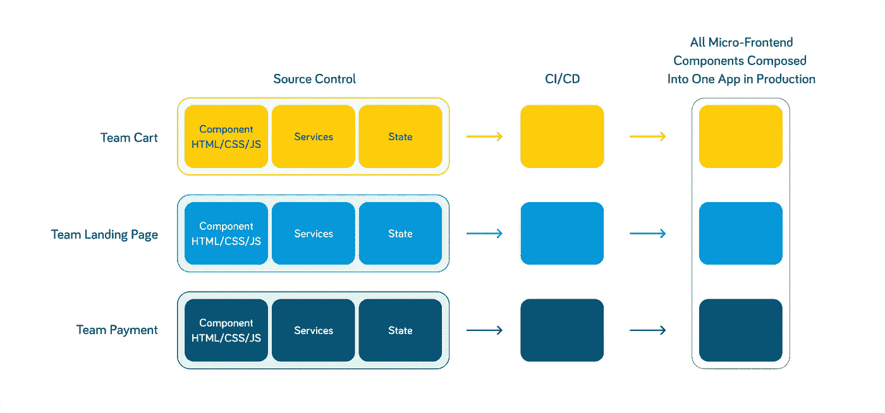

# 什么是微前端 Web 应用？

> 原文：<https://javascript.plainenglish.io/what-are-micro-frontend-web-applications-9df3bc212cb8?source=collection_archive---------1----------------------->

微前端(mfe)是最近 web 开发界的热门话题。但是它们是什么呢？简而言之，mfe 是一种将 web 应用程序组织成一组小型的、可独立部署的模块的方式。每个模块都有自己的 UI、业务逻辑和数据模型，并且可以独立于其他模块进行开发、测试和部署。尽管微前端作为一个术语在过去的许多文章和项目中使用过，但直到 Zack Jackson 在 2020 年发布了名为 Module federation 的主插件，这一概念的宣传活动才真正开始，带来了广泛的采用和关注。

# 微前端的好处

在新的和现有的项目中使用微前端架构有几个好处，其中最明显的是在用户界面和表示层的设计中具有更大的灵活性和模块化。每个团队都可以开发自己的 UI 组件，而不必担心破坏其他团队的功能。其他一些好处包括:

*   **更好的分离顾虑。**每个团队可以专注于自己的应用领域，而不必担心其他团队的实现细节。
*   **更容易平行发展。**多个团队可以同时处理应用程序的不同部分，而无需协调他们的工作。
*   **单个模块的测试和调试更容易、更简单。每个团队都可以测试和调试自己的 UI 组件，而不必担心其他团队的组件。**
*   **性能更佳。**每个团队都可以优化自己的 UI 组件，而不必担心其他团队的性能。
*   **可扩展性和扩展相关的问题可以轻松解决。**每个团队都可以扩展自己的 UI 组件，而不必担心其他团队、组件或模块。
*   **部署。**每个模块都可以根据需要分配资源，而不会影响更大应用程序的其他部分，每个模块都可以单独部署，这使其成为高效管理资源的最佳选择。

# 微前端的缺点

使用微前端架构有一些缺点，最明显的是如果不小心，可能会产生大量的代码重复，有时在组件之间管理和共享数据是不可避免的挑战。其他一些明显的缺点列举如下。

*   **难以保持不同模块之间的同步。**如果一个团队做出了改变，破坏了两个模块之间的接口，就很难找到问题的根源。
*   测试或调试整个应用程序的难度。当有多个团队在代码的不同部分工作时，可能很难重现错误发生的条件。
*   **微前端架构使得在应用程序的不同部分之间共享代码变得困难。**如果每个团队都独立工作，那么重用由另一个团队开发的代码可能会很困难。
*   有人可能会说这种模式是**形式胜于功能**。
*   具有讽刺意味的是，**如果不同的组件相互依赖，那么将它们集成在一起可能会很困难**。为了使这成为一个问题，建立跨团队的最佳实践和惯例。

最后，在部署和跟踪整个应用程序的当前状态时，遵循微前端架构可能会很困难。如果每个团队负责部署他们自己的代码，可能很难跟踪在何时何地发生了什么，从而在更高的层次上对应用程序的实际状态产生混淆。

所有的缺点都可以通过使用更适合工作的不同工具和过程来适当地管理，然而，其中一些在本文中有所涉及，其他的通过进一步的研究。

# 如何实现微前端架构？

有几种不同的方法来实现微前端模块或组件。最常见的方法是使用 JavaScript 库，如 React、Vue 甚至 SSR(服务器端渲染)库和工具。每个团队可以使用自己选择的库开发自己的 UI 组件，然后使用 webpack 或 rollup 等工具构建一个包含所有 UI 组件的包。

另一种方法是使用 Ember 或 Angular 等框架，这有助于正确组织组件，并使它们易于拆卸。值得注意的是，使用微前端架构，每个团队可以使用他们选择的框架或库开发自己的组件，然后使用 webpack 或 rollup 等工具来构建包含所有组件的单个包。实现微前端架构的示例随处可见，其中一个流行的来源是 GitHub 上的模块联合示例库，有关更多信息，请参见[https://GitHub . com/module-Federation/module-Federation-examples](https://github.com/module-federation/module-federation-examples)。

# 存储和共享代码

Monorepo 是使用基于 git 的代码库时广泛使用的设置之一。这个概念允许在本地访问其他组件，并允许开发人员轻松地对组件进行更改，而无需额外的工作。然而，一些团队不共享代码库，仍然高效地工作。人们必须考虑团队交互的频率，组件的相关性，并决定如何根据这些信息组织代码。同样重要的是，以这样一种方式适当地划分组件，使得它们在代码方面、数据方面和特性方面尽可能地独立。

共享组件或功能可以组织在单独的存储库中，也可以组织在由文件夹分隔的单个存储库中，但是建议对它们进行版本控制。如果一个团队更改了一个特定的共享组件，它应该反映在更改后构建的组件版本中。应保存描述共享组件变更的适当变更日志，以确保有效记录所做的变更。

将单个组件集成到单个应用或容器中

除了在模块联盟的帮助下使用 webpack 等构建工具之外，其他工具如 [React](https://www.itmagination.com/blog/react-18-what-changes-does-it-bring) Router、Angular Router、Next.js、Astro 甚至 Nginx 都可以用来创建单页面应用程序，我们将称之为容器应用程序。这种设置通常包括所有组件，并作为项目的入口点。每个团队都可以开发自己的 UI 组件，然后使用 choice 工具在不同的组件之间传递，并将其作为单个可交付项目或多个小项目来呈现。值得注意的是，制作容器应用程序需要额外的工作，因此一些组织将容器应用程序项目分配给专门的团队。

# 构建和部署

在构建单个组件时，有许多选项可用，在大多数情况下，库或框架的默认构建工具通常就足够了。在其他情况下，可以集成 webpack 等第三方工具。

所有组件都应该有自己专用的构建过程或阶段，或者作为更大管道的一部分，或者作为单独管道的一部分。这使得组件真正独立，可以单独部署。团队可以利用容器化(例如 Docker)来帮助组织部署过程和构建。可以使用语义版本控制对组件的每个更改进行版本控制，并且可以根据业务需求自动、受控或手动部署版本更新。

在大多数情况下，现有的管道解决方案，如 GitLab 和 GitHub Actions、Jenkins 等，应该足以构建和部署单个组件。不管它们是部署到云还是定制服务器、pods、azure 应用服务，甚至是 s3 bucket 上的文件，现有的解决方案都应该足够了，因为它们是高度可定制的，可以将一个大项目分成更小的部分。

单个组件也可以部署到私有的包注册中心，比如使用 NPM 或其他可用选项的 nexus。这样，组件可以很容易地导入、构建和管理。团队可以决定他们想要安装的第三方组件的版本，并跟踪变更的历史。这对于共享组件和服务尤其有用。

值得注意的是，虽然使用 webpack 或 rollup 构建一个包含来自所有不同团队的所有 UI 组件的包是一件好事，因为它允许您使用任何 JavaScript 库或框架，但它确实需要您有一个可以有效处理不同依赖关系的构建系统。

# 公开 MFE 模块以供公共访问

容器 app 大多作为微前端应用的入口。用户将访问容器应用程序，该应用程序进而根据用户交互决定呈现哪个微前端组件。有时，容器应用程序可能包含菜单、标题组件和呈现应用程序所需的必要结构。

除了使用内置于框架和库中的现有解决方案进行数据传输、路由和为您的组件构建容器之外，容器应用程序还可以是简单或复杂的 Ngnix 服务器、Express 应用程序、Astro 项目以及其他可用选项，因为它们的核心作用是路由流量并呈现在专用端口、本地网络内的 url、Kubernetes 集群或公共网络上运行的不同组件。应用程序的不同部分可以有自己的防火墙配置、访问级别和权限，并且仍然可以有效地协同工作，不会出现问题，因为每个部分都将在自己的迷你网络、容器和端口上运行，可以在顶层应用规则，可以配置负载平衡器，并且可以无缝管理流量。

# 共享数据

在基于 MFE 的应用程序中，在不同的模块和组件之间共享数据可能很棘手。有一些重要的部分需要注意，也有一些适用的基本规则。在大多数情况下，可以使用状态管理器来帮助本地组件的数据管理，以及在外部组件之间共享数据。像 Redux 这样的状态管理工具在微前端组件中表现良好，因为每个团队都可以在他们的组件中管理他们的本地数据，此外还可以共享数据。在 Angular 中，可以使用像 RxJS 和带有 observables 的服务这样的工具，而不是使用外部状态管理工具来无缝地管理和共享组件数据。

需要注意的一件重要事情是，数据应该尽可能地分离，当从第三方 API 或用户输入中接收数据时，目标应该是使它们独立于各个组件并且是唯一的。最小化组件之间共享的数据量，并确保以这样的方式管理共享的状态，即只有负责修改它的组件具有写访问权，而其他组件仅消费/读取数据。当更新中涉及多个组件时，应该以类似队列的方式更新数据，其中首先到达的更新被应用，接着是下一个更新，以创建状态的平滑转换和通常高效的系统。确保组件可以忽略不必要的数据、事件和数据变化也很重要，当组件内部没有直接变化时，这些数据、事件和数据变化可能会导致组件重新呈现。强烈建议实施高效的更改检测策略，并在不再需要数据流时取消订阅。

# 微前端的最佳实践

在开发微前端应用程序时，应该遵循一些最佳实践。

*   **每个团队都应该在一个单独的存储库中开发自己的 UI 组件。**这将允许每个团队独立工作，并使团队之间共享 UI 组件变得更加容易。
*   **每个团队都应该使用 webpack 或 rollup 等工具来构建一个包含所有 UI 组件的包。**这将使部署和更新 UI 组件变得更加容易。
*   每个团队应该为他们的 UI 组件使用一致的编码风格和命名约定。这将使其他团队更容易理解和使用 UI 组件。
*   使用微前端框架很重要，它将允许团队在 UI 组件之间轻松共享数据和状态。这将使开发由多个微前端组成的复杂应用程序变得更加容易。
*   每个团队都应该对他们的 UI 组件进行单元测试。这将确保组件按预期工作，并有助于防止将错误引入应用程序。

总之，微前端架构正在彻底改变前端开发、表示和管理。它展示了一些令人兴奋的可能性，每个人都想成为其中的一部分。在转换现有项目或利用 MFE 架构进行新项目之前，进行适当的研究是至关重要的。

‍

*原载于*[*https://www.itmagination.com*](https://www.itmagination.com/blog/what-are-micro-frontend-web-applications-mfes)*。*

*更多内容请看*[***plain English . io***](https://plainenglish.io/)*。报名参加我们的* [***免费周报***](http://newsletter.plainenglish.io/) *。关注我们关于*[***Twitter***](https://twitter.com/inPlainEngHQ)[***LinkedIn***](https://www.linkedin.com/company/inplainenglish/)*[***YouTube***](https://www.youtube.com/channel/UCtipWUghju290NWcn8jhyAw)*[***不和***](https://discord.gg/GtDtUAvyhW) *。对增长黑客感兴趣？检查* [***电路***](https://circuit.ooo/) *。***