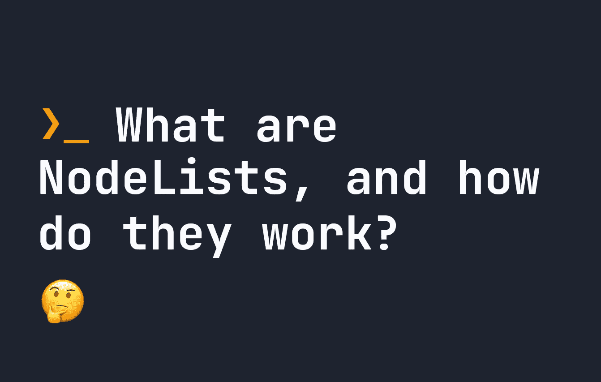

# 什么是节点列表，它们是如何工作的？

> 原文：<https://javascript.plainenglish.io/what-are-nodelists-and-how-do-they-work-7594c33abac5?source=collection_archive---------13----------------------->

## 节点列表在 JavaScript 中是一种奇怪的类型，你可能都不知道。让我们看看它们是如何工作的。



您知道吗，Javascript 不将多个元素的选择归类为数组？相反，它是一种叫做`NodeList`的东西。节点列表本质上是一个元素列表。要生成一个`NodeList`，我们可以这样做:

```
let myNodeList = document.querySelectorAll('p');
```

上面的代码将返回一个页面上所有段落的列表，作为一个`NodeList`。

节点列表很有趣，因为它们不是数组，所以它们不会继承数组的所有不同功能。一个显著的例子是，在一些较老的浏览器中，如 Internet Explorer，`NodeList`不继承`forEach`功能。

因此，如果您想为每个段落添加一个事件侦听器，下面的代码将在 Internet Explorer 中引发一个错误:

```
let myNodeList = document.querySelectorAll('p');myNodeList.forEach(function(item) {
    item.addEventListener('click', function(e) {
        // Do some click events
    });
    // For each node item..
});
```

因为这在大多数现代浏览器中都可以工作，所以你通常不必担心使用它，但是如果你想支持旧的浏览器并使用`forEach`，我们必须将我们的节点列表放入一个数组中，就像这样:

为了将我们的节点列表转换成更易于管理的数组，我们可以使用下面的代码:

```
let myNodeList = document.querySelectorAll('p');
Array.prototype.forEach.call(myNodeList, function(item) {
    item.addEventListener('click', function(e) {
        // Do some click events
    });
    // For each node item..
});
```

有点复杂，但现在我们可以确保所有用户都可以访问我们添加到节点列表项中的事件侦听器。

# 节点列表支持哪些功能？

由于本文到目前为止关注的是`NodeList`在默认情况下并不总是有`forEach`，您可能想知道哪些函数可以在节点列表上运行。有 4 个:

*   `NodeList.entries` -返回一个迭代器，用于获取 id 和元素作为 id/元素对，即`[ 1, p ]`。
*   `NodeList.forEach` -用于逐个迭代每个项目。
*   `NodeList.item` -用于通过 id 获取特定项目，即通过`NodeList.item(0)`获取第一段。
*   `NodeList.keys` -返回获取密钥的迭代器，即 1 2 3 4 5...
*   `NodeList.values` -返回获取 HTML 元素的迭代器，即`p p p p`...

值得注意的是`NodeList.item`是 ie 浏览器支持的唯一功能。其余的都不是。

例如，下面是我们如何在节点列表上运行这些函数:

# 节点列表.条目

```
let myNodeList = document.querySelectorAll('p');// entries
let allEntries = myNodeList.entries();
for(var i of allEntries) {
    // Console logs each paragraph with an id individually, such as [ 0, p ] [ 1, p ] [ 2, p ] ...
    console.log(i);
}
```

# NodeList.forEach

```
let myNodeList = document.querySelectorAll('p');// forEach - iterate over each item
myNodeList.forEach(function(item) {
    // Console logs each paragraph element individually
    console.log(i);
});
```

# 节点列表.项目

```
let myNodeList = document.querySelectorAll('p');// item - get the first element (0)
let firstElement = myNodeList.item(0);
// Console logs the first element only
console.log(firstElement);
```

# 节点列表.密钥

```
let myNodeList = document.querySelectorAll('p');let getKeys = myNodeList.keys();
// Console logs the id of each element, i.e. 1 2 3 4 5 ...
for(var i of getKeys) {
    console.log(i);
}
```

# 节点列表.值

```
let myNodeList = document.querySelectorAll('p');let getValues = myNodeList.values();
// Console logs each HTML element as an array, i.e. p p p p ...for(var i of getValues) {
    console.log(i);
}
```

*更多内容请看*[***plain English . io***](https://plainenglish.io/)*。报名参加我们的* [***免费周报***](http://newsletter.plainenglish.io/) *。关注我们关于*[***Twitter***](https://twitter.com/inPlainEngHQ)[***LinkedIn***](https://www.linkedin.com/company/inplainenglish/)*[***YouTube***](https://www.youtube.com/channel/UCtipWUghju290NWcn8jhyAw)*[***不和***](https://discord.gg/GtDtUAvyhW) *。对增长黑客感兴趣？检查* [***电路***](https://circuit.ooo/) *。***