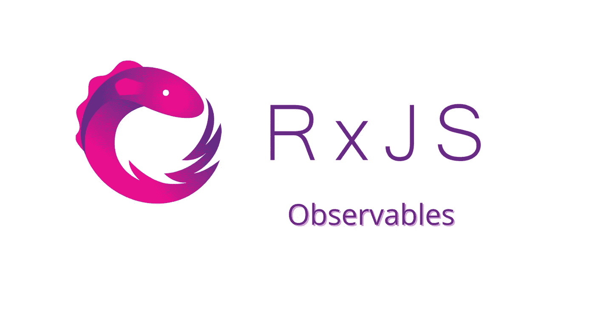
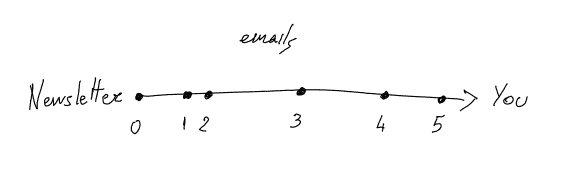
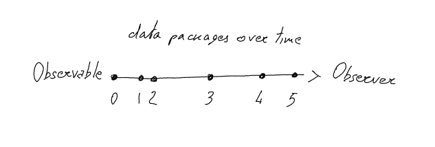

# 什么是 RxJS 可观测量？

> 原文：<https://javascript.plainenglish.io/what-are-rxjs-observables-5707e0c4c7ba?source=collection_archive---------17----------------------->

## [RxJS](https://medium.com/@lorenzozar/list/rxjs-39bc4f4110ec)

许多人在用 Angular 编码时开始使用 observables。然而，可观并不是 Angular 特有的东西！

在 [angular.io](https://angular.io/guide/observables#using-observables-to-pass-values) 上，我们可以读到“*它们在 angular 中被频繁使用，是一种事件处理、异步编程、处理多值*的技术。

很多东西！但是它们肯定不是 Angular 框架或 React 库的固有部分。

可观察对象是由 RxJS(JavaScript 的反应式扩展)提供的，在 [angular.io](https://angular.io/guide/rx-library) 上定义为“*一个使用可观察对象的反应式编程库，使得编写异步或基于回调的代码*变得更加容易”。

因此，我们可以说他们对框架和库是不可知的，尽管 Angular 很流行。

如果你不知道 RxJS，你大概应该读一下[什么是 RxJS？](https://www.vitainbeta.org/2022/01/18/what-is-rxjs/)首先。

# 了解 RxJS 可观测量

我将提出几个定义，但我发现它们都很令人困惑。尤其是有人第一次接近这个话题的时候。

*   [RxJS](https://rxjs.dev/guide/observable) : L *azy 推送多值集合。*
*   [Angular](https://angular.io/guide/observables#using-observables-to-pass-values) :它们*为在应用程序的不同部分之间传递消息提供支持。*
*   [react vex](http://reactivex.io/rxjs/class/es6/Observable.js~Observable.html):*任意时间内任意一组值的表示。*

这些定义非常准确，它们从不同的角度描述了可观测量。然而，他们没有传达主题的主旨。我们来举个例子。

# 想象一份时事通讯

我发现把 Observables 想象成一份时事通讯很有用。在许多方面，一个可观察的就像一个时事通讯，我们将看到如何。

Explaining Observables with an email subscription

上面的图像代表一个可观察的时事通讯。时事通讯是数据(电子邮件)的来源，但是在你订阅它之前，你不会收到任何电子邮件。

订阅简讯后，你会在一段时间内收到一连串的电子邮件(如上图所示，正好是六封)。您将继续收到电子邮件，直到您取消订阅时事通讯。

让我们回顾一下接收电子邮件的步骤。

1.  **订阅时事通讯**。简讯是(电子邮件的)数据源，在你订阅之前，它不会给你发送任何电子邮件。当你想收到一些电子邮件/内容/数据时，你只需订阅一份时事通讯。
2.  **开始接收邮件**。一旦你订阅了时事通讯，你将开始收到一些电子邮件。您将继续收到电子邮件，直到您取消订阅时事通讯。然而，你不知道到底有多少封电子邮件或者你什么时候会收到它们，因为这是由时事通讯提供商决定的。因此，你可以把它想象成一段时间内的电子邮件/数据流。
3.  **退订**。最终，当你对内容不再感兴趣的时候，你就退订了(你退订了，对吧？)以避免不必要的电子邮件塞满我们的收件箱。

如果你理解了这些步骤，理解下一段中的可观测量就容易多了。

# 从时事通讯到观察

我现在将按照同样的步骤来解释可观测量。

From email subscriptions to observables

**把可观察的事物看作数据源**，就像时事通讯是电子邮件的来源一样。当观察者发出数据时，时事通讯发送电子邮件。

1.  **订阅可观察的**。一个可观察对象是一个数据源，但是在你订阅之前它不会发出任何数据。基于这个原因，我们说可观测量是懒惰的。使用名副其实的 Subscribe()方法订阅一个可观察对象:`myObservable.subscribe()`
2.  **开始接收数据**。一旦你订阅了可观测量，你将开始接收一些数据。你会不断收到“数据包”，直到你退订可观察。然而，你并不知道到底有多少“数据包”，也不知道你什么时候会收到它们，因为这是由可观测性决定的。出于这个原因，我们说*可观测量推动值*。你可以把可观测量看作一段时间内的数据流。
3.  **退订**。最后，当您不再需要任何数据时，您可以使用 unsubscribe()方法取消订阅:`myObservable.unsubscribe()`。这对于防止[内存泄漏很重要。注意，当使用 Angular 创建的可观察对象时，不需要取消订阅，因为 Angular 会自动处理取消订阅。一个例子是路由环境中的*可观察参数*。](https://en.wikipedia.org/wiki/Memory_leak)

从理论角度来看，这种模型通常被称为[反应堆模式](https://en.wikipedia.org/wiki/Reactor_pattern)。

一个[观察者](https://www.vitainbeta.org/2022/02/08/what-are-observers/)订阅一个可观察的。可观察对象通过调用观察者的方法向其观察者发送数据。

有时观察者被称为“订阅者”、“观察者”或“反应者”。

# 要点

*   RxJS 和 Observables 对框架和库是不可知的，尽管在 Angular 中很流行。
*   把可观察的事物想象成数据源。要从一个可观察对象中读取和处理数据，您必须订阅它`myObservable.subscribe()`。
*   一旦你订阅了一个可观测的，它会在一段时间内发出数据。这可以同步或异步发生，数据量可以是有限的，也可以是无限的。要知道[一个可观察到的东西类似于一个承诺，但也有很大的不同](https://www.vitainbeta.org/2022/01/25/why-rxjs-rxjs-vs-promises/)。
*   当你不再需要任何数据时，退订可观测的`myObservable.unsubscribe()`。

接下来:[创建一个 RxJS 可观察对象](https://medium.com/p/98b90ecfda8e)

*更多内容看* [***说白了。报名参加我们的***](https://plainenglish.io/) **[***免费周报***](http://newsletter.plainenglish.io/) *。关注我们关于*[***Twitter***](https://twitter.com/inPlainEngHQ)*和*[***LinkedIn***](https://www.linkedin.com/company/inplainenglish/)*。加入我们的* [***社区***](https://discord.gg/GtDtUAvyhW) *。***