# SQL 联接类型(用图像描述)

> 原文：<https://javascript.plainenglish.io/what-are-sql-join-types-described-with-image-281c10949818?source=collection_archive---------17----------------------->

## 通过理解连接类型的基础知识，有效地使用 SQL

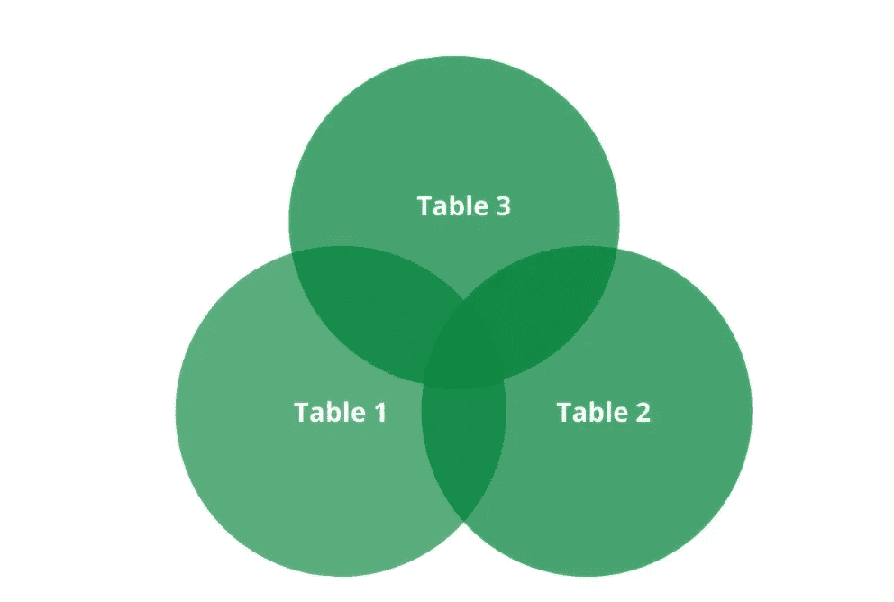

Two Full Outer Joins

Join 是 SQL servers 中使用最广泛的子句。join 子句用于从两个或多个表中检索和组合数据。今天，我们将讨论用图片描述的 SQL 连接类型。

所以我们开始吧！

## 示例模式

为了便于理解，我们假设有三个表。下面是一些表格

**表 1**

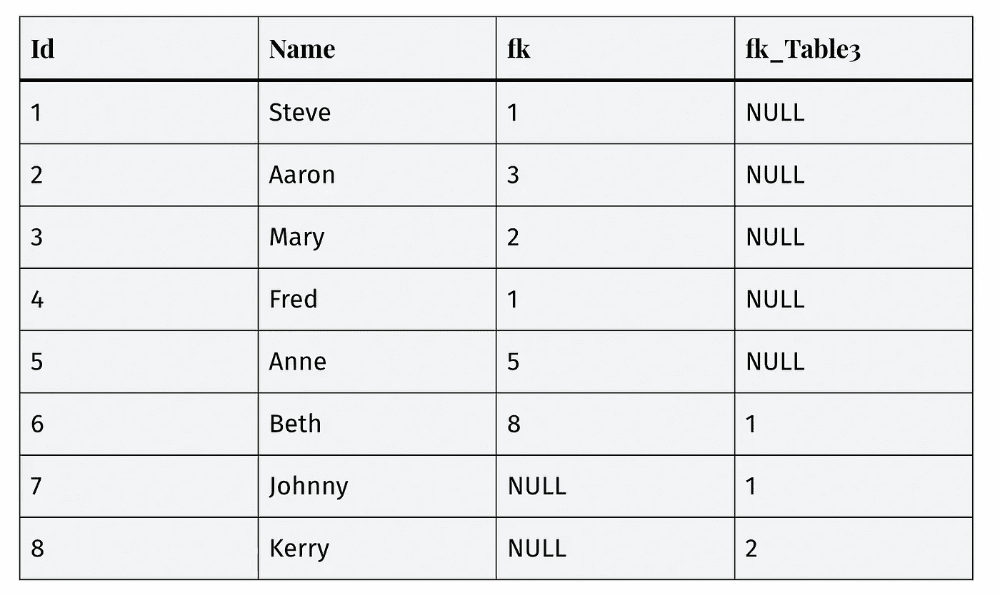

Table 1

**表二**

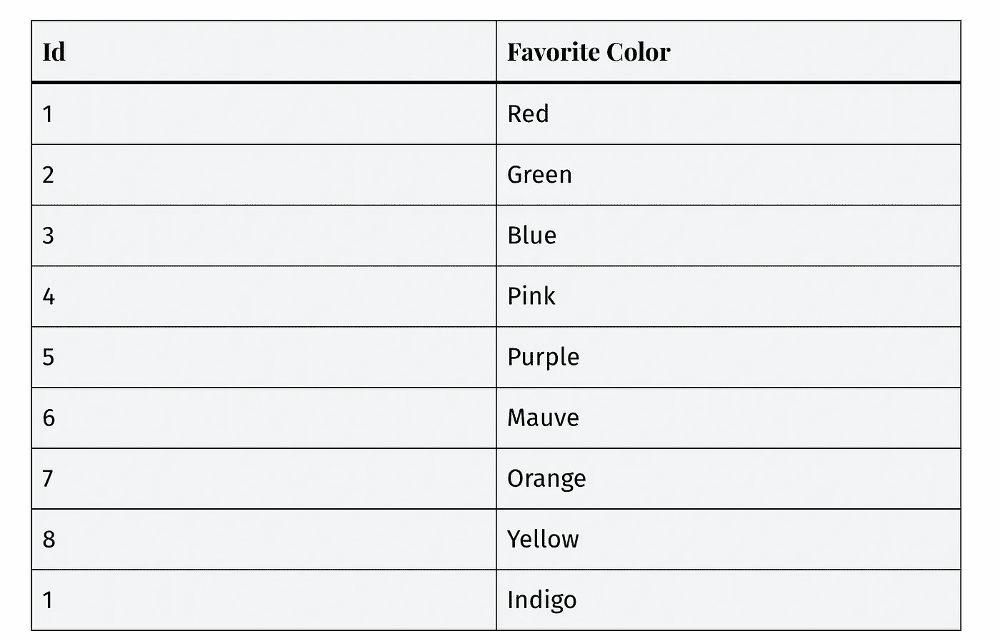

Table 2

**表 3**

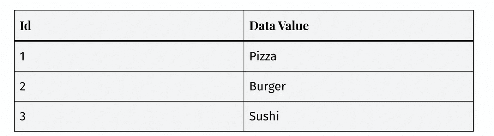

Table 3

# 让我们开始描述 SQL 连接类型

## 从两个表中选择

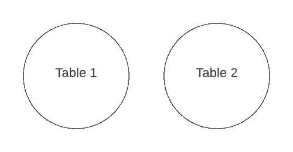

Two Tables

```
SELECT *
FROM Table1;SELECT *
FROM Table2;
```

## 左外部连接

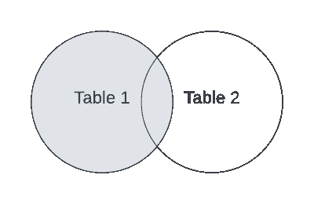

Left Outer Join

```
SELECT *
FROM Table1 t1
LEFT OUTER JOIN Table2 t2
ON t1.fk = t2.id;
```

## 半连接

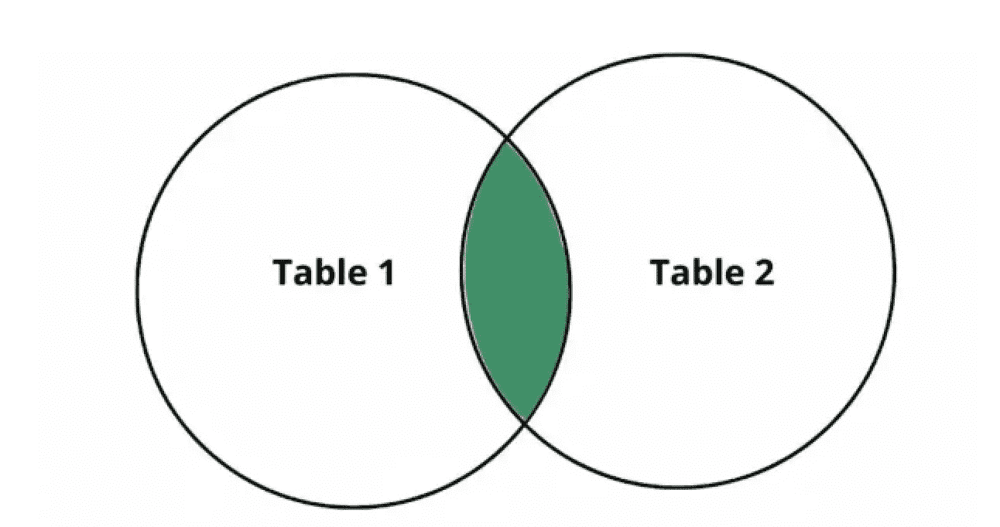

Semi Join

```
SELECT *
FROM Table1 t1
WHERE EXISTS (SELECT 1FROM Table2 t2
WHERE t1.fk = t2.id
);
```

## 排除的左外连接

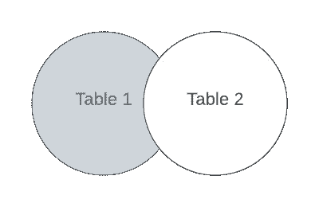

Left Outer Join with exclusion

```
SELECT *
FROM Table1 t1
LEFT OUTER JOIN Table2 t2
ON t1.fk = t2.id
WHERE t2.id IS NULL;
```

## 完全外部连接

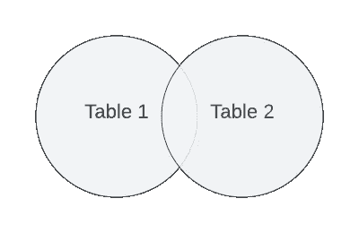

Full Outer Join

## 排除的完全外部连接

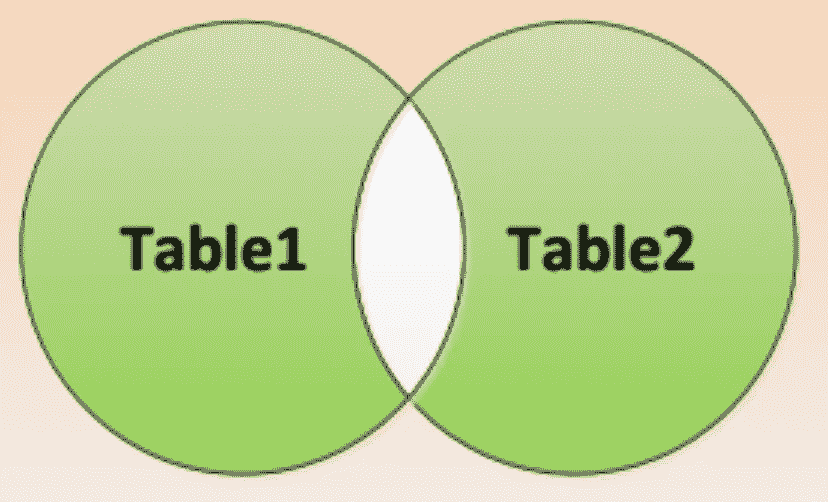

FULL OUTER JOIN with exclusion

```
SELECT *
FROM Table1 t1
FULL OUTER JOIN Table2 t2
ON t1.fk = t2.id
WHERE t1.fk IS NULL
OR t2.id IS NULL;
```

## 内部连接


Inner Join

```
SELECT *
FROM Table1 t1
INNER JOIN Table2 t2
ON t1.fk = t2.id;
```

## 右外部联接

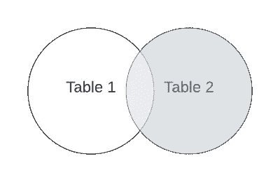

Right Outer Join

```
SELECT *
FROM Table1 t1
RIGHT OUTER JOIN Table2 t2
ON t1.fk = t2.id;
```

## 反半连接

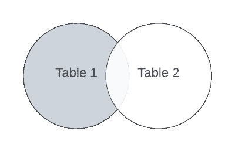

Anti Semi Join

```
SELECT *
FROM Table1 t1
WHERE NOT EXISTS (SELECT 1FROM Table2 t2
WHERE t1.fk = t2.id
);
```

## 排除的右外连接

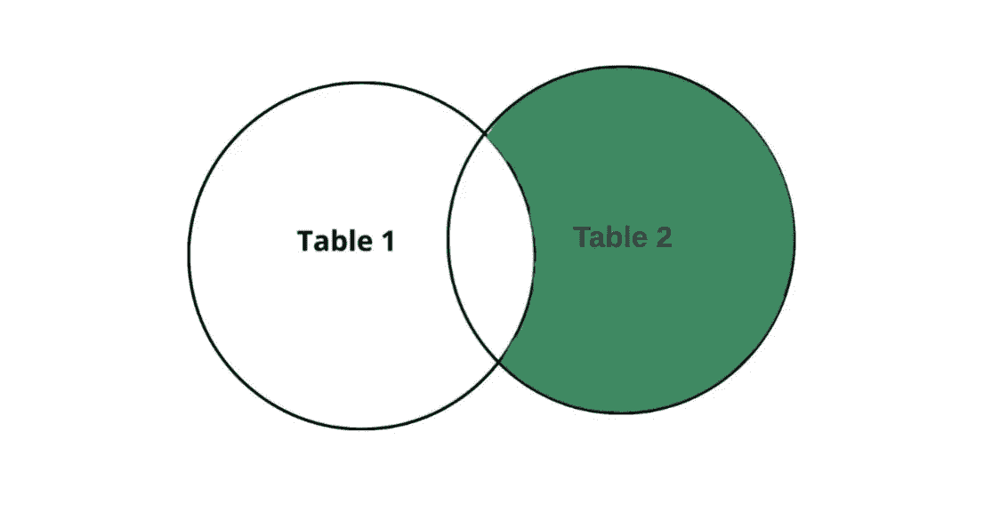

Right Outer Join with Exclusion

```
SELECT *
FROM Table1 t1
RIGHT OUTER JOIN Table2 t2
ON t1.fk = t2.id
WHERE t1.fk IS NULL;
```

## 交叉连接-笛卡尔乘积


CROSS JOIN- the Cartesian product

```
SELECT *
FROM Table1 t1
CROSS JOIN Table2 t2;
```

## 非对等内部连接


NON-EQUI INNER JOIN

```
SELECT *
FROM Table1 t1
INNER JOIN Table2 t2
ON t1.fk >= t2.id;
```

## 交叉应用

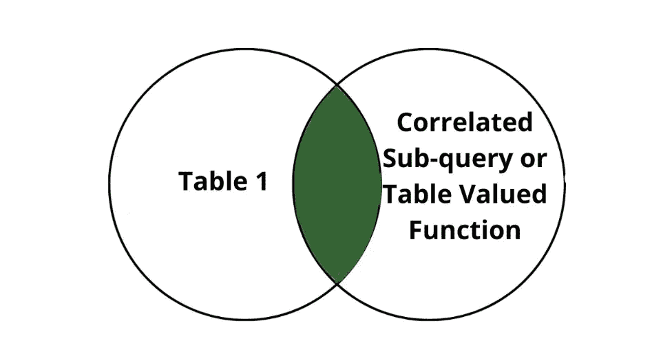

Cross Apply

```
SELECT *
FROM Table1 t1
CROSS APPLY[dbo].[someTVF](t1.fk)
AS t;
```

## 外部应用

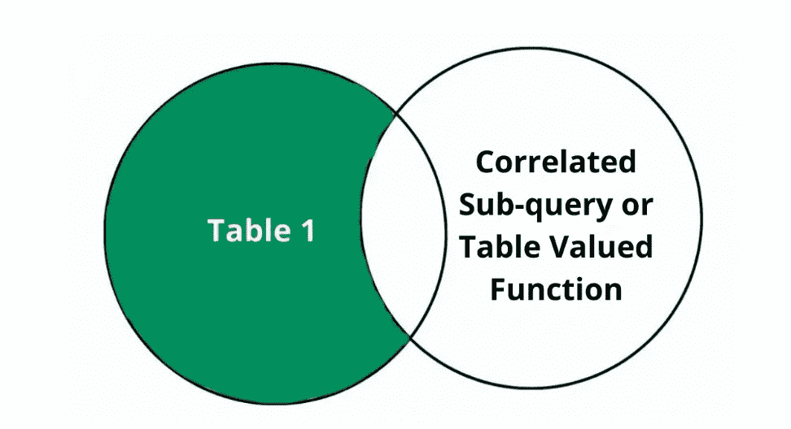

Outer Apply

```
SELECT *
FROM Table1 t1
OUTER APPLY[dbo].[someTVF](t1.fk)
AS t;
```

## 两个完整的外部连接


Two Full Outer Joins

```
SELECT *
FROM Table1 t1
FULL OUTER JOIN Table2 t2
ON t1.fk = t2.id
FULL OUTER JOIN Table3 t3
ON t1.fk_table3 = t3.id;
```

## 两个内部连接

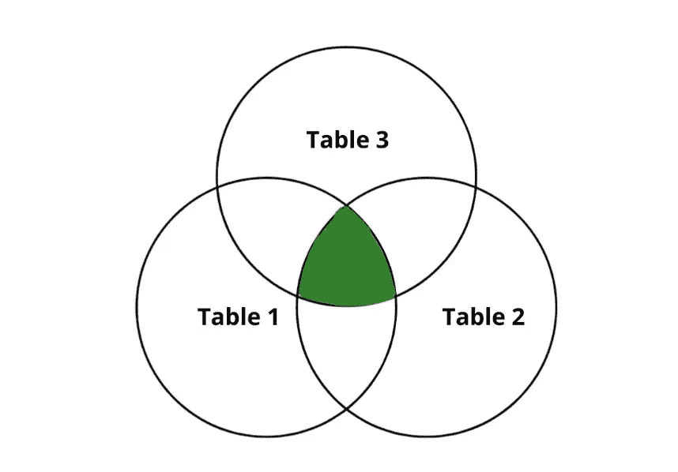

Two Inner Joins

```
SELECT *
FROM Table1 t1
INNER JOIN Table2 t2
ON t1.fk = t2.id
INNER JOIN Table3 t3
ON t1.fk_table3 = t3.id;
```

## 两个左外部连接

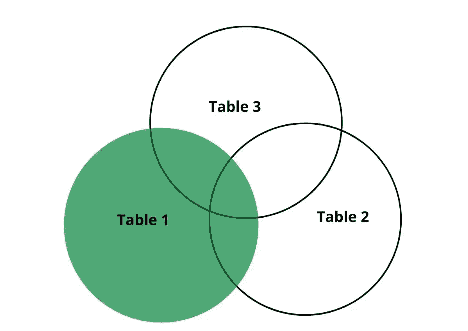

Two Left Outer Joins

```
SELECT *
FROM Table1 t1
LEFT OUTER JOIN Table2 t2
ON t1.fk = t2.id
LEFT OUTER JOIN Table3 t3
ON t1.fk_table3 = t3.id;
```

## 内部连接和左外部连接

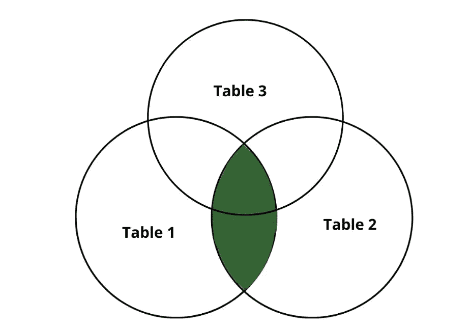

INNER JOIN and a LEFT OUTER JOIN

```
SELECT *
FROM Table1 t1
INNER JOIN Table2 t2
ON t1.fk = t2.id
LEFT OUTER JOIN Table3 t3
ON t1.fk_table3 = t3.id;
```

## 除...之外

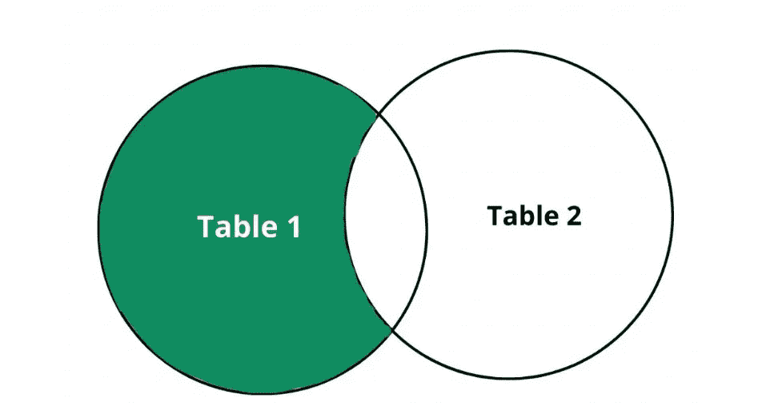

Except

```
SELECT fk as id
FROM Table1
EXCEPT
SELECT ID
```

## 联盟


Union

```
SELECT fk as id
FROM Table1
UNION
SELECT ID
```

## 横断

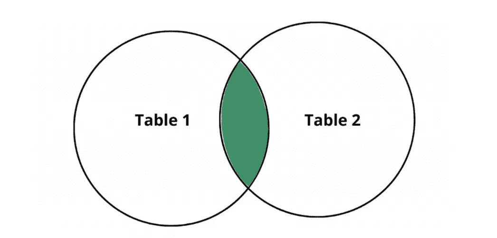

Intersect

```
SELECT fk as id
FROM Table1
INTERSECT
SELECT IDFROM Table2:
```

## 最后的想法


Photo by [Jens Lelie](https://unsplash.com/@madebyjens?utm_source=medium&utm_medium=referral) on [Unsplash](https://unsplash.com?utm_source=medium&utm_medium=referral)

希望你喜欢这篇文章，它会对你有所帮助。

编程快乐！:D

***这是我的另一篇关于 SQL cheatsheet 的文章。希望对你们也有帮助。***

[](https://blog.devgenius.io/sql-cheatsheet-you-will-find-useful-b5316f308525) [## 你会发现有用的 SQL Cheatsheet

### 使用此备忘单，让您的 SQL 之旅更加轻松

blog.devgenius.io](https://blog.devgenius.io/sql-cheatsheet-you-will-find-useful-b5316f308525) 

*更多内容请看**[***说白了. io***](https://plainenglish.io/) *。报名参加我们的**[***免费每周简讯***](http://newsletter.plainenglish.io/) *。关注我们* [***推特***](https://twitter.com/inPlainEngHQ) *和*[***LinkedIn***](https://www.linkedin.com/company/inplainenglish/)*。查看我们的* [***社区不和谐***](https://discord.gg/GtDtUAvyhW) *加入我们的* [***人才集体***](https://inplainenglish.pallet.com/talent/welcome) *。***