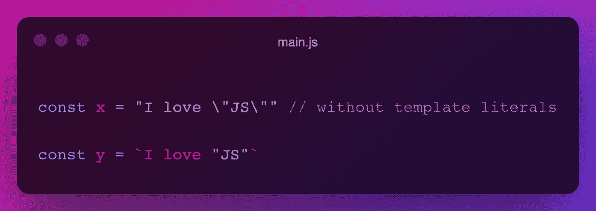
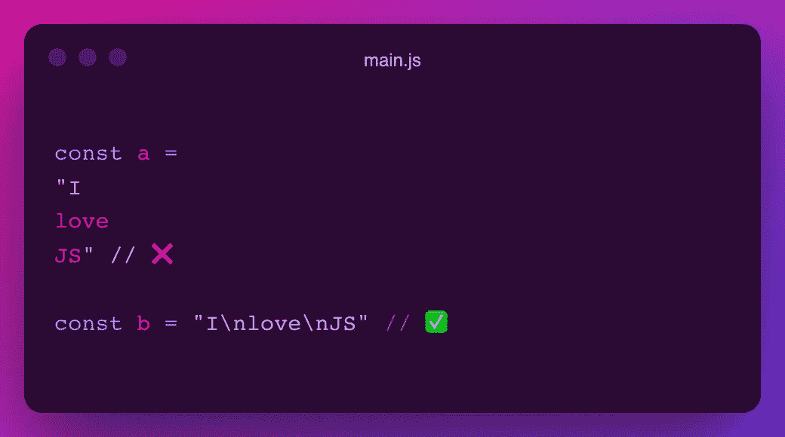
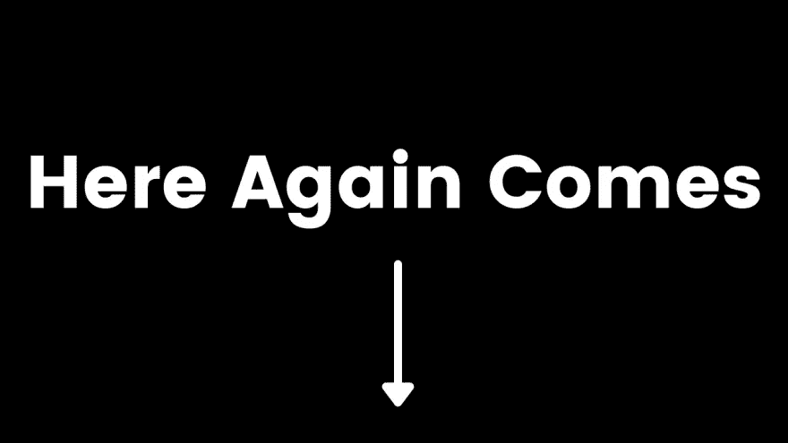
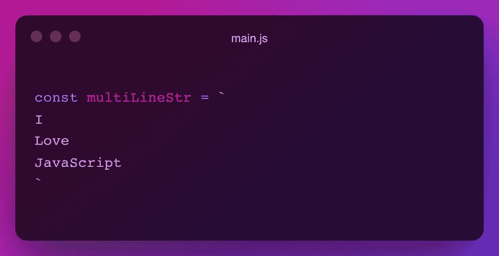
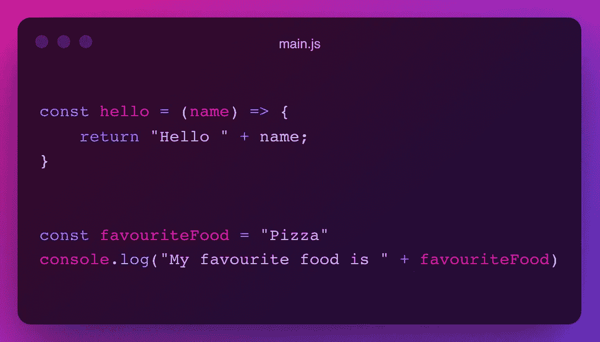
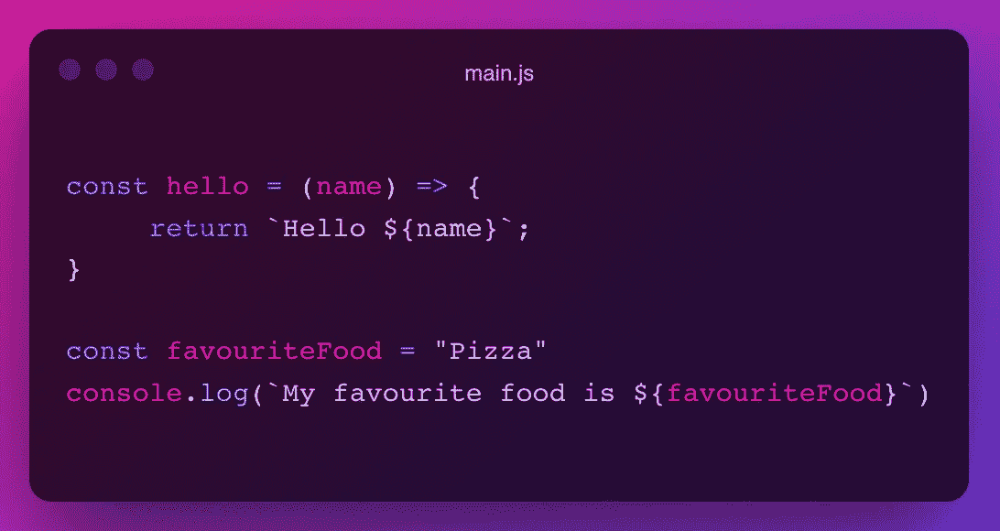
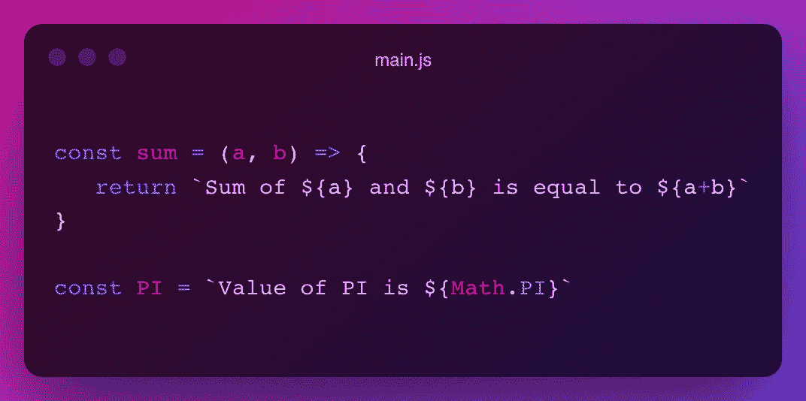

# 模板文字的介绍以及为什么应该使用它们？

> 原文：<https://javascript.plainenglish.io/what-are-template-literals-and-why-you-should-use-them-260ead4be8f8?source=collection_archive---------19----------------------->

## **什么是模板文字？模板文字**使用**反斜杠**来定义一个字符串，而不是**双**和**单**引号。

# 大家好👋

朋友们好，我是**雪球**。我是一个年轻的热情和自学前端网站开发人员，并打算成为一名成功的开发人员。

在本文中，我将解释 JavaScript 中一个非常有用的主题— **模板文字**。

# 什么是模板文字？

*   在 JavaScript 中，**模板文字**使用**反斜杠**来定义字符串，而不是**双(" ")**和**单引号(')**。
*   **模板文字**是在 **2015 中引入的 ES6 特性。**

Image source: **IOSHacker**

# 利益

*   **允许引号**

当使用**模板文字**时，可以在字符串中使用双引号和单引号。

如您所见，它太复杂了，无法对分配给变量`x`的文字引号进行转义。在带有**模板文字**的字符串中使用引号太简单了。

FreeCodeCamp 对字符串中的"[转义文字引号](https://www.freecodecamp.org/learn/javascript-algorithms-and-data-structures/basic-javascript/escaping-literal-quotes-in-strings)有很好的解释，我在上面的代码片段中对变量" x "做了同样的事情

*   **多行字符串**

通常情况下，在 Javascript 中你不能写一个多行的字符串，它带有双和单引号。而是要用`\n`断行。

您可以使用**模板文字**完美地编写多行代码，没有任何限制。

*   **字符串内的变量**

通常，我们都使用加号(+)将一个字符串与一个变量或表达式连接起来。

有了模板文字，我们的任务变得简单多了。

在**模板文字**中传递变量时，变量必须用**花括号**括起来，并在前面加上**美元符号($)** 。

*   **字符串中的表达式**

使用**模板文字**，可以像传递变量一样传递字符串中的表达式。

# 应该使用模板文字吗？

**是**。看到这么多好处🤩拉我用**模板文字**。请在下面的评论中告诉我你对使用它的想法，我会很高兴阅读你的评论

感谢您的阅读，祝您愉快！
**您的欣赏是我的动力😊**

*   在 Twitter 上关注我— [@codewithsnowbit](https://twitter.com/codewithsnowbit)
*   在 YouTube 上订阅我— [用雪球编码](https://www.youtube.com/channel/UCNTKqF1vhFYX_v0ERnUa1RQ?view_as=subscriber&sub_confirmation=1)

*更多内容看* [***说白了。报名参加我们的***](http://plainenglish.io/) **[***免费周报***](http://newsletter.plainenglish.io/) *。在我们的* [***社区不和谐***](https://discord.gg/GtDtUAvyhW) *获得独家获取写作机会和建议。***