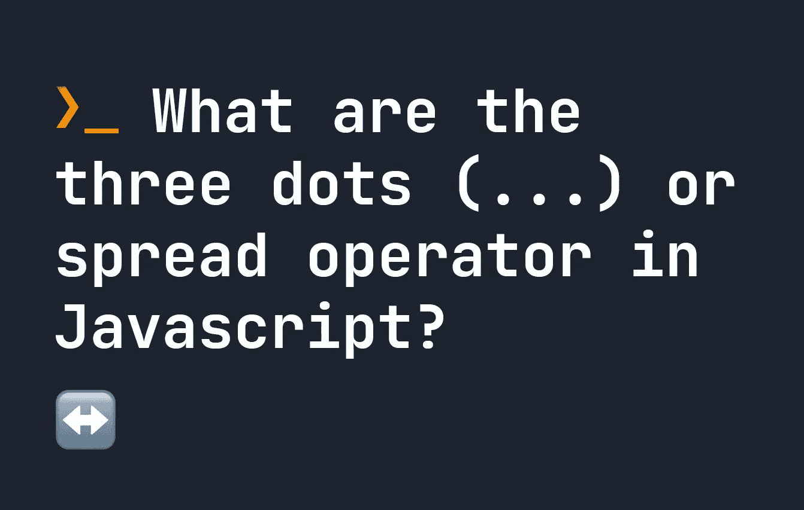

# JavaScript 中的三点(…)或 Spread 运算符是什么？

> 原文：<https://javascript.plainenglish.io/what-are-the-three-dots-or-spread-operator-in-javascript-f359e4ad25cb?source=collection_archive---------10----------------------->

## 什么是传播算子？spread 运算符有哪些用途？JavaScript 代码中如何使用 spread 运算符？



**扩展操作符**、**扩展语法**或 **3 dots** (…)是 JavaScript 中的一种语法类型，由函数调用和数组/对象使用。它有许多不同的用途，所以让我们看看如何在真实的 JavaScript 代码中使用 spread 语法。

# 在函数调用中

我们可以使用 JavaScript 函数调用中的 3 个点来将数组转换为函数的一组参数。让我们看一个例子。下面，我们的数组被转换成`x`、`y`、`z`和`a`的值。

```
let numbers = [ 1, 2, 3, 4 ];let myFunction = function(x, y, z, a) {
    return x + y + z + a;
}// Returns 10
myFunction(...numbers);
```

**这可以与其他值**结合，因此使用与之前相同的函数，以下也有效:

```
let numbers = [ 1, 2 ];// Returns 15 (i.e. 5 + 7 + 1 + 2)
myFunction(5, 7, ...numbers);
```

这也可以在用`new`调用构造函数时使用，例如:

```
let numbers = [ 1999, 26, 3 ];let thisDate = new Date(...number);
```

# 合并数组

使用 spread 语法的另一个有用的方法是合并数组。例如，我们可以使用两种扩展语法将两个独立的数组合并成一个新数组:

```
let x = [ 1, 2, 3 ];
let y = [ 4, 5, 6 ];// Returns [ 1, 2, 3, 4, 5, 6 ]
let newArray = [ ...x, ...y ];
```

与之前类似，我们可以将此值与其他值相结合，仍然得到相同的结果:

```
let x = [ 1, 2 ];// Returns [] 4, 5, 1, 2 ]
let newArray = [ 4, 5, ...x ];
```

# 合并对象

最后，我们可以使用扩展语法来**合并对象**。在下面的示例中，我们将两个具有键/值对的对象合并为一个对象:

```
let obj1 = { name: "John" };
let obj2 = { age: 114 };// Returns { name: "John", age: 114 }
let newObj = { ...obj1, ...obj2 };
```

**如果我们试图合并两个对象，并且有一个重复的关键字**，第二个对象将优先并覆盖第一个对象，如下所示:

```
let obj1 = { name: "John" };
let obj2 = { name: "Jake" };// Returns { name: "Jake" }
let newObj = { ...obj1, ...obj2 };
```

**这就是 spread 语法的工作方式**——它们让我们可以轻松地用数组运行函数，并且有利于合并对象和数组。你可以在本页底部找到更多的 JavaScript 教程。

*更多内容请看*[***plain English . io***](https://plainenglish.io/)*。报名参加我们的* [***免费周报***](http://newsletter.plainenglish.io/) *。关注我们关于*[***Twitter***](https://twitter.com/inPlainEngHQ)[***LinkedIn***](https://www.linkedin.com/company/inplainenglish/)*[***YouTube***](https://www.youtube.com/channel/UCtipWUghju290NWcn8jhyAw)*[***不和***](https://discord.gg/GtDtUAvyhW) *。***