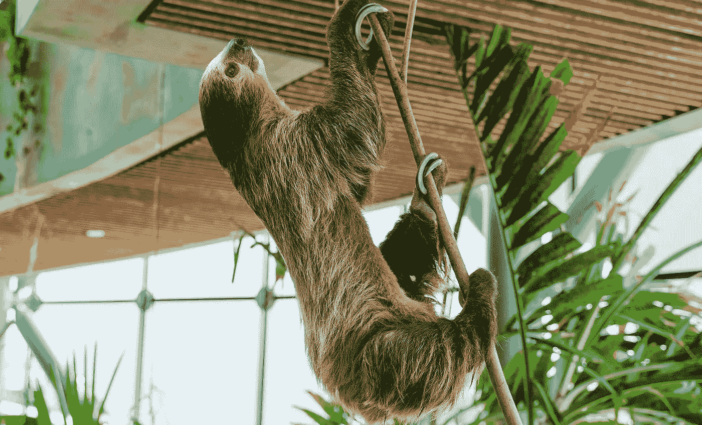
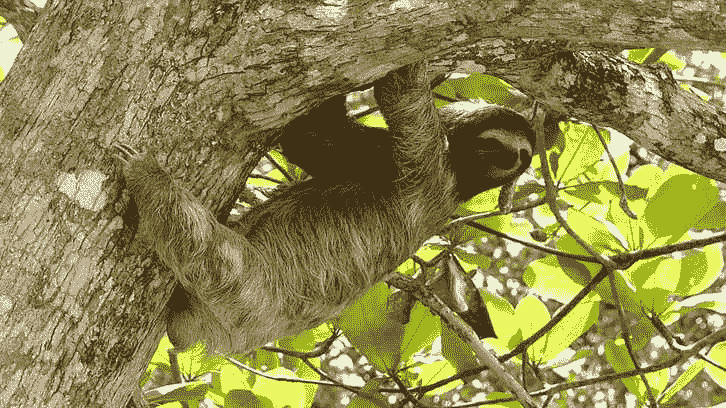
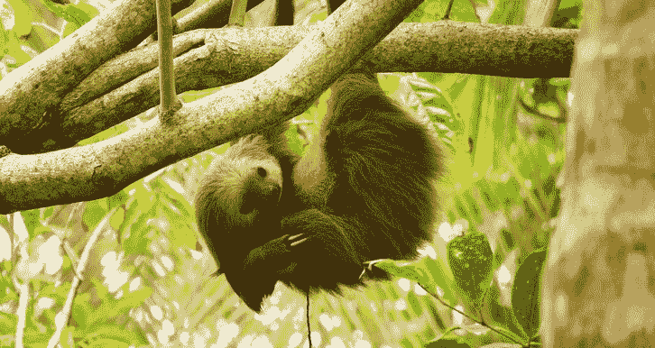

# 程序员能从树懒身上学到什么

> 原文：<https://javascript.plainenglish.io/what-can-programmers-learn-from-sloths-179410f93c1b?source=collection_archive---------16----------------------->

## 他们应该吗？

Captured by [Denys Gromov](https://www.pexels.com/sk-sk/@jdgromov?utm_content=attributionCopyText&utm_medium=referral&utm_source=pexels) on [Pexels](https://www.pexels.com/sk-sk/fotka/zviera-roztomily-divy-vetva-stromu-4835276/?utm_content=attributionCopyText&utm_medium=referral&utm_source=pexels)

树懒是独一无二的生物！他们慢条斯理，深思熟虑，似乎喜欢做任何事情都不紧不慢。在某些方面，它们是放松的缩影。但在其他方面，它们是效率的完美典范。

这正是我们作为程序员想要达到的目标，对吗？我们想高效地工作。同时，在做这件事的时候要玩得开心。

这个想法让我思考，我们真的能从这些伟大的生物身上学到东西吗？或者更好，我们能通过向树懒学习成为更好的程序员吗？

嗯，你马上就会知道了。

# 树懒的简单生活

众所周知，树懒是懒惰的动物。它们大部分时间都挂在树上，睡觉和吃东西。但是人们不知道的是，树懒实际上是非常好的思考者，他们擅长解决问题。

众所周知，树懒知道如何摆脱棘手的局面。他们通过在任何压力下保持冷静和耐心来做到这一点。由于他们的观察技能，他们也善于提前计划。

似乎程序员和树懒比乍看起来有更多的共同点。

## 程序员和树懒类似吗？

就像程序员一样，树懒非常擅长解决问题。他们能够找到最有效的做事方法，并且总是在寻找改进的方法。

众所周知，树懒和程序员都很懒，花很多时间睡觉，并且擅长慢慢来。但是这两个群体并不像看上去那样简单。在需要的时候，树懒和程序员实际上都非常聪明和高效。

Photo by [Javier Mazzeo](https://unsplash.com/@javier365?utm_source=unsplash&utm_medium=referral&utm_content=creditCopyText) on [Unsplash](https://unsplash.com/s/photos/sloth?utm_source=unsplash&utm_medium=referral&utm_content=creditCopyText)

对树懒来说，它们较慢的步伐是一种帮助它们在野外生存的适应。对于程序员来说，花时间去理解一个问题并缓慢而准确地编码可以节省以后调试的时间。

## 相似之处不止于此

程序员和懒人都知道慢慢来的价值。他们知道匆忙永远不会让你走远。他们也知道，慢慢来往往会带来更成功的结果。

他们都很聪明。他们知道如何不用付出很多努力就能得到自己想要的东西。他们很有耐心，总是先人一步思考。他们都很聪明，都很努力，并且在他们所做的事情上都非常成功。

程序员和树懒都是习惯动物。一旦它们找到一个舒适的地方，它们会在那里呆上一段时间。而且都是为了达到一致性。一致性是关键。他们知道，如果他们坚持走同一条路，他们最终会实现自己的目标。

他们非常善于在压力下保持冷静。他们在压力下从不崩溃，而且总能保持冷静。这也是程序员应该向树懒学习的原因之一。

树懒也非常擅长独立工作。他们不怕爬下树，走很长一段路去最近的厕所。他们不需要任何人和他们一起去。同样的道理也应该适用于开发者。我们不应该害怕独立解决问题。我们应该研究、分析和观察问题，而不是总是寻求帮助。之后，想出一个聪明的解决方案。

Photo by [Adrián Valverde](https://unsplash.com/@adrianvalverdem?utm_source=unsplash&utm_medium=referral&utm_content=creditCopyText) on [Unsplash](https://unsplash.com/s/photos/sloth?utm_source=unsplash&utm_medium=referral&utm_content=creditCopyText)

已经很明显了。树懒和程序员有很多共同点。他们都是高效的员工。下次你看到树懒或者程序员，不要急于下判断。他们可能只是更聪明地工作，而不是更努力地工作的完美例子。

# 我们能从树懒身上学到什么吗？

树懒是我们大多数人都可以向其学习的专家。他们从容不迫，享受每一刻。他们不会匆匆忙忙地过完一生，试图尽可能快地去做下一件事。他们从容不迫，享受生活的过程。

在当今这个匆忙的世界里，那是一件非常难得的事情！

我们总是试图去做下一件事，总是试图优化和加快我们的生活。我们经常同时处理多项任务，从一件事跳到另一件事。

但是如果我们从树懒的书上取一页呢？如果我们放慢脚步，慢慢来，会怎么样？当然，我们不一定要变成树懒。但对于品味当下，享受过程，而不是匆匆度过一生，还是有话说的。

下一次，当你发现自己匆匆忙忙地过着生活时，停下来深呼吸一下。享受外面的好天气，闻闻新煮的咖啡，或者更好的是，试着注意你周围发生的事情。

在过去的几分钟里，你听到了我对树懒的咆哮。现在，我想听听你们的想法。

你觉得我们能从树懒身上学到什么吗？

*我希望你喜欢这个故事。如果你想从我这里听到更多或阅读更多，请考虑使用* [***此链接***](https://bernardbad.medium.com/membership) ***成为一名中等会员。***

*原载于***。**

**更多内容请看*[***plain English . io***](https://plainenglish.io/)*。报名参加我们的* [***免费周报***](http://newsletter.plainenglish.io/) *。关注我们关于*[***Twitter***](https://twitter.com/inPlainEngHQ)*和*[***LinkedIn***](https://www.linkedin.com/company/inplainenglish/)*。加入我们的* [***社区不和谐***](https://discord.gg/GtDtUAvyhW) *。**