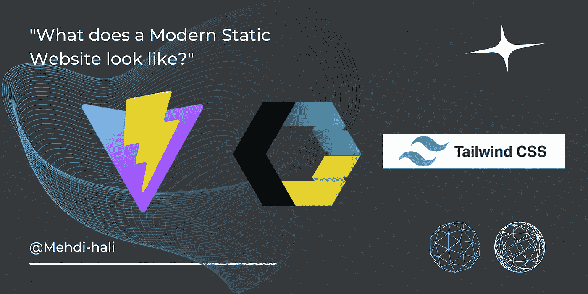

# 现代静态网站是什么样子的？

> 原文：<https://javascript.plainenglish.io/what-does-a-modern-static-website-look-like-eaf9583adb94?source=collection_archive---------3----------------------->

## 静态网站开发枯燥无味；但是，有一种方法可以让它变得有趣和现代。

在这个故事中，我将带你踏上我如何创建一个特殊的*静态网站的旅程，我的一个朋友这样描述:*

> **“最新最伟大！”😎**

*有点夸张但我喜欢称之为 ***现代静态网站*** *。**

**

# *问题陈述:*

*想象一下你经常处于这种情况，你被雇佣来编写一个简单的 6 页静态网站，例如，为你的同事组织的一个活动，但是因为你是一个书呆子！你希望你的网站更有趣，因为静态网站开发很无聊！*

*那么这个**现代静态网站**是什么样子的呢？*

*   *DRY:用可重用的 UI 组件替换重复的 HTML 代码，就像在现代水疗中心一样。*
*   *使用现代模块化 javascript 语法(ESModules)*
*   *能够安装 npm 包并从丰富的 javascript 包生态系统中受益(在我的例子中，我安装了 **GSAP:** 绿色套接字动画平台，以添加一些动画和一个 HTML 迷你包)*
*   *HMR:热模块重装，快速无缝的开发体验。*
*   *为一个高性能的生产网站建立优化。*
*   *一些无服务器的后端服务，如时事通讯和联系表格。*
*   *使用实用工具的第一类进行样式化(比如 Tailwind Css)。*

*所有这些都没有损害静态网站以简单而闻名的特点。*

# *让我们建造它！🧑‍💻*

*首先，确保您的机器上安装了 nodejs 和 npm。为什么？我们不是在建一个静态网站吗？是的，但是如前所述，我们希望能够在我们的网站上使用 npm 包。*

*npm 包需要像 ESModules 这样的现代 javascript 语法来导入和导出，因此我们需要一个构建工具来将我们的现代 javascript 模块捆绑到浏览器可以理解的文件中。*

# *向维特伊斯·⚡问好*

*现在有很多 javascript 构建工具，但是让 vitejs 脱颖而出的是它惊人的速度；此外，它非常简单，只需安装它，您就可以零配置拥有它！这将帮助我们保持现代静态网站的简单性！*

*⚠️——我将把 tailwind 和 vitejs 一起安装，但这只是一个偏好，你可以单独安装 vitejs。如果您对安装有任何疑问，请参考 [vitejs 文档](https://vitejs.dev/guide/#scaffolding-your-first-vite-project)。*

**终端:创建一个 vitejs 项目**

```
*npm create vite@latest my-modern-static-website
cd my-modern-static-website*
```

**端子:安装顺风 css**

```
*npm install -D tailwindcss postcss autoprefixer
npx tailwindcss init -p*
```

*🔴确保在内容数组中添加了您希望 tailwind 使用的每个页面。*

*~ *tailwind.config.js**

```
*/** @type {import('tailwindcss').Config} */
module.exports = {
  content: [
    "index.html",
    // "edition.html",
    // "partners.html",
    // "team.html",
    // "about.html",
    // "contact.html",
    // "404.html",
     "./src/**/*.{vue,js,ts,jsx,tsx}",
    //"./components/**/*.{vue,js,ts,jsx,tsx}",
  ],
  theme: {
    extend: {},
  },
  plugins: [],
}*
```

*我留下了我的项目中的一些页面，以便您有一个如何将页面添加到文件中的示例。*

*🔴确保你的网站上的每个入口页面都与 *vite.config.js* 文件中的一个入口相关联，如下所示:*

*~ *vite.config.js**

```
*import { resolve } from 'path'
import { defineConfig } from 'vite'export default defineConfig({
  build: {
    rollupOptions: {
      input: {
        main: resolve(__dirname, 'index.html'),
        // team: resolve(__dirname, 'team.html'),
        // edition: resolve(__dirname, 'edition.html'),
        // partners: resolve(__dirname, 'partners.html'),
        // about: resolve(__dirname, 'about.html'),
        // contact: resolve(__dirname, 'contact.html'),
        // 404: resolve(__dirname, '404.html'),
      }
    }
  }
})*
```

*~ *index.css**

```
*@tailwind base;
@tailwind components;
@tailwind utilities;*
```

**端子**

```
*npm run dev*
```

*现在你已经准备好开始从 npm 包的巨大生态系统中受益了！*

*我个人用 [GSAP](https://greensock.com/gsap/) 做了一些很酷的动画，用[**html-minifier-terser**](https://www.npmjs.com/package/html-minifier-terser)缩小 HTML 代码，让包变小。*

# *Vitejs ✨的其他优势*

*默认情况下，vitejs 还附带了 HMR(热模块重载),因此您可以轻松获得无缝的开发体验，而且 vitejs 还执行许多生产构建优化。*

*现在有了 vitejs，我们确保了*

*   *现代 js 语法兼容性*
*   *npm 包*
*   *速度和性能*

*我们剩下要做的就是不重复我们自己！这在 HTML 代码中很常见。*

*我非常喜欢现代 spa 中的 UI 组件，但这些框架并不是这个项目的正确选择，因为它们中的一些(例如 React)对 SEO 不友好，这对静态网站来说是一个问题，即使像 Nextjs 这样的一些框架解决了这个问题，但它们仍然增加了太多的复杂性，这对一个 6 页的静态网站来说是不值得的。*

***幸运的是，**有一种只使用本地 Web APIs 实现组件的本地方法，我们可以在需要时使用它们，而不需要任何依赖或安装！！*

# *Web 组件🧩*

*Web 组件 API 是一组本地 web APIs，可以创建定制的 HTML 元素，也称为**组件。***

*当谈到静态网站时，第一个想到的组件是网站的标题，在网站的每个页面中硬编码标题，然后想象一下，如果你想对它进行小的更改，你必须在每个页面中重复更改，这很烦人；因此，让我们为标题创建一个自定义组件！*

*为了保持有序，创建一个新文件夹，命名为“components”，在这个文件夹中创建一个新的 javascript 文件，命名为“wc-header.js”。*

*然后在新创建的文件中定义一个扩展 HTMLElement 类的新类，以便我们的组件继承常规 HTML 元素的属性，然后在构造函数中调用父构造函数，如下所示…*

**~ components/WC-header . js**

```
*class wcHeader extends HTMLElement {
	constructor(){
		super();	
	}
}*
```

*然后将 **innerHTML** 属性设置为 HTML 标题的代码，如下所示…*

**~ components/WC-header . js**

```
*class wcHeader extends HTMLElement {
	constructor(){
		super();
	}
	this.innerHTML = `<h1> My Header </h1>`;
}*
```

*最后一步，在 **customElement** 类中使用 **define** 方法定义一个定制 HTML 元素。*

**~components/wc-header.js**

```
*class wcHeader extends HTMLElement {
constructor(){
		super();
	}
	this.innerHTML = `<h1> My Header </h1>`;
}
customElement.define("wc-header",wcHeader);*
```

*🔴确保您给自定义元素起的名字中有一个破折号“-”，就像我的例子“wc-header”一样。*

*🔴你现在还不能在 web 组件中使用 tailwind，我希望它很快就能实现，所以现在只能在你的组件中使用内联 css。*

*我们的组件准备好了！*

*将组件包含在 HTML 中，并像*

```
*<html>
<head>
<script type="module" src="/components/wc-header.js"></script>
<title> My first web component </header>
</head>
<body>
	<!-- use your component like this -->
	<wc-header>

	<p> it is working !! </p>
</body>
</html>*
```

# *时事通讯和联系方式📬*

*在你的网站上有很多第三方服务，不需要任何后端或服务器端代码就可以轻松使用。*

*在我的例子中，我使用了 [**Mailer Lite**](https://www.mailerlite.com/) 用于时事通讯，使用了 [**智能表单**](https://smartforms.dev/) 用于联系人表单，它们都有很好的免费计划。*

# *恭喜你！🎉*

*你现在已经拥有了构建一个现代静态网站的所有要素！！*

*但是我们仍然需要一些后端功能。*

*就这些，谢谢你的阅读！*

**更多内容请看* [***说白了就是***](https://plainenglish.io/) *。报名参加我们的* [***免费每周简讯***](http://newsletter.plainenglish.io/) *。关注我们关于* [***推特***](https://twitter.com/inPlainEngHQ) ，[***LinkedIn***](https://www.linkedin.com/company/inplainenglish/)*，*[***YouTube***](https://www.youtube.com/channel/UCtipWUghju290NWcn8jhyAw)*[***不和***](https://discord.gg/GtDtUAvyhW) *。对增长黑客感兴趣？检查出* [***电路***](https://circuit.ooo/) *。***