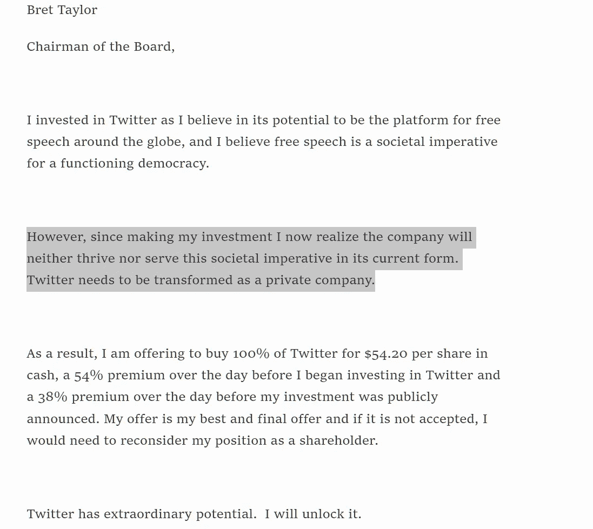
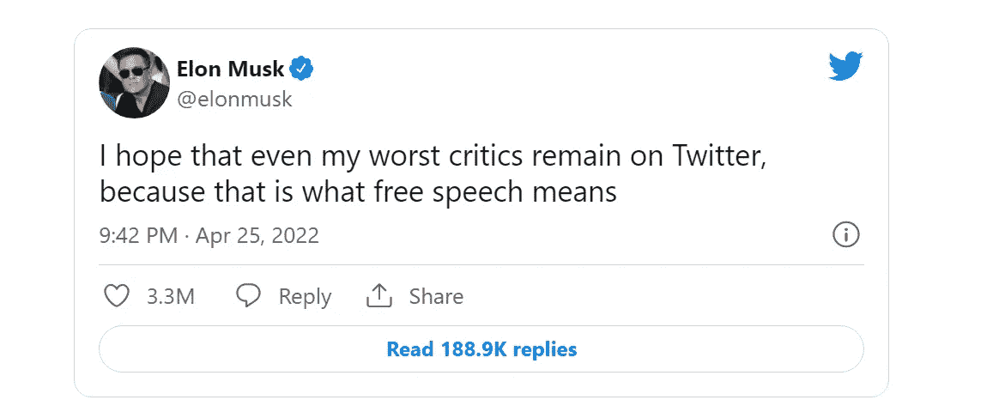

# 埃隆·马斯克向我们隐瞒了什么？

> 原文：<https://javascript.plainenglish.io/what-elon-musk-is-hiding-from-all-of-us-d5d29b04d1cb?source=collection_archive---------6----------------------->

## 推特售罄背后隐藏的原因！

[📷](http://Made By The Author)

世界首富刚刚买了他最喜欢的东西。

每个人都不能满足它。

他现在拥有 SpaceX 和 Twitter。马斯克似乎在想，“我见过星星。现在该下地狱了。”

当你不用付油钱的时候，你能省下多少钱，这很令人吃惊，不是吗？

440 亿美元。不算太寒酸。

440 亿美元。太多了！

当你花 440 亿美元买东西时，你知道你是富有的，而且你仍然是富有的。

马斯克表示，他将把言论自由带回 Twitter。

如果是真的，这意味着我们终于可以谈论布鲁诺了。

当然，有人担心马斯克的存在会伤害 Twitter。是的，与它一直以来的绝对天堂相比。

他还打算摆脱垃圾邮件。他说我们不想要任何不是真人的实体。希望扎克伯格不要往心里去。

# 为什么偏偏是 Twitter？

Twitter 是一笔不寻常的交易。这就像买了 YouTube，然后告诉自己，“忘掉那些视频吧。我来这里只是为了刻薄的评论。”

一个影响力这么强的人，为什么不自己创造一个平台？

并不是说 ***容易*** 难。

埃隆以前也尝试过，他推广了 Signal，但那并不成功。

我们都看到了，特朗普被封杀的时候，他出了一个新的 app，叫 Truth。尽管有这样的影响，它并不成功。

这足以让他明白，说服人们转向一个新平台是很难的。

Twitter 并不是收入最高的社交媒体平台。它也没有最高的用户数量。

去年，它赚了 50 亿美元。相比之下，YouTube 赚了 280 亿美元，亚马逊赚了 300 亿美元，脸书赚了 1170 亿美元。

因为 Twitter 缺乏一些功能，其他社交媒体平台将其抛在了后面。

说起经济学，Twitter 并不特别。

还是那句话，推特是 ***专用*** 。

Twitter 是一个微博平台，是少数几个书面内容仍然至高无上的地方之一。

每个用户，无论大小，都是创造者。

从政治家到金融专家，人人都在使用 Twitter。

绝大多数世界领导人都使用 Twitter，每个政府都有自己的 Twitter 账户。

普通人也能得到高绩效者的关注。

名人可以收听粉丝的实时对话。

埃隆·马斯克是推特迷。他是 Twitter 上最受欢迎的账户之一，拥有近 9000 万粉丝。

Twitter 自信地表示，它希望促进安全、包容和真实的对话。

很多时候，仇恨的叙事成为流行。很多时候，我们在 Twitter 上看到了明显的偏见。

例如，Twitter 已经永久禁止唐纳德·特朗普(Donald Trump)进入其平台。另一方面，塔利班的官方把柄仍然是活跃的。

暂停特朗普的账户是反对言论自由的行为，还是试图阻止仇恨言论？

你是否同意特朗普的观点并不重要。

对美国代总统颁布终身禁令是一个勇敢的举动。

我不确定你的或我的，但埃隆关心他的言论自由。

如果埃隆没有购买 Twitter，公司决定有一天禁止他使用，就像特朗普那样，情况会怎样？他很快意识到，即使他购买了公司最大的股份，他也无力影响公司。

[🔗](https://www.sec.gov/Archives/edgar/data/1418091/000110465922045641/tm2212748d1_sc13da.htm#ex-b_001)

Twitter 的私有化可能会引发监管问题——马斯克可能会对任何不当行为负责。

他很清楚这一点，但他继续承担风险。

Reddit(CSS 不太好的推特)前首席执行官伊山评论说，埃隆·马斯克有点理想主义。实际上，互联网很难得到适当的监管，在审查制度和言论自由之间划清界限就更难了。

[🧵](https://twitter.com/yishan/status/1514939157931454466)

另一方面，埃隆非常清楚他所说的言论自由是什么意思。

他认为，Twitter 作为一个平台，不应该有权压制他们认为合适的言论自由，并有权决定在这个平台上应该允许哪些观点，哪些不应该。

> “如果我们不相信我们所鄙视的人的言论自由，我们就根本不相信。”
> 
> **诺姆·乔姆斯基**

马斯克还认为，能够决定平台内容的算法应该开源。

Man of his words.

# 你所看到的≠你所知道的

现在让我们来谈谈对公众隐瞒了什么。

埃隆有可能导致加密货币价格大幅波动。

他可以创造或摧毁价值上亿美元的财富。

埃隆在一条推文中宣布，现在可以用比特币购买特斯拉。

这将导致比特币价格创下历史新高。

然后他说比特币对环境有害，而且他推翻了自己的决定，导致比特币价格连续数日暴跌。

埃隆·马斯克是当今世界最具影响力的金融人物。毫无疑问！

他的声望如此之高，以至于他在发布任何财经推特前都需要获得证交会的许可。

人们可以根据他的推特做出任何决定，这可能会导致市场的大起大落。

埃隆·马斯克承受不起失去这种权力的代价。任何人都不应该。

只有时间能告诉我埃隆的计划是什么，但我相信还有希望。

First tweet after buying Twitter

我们永远不应该使用压迫者的工具来压制那些我们不同意的人，不管我们多么强烈地不同意他们的观点。

毫无疑问，人们会支持那些拥有相同信仰的人。另一方面，言论自由的真正支持者允许他们强烈反对的思想存在。

如果不能坚持这一点，他们甚至不应该使用“言论自由”这个词。

司各特·菲茨杰拉德有句名言:“对一流人才的考验是 ***同时记住两种相反想法的能力，同时仍能保持*** *的功能。*

# 特斯拉+推特=强大的生态系统

看看苹果或谷歌——这些都是生态系统。

当你在苹果购物时，你不仅仅是买一部手机。在你拿到手机之后，你必须拿到笔记本电脑，然后你必须得到 iCloud 服务和 Apple TV，然后你必须年复一年地回来。你下半辈子都会生活在这个数字化的国家里。

谷歌也是同样的情况。Gmail，YouTube，Google Suite，Google Search，Chrome，整个 Android 生态系统都有。

因此，一旦你进入这个领域，它就有点像这个数字护照，你可以单点登录，你实际上是生活在这个数字国家里

软件生态系统是真正加强一个公司的东西。

> 特斯拉+推特=强大的生态系统

我认为这笔交易可以让特斯拉这样的公司变得非常强大。

Twitter 最终为埃隆·马斯克建立的所有硬件公司增加了社交媒体网络部门。

他已经错过了社交媒体软件网站，这将使他能够连接所有这些服务，并创建一种数字国家。

也许你进入 Twitter，然后突然收到一堆与特斯拉、SpaceX、Starlink 和 T2 相关的东西，你就进入了整个埃隆马斯克生态系统。

谁知道呢，如果他们能够将人类送上火星(我相信他们会的)，Twitter 可能会成为第一个(也可能是唯一一个)星际社交媒体平台。

通过他的 Starlink 项目，他也许能把地球上的人和火星上的人联系起来。如果发生这种情况，将没有什么比得上 Twitter。

我认为这是埃隆·马斯克的明智之举。如果他们打对了牌，他们最终会创造出惊人的东西。

希望这也有利于言论自由。

有一点是肯定的: ***Twitter 在未来几年将会是一个有趣的平台。你有什么想法？***

# 感谢信

我想利用这最后的机会说声谢谢。

感谢您的光临！如果没有像你这样的人跟随并带着信念阅读我的帖子，我将无法做我所做的事情。

我希望你能 [***加入我的***](https://polymathsomnath.medium.com/subscribe)[**我未来的博客文章**](https://polymathsomnath.medium.com/subscribe) 并留下来，因为我们这里有一些很棒的东西。

我希望在未来的许多年里，我能在你的职业生涯中帮助你！

下次见。再见！

*更多内容请看*[***plain English . io***](https://plainenglish.io/)*。报名参加我们的* [***免费周报***](http://newsletter.plainenglish.io/) *。关注我们关于*[***Twitter***](https://twitter.com/inPlainEngHQ)*和*[***LinkedIn***](https://www.linkedin.com/company/inplainenglish/)*。加入我们的* [***社区不和谐***](https://discord.gg/GtDtUAvyhW) *。*