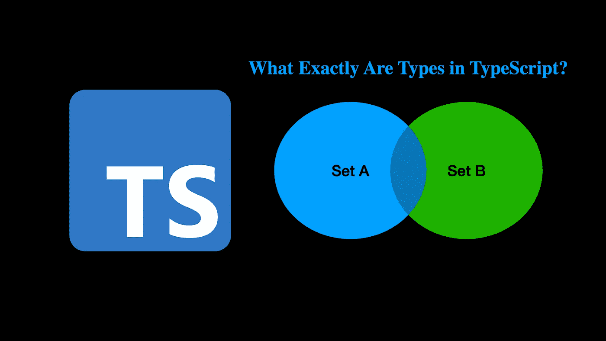
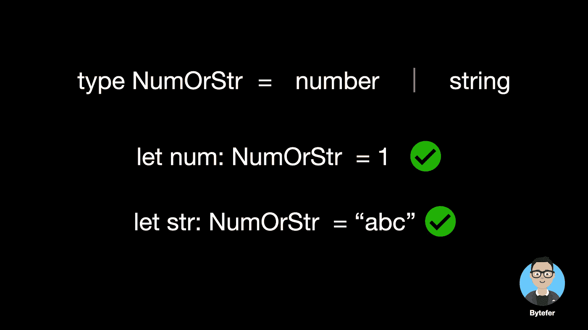
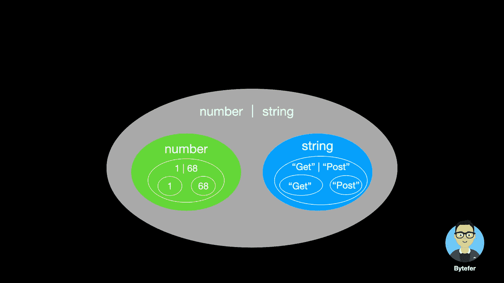
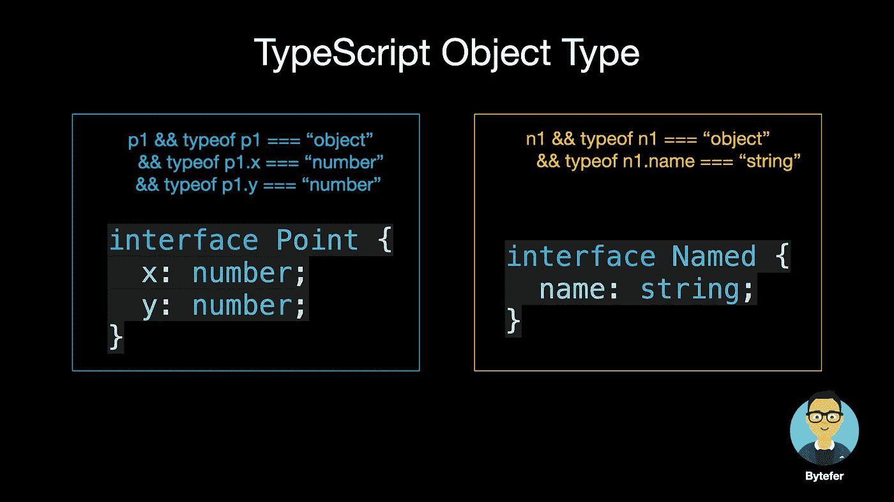
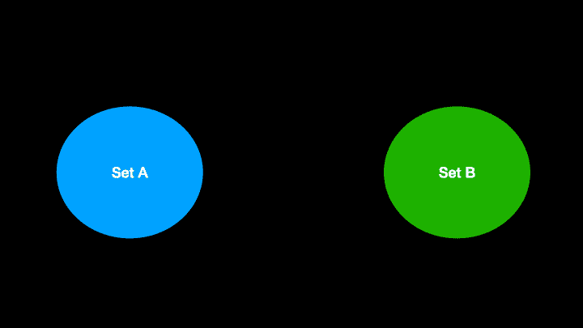
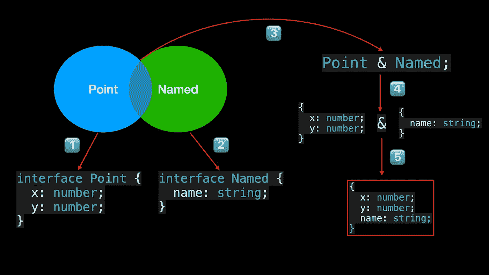
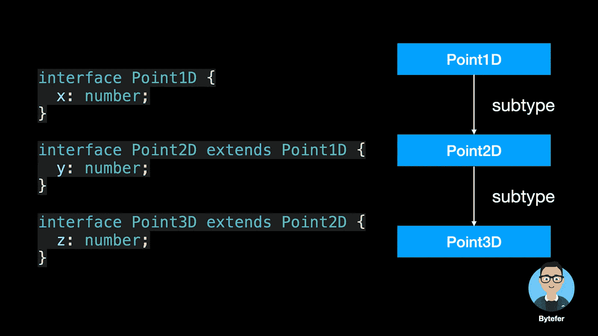
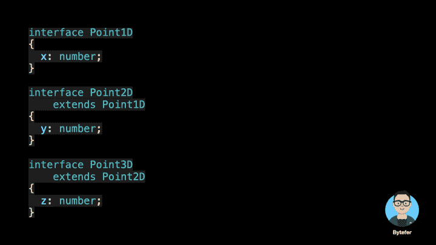

# 打字稿中的类型到底是什么？

> 原文：<https://javascript.plainenglish.io/what-exactly-are-types-in-typescript-bff06aee591?source=collection_archive---------6----------------------->

## 打字稿中的主类型和理解打字稿系统。将您的打字技能向前推进一步。



欢迎来到**掌握打字稿**系列。本系列将以动画的形式介绍 TypeScript 的核心知识和技术。让我们一起学习吧！之前的文章如下:

*   [**type script 泛型中的 K、T 和 V 是什么？**](https://medium.com/frontend-canteen/what-are-k-t-and-v-in-typescript-generics-9fabe1d0f0f3)
*   [**使用类型脚本像 Pro 一样映射类型**](/using-typescript-mapped-types-like-a-pro-be10aef5511a)
*   [**像 Pro 一样使用类型脚本条件类型**](/use-typescript-conditional-types-like-a-pro-7baea0ad05c5)
*   [**使用打字稿像 Pro 一样推断**](https://levelup.gitconnected.com/using-typescript-infer-like-a-pro-f30ab8ab41c7)
*   [**像 Pro 一样使用排版模板文字类型**](https://medium.com/javascript-in-plain-english/how-to-use-typescript-template-literal-types-like-a-pro-2e02a7db0bac)
*   [**类型脚本可视化:15 种最常用的实用程序类型**](/15-utility-types-that-every-typescript-developer-should-know-6cf121d4047c)

TypeScript 是带有类型语法的 JavaScript。它是一种基于 JavaScript 的强类型编程语言。TypeScript 内置了常见的基本数据类型，如**字符串、数字、布尔、bigint 和符号**。

基于这些类型，我们可以在声明变量时显式声明变量的类型。

```
let name: string = "Bytefer";
```

那么，TypeScript 中到底有哪些类型呢？**其实，你可以把一个类型看成是一个值的集合**。例如，您可以将数字类型视为所有数字的集合，1.0、68 属于该集合，而“Bytefer”不属于该集合，因为它属于字符串类型。


集合的最小集合是不包含任何值的**空集合**。TypeScript 中对应的类型是`never`类型。因为它的域是空的，所以没有值可以分配给 never 类型的变量。

```
let num: never = 123; // Error
let name: never = "Bytefer"; // Error
```

下一个最小的集合是包含单个值的集合。TypeScript 中的相应类型是**文字类型**，也称为单位类型。

```
type Get = "Get"
type Post = "Post"let m1: Get = "Get"; // Ok
let m2: Post = "Post"; // Ok
let m3: Get = "Post"; // Error
```

因为对应于获取类型的集合只能包含一个“获取”值。因此，当给 Get 类型的变量赋值“Post”时，就会发生错误。

```
Type '"Post"' is not assignable to type '"Get"'.ts(2322)
```

如果我们想要 m4 变量的值，即它可以是“Get”或“Post”。那么我们应该如何定义 m4 变量的类型呢？为了满足这种使用场景，TypeScript 引入了**联合类型**。通过使用`|`操作符，我们可以将多个文字类型组合成一个新类型。

```
type Method = "Get" | "Post"let m4: Method = "Get"; // Ok
    m4 = "Post"; // Ok
```

既然有单值的集合，那么有两个值的集合吗？答案是肯定的，**布尔**类型是包含真值和假值的集合。

```
type MyBoolean = true | falselet completed: MyBoolean = true // Ok
let enabled: MyBoolean = false // Ok
```

除了有限集，我们前面介绍的字符串和数字类型都属于无限集。通过使用`|`操作符，我们还可以将`number`类型和`string`类型组合成一个新的联合类型。



联合类型`A | B`，代表两个集合的联合。联合类型包含集合 A 和集合 b 中的所有值，例如`number | string`、`"Get" | "Post"`，具体如下图所示:



除了前面介绍的原始类型，TypeScript 还允许我们开发人员以`type`或`interface`的形式定义新类型。接下来，我们使用`interface`关键字来定义一个`Point`对象类型。

```
interface Point {
  x: number;
  y: number;
}
```

对于对象类型，我们也可以理解为对象的集合。例如，上面代码中的`Point`类型表示具有`x`和`y`属性的对象的集合，属性值的类型都是`number`类型。然后我们继续定义一个`Named`对象类型:

```
interface Named {
  name: string;
}
```

`Named`类型表示包含`name`属性的对象集合，属性值的类型为`string`类型。为了更容易理解，我们用 JavaScript 表达式来描述上面的规则。



在集合论中，假设 A 和 B 是集合，由属于集合 A 和属于集合 B 的所有元素组成的集合称为集合 A 和集合 B 的交。



上图叫做**文氏图**。它用来表示不同事物集合之间的数学或逻辑联系，特别适用于表达集合之间的“粗糙关系”。

当我们将一个`Point`类型和一个`Named`类型相交时，一个新的类型被创建。该类型中包含的对象同时属于`Point`类型和`Named`类型。

在 TypeScript 中，为我们提供了`&`操作符来实现对多个类型的交集操作，产生的新类型称为**交集类型**。



对于**交集类型**，它还包含了其他知识，如果你有兴趣，可以阅读下面这篇文章:

[](/using-typescript-intersection-types-like-a-pro-a55da6a6a5f7) [## 像专家一样使用 TypeScript 交集类型

### 你应该知道的关于 TypeScript 交集类型的细节——用动画解释。

javascript.plainenglish.io](/using-typescript-intersection-types-like-a-pro-a55da6a6a5f7) 

了解类型之后，我们来介绍一下类型之间的关系。TypeScript 采用了一个**结构化类型系统**来更好地兼容使用 duck 类型的 JavaScript。

```
class Point1D {
  constructor(public x: number) {}
}class Vector1D {
  constructor(public x: number) {}
}const p1: Point1D = new Point1D(0); // Ok
const p2: Point1D = new Vector1D(0); // Ok
```

除了用类定义`Point1D`类型，我们还可以用接口定义`Point1D`类型。使用`Point1D`类型，我们也可以通过`extends`关键字扩展`Point1D`类型。

```
interface Point1D {
  x: number;
}interface Point2D extends Point1D {
  y: number;
}interface Point3D extends Point2D {
  z: number;
}
```

在这个类型系统中，`Point1D`被称为**超类型**，而`Point2D`被称为**子类型**。这种关系通常被绘制成一个层次结构:



从集合的角度，我们也可以用前面介绍的**维恩图**来描述它们之间的关系:



现在我们来做一个总结。**与父类型 Point1D 相比，子类型 Point2D 会包含更多的属性，即描述的对象更精确，因此占用的空间更少。**对应于`Point2D`子类型的集合包含在对应于`Point1D`超类型的集合中。

学这些东西有什么用？让我们看一个例子:

```
interface Point1D {
  x: number;
}interface Point2D extends Point1D {
  y: number;
}type SubtypeOf<T,U> = T extends U ? true : false
type S0 = SubtypeOf<Point2D, Point1D> // true
type S1 = SubtypeOf<Point1D, Point1D> // true
type S2 = SubtypeOf<Point1D, Point2D> // false
```

在上面的代码中，`SubtypeOf`实用程序类型使用了**条件类型**的语法。这很重要，你可以通过这篇文章深入了解:

[](/use-typescript-conditional-types-like-a-pro-7baea0ad05c5) [## 像专业人员一样使用 TypeScript 条件类型

### 用动画解释。掌握 TypeScript 条件类型并理解 TypeScript 的内置实用工具如何类型化…

javascript.plainenglish.io](/use-typescript-conditional-types-like-a-pro-7baea0ad05c5) 

理解 TypeScript 中的类型和所使用的结构化类型系统是 TypeScript 进步的关键，这是值得学习的。如果遇到不清楚的内容，可以给我留言。

如果你喜欢学习动画形式的 TypeScript，可以在 [Medium](https://medium.com/@bytefer) 或者 [Twitter](https://twitter.com/Tbytefer) 上关注我，了解更多关于 TS 和 JS 的内容！

# 资源


[拜特弗](https://medium.com/@bytefer?source=post_page-----bff06aee591--------------------------------)

## 掌握打字稿系列

[View list](https://medium.com/@bytefer/list/mastering-typescript-series-688ee7c12807?source=post_page-----bff06aee591--------------------------------)47 stories

*更多内容看* [***说白了就是 io***](https://plainenglish.io/) *。报名参加我们的* [***免费周报***](http://newsletter.plainenglish.io/) *。关注我们关于* [***推特***](https://twitter.com/inPlainEngHQ) ， [***领英***](https://www.linkedin.com/company/inplainenglish/) *，*[***YouTube***](https://www.youtube.com/channel/UCtipWUghju290NWcn8jhyAw)*[***不和***](https://discord.gg/GtDtUAvyhW) *。对增长黑客感兴趣？检查* [***电路***](https://circuit.ooo/) *。**