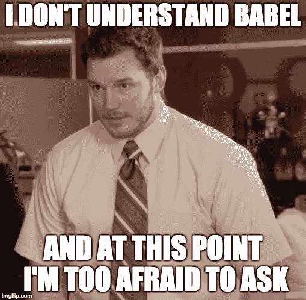
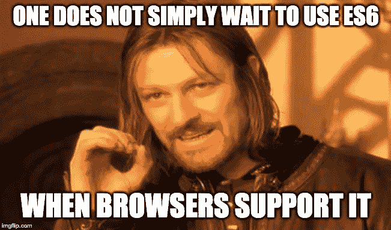

# 初学者巴别塔入门

> 原文：<https://javascript.plainenglish.io/what-exactly-is-babel-b40b3cd8a42d?source=collection_archive---------19----------------------->

## 什么是巴别塔，为什么需要它，如何使用它？

谈到 JavaScript 应用程序，Babel 是一个新的流行词。这是什么？在这篇文章中，我们将探索什么是巴别塔，为什么需要它，以及如何使用它。



# **巴别塔是什么？**

Babel 是一个 JavaScript trans piler，它将 edge JavaScript 转换成普通的旧版本 ES5 JavaScript，可以在任何浏览器上运行，因为旧版本可能不支持最新的标准。

它提供了用新的 ES6 规范添加到 JavaScript 中的所有语法糖，包括类、粗箭头和多行字符串。

我们也可以选择使用它将类型脚本转换成可以在浏览器中运行的常规 JavaScript。

```
***Transpilers****, or* ***source-to-source*** *compilers, are tools that read source code written in one programming language and produce the equivalent code in another language which at the same abstraction level like typescript to javascript or sass to css while traditional C****ompilers*** *convert one language to another at lower abstraction level like java to byte code.*
```

# Babel 入门

Babel 被打包成一个节点模块。

**1 —** 正如您所料，安装是通过 npm 进行的:

`npm install -g babel-cli`

**2 —** 现在，为了将它添加到您的项目中，运行以下命令

`npm install --save-dev babel-cli`

*有 webpack、Rollup、Gulp、Grunt、VSCode、Sublime、Webstorm 等插件。无论您的开发工具链是什么，Babel 都可以嵌入其中。*

***注意:***`*–-save-dev*`**表示我们安装这些依赖项的目的只是为了开发，我们不希望它用于生产。**

***3 —** 创建**。你根目录下的 babelrc** 文件*

```
****Note:*** *This file tells the babel how we want our code to transpile. It contains a normal json.* *Two important properties are* ***plugins*** *&* ***presets****. If you just want babel to transpile specific features you can specify them with* ***plugins*** *property because there are separate plugins like arrow function, classes,* instanceof etc *& many more.* *But defining plugins this way is not a great idea because you want all the features of ES6 to be transpiled so instead of specifying all the plugins in plugins property babel has something called presets.* ***Presets*** *are just a simple collection of babel plugins.**
```

***4 —** 为了运行 babel 来传输您的代码，运行以下命令*

*`babel src -d build`*

```
****Note:*** ***src*** *is where I have my source JS code and* ***build****is where i want to see the Output or Build.**
```

*这将创建相应的文件转换为 ES5 或任何其他版本，你在预设预定义。*

**

# *例子*

> ***类***

***ES6***

```
*class Person {}
const sumeet = new Person()*
```

***通过巴别塔传送后***

```
*"use strict";
function _classCallCheck(instance, Constructor) {
  if (!(instance instanceof Constructor)) {
    throw new TypeError("Cannot call a class as a function");
  }
}
var Person = function Person() {
  _classCallCheck(this, Person);
};
var sumeet = new Person();*
```

> ***箭头功能***

***ES6***

```
*(x, y) => {
  return x + y;
}*
```

***经过巴别塔***

```
*(function (x, y) {
  return x + y;
});*
```

> ***用箭头函数处理这个问题(词法范围***

***ES6***

```
*const x = {
  y: function() {
    () => {console.log(this)}();
  }
}*
```

***通过巴别塔运输后***

```
*var x = {
  y: function y() {
    var _this = this;
    (function () {
      console.log(_this);
    })();
  }
};*
```

> ***多线串***

***ES6***

```
*const template = `
  <div>
    <h1>hello {{name}}</h1>
  </div>
`*
```

***通过巴别塔运输后***

```
*var template = "
  <div>
    <h1>hello {{name}}</h1>
  </div>
";*
```

# *结论*

*Babel 确保您的最新代码可以在所有环境下运行，即使这些环境不支持最新的 JavaScript，从而让您的生活变得轻松。*

**

*如果您无法控制应用程序的运行环境，那么在您的代码中加入这一点是非常好的。*

*也看看我的其他文章。*

*[](/what-is-webpack-ed18b68bd5d3) [## JavaScript 中的 Webpack 是什么？

### 我们大多数人在构建 JavaScript 应用程序时都听说过术语“Webpack”。这是什么？它是如何工作的…

javascript.plainenglish.io](/what-is-webpack-ed18b68bd5d3) [](/hoisting-in-javascript-a0320bb42921) [## 深度提升 JavaScript

### 深入探究 JavaScript 中的提升。

javascript.plainenglish.io](/hoisting-in-javascript-a0320bb42921) 

*更多内容请看*[***plain English . io***](http://plainenglish.io/)*。报名参加我们的* [***免费周报***](http://newsletter.plainenglish.io/) *。在我们的* [***社区***](https://discord.gg/GtDtUAvyhW) *获得独家获得写作机会和建议。**