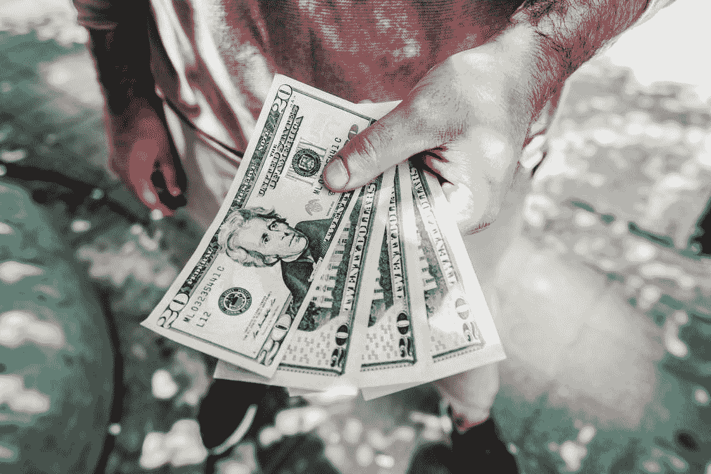

# 当我的有钱朋友告诉我停止编程时发生了什么

> 原文：<https://javascript.plainenglish.io/what-happened-when-my-rich-friend-told-me-to-stop-programming-3838072b6ded?source=collection_archive---------1----------------------->

## 在这种情况下，如果有人告诉你停止做你喜欢的事情，你会有什么反应？

我最近在本的生日上拜访了他，他是我童年的朋友。在过去的 4 年里，我们通常都忙于工作，没有机会见面。

我们有时会互相发信息，或者每月随机给对方打一次语音电话。是的，社交媒体是与你真正关心的人保持联系的福音。

那是一个公共假期，我非常兴奋能见到他，因为我们将在 4 年后见面。

关于本的一些有趣的事实是，在过去的几年里，他经营着他父亲的生意。他有一辆超级跑车和一栋豪宅，这基本上是他父亲送给他的礼物。所以基本上他的家庭非常富有，在我的童年，我一直梦想过上像他一样的生活。

所以，在本的生日那天，我做好准备，拿着我的车钥匙，冲向他的豪宅。当我到达本的宅邸时，我注意到本正在门口急切地等我。他非常兴奋能在现场见到我。看到这个我超级开心。

两三分钟后，当我的车向他开过来时，他的笑容变得很生硬。当我把车停在他家门口，追上去拥抱他时，我看到他做了一个非常奇怪的手势。

我们只是像兄弟一样拥抱了整整 1 分钟，并以正式的问候相互问候。

他问我到底是做什么的，因为他从来没有机会了解我的职业。我简单回答说“我现在是程序员了。”

本的回答让我心烦意乱，他说:“这就是你开那辆蓝色旧车的原因吗？”

我就想，“等等，什么？我只是不喜欢把钱花在昂贵的东西上，这与我是一名程序员无关”。

我告诉他统计数据，程序员工资很体面，我热爱编程。

本简单的回答道:“你应该退出编程，做一些让你像我一样超级有钱的事情”。

我没有对他的声明反应过度，给了他我从当地礼品店花 90 美元买的礼物。我们只是享受了他的生日，后来我们分开了，再次忙于我们的日程安排。

## 钱重要吗？

我热爱编程，在找到新的激情之前，我会一直做下去。跟钱没关系。 [*我对自己的收入很满意*](/i-always-wanted-to-get-instantly-rich-from-my-programming-job-9044ada48156)*我对自己的生活方式毫无怨言。*

*所以对我来说，在每月赚到一定的钱来满足我的需求后，我不认为钱会在成功的生活中发挥很大的作用。*

*我投入了大量资金，并为此感到自豪。很明显，买一栋像本这样的豪宅对我来说是一项艰巨的任务，但我根本不在乎。我会一直关注我的自我提升，而不是随意的批评。*

*我知道的是——“我努力工作赚钱，这让我的收入变得非常有价值”。*

*目前，我正在做我喜欢的事情，这才是真正重要的。*

## *你该怎么办？*

*我知道我所面临的尴尬局面是很常见的，有很多人需要处理同样的情况。*

*我只是不明白根据人们拥有的金钱来批评他们背后的基本原理。我花了多年的努力才成为现在的我，当我那些没什么天赋的朋友赚得比我多的时候，我感觉自己就是一堆垃圾。但是，我让它去，并提醒自己，比较是我最大的敌人。*

*因此，无论你面临什么情况，都不要再比较了。*

*当我富有的朋友告诉我停止我正在做的事情时，因为他认为我很穷，现在这与我无关。我只是在这种情况下保持冷静，继续做我喜欢做的事情。*

*每当你把自己和挣得比你多的人比较时，你就会觉得自己一无是处。但是，在现实中，你只是做得很好，你只需要继续做你喜欢的事情。注重自我提升，确保把大部分时间投入到有成效的事情上。*

> *你只需要提高自己，结果只是过程的副产品*

*在我喜欢做的事情上受到批评真的让我很生气。我知道这听起来很愚蠢，但我总是倾向于忽略这样的批评，因为它会完全扼杀我的生产力。*

*我想强调的关键点是，在这种情况下我没有反应过度。不必要的反应会毁了我们的友谊，我将来会恨它。*

*目前，我只专注于自我提升，并试图围绕我的技能建立一个成功的职业生涯。希望这几点能给你应对不必要批评的力量。*

*就是这样，希望你会发现它的价值和信息。此外，我相信有些要点会帮助你重新获得动力。*

*关于我——我是*科技*和*自我提升的顶级作家；* [*点击这里*](https://aniketz.medium.com/) *阅读更多我的文章。**

*如果你想购买 5 美元的中等会员资格， [*点击这里*](https://aniketz.medium.com/membership) (当你使用 [*这个链接*](https://aniketz.medium.com/membership) 购买中等会员资格时，我会从你的会员费中抽取一小部分作为佣金，不需要你额外付费)。如果你想订阅我的电子邮件列表然后 [*点击这里*](https://aniketz.medium.com/subscribe) *。**

* [## 通过我的推荐链接加入 Medium-Aniket

### 作为一个媒体会员，你的会员费的一部分会给你阅读的作家，你可以完全接触到每一个故事…

aniketz.medium.com](https://aniketz.medium.com/membership)* 

*[**通过电子邮件获取我的文章点击这里**](https://aniketz.medium.com/subscribe) **|** [**购买 5 美元的中等会员资格**](https://aniketz.medium.com/membership)*

**更多内容看* [***说白了。报名参加我们的***](https://plainenglish.io/) **[***免费周报***](http://newsletter.plainenglish.io/) *。关注我们关于*[***Twitter***](https://twitter.com/inPlainEngHQ)*和*[***LinkedIn***](https://www.linkedin.com/company/inplainenglish/)*。加入我们的* [***社区不和谐***](https://discord.gg/GtDtUAvyhW) *。****