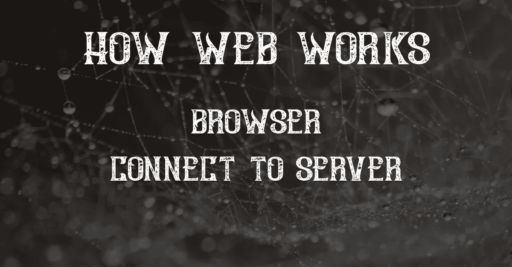

# 载入网页时会发生什么

> 原文：<https://javascript.plainenglish.io/what-happens-while-a-webpage-is-loading-6d645f40a08b?source=collection_archive---------7----------------------->

Browser Connect To Server

## 加载网站的过程，从您键入其 URL 开始，直到您看到它出现在您的屏幕上。

当你访问一个网站时，你的电脑要做很多事情，有很多事情可能会出错。在这篇文章中，我们将介绍加载一个网站的过程，从你输入它的 URL 开始，直到你看到它出现在你的屏幕上。

首先，在进入本题之前，有必要对 TCP、ISP、DNS、DNS 查找有所了解。如果你知道这些话题，可以*跳过*这部分。

## 什么是 ISP？

ISP 代表互联网服务提供商。这是一家向客户提供互联网的公司。例如，如果你有一个电缆连接，那么你有一个 ISP。如果你有移动数据连接，那么你也有一个 ISP。ISP 负责将数据包从您的计算机发送到目的地。最常见的公司是美国电话电报公司互联网服务公司，美国的 Sparklight 英国电信，英国天空宽带。

## 什么是 DNS？

DNS 代表域名系统，用于将 www.google.com[或 www.facebook.com](http://www.google.com)[等域名分别翻译成 216.58.194.65 和 2a03:2880:21d:80c::2 等 IP 地址。这个翻译过程被称为 DNS 查找，当您在浏览器的地址栏中键入网站地址或单击网站上的链接(超链接)时就会发生。DNS 服务器包含所有关于域名和与之相关的 IP 地址的信息，因此当有人发起 DNS 查找请求时，他们的计算机向这些服务器中的一个发送请求，该服务器返回与他们在浏览器地址栏中输入的或使用网络连接在线浏览时点击的域名相对应的 IP 地址。](http://www.facebook.com)

## 什么是 TCP？

TCP 是一种面向连接的协议，它工作在 IP 层，为用户提供传输环境(HTTP、SMTP 等)。)，即双方发起连接，观察对方的健康状况。双方之间的 TCP 连接是通过称为三次握手的过程建立的。

# 页面加载时会发生什么？

当你加载一个网站时，有很多步骤。让我们以总结的形式来检查这个过程，然后把它分成几个步骤，并详细说明每个步骤。

服务器向您的浏览器发送请求。请求通常是针对像图像或视频这样的文件。如果请求成功，服务器将发回数据。如果有错误，那么它将返回一个错误消息。然后，浏览器处理这些数据，并在屏幕上显示出来。整个过程发生在一个叫做互联网的计算机网络上。网络由提供数据的服务器(如网站)、客户端(如浏览器)以及它们之间的连接(如路由器)组成。客户机向服务器发送请求，服务器根据它们是否能满足这些请求，用数据或错误消息来响应。

***步骤:***

1.  键入 url，然后按 enter 键。
2.  浏览器从 DNS 中找到 IP 地址。
3.  浏览器与服务器建立 TCP 连接
4.  浏览器向服务器发送 HTTP 请求
5.  服务器接收请求并返回响应
6.  浏览器呈现从服务器返回的内容

## 1.键入 URL，然后按 Enter 键。

## 2.浏览器从 DNS 中找到 IP 地址。

输入 URL 后，浏览器首先要知道应该连接哪个服务器。为了知道与哪个服务器连接，它需要从写入的 url 地址中知道它应该被定向到哪个 IP 地址。IP 地址是通过 DNS 查找从 url 中写入的网站名称中找到的。

浏览器从 DNS 中找到 IP 地址后，需要做的就是和这个地址的服务器建立 TCP 连接。

## 3.浏览器与服务器建立 TCP 连接

浏览器找到 IP 地址后，会与服务器建立 TCP 连接。如果主机服务器有 ssl 证书，即 https，url 的方案将进行 TLS 握手来创建可靠的连接。

## 4.浏览器向服务器发送 HTTP 请求

现在浏览器和服务器之间有了连接。建立 TCP 连接后，浏览器会创建一个 http 请求，并向服务器发出请求。服务器根据这个 http 请求返回一个响应。

## 5.服务器接收请求并返回响应

服务器根据请求行、标题和正文决定如何处理来自浏览器的请求。然后服务器获取这个路径的内容或者动态地创建它。
如果服务返回的响应的状态码是 200，浏览器认为操作成功并呈现内容。
现在我们知道了服务器是如何生成响应的。现在让我们看看浏览器如何处理这个返回的响应。

## 6.浏览器呈现从服务器返回的内容

浏览器收到来自服务的响应后，首先查看响应的 headar。根据标题中的 Content-Type 字段，浏览器呈现这个请求。通常，从对网站的第一个 http 请求返回的响应的内容类型是 bit HTML，浏览器知道如何呈现 HTML。

我们可以把从服务返回的 HTML 称为页面的结构或骨架。当我们检查一个 HTML 文件时，我们可以看到引用它需要的其他文件的行。这些文件(Js、Css、图片等。)是决定我们的 HTML 页面在呈现时如何呈现的文件。

当浏览器解析并呈现 HTML 文件时，它会向服务器发送额外的请求来访问这些文件。这些请求通常并行处理。在这些请求得到响应后，浏览器会完整地呈现所请求的页面。

*更多内容请看*[***plain English . io***](https://plainenglish.io/)*。报名参加我们的* [***免费周报***](http://newsletter.plainenglish.io/) *。关注我们关于*[***Twitter***](https://twitter.com/inPlainEngHQ)[***LinkedIn***](https://www.linkedin.com/company/inplainenglish/)*[***YouTube***](https://www.youtube.com/channel/UCtipWUghju290NWcn8jhyAw)*[***不和***](https://discord.gg/GtDtUAvyhW) *。对增长黑客感兴趣？检查* [***电路***](https://circuit.ooo/) *。***