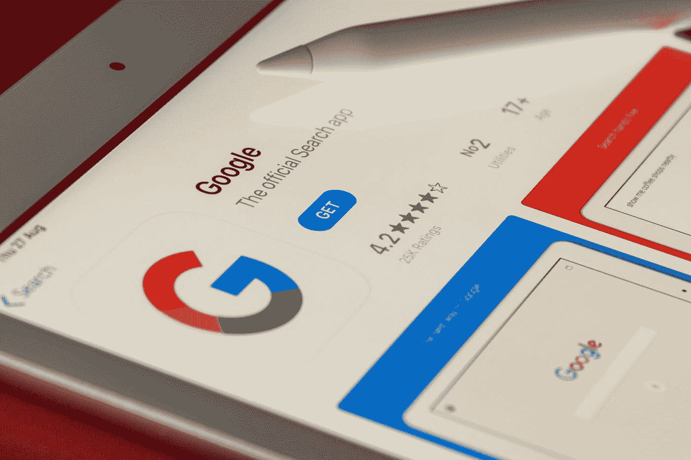

# 我从谷歌和 2 个编程实践糟糕的开发者那里学到了什么

> 原文：<https://javascript.plainenglish.io/what-i-learned-from-google-and-2-developers-with-bad-programming-practices-f5e043dd6712?source=collection_archive---------3----------------------->

## 一个开发者复制粘贴，另一个不文档化。

Photo by [Souvik Banerjee](https://unsplash.com/@rswebsols?utm_source=medium&utm_medium=referral) on [Unsplash](https://unsplash.com?utm_source=medium&utm_medium=referral)

由此产生的代码(以冗余和扭曲的方式运行)是来自两个主要来源的许多同时发生的不良实践的汇合结果:开发者和巨头谷歌。

为了帮助你理解，有必要对代码进行反汇编，并推断出它的历史，我试着总结一下:

*   最初的程序(一个铃声生成器)是在 2013 年由一个开发者开始的，比如说，**乔。**
*   **Joe 有一个坏习惯(很时髦):**从 Stack Overflow 复制粘贴，不用太担心字体。虽然剪切粘贴是合理的，但是错的是**在做代码的时候完全没有文档和推理。匆忙通常是一个糟糕的顾问。**
*   当时安卓的版本是 KitKat，内部安全设计还处于初级阶段。结果， **Android 本身就存在诸多安全缺陷。**
*   2015 年，Joe 停止开发代码，去了另一家公司。然而，该程序已经运行了一段时间。
*   开发任务就委托给了**瑞安**，他还有一个坏习惯。当他看到他处理过的代码时，他让代码保持不变，而不用担心文档或请求文档。他知道这行得通，但有些概念对他来说是陌生的。如果代码有问题，他将已经设法用他已经知道的来修复它。
*   谷歌继续 Android 开发并发布了 6.0 版本(棉花糖)，引入了**运行时权限。**简而言之，新版 Android 更安全，**将多个权限的决定权委托给用户交互:**
*   我们从这里通过(安装应用程序时要求所有权限)
*   这是一个重要的细节:**它迫使开发人员重新思考应用程序，并添加额外的代码来处理快速授予或拒绝权限的情况。**这是安全方面的一大进步，**谷歌将这种新模式的解决方案委托给了开发者。标准的做法是开发人员负责解决这些事件(这不是谷歌的权力:微软、甲骨文和其他公司也有他们的)。**也就是说，在安全性方面前进了一步，但由于变更的破坏性而后退了一步。成千上万的(运行良好的)应用程序将不得不被重新编程以符合新的标准。否则**从 Android 6 开始就不行了。**
*   我们回到 **Ryan** 的话题:现在越来越多的人发现这个应用程序不能在新设备上运行。不管怎样，你都得想办法。 **Joe** 很久没有开发这个应用程序了，他可能也不知道这个问题。
*   因此 **Ryan** 做了任何开发人员都会做的事情:开始研究问题并尽快寻找解决方案。
*   由于对主题了解甚少，他做了一个**‘补丁’或‘修复’**:如果设备是安卓 6 以下，做一件事。如果是旧的，再做一个。它**工作正常，除了“以防万一”复制了大量代码。**这是另一个影响许多开发的问题:**对问题的部分分析会导致冗余代码和长期问题。**
*   一路上，Ryan 跳过了记录。毕竟，他能记住整个解决方案。为什么记录？许多程序员都有“完美记忆”情结，他们认为他们能记住所有的事情，因此没有必要做记录。时间总是负责证明他们是错的。
*   当你开始复制代码时，你需要复制做相同事情或者几乎相同事情的功能。这“几乎”要求你开始“调整”变量并创建新代码。最后，Ryan 将以大量“手工”代码结束**，以避免根据新的变化重新分析情况。**
*   2017 年年中:谷歌推出 Android 8，在安全层面有了新的变化，**再次对完全可操作的应用产生负面影响。**
*   同样，该应用程序不能在 Android 8 及以上版本上运行。瑞安已经掌握了代码:如果 Android 大于 8，就做一件事。如果小于 8，再做一次。不对不对，如果安卓大于 6 和< 6 我也得。好吧，我会看看如何适应自己。
*   Ryan 的代码开始看起来像一个 7 头的 hydra，在这里复制代码，在那里复制代码，并试图使所有代码作为一个应用程序工作。
*   过了一段时间，Ryan 换了工作，去了另一家公司做程序设计。不幸的是，他留下了一堆难以理解的代码。
*   不幸的是现在必须维护代码的人。剩下的是一个可以工作的程序**，但是没有文档的话，不知道为什么有些东西会工作，顺序是什么。**

# 在这个故事中，我们可以指出一些寓意:

*   即使有完美的代码，开发人员的工作也很少完成。所有应用程序都依赖于它们之间的交互方式，并由操作系统支持。所以除了在非常狭窄的环境中，**‘完美’**的概念并不存在。剩下的就是**可完善的代码**，**一个“活的”存在，我们对它进行建模，以便它以某种方式适应它的环境。**
*   **当咨询公司改变其“范式”时，会有紧张的工作时期。它就像一股无声的巨浪，影响着成千上万的应用程序，让它们无法运行。大公司将责任委托给程序员**已经成为一种规范，一种强制承担的责任，**而这种(灾难性的)做法的含义很难被理解。它被认为是“该应用程序在新版操作系统中无法工作”或“这些应用程序停止工作”或“它在我的新手机上无法工作”。**责任人落在开发商身上。****
*   糟糕的开发实践会放大并留下可操作的代码，这些代码会在我们眼皮底下爆炸。这是一个“传递烫手山芋”的例子，没有人对代码变得有缺陷和没有文档记录的后果负责。

**PS:** 人名纯属虚构。没有乔/瑞安在这个故事中受到伤害。

***更多内容看*** [***说白了就是***](https://plainenglish.io/) ***。报名参加我们的*** [***免费每周简讯***](http://newsletter.plainenglish.io/) ***。关注我们关于***[***Twitter***](https://twitter.com/inPlainEngHQ)***和***[***LinkedIn***](https://www.linkedin.com/company/inplainenglish/)***。查看我们的*** [***社区不和谐***](https://discord.gg/GtDtUAvyhW) ***加入我们的*** [***人才集体***](https://inplainenglish.pallet.com/talent/welcome) ***。***