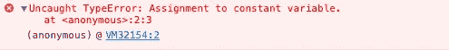
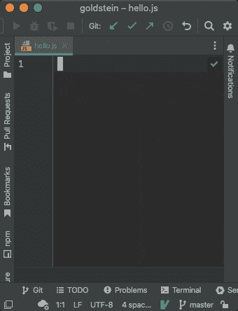
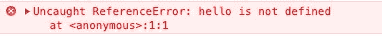
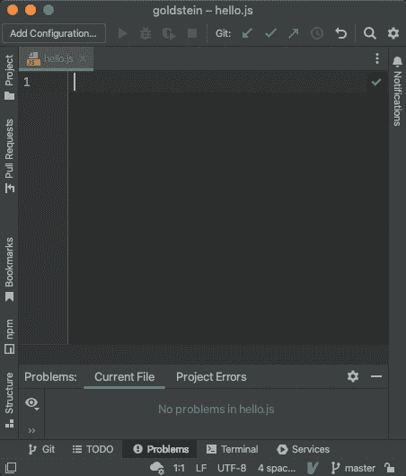
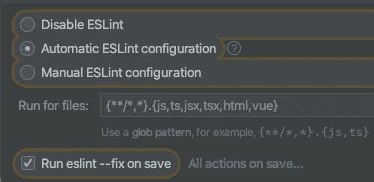

# 如果 Linter 可以修复运行时错误会怎么样？

> 原文：<https://javascript.plainenglish.io/what-if-linter-could-fix-runtime-errors-666c1d6225b4?source=collection_archive---------1----------------------->

# TypeError:常量变量的赋值



The `**TypeError**` object represents an error when attempting to modify a value that cannot be changed © MDN

假设您编写了代码，一切都很好，但是当您在浏览器或节点中运行测试或执行它时，您会看到这样的错误。

这很容易修复，因为您声明了一个常数，然后试图改变它:

```
const a = 5;
a = 3;
```

但是，等一下！为什么你需要为这样的事情烦恼？@ putout/convert-const-to-let 会帮你做这类事情！它将搜索参考，如果变量值改变，`const`将切换到`let`。当一个变量没有理由成为`let`时，它可以在 ESLint 的`[prefer-constant](https://eslint.org/docs/latest/rules/prefer-const)`的帮助下切换回`const`:



这是如何🐊[输出](https://github.com/coderaiser/putout)防止运行错误！

# ReferenceError: hello 未定义



The `**ReferenceError**` object represents an error when a variable hasn't yet been initialized in the current scope is referenced. © MDN

假设您有一些代码:

```
if (a)
    hello();const hello = () => ‘world’;
```

你一定会收到 **ReferenceError** ！但是不要担心！🐊**输出**在`[@putout/declare-before-reference](https://github.com/coderaiser/putout/tree/master/packages/plugin-declare-before-reference#putoutplugin-declare-before-reference-)`的帮助下解决了这个问题！



好的，如果使用的东西没有声明呢？不要担心！

`[@putout/plugin-declare-undefined-variables](https://github.com/coderaiser/putout/tree/master/packages/plugin-declare-undefined-variables#readme)`轻松解决这一问题:


# 如何设置？

用以下工具安装[扳手](https://eslint.org)和`[eslint-plugin-putout](https://github.com/coderaiser/putout/tree/master/packages/eslint-plugin-putout#safe-mode)`:

```
npm i eslint eslint-plugin-putout -D
```

然后将`.eslintrc.json`加上:

```
{
    "extends": [
        "plugin:putout/safe"
    ],
    "plugins": [
        "putout"
    ]
}
```

然后启用保存时修复 lint:



Most IDE’s has ability to run fix lint on save

# 结论:用 linter 修复运行时错误是一件好事

今天就到这里，最后还有几件事:

☝️follow me on medium/@[code raiser](https://medium.com/u/47c05fa2893e?source=post_page-----1782c6625d77--------------------------------)，了解如何改进您的编码😏。

☝️在 GitHub 上增加了明星⭐️，这很激励人！

如果你喜欢我正在做的事情，☝️会支持我。

☝️And:记住，我会一直在这里解决你对我提出的代码的任何问题😋。

干杯🥤！

*更多内容看* [***说白了。报名参加我们的***](https://plainenglish.io/) **[***免费周报***](http://newsletter.plainenglish.io/) *。关注我们关于*[***Twitter***](https://twitter.com/inPlainEngHQ)*和*[***LinkedIn***](https://www.linkedin.com/company/inplainenglish/)*。查看我们的* [***社区不和谐***](https://discord.gg/GtDtUAvyhW) *，加入我们的* [***人才集体***](https://inplainenglish.pallet.com/talent/welcome) *。***