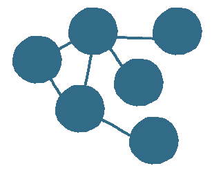
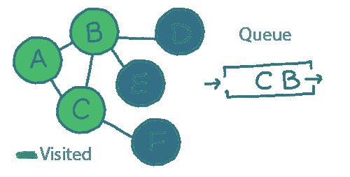
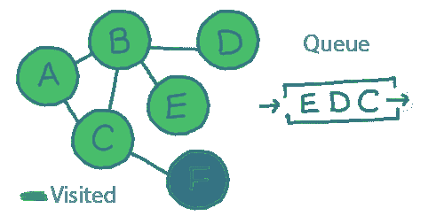
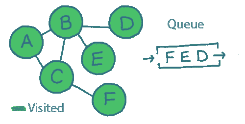
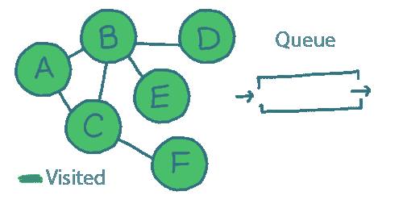

# 什么是广度优先搜索？

> 原文：<https://javascript.plainenglish.io/what-is-a-breadth-first-search-f42652896d7c?source=collection_archive---------21----------------------->

## 对广度优先搜索的深入研究。

Photo by [James Harrison](https://unsplash.com/@jstrippa?utm_source=medium&utm_medium=referral) on [Unsplash](https://unsplash.com?utm_source=medium&utm_medium=referral)

广度优先搜索和深度优先搜索是我们在处理图形时最常用的两种算法。

在这里，我们将看看第一个，广度优先搜索。

# 我为什么要在乎？

作为你选择的语言的一部分，很多算法已经为你实现了。这意味着学习它们很有趣，但是你很少自己写。

图的遍历算法是不同的。

我们无时无刻不在使用图形，从在电子商务应用程序中链接相关产品，到在社交网络中映射人们之间的关系。

搜索一个图不仅在理论上有用，而且在实践中你几乎肯定也需要这样做。

# 在 5 分钟或更短时间内:

下面是一个图形数据结构:

图(A-F)中的“节点”称为“顶点”。每个顶点通过“边”连接到一个或多个其他顶点，边是节点之间的线。

但是一个图只有在我们可以用它做一些事情的时候才有用；我们可能想要找出某个元素是否存储在我们的图中，或者在两个元素之间需要多少“跳”。

这类问题被称为“图遍历”，而“广度优先搜索”(或“BFS”)是一种算法。

让我们来看看…

# 广度优先搜索的工作原理

在上一期中，我们看了“队列”数据结构。

你会记得这是一个“先进先出”的数据结构；要添加的第一个元素是要处理(或“出列”)的第一个元素。如果你是最后一个，你会被最后处理:

我们将使用队列来实现广度优先搜索(BFS)。

这是 BFS 算法:

*   从队列中拉出下一个“顶点”
*   对于连接到这个顶点(我们还没有访问过)的每个顶点，将其标记为“已访问”并将其添加到队列中
*   重复直到队列为空

通过这样做，我们从起点向外辐射。首先访问直接连接到起点的所有节点。然后，访问连接到*和*的所有节点，等等。

随着我们工作的进行，这将变得更有意义…

# 实施 BFS

我们从选择一个地方开始，我们将选择`A`。

因此，第一步是将`A`添加到队列中，并将其标记为‘visited’:

您会记得 BFS 算法要求我们重复以下步骤，直到队列为空:

从队列中拉出下一个顶点。

对于连接到这个顶点(我们还没有访问过)的每个顶点，将其标记为“已访问”，并将其添加到队列中。

`A`是队列中的第一个(也是唯一的)元素。

`A`连接到`B`和`C`。我们还没有访问过其中的任何一个，所以我们将它们添加到队列中，并将其标记为已访问:

现在，我们再次重复同样的事情。

队列中的下一个。

`B`接`A`、`C`、`D`和`E`。我们已经访问过`A`和`C`，所以我们只对`D`和`E`进行排队(并标记为已访问):

你大概可以看到这将走向何方…

接下来，我们出列`C`。连接到`A`、`B`和`F`。唯一一个我们还没有访问的是`F`，所以我们将它添加到队列中，并将其标记为‘已访问’:

我们现在在队列中剩下`F`、`E`和`D`...

我们将依次让它们出列，寻找我们还没有访问过的任何连接的顶点——但我们不会找到任何顶点。

检查完每个节点后，队列为空，我们就完成了，我们已经访问了每个节点:

# BFS 的应用

这一切都很好，但是我们用它来做什么呢？

假设我们正在建立一个像 LinkedIn 这样的社交网络。

在这种情况下,“图”是人与人之间所有联系的地图。

如果我们想知道“鲍勃”是否通过一个或多个共同的朋友认识“珍妮”，BFS 将是一个很好的选择。

我们将从鲍勃开始，向外辐射，直到我们找到珍妮(或者直到我们离鲍勃足够远，我们已经放弃)。

或者，该图可以是地铁地图，并且“鲍勃和珍妮之间有多少共同的朋友”问题可以改为“在两个车站之间需要多少次换乘”。

一旦你学会了图形和像广度优先搜索这样的算法，很多问题就会变成这样。

# 想了解更多？

查看这些链接:

*   [图表的一般应用(不仅限于 BFS)](https://blog.finxter.com/graph-applications/)
*   [对 BFS 的另一种描述](https://www.tutorialspoint.com/data_structures_algorithms/breadth_first_traversal.htm)
*   [探索 BFS 的时间复杂性](https://www.khanacademy.org/computing/computer-science/algorithms/breadth-first-search/a/analysis-of-breadth-first-search)

*更多内容请看*[***plain English . io***](http://plainenglish.io/)*。报名参加我们的* [***免费周报***](http://newsletter.plainenglish.io/) *。在我们的* [***社区***](https://discord.gg/GtDtUAvyhW) *获得独家获得写作机会和建议。*