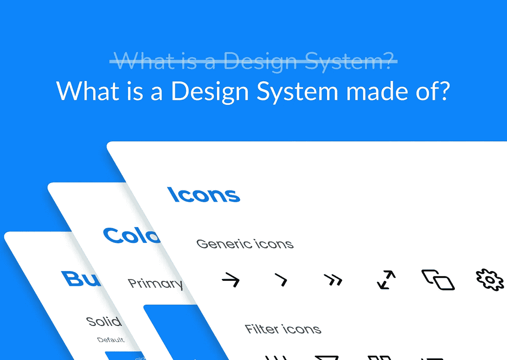

# “什么是设计系统？”是个错误的问题

> 原文：<https://javascript.plainenglish.io/what-is-a-design-system-is-the-wrong-question-6b82cc7c661c?source=collection_archive---------17----------------------->

## 问问你自己:“设计系统是由什么构成的？”

What is a Design System made of?

大家好，我叫 Mauro Erta，是 VLK 工作室的一名软件开发人员。
在过去的几年里，我有机会为不同的公司构建一些设计系统，并构建了一个名为 [**Morfeo**](https://morfeo.dev) 的[库](https://github.com/morfeojs/morfeo)，它可以帮助你构建自己的设计系统。在这篇文章中，我想和你分享我从那些经历中学到的东西。

## 目录

[问题:开发者驱动的设计系统](#8c6f)
[错误问题:什么是设计系统？](#2ff3)
[正题:设计系统是由什么构成的？](#5a23)
∘ [设计语言](#5ef2)
∘ [设计工具包](#d1e6)
∘ [组件库](#c0f1)
∘[d̶e̶v̶e̶l̶o̶p̶e̶r̶沙盒](#1bd5)
∘ [文档](#51a6)
∘ [治理模型](#890c)
[dividi et impera](#2920)
[ⓜ️morfeo](#5e0e)
[👋感谢阅读](#5f51)

# 问题:开发者驱动的设计系统

在过去几年组件库的开发和重构中，我注意到一个反复出现的模式:

***很多时候，设计系统是开发者做的，是为开发者做的；***

老实说，我甚至不认为这种东西是设计系统，它们是重用组件和通用规则的一种尝试，但是以一种混乱的方式，结果相当糟糕。我喜欢称它们为“**开发者驱动的设计系统**”(简而言之就是 **DDDS** ，或者如果你是任天堂的粉丝，就称之为 **3DS** )。

想想就觉得很奇怪——一个设计系统应该是(至少)设计师和开发者**协作**的结果；相反，DDDS 是缺乏协作的结果，他们越成长，团队之间的交流就越困难。

在 **DDDS，**每当 UI/UX 团队提出一个新的设计，结果总是这样:

The result of lack of communication.

没错。可用的组件不能代表新的布局，所以你必须构建新的组件或更新一些现有的组件，你知道这意味着什么:**噩梦**和大量的错误和回归。

如果这样的事情发生在我们的项目中，我们应该停下来，问问我们自己:
-我们的组件库怎么可能如此脆弱？
-这怎么可能，设计团队要求更新这个**很难正确实现**？

答案相当简单:**缺乏沟通！**

这是谁的错？设计师？开发商？两个都怎么样！

缺乏沟通的罪恶感总是会被分担的！

我希望这篇文章不仅能让*开发者受益，也能让*开发者受益；如果你是一名设计师，你认为你的应用程序/网站设计中的所有不一致之处都是由无能的开发者造成的，我有话要告诉你:

对于这种情况，你可能比(最终无能的)开发人员自己更有责任，原因很简单:你知道设计！

我说的“*你懂设计*”是什么意思？
我的意思是一个好的设计要*沟通*，像一个*语言*，所以我的问题是:**你的语言在哪里？**你曾经**教过**这种语言给你的团队吗？如果答案是否定的，那么我是对的，你要为你目前的混乱局面负责。

# 错题:什么是设计系统？

如果你在[谷歌](https://letmegooglethat.com/?q=Design+System)上搜索，或者在 [Medium](https://medium.com/search?q=design%20system) 上搜索，你可以找到大量不同的定义，为什么会有这么多？因为这不仅仅是一件事。

我会尽可能给出最简单、最简短的定义:

***一个设计系统是你的应用程序的视觉行为的真实来源。***

你对这个定义满意吗？我花了 15 分钟思考这个问题，即使我认为它是正确的，我也不认为它能帮助任何人理解这个观点。

如果问题只是…错了呢？
一个设计系统不仅仅是一件事，而且**也不是一个人**做出来的。
这是由不同的人用不同的技术制作的一套不同的零件。那么，为什么我们要试图找到一个单一的定义呢？如果你真的想了解它是什么，并最终建立自己的，不如**着眼于大局！**

Focus on the big picture

# 正确的问题:设计系统是由什么组成的？

我认为 [Rangle.io](https://medium.com/u/e98614aeb948?source=post_page-----6b82cc7c661c--------------------------------) 的人在描述设计系统的各个部分方面做得非常出色，我完全同意他们在这篇文章中所写的[，在这里我将简单介绍一下，并给出我的观点；
但无论如何，我强烈推荐阅读原文！](https://rangle.io/blog/the-six-pieces-of-a-design-system)

Rangle 建议将设计系统的概念分成 6 个不同的部分:

1.  **设计语言**
2.  **设计套件**
3.  **元件库**
4.  **开发者沙盒**
5.  **文档**
6.  **治理模式**

## 设计语言

就像我之前说的，一个好的设计应该是交流的，就像语言一样。
设计语言是你全新设计系统的起点，它包含了**颜色**、**间距**、**渐变**、**阴影**……所有其他部分都将基于设计语言，它的正确实现将确保**一致性**和**和谐**围绕你的应用。

从应用的角度来看，设计语言通常被称为“**主题**”，可以用一个遵循[系统 UI 规范](https://system-ui.com/theme/)的对象来描述。

## 设计套件

由设计者制作，它是应用程序所有 UI 元素的集合，这些组件由**严格按照**设计语言制作。
构建设计套件最常用的工具有 [**Figma**](https://www.figma.com/) ， [**Sketch**](http://Sketch) ，或者 [**Adobe XD**](https://www.adobe.com/it/products/xd.html) 。

## 组件库

它由开发人员制作，是设计套件的**实现。** 简而言之，它是组成用户界面的一组真实元素，必须是设计工具包的一对一表示，当然，它也严格遵循设计语言。

组件库通常由 [React](https://it.reactjs.org/) 、 [Vue](https://vuejs.org/) 、 [Angular](https://angular.io/) 、[svelite](https://svelte.dev/)或 [Web 组件](https://developer.mozilla.org/en-US/docs/Web/Web_Components)组成。

## D̶e̶v̶e̶l̶o̶p̶e̶r̶沙盒

在这里，您可以*直观地*测试组件，更具体地说，您可以孤立地查看它们，摆弄它们及其属性，并查看它们在不同屏幕尺寸或颜色模式下的外观。
沙箱是组件库的游乐场，也是了解它在真实环境中表现的最快方式。

创建和维护沙箱最著名的工具是 [**故事书**](https://storybook.js.org/) **。**

ed: Rangle 称这部分为“开发者沙箱”，但我更喜欢称之为“沙箱”,因为我认为让设计师也能玩沙箱真的能帮助他们理解组件库的状态，用它能做什么，以及它是否遵循设计工具包。

## 证明文件

*没有控制，权力什么都不是*

好的文档包含对每个组件的描述，描述它们的功能、用例以及与其他组件的关系。它还应包含更高层次的信息，以明确设计系统的**意图**，其**理念**，以及确保布局构图中**和谐**的**规则**。

编写和维护文档的好工具有[**【git book】**](https://www.gitbook.com/)、 [**【合流】**](https://www.atlassian.com/software/confluence) 、 [**概念**](https://www.notion.so/) ，或者，对于完全专用的网站， [**Docusaurus**](https://docusaurus.io/) 和 [**Nextra**](https://nextra.vercel.app/) 。

## 治理模式

如任何产品、软件或硬件，设计系统也需要维护和持续的支持。了解设计系统应该如何更新，问题应该如何报告，如何修复错误，以及新人如何准备开始使用设计系统本身是很重要的。

将设计系统视为不同部分的组合有助于更好地理解本文的主要概念:设计师和开发人员之间的交流将决定设计系统的成功和失败。

Let our powers combine!

然而，这种合作不应该被视为每个团队责任的延伸，相反，完全相反！

# 分割和不分割

将设计系统划分为 6 个部分也有助于理解不同团队之间应该如何交互:
**设计语言**和**设计工具包**由设计团队制作，**组件库**和**(开发者)沙箱**则由开发者负责，而**文档**和**治理模型**将接受每个团队的贡献。

这就是我最初想到 DDDS 的原因:

***很多时候，设计系统是开发者做的，是为开发者做的；***

我认为现在很清楚将设计系统视为不同部分的组合是多么重要，这样也更容易划分其实施的责任，并促进成功的合作。

在应用这些概念时，我们都看到了令人难以置信的改进和令人印象深刻的优势:

1.  **贯穿整个应用程序的和谐**:新的布局和组件，因为它们是按照**设计语言、**创建的，所以彼此是一致的，即使它们是由不同的工程师团队制作的；
2.  干净的代码:清晰简洁的文档、严格的类型检查和测试极大地提高了代码的质量和可维护性；
3.  **团队之间的交流:**设计和开发团队紧密合作。共享一种公共语言(设计语言)有助于团队更快地交流，但也使独立工作更容易，因为设计工具包和组件库共享相同的核心价值；
4.  **性能:**制作新的布局变得像玩乐高一样，组件完美地装配在一起，不再需要做任何“破解”或重构来实现新的功能；
5.  **学习曲线:**适应一个大的代码库从来都不容易，但是良好的文档和过程的标准化使得新人可以在几天内准备好整个项目，而不是像过去那样需要几周；
6.  **可扩展性:**不仅实施新布局所需的时间减少了，而且更新现有布局更容易、更快，使项目发展速度比以往更快！

正如你所看到的，现在我们的应用程序看起来不错的事实只是整个公司受益的过程的一个副作用！

我认为这种情况的原因应该在古老但黄金的概念" **Dividi et impera** "中找到，在这种情况下，将设计系统拆分成可以由专业团队通过优化**和**思考的部分，同时共享相同的目标。****

# ⓜ️**莫菲奥**

我想通过介绍 [**Morfeo**](https://morfeo.dev/) 来结束这篇文章，这是一套帮助你构建设计系统的工具和库。

可以将 Morfeo 与任何 [**框架或者库**](https://morfeo.dev/docs/Features/framework-agnostic) **集成。使用它你可以创建与设计语言(主题)严格相关的风格和组件；支持**，支持**[**易测试**](https://morfeo.dev/docs/Features/easy-to-test) 。
此外，通过 [**浏览器扩展**](https://morfeo.dev/docs/Features/web-extension) ，您可以直接在浏览器中获得一个自动生成且始终可用的开发者沙箱。免费的。******

**Morfeo 仍处于测试阶段，我们正在开发一些很酷的新功能，以便尽快投入生产，但如果你对它感兴趣，你可以在这里找到你想要的所有信息:**

 **[## 主页| Morfeo

### 你丢失的主题系统

morfeo.dev](https://morfeo.dev/)** 

**如果你想帮助我们并为这个项目做贡献，这里是 Github 页面(它是完全开源的):**

** [## GitHub - morfeojs/morfeo: Morfeo 这是一个基于主题构建设计系统的工具。它帮助你…

### 这是一个基于主题构建设计系统的工具。它有助于你遵循设计语言和写作…

github.com](https://github.com/morfeojs/morfeo) 

并且在这里可以找到下载浏览器扩展的链接(想看的话可以直接上 Morfeo 的网站测试):

 [## 莫尔费奥

### 可视化您用 Morfeo 构建的设计系统

chrome.google.com](https://chrome.google.com/webstore/detail/morfeo/phhhjdmeicikchjnpepljcdgbmipipcl) 

# 👋感谢阅读

我对任何反馈都很好奇，请随时发表评论并给我你的观点，另外，如果你想分享你在构建设计系统方面的经验，我迫不及待地想知道你面临什么样的问题以及你是如何解决它们的。

如果你对 Morfeo 感兴趣，我们有一个 Discord 服务器，欢迎加入我们:

 [## 加入 Morfeo Discord 服务器！

### Morfeo 或 MorfeoJS，是一个基于单一事实来源构建设计系统的工具。| 9 名成员

不和谐. gg](https://discord.gg/5hbsKMBRBh) 

🇮🇹你是意大利人吗？这篇文章还有一个意大利语版本，[查看这里](https://medium.com/vlk-studio/cos%C3%A8-un-design-system-%C3%A8-la-domanda-sbagliata-eb29fec7e633?sk=6b7dd48912d1b5bfc2b98cf3f6a3a3f7)。

## 进一步阅读

 [## 如何改进设计者和开发者的合作

### 随着远程/在家工作作为新的现状的出现，人员和预算紧缩，以及永恒的…

简明英语. io](https://plainenglish.io/blog/how-to-improve-designer-developer-collaboration-with-lifecycle) 

*更多内容请看*[***plain English . io***](https://plainenglish.io/)*。报名参加我们的* [***免费周报***](http://newsletter.plainenglish.io/) *。关注我们关于*[***Twitter***](https://twitter.com/inPlainEngHQ)*和*[***LinkedIn***](https://www.linkedin.com/company/inplainenglish/)*。加入我们的* [***社区不和谐***](https://discord.gg/GtDtUAvyhW) *。***