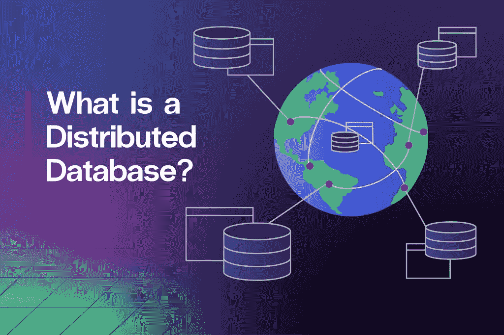
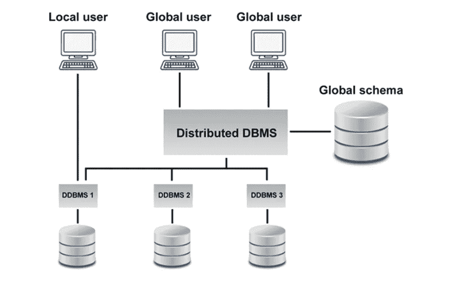
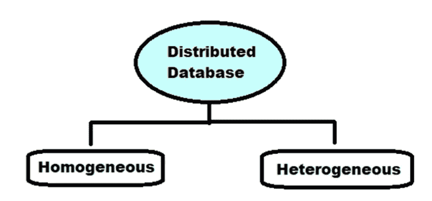

# 什么是分布式数据库？

> 原文：<https://javascript.plainenglish.io/what-is-a-distributed-database-8a54734b0dba?source=collection_archive---------23----------------------->

分布式数据库不限于单个系统，而是分散在许多地方，例如两台或多台计算机或计算机网络。分布式数据库或数据管理系统分布在几个站点上，没有共同的物理部分。

如果某个数据库需要被全球的许多个人访问，这可能是必需的。

因此，必须对其进行管理，使其作为单一数据库呈现给消费者。

分布式数据库可用于水平可伸缩性和满足负载需求，而无需更改数据库模式或垂直扩展单个系统。

分布式数据库解决了使用单个系统和单个数据库时可能出现的几个问题，包括可用性、容错性、吞吐量、延迟、可伸缩性等等。

# 为什么要使用分布式数据库？

分布式数据库在保持本地控制的同时提供了数据位置的清晰性。这意味着，即使应用程序不知道数据是什么，每个网站都可以在本地管理数据，管理安全，记录交易，并在本地网站出现问题时进行恢复。

即使与其他站点的连接中断，autonomy 仍然可用。在保存在特定位置的专用数据可能比其他数据需要更多的安全性和合规性限制的情况下，这提供了更大的灵活性。

例如，为欧盟地区的零售客户维护的客户数据必须符合 GDPR 规则。

# 分布式数据库中的数据是如何存储的？

有两种不同的方法可以将数据存储在不同的站点上，从而形成一个分布式数据库。

> ***这两种方式是——复制和碎片化。***

# 复制

数据库复制方法跨许多位置复制数据。然而，一个完全冗余的数据库存储在许多地方。数据库复制的好处是它提高了跨多个站点的数据可用性，并支持并行查询处理。

然而，数据库复制需要频繁更新并与其他站点同步，以维护一个精确的数据库副本。因此，在一方进行的任何修改都必须在其他站点复制，以避免差异。

此外，频繁的更新会增加服务器成本，并使并发管理变得复杂，因为需要在所有可访问的站点上验证许多并发查询。

# 分裂

每当涉及存储碎片的分布式数据库时，关系都是碎片化的，这表明它们被分成更小的部分。因此，需要时，每件物品都存放在不同的位置。

碎片化要求即使是碎片也可以重建成原始关系，而不会丢失数据。碎片化的好处是不会产生重复的信息，防止数据不一致。

碎片可以分为两种类型:水平碎片需要将关系模式划分为行组，每个组(元组)分配给不同的碎片。垂直分割需要将相关模型分割成更小的模式，每个元素都包含一个共享的候选键，以确保无损连接。

# 分布式数据库的类型

分布式数据库主要分为异构和同构两种类型。

# 同构分布式数据库

所有位置都在同构分布式数据库中使用相同的 DBMS 和操作系统。这些站点使用非常相似的软件，以及相同的数据库管理系统或来自同一提供商的数据库管理系统。此外，每个站点都知道许多其他站点的存在，并与它们协作来执行用户的请求。此外，可以通过单个平台访问该数据库，就像它是单个数据库一样。

同构数据库进一步分为自治和非自治两种类型。独立意味着每个数据库都是独立的，独立运行。管理程序将它们集成在一起，并使用消息传递来传递数据变化。

同时，在非自治环境中，数据分散在同构节点中，由中央或主 DBMS 跨位置协调更改。

# 异构数据库

异构分布式数据库中的不同位置包括不同的操作系统、DBMS 产品和数据模型。it 中的多个网站采用不同的模式和技术。例如，系统可能有许多关系型、网络型、层次型或面向对象的 DBMSs。另一个特点是，由于模式的差异，查询执行很复杂。由于软件的差异，交易处理很复杂。例如，因为一个站点可能不知道许多其他的网站，所以在处理用户请求时只有有限的协调。

联合和非联合异构分布式系统是另外两个类别。在联邦数据库中，异构数据库系统是自治的和连接的，因为它们作为一个单一的数据库系统工作。相比之下，通过非联合数据库中的中央协调单元可以访问数据库。

# 分布式数据库的优势

> 随着数据成为我们日常生活中更重要的一部分，分布式数据库是任何组织信息架构的基础。

**例如**，在大多数情况下，使用 web 服务器或移动电话应用程序的最终用户可能看不到分布式数据库的运行——正是分布式数据库在后台极其努力地工作，为这些用例提供了动力。

分散数据库给游戏带来的主要优势是改进的性能、巨大的可伸缩性和全天候的可靠性。

# 不同数据库的可用性

企业每天都会产生数 Pb 的数据。然而，并不是所有的数据库都能提供必要的灵活性、可用性和可伸缩性来满足不断增长的数据存储和访问需求。

分布式数据库将文档和数据保存在同一网络或其他网络中的多个物理位置。可伸缩性允许分布式数据库系统让您适应和满足不断增长的数据需求。例如，分布式数据库使用位于不同位置的多台机器，而不是将存储空间和事务处理限制在一个系统中。这提高了速度、数据恢复和客户体验。

HarperDB 是可用于分布式数据存储的顶级数据库之一。

# 什么是 HarperDB？

HarperDB 是一个分布式数据和应用开发平台，支持 SQL 和 NoSQL。它是完全索引的，不复制数据，可以在从边缘到云的任何系统上使用。

通过自定义功能和微服务架构，HarperDB 易于使用和集成。该数据平台正在帮助组织降低全球基础设施的成本，同时提供低于 10 毫秒的延迟。

> ***HarperDB 旨在通过将两者的最佳特性结合到一个平台中来支持两种 SQL & NoSQL 用例。***

此外，它还具有独特的集群技术，用于在 HarperDB 节点之间复制数据。它允许表级别的发布-订阅配置，因此您不需要将所有数据迁移到所有节点。例如，数据、子集或表的某些部分可以驻留在边缘服务器上，云可能包含所有内容。那么另一个边缘节点可能具有不同的数据子集。因此，它的效率令人难以置信，几乎可以处理你能想到的任何数据结构。

# HarperDB 有什么特点，有什么不同？

为了支持复杂的 SQL 查询，大多数 NoSQL 数据库使用多模型架构。在幕后，多模型相当于运行两个独立的数据库。然而，HarperDB 通过高性能单一模型数据存储支持 SQL 和 NoSQL 用例。借助自定义函数支持的灵活的用户定义 API 和简单的 HTTP/s 接口，您可以在一个地方构建整个应用程序，HarperDB 可随您的应用程序从概念验证扩展到生产。

**Harper db 的几个特性使其成为开箱即用的分布式数据库解决方案**:

# *完整索引

因为它的存储引擎根据分解模型独立存储属性，所以特性(或列)在写入时形成索引。在写的时候所有的特征都被编入索引。

# *分解模型

内存引擎使用“分解模型”，即开箱即用的存储模型。当它读取一个记录时，它立即将它分成不同的属性，将特征和相关值分别保存在光盘上。此外，它使用所需的哈希值连接特征。这就是允许它作为一个 NewSQL 数据库的原因。

# *自定义功能

通过自定义函数，您可以在 HarperDB 中定义自己的 API 端点。通过将预配置的 Fastify 服务器集成到 HarperDB 中，用户可以定义他们的路线和处理程序——无需依赖、配置和命令行配置。这消除了从 API 到数据库的第二个连接，有利于直接连接到数据层，这可以将往返 API 延迟减少 50%。

# *动态模式

它不会将数据保存为文件或表格形式；相反，它将每条记录分解成单独的属性(或列),并将它们离散地存储在磁盘上。如果搜索包括新属性，则每次新写入时，将立即为值为 0 的任何表条目定义属性。这就是动态模式的意义所在。

# *程序员友好

使用 HarperDB 的一个好处是，它对程序员友好，以开发人员体验为重点。它被设计成一组微服务，您可以通过 API 请求执行不同的数据库操作。它的设计还允许您处理 SQL 和 NoSQL 查询。由于其 REST 设计用于处理数据库，任何开发人员都可以很快适应 HarperDB。还有许多适配器/驱动程序/客户端可用于不同的语言，有了它们，你可以很快上手。

# 结论

最后，您可能已经从本文中了解到，数据库是一个有组织的信息集合。

数据库大致分为两种类型:分布式数据库和集中式数据库。分布式数据库解决了使用单个系统和单个数据库时可能出现的几个问题，例如可用性、容错、吞吐量、延迟、可伸缩性等等。

例如，分布式数据库是由位于同一网络或完全不同的网络上的多台计算机或多个位置上的两个或多个文件组成的一种类型。这些位置没有共享物理组件。

使用分布式数据库有几个好处。可用性、可靠性和更快的反应时间就是几个例子。像 HarperDB 这样的分布式数据库也通过减少所需的服务器和系统数量以及消除昂贵的维护需求来降低成本。如果您想了解更多关于不同数据库架构及其用例的信息，[请阅读本文](https://harperdb.io/blog/database-architectures-use-cases/)。

感谢您成为我们的普通读者；你是我与你分享我的生活/工作经历的主要原因之一。

关注我的 [Twitter](https://twitter.com/TheAnkurTyagi) 以获取更多可操作的内容。

*原载于 2022 年 8 月 24 日*[*https://Harper db . io*](https://harperdb.io/blog/what-is-a-distributed-database/)*。*

*更多内容看* [***说白了。报名参加我们的***](https://plainenglish.io/) **[***免费周报***](http://newsletter.plainenglish.io/) *。关注我们关于* [***推特***](https://twitter.com/inPlainEngHQ) ，[***LinkedIn***](https://www.linkedin.com/company/inplainenglish/)*，*[***YouTube***](https://www.youtube.com/channel/UCtipWUghju290NWcn8jhyAw)*，以及* [***不和***](https://discord.gg/GtDtUAvyhW) *。***