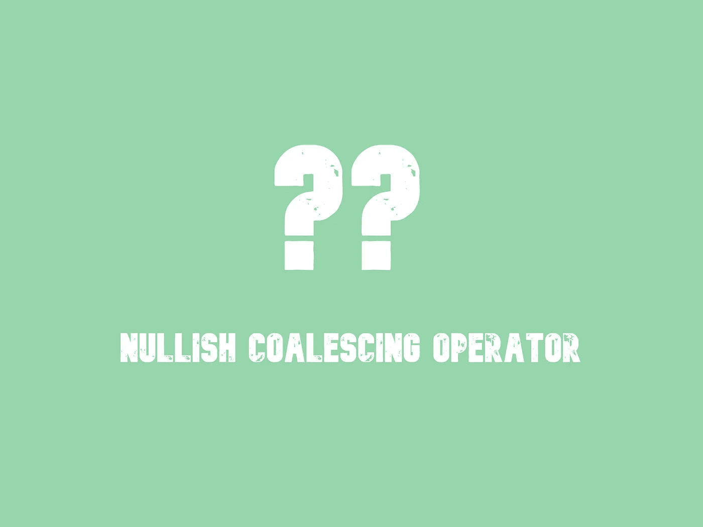

# 什么是零化凝聚运算符(？？)在 JavaScript 中？

> 原文：<https://javascript.plainenglish.io/what-is-a-nullish-coalescing-operator-in-javascript-8012bf3e7525?source=collection_archive---------5----------------------->

## 什么零化合并运算符(？？)是以及如何使用。

nullish 合并操作符是一个逻辑操作符，它非常强大，在某些情况下可以让我们的生活变得更加容易。有了这个，我们就能写出最高效的逻辑。



ES11 引入了由双问号(`??`)表示的 nullish 合并运算符。

## 语法:

运算符写成两个问号`??`。

***无效合并运算符*** 的语法是，

```
leftExpr ?? rightExpr
```

以下是如何使用运算符的示例:

```
const baz = 0 ?? 42;console.log(baz);
// expected output: 0null ?? 'test' // returns 'test'
undefined ?? 56 // returns 56
null ?? 0 // returns 0
45 ?? 25 // returns 45
```

## 它是如何工作的？

考虑下面的运算符示例。nullish 合并运算符是一种逻辑运算符，它接受两个值:

```
const result = value1 ?? value2
```

如果第一个值(`value1`)是`null`或`undefined`，上面的语句将返回第二个值(`value2`)。否则，它将返回第一个值(`value1`)。

从技术上讲，上述逻辑等同于以下块:

```
const result = value1;if(result === null || result === undefined) {
   result = value2;
}
```

换句话说，

让我们假设`null`和`undefined`在这个上下文中是相似的，并假设'*定义的*不是`null`或`undefined`

我们可以这样定义我们的例子，

`value1 ?? value2`的结果是，

*   如果`value1`是*定义的*，则返回`value1`
*   如果`value1`不是*定义的*，则返回`value2`

让我们看看更多的零化合并运算符的例子。

在下面的例子中，第一个值是`null`,第二个值是字符串。因为第一个值中有`null`，所以返回第二个值(`‘default string’`)。

```
const nullValue = null;
const foo = nullValue ?? ‘default string’;console.log(foo);
// expected output: “default string”
```

让我们再看一个返回第一个值的例子。

```
const someNumber = 42;const valC = someNumber ?? 0;console.log(valC);
// expected output: “42”
```

因为我们在第一个字符串中有一个数字，所以返回第一个值(`someNumber or 42`)。

考虑下面的例子，注意第一个值需要是`null`或`undefined`，以便`??`操作符返回第二个值。不考虑空字符串或 0。

```
const emptyText = ""; // falsy
const valB = emptyText ?? "default for B";console.log(valB); // "" (as the empty string is not null or undefined)
```

## 与逻辑 OR (||)运算符有何不同？

OR `||`运算符的使用方法与`??`相同。对于上面的例子，我们可以得到相同的结果。

但是，

`||`和`??`有一个区别。

*   `||`返回第一个*真值*值。
*   `??`返回第一个*定义的*值。

换句话说，`||`不区分以下值(falsy)

*   `false`
*   `0`
*   一个空字符串(`“”`)
*   `null`
*   `undefined`

它们被称为——[*falsy*](https://developer.mozilla.org/en-US/docs/Glossary/Falsy)值。如果其中任何一个是`||`的第一个参数，那么我们将得到第二个参数作为结果。

```
0 || 2 // returns 2
0 ?? 2 // returns 0
```

然而，`??`只考虑`null`和`undefined`不同于`||`

## 结论:

这就是`??`运算符的工作方式。如果您在代码中使用了该运算符，请在下面添加注释。谢谢你。

*更多内容请看*[***plain English . io***](https://plainenglish.io/)*。报名参加我们的* [***免费周报***](http://newsletter.plainenglish.io/) *。关注我们*[***Twitter***](https://twitter.com/inPlainEngHQ)*和*[***LinkedIn***](https://www.linkedin.com/company/inplainenglish/)*。查看我们的* [***社区不和谐***](https://discord.gg/GtDtUAvyhW) *加入我们的* [***人才集体***](https://inplainenglish.pallet.com/talent/welcome) *。*