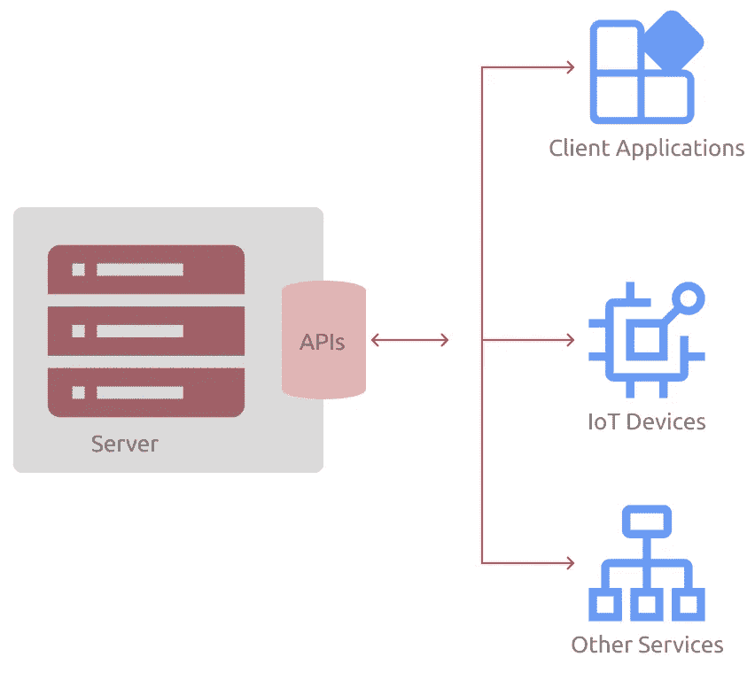

# 什么是 API？

> 原文：<https://javascript.plainenglish.io/what-is-an-api-b53f95aa79a7?source=collection_archive---------9----------------------->

## 了解什么是 API，有哪些不同类型的 API。

Photo by [NASA](https://unsplash.com/@nasa?utm_source=medium&utm_medium=referral) on [Unsplash](https://unsplash.com?utm_source=medium&utm_medium=referral)

应用程序编程接口或 API，这是每个开发人员都听过和使用过的术语。从发送 WhatsApp 信息到播放 YouTube 视频，每个应用程序都使用 API。您可能很难找到任何使用互联网而不使用 API 的应用程序。所以，你可能想知道，“这些 API 是什么？”

# 什么是 API？

API 只是帮助两个服务器应用程序(后端)或一个客户端应用程序(前端)和一个服务器应用程序进行通信的代码片段。这种通信对于任何现代应用程序的工作都是必不可少的。因此，API 被认为是最新软件和/或服务的支柱。

如果要我用简单的话来说 API 是做什么的，我会说，API 只是按需返回某种数据的服务。这些数据可以是任何东西，如图像文件、声音文件、原始文本等。

The basic working of an API

在这里，我已经说明了 API 如何工作的基本架构概述。正如我前面提到的和图片中显示的，任何系统、服务和软件都可以使用 API。

# 解释 API 如何适用于 7 岁儿童

让我们假设为我们提供 API 的服务器是一家比萨饼店。现在，当我们想要一种特定的比萨饼时，我们该怎么做呢？

*对！我们叫一个服务员，要么要一份菜单，要么再点一份比萨饼。*

API 也是如此。我们调用一个 API 端点，请求它为我们获取一些数据或验证一些数据。

那么，在一个请求被满足后，现在做什么呢？

*正确！我们要么要一张支票，要么要更多的比萨饼。它可以是相同或不同种类的比萨饼。*

现在，让我们在一个 API 的上下文中来看看这个。在一个请求被服务之后，我们可以什么都不做或者请求 API 去做另一个任务(我们可以什么都不做意味着不需要另一个请求)。

在大多数地方，我们可以订购定制的披萨，而不是固定的披萨。

我们也可以对 API 做同样的事情。如果 API 有能力，我们可以请求特定的数据(定制的数据)或者操作特定的数据。例如，我们可以请求具有特定 ID 的用户数据，而不是请求所有用户数据。或者我们可以请求 API 删除具有特定 ID 的用户的数据。有些 API 提供某些功能，而有些则不提供。这完全取决于 API 是如何设计的。

*这只是一个顶层解释。在现实生活的 API 中，许多事情都是在底层发生的，我们可以在另一个博客中讨论。*

# API 的类型。过去，现在和未来！

纵观 API 的历史，主要有三种。

1.  远程过程调用
2.  简单对象访问协议
3.  REST(代表性状态转移)

**RPC** 或**远程过程调用**API 似乎是最**简单而古老的**API。通常，RPC 要求开发人员或客户在服务器上运行一段代码。RPC-style 使得开发人员可以轻松地在一台服务器上创建和调用多个程序和服务。如今，你不会看到 RPC APIs 有太多的用途。RPC APIs 有两个子类型:

*   XML-RPC:XML-RPC 基本上是一个 RPC API，编码为返回 XML 格式的数据。
*   JSON-RPC:JSON-RPC 基本上是一个 RPC API，被编码为返回 JSON 格式的数据。

**SOAP** 或**简单对象访问协议**使用 XML 格式通过超文本传输协议(HTTP)传输数据。SOAP 使用 Web 服务定义语言(WSDL)来发布其接口的定义。在 REST APIs 出现之前，SOAP 在 API 的创建方式上占据主导地位。SOAP 是第一个可以在任何操作系统上创建和调用的 API 协议，二十年前，这是一件大事。

**REST** 或**表述性状态转移**是一个现代的 web 服务 API。REST 遵循一种架构风格，而不是通用的协议风格。这种风格的主要好处是它分离了消费者和提供者。这意味着，由于它的架构风格，消费者可以使用它而不用担心它的底层协议。REST APIs 支持 JSON 和 XML 格式。但是大多数开发人员更喜欢 JSON 格式，因为它易于使用和阅读。目前，REST 是最流行的 API 类型。如果你研究一下，你会发现网飞、亚马逊、谷歌或任何其他大型科技公司都在他们的产品中使用 REST APIs。

# API 的可访问性

不是每个 API 都是公共 API。还有许多私有的和合作的 API。**公共 API**是世界上任何人都可以访问的 API。它可以是免费的，付费的或基于订阅的。私有 API 可以由组织开发供内部使用。私有 API 可以用在对公众开放的产品中。**合作伙伴 API**是一类 API，其访问权限仅限于某些用户，或者这些 API 只能用于某些应用程序或服务。例如，Twitter API 是一个公共 API。但是，Twitter 可能会使用一些 API 来完成一些内部任务。现在，如果某个组织创建了一些只能与其他组织的某些服务一起使用的 API，那么它将被称为合作伙伴 API。

# API 的一般用途和 API 的基本功能

作为一名开发人员，我们为许多目的和许多用例使用和开发 API。这些使用案例包括:

1.  从服务器(数据库)获取数据
2.  向数据库添加数据
3.  更新数据库中的记录(数据)
4.  删除数据库中的记录
5.  验证用户或进行身份验证
6.  请求其他服务执行某些操作

***注:*** 根据 [RapidAPI](https://rapidapi.com/blog/api-glossary/endpoint/) 的说法，API 端点是两个系统交互时，一个通信通道中的入口点。这意味着 API 端点是一个 URI，通过它您可以访问 API 或与服务器通信。

# 结论

现在，有很多关于 API 的东西只有通过编写代码才能理解。可能有许多其他类型的 API，也可能有许多我可能错过的功能。在评论区提到我可能错过的一切。这样别人才能了解和理解。

就这样。感谢您的阅读。希望现在你知道了**什么是 API？**

如果你喜欢这个博客，请在评论区告诉我。如果你需要任何帮助或者想讨论什么，请告诉我。在 Twitter 或 LinkedIn 上联系我。你可以看看我其他的博客。

> **想了解更多信息？**
> 
> 注册我的[时事通讯](https://bit.ly/3Menk8Q)，把最好的文章放进你的收件箱。

看看我的其他博客

 [## Python 中的请求库

### 了解如何使用 Python 中的请求库与 API 进行通信。

levelup.gitconnected.com](https://levelup.gitconnected.com/requests-library-in-python-32cfb7da0a30)  [## 使用 JavaScript 通过三个清晰的步骤获得 Twitter API 的最佳途径

### 关于如何用 JavaScript 从 Twitter API 获取数据的初学者指南。

javascript.plainenglish.io](/best-path-to-twitter-api-using-javascript-3-clear-steps-ca3eba503115) 

*更多内容请看* [***说白了就是***](https://plainenglish.io/) *。报名参加我们的* [***免费每周简讯***](http://newsletter.plainenglish.io/) *。关注我们*[***Twitter***](https://twitter.com/inPlainEngHQ)*和*[***LinkedIn***](https://www.linkedin.com/company/inplainenglish/)*。加入我们的* [***社区不和谐***](https://discord.gg/GtDtUAvyhW) *。*