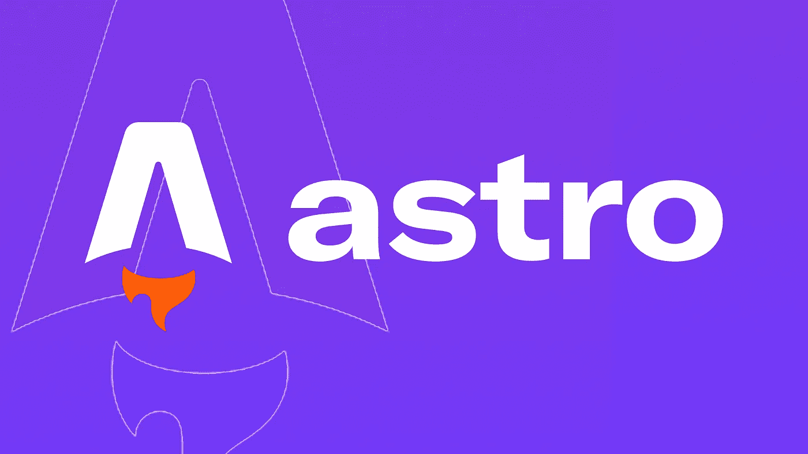

# 什么是阿童木？

> 原文：<https://javascript.plainenglish.io/what-is-astro-aa3369d5a7f4?source=collection_archive---------5----------------------->

## 为什么你应该考虑在你的下一个项目中使用这个“JavaScript 框架”。

## 为什么你应该考虑在下一个项目中使用 Astro

什么是阿童木？我指的是几件事:Astro 是干什么的？什么时候使用 Astro 是个好主意？什么时候不是呢？它试图解决什么问题？换句话说:Astro 的*为什么* …正如法国人所说的，它的“存在理由”是什么？

从定义什么是*而不是*开始可能更容易。

Astro 是一个 JavaScript 框架……但是我不太愿意这样称呼它。为什么？因为人们会立即认为这意味着前端框架。旨在作为反应等的替代物的一种。

阿童木是另一回事。它与前端框架*协同工作，而不是竞争。*

它也不打算与 Next.js 或 Remix 竞争，尽管这两家公司确实处理类似的用例。

令人耳目一新的是，听到创造者说，不，他们不想满足每一个需求。不，有些情况下 Astro 并不适合手头的工作。

因为阿童木是…一种工具。一个针对特定用例的工具:发布以内容为中心的网站。

那是什么意思？为了理解这一点，我们将讨论 Astro 的特性、优点和缺点，例如:

*   Astro 的老派页面渲染模型(以及 Astro 的目标用例)
*   Astro 的开发者体验或 DX
*   Astro 的“你可以选择加入的复杂性”
*   Astro 如何创建加载速度快的页面
*   和“互动岛”模型

但是首先，让我们看看渲染模型。

# SPA vs MPA？

React 等前端框架，将 HTML 渲染委托给浏览器。这允许更丰富的用户体验，因为状态是在客户端本地管理的。但是这是以向客户端发送更多 JavaScript 为代价的。

但是那些没有州的网页呢？所有的博客、登陆页面、新闻网站等。占了网络的绝大部分？网页关注的是内容，而不是交互性？

*那些*是 Astro 旨在服务的用例。

Astro 的目标与 React 的相反。Astro 将自己定义为“多页面应用程序”。对于任何服务器开发人员来说，这听起来像是重新发明 PHP 的 Laravel 或 Ruby on Rails。

这正是 Astro 的目标。人们评论说，在服务器上生成页面感觉过时和老派。天文小组的弗雷德·肖特回答道:

> “一点不错！这是一个很好的模型，但我们放弃了，因为开发人员的体验太差了！”

PHP 或 Ruby on Rails 甚至 Python 都需要你掌握另一门语言。Astro 使用 JavaScript，这是前端开发所需要的。

所以从某种意义上来说，Astro 是前端开发者的服务器。

# 为什么不是香草 HTML？

HTML 是用来做标记的，不是用来编程的。

Astro 带来了可重用性(通过组件)、逻辑和 JSX 式语法。(虽然不需要使用 React 的“类名”属性。)我们可以在数组上使用变量、条件和映射来给 HTML 添加逻辑。

简而言之:Astro 为 HTML 创作带来了类似 Next.js 的开发体验。

然而，它主要不是为 HTML 创作提供客户端的 T4 逻辑。

Astro 文件(即页面和组件)有两个部分。首先是服务器端代码(在两行三连字符之间，像 Markdown 上的 frontmatter)。然后是前端 HTML 代码。这允许 Astro 页面和组件从服务器上的文件中读取数据，或者从后端(比如 headless CMS)获取数据来创建页面。

Astro 还支持 Markdown 和 MDX。这意味着用户可以用“文案友好”的格式创作内容。

# 为什么不用 Next.js？

乍一看，Remix 和 Next.js 和 Astro 的作用是一样的。但是 Astro 消除了所有的前端复杂性。

为什么？因为默认情况下它不关心客户端状态。Astro 的默认行为是静态站点生成(SSG)。任何服务器端渲染(SSR)都是可选的。两者之间的选择是在部署时完成的:我们是部署到静态环境还是计算环境？

这意味着状态，无论是客户端还是服务器端，都是一个选项，而不是先决条件。Astro 去除了所有客户端 JavaScript，除非另有指示。这意味着它生成的页面很轻，加载速度很快。

# 但是我喜欢反应/苗条/固体/ Vue…！

我也是。

但更重要的是阿童木也是。

您可以将这些框架中的组件插入 Astro 页面或组件。它只需要一个导入语句

但是这里发生的事情很有趣:默认情况下 Astro **没有向浏览器**发送 JavaScript。组件本身不是交互式的。Astro 呈现组件树(服务器端)并发布结果 HTML。

基于 React 的 CMS 越来越多。Astro 去除了多余的重量，生成了可以快速加载的登录页面，使这些 CMSs 成为登录页面创建的可行解决方案。

# 但是如果我需要交互性呢…！

Astro 允许您在逐个组件的基础上选择客户端交互性。

正如我提到的，默认行为是没有交互性。但是如果你愿意或者需要，你可以选择客户端交互。Astro 随后会将相关的 JavaScript 发送给客户端。

事实上，当您希望组件变得可交互时(为了“水合”)，您可以指定*。为此，Astro 提供了一组指令。如果您希望组件在页面加载时是交互式的，那么向组件添加`client:load`指令。对于在页面空闲时加载的组件，使用`client:idle`。如果你想等待组件可见，使用`client:visible`。*

你得到了两个世界的最好的东西:快速加载和基于你的用例的优化的页面加载。

从这个意义上说，Astro 让 React 工作得更好。

# 但这是另一个框架…

在我过去几年使用的所有框架中，Astro 是学习曲线最软的一个。感觉最不像“另一个要学的框架”的那个。对我来说，这是它最大的卖点:没什么可学的。

HTML 是普通的 HTML，增加了一点逻辑和组件化。

服务器代码是基本的服务器端 JS。

这是有道理的，因为苗条、反应或坚实的创新的核心是如何管理国家。去掉国家，一切都变得简单多了。

当然，有*种*方法在不同树中的组件之间共享状态(甚至来自不同的框架！).你可以使用一种被称为*原子*的内置解决方案，也可以依靠 Svelte 或 Solid。

但是这种复杂性是可选的，取决于您的用例。

这使得 Astro 成为想要创建简单页面的人的完美平台。或者学习 HTML、JavaScript 甚至前端框架的人。

Astro 不是(还不是？)适合每一种使用情况。这很好。

但是令人惊讶的是它涵盖了如此多的用例，以及如此令人愉快的开发者体验。

而我，作为一个人，将会花更多的时间去探索这个新的…框架？工具？服务器？

*更多内容看* [***说白了就是***](https://plainenglish.io/) *。报名参加我们的* [***免费周报***](http://newsletter.plainenglish.io/) *。关注我们关于* [***推特***](https://twitter.com/inPlainEngHQ) ， [***领英***](https://www.linkedin.com/company/inplainenglish/) *，*[***YouTube***](https://www.youtube.com/channel/UCtipWUghju290NWcn8jhyAw)*，以及* [***不和***](https://discord.gg/GtDtUAvyhW) *。*