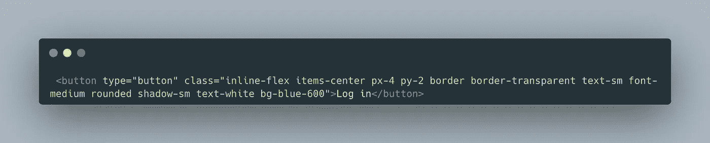
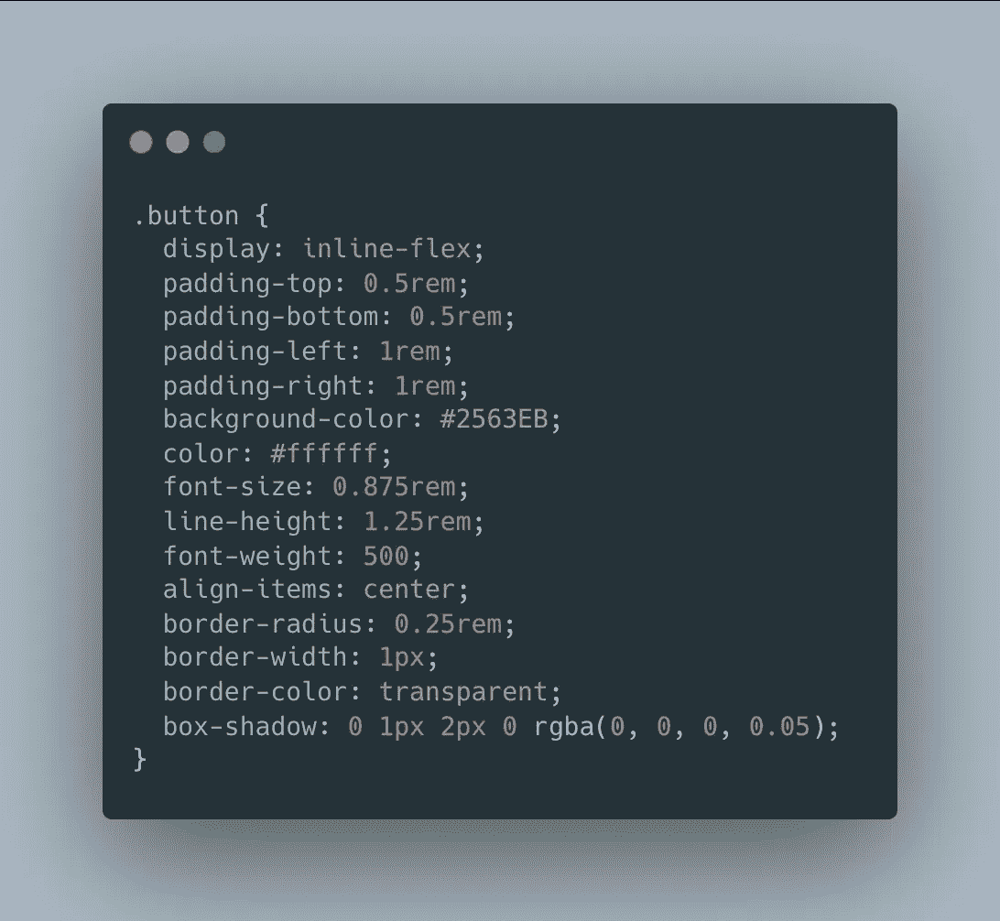

# 什么是原子 CSS？

> 原文：<https://javascript.plainenglish.io/what-is-atomic-css-6dd63fee9ef9?source=collection_archive---------8----------------------->

Photo by [Ferenc Almasi](https://unsplash.com/@flowforfrank?utm_source=medium&utm_medium=referral) on [Unsplash](https://unsplash.com?utm_source=medium&utm_medium=referral)

# 介绍

以前没听说过原子 CSS 的概念？我们先看一个例子给你一个思路。

我们将使用 Tailwind CSS 重新创建这个按钮，这是一个用于编写原子 CSS 的流行 CSS 框架。下面是我们如何使用 Tailwind 创建按钮:

如果你对这段代码的第一反应是畏缩，没关系。这很正常。说实话，原子 CSS 有时看起来非常丑陋和混乱。之所以这样看，是因为它使用了所谓的实用程序类，这些类的作用范围通常是单个属性。例如，实用程序类`inline-flex`应用值为`inline-flex`的`display`属性。现在，你可能会想:“如果我想将 flex 应用于这个元素，为什么不直接在我的 CSS 文件中修改它呢？”嗯，这是一个非常有效的方法，但是，一个原子的 CSS 方法比传统的 CSS 有很多优势。

# 优势

现在，用传统的 CSS 方法编写 HTML 和 CSS 实用程序类有什么意义呢？嗯，现代网络景观实际上非常适合原子方法。为了理解为什么，让我们想想如何使用传统的 CSS 方法来设计按钮的样式。

现在我们可以将这个 button 类应用到一个 button 元素中，我们可以开始了。如果我们想在网站上的其他地方放置另一个按钮，我们甚至可以在将来重用这个按钮类，但是当我们想创建一个不同类型的按钮时，例如一个红色的删除按钮？嗯，我们必须创建一个新的类或者使用内联样式来覆盖通用的按钮样式。然后，我们决定对原来的按钮进行更改，但我们不想更改新的删除按钮。这些小的复杂性迅速增长，使得页面的样式很难管理。改变一个元素的样式可能会产生意想不到的后果。

我们用原子 CSS 编写的样式是封装的，这意味着我们编写的任何样式都只适用于该元素。这有助于避免由于为多个元素重用类而导致的意外后果。这释放了我们必须考虑重用哪些类以及在哪里重用所带来的精神负担。原子 CSS 非常适合现代的基于组件的方法来开发 web 应用程序。当我们使用 Vue、Svelte、React 或 Angular 等框架时，我们会将应用程序分解为多个组件。直接在这些组件上编写原子 CSS 给了我们封装的好处。

# 不足之处

主要缺点是这种方法很难看。这是没有办法的。看到一个网页被 10 到 15 个实用类一个接一个地添加，是很没有吸引力的。然而，如果我们将这些实用程序类与基于组件的 web 框架结合起来，我们可以将这种丑陋的东西抽象掉一点。

有些课程很难阅读或理解，尤其是对初学者来说。对于刚开始学习 CSS 的人来说，看到名为 py-12 或 mr-3 的类可能会感到很困惑，但是对于已经掌握了一些 CSS 知识的人来说，经过一段时间熟悉实用程序类和原子 CSS 概念之后，就会变得非常直观。

# 原子 CSS 框架

有几个框架将这些原则付诸实践。这里有一些链接，你应该看看:

*   [顺风 CSS](https://tailwindcss.com/docs/installation)
*   [Windi CSS](https://windicss.org/guide/)
*   [Uno CSS](https://github.com/unocss/unocss)

[**阅读 braxtonmassengale.com**](https://braxtonmassengale.com/blog/what-is-atomic-css/)上的这篇帖子

*更多内容看* [***说白了。报名参加我们的***](https://plainenglish.io/) **[***免费周报***](http://newsletter.plainenglish.io/) *。关注我们关于*[***Twitter***](https://twitter.com/inPlainEngHQ)*和*[***LinkedIn***](https://www.linkedin.com/company/inplainenglish/)*。查看我们的* [***社区不和谐***](https://discord.gg/GtDtUAvyhW) *加入我们的* [***人才集体***](https://inplainenglish.pallet.com/talent/welcome) *。***