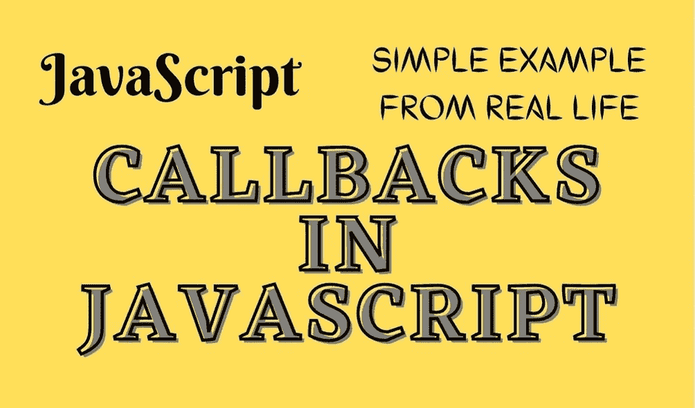

# 什么是回调&它们在 JavaScript 中是如何工作的？

> 原文：<https://javascript.plainenglish.io/what-is-callbacks-how-it-works-in-javascript-step-by-step-real-life-example-425bc277893?source=collection_archive---------12----------------------->

## JavaScript 回调的分步指南——用真实的例子解释。



有几个定义可以描述回调，让我们看看其中的 3 个。

*   回调是作为参数传递给另一个函数的函数。
*   这种技术允许一个函数调用另一个函数。
*   回调函数可以在另一个函数完成后运行。

让我们**简化那些定义**。

我将使用箭头函数而不是常规函数来解释回调，如果你不知道最流行的创建函数方法之间的区别，你可以在这里查看[](https://nissimzarur.medium.com/javascript-arrow-function-vs-regular-function-whats-the-difference-fast-understanding-cda1a162a355)*。*

*让我们看看下面的例子:*

```
*const calc = (x, y) => {
    let sum = x + y; //5 + 6
    return sum;
}const result = calc(5,6); //Will return 11.*
```

*该函数将计算`x` + `y`的和，然后将和值返回给`result`变量。从例子中我们可以看到，最终结果是 11。*

*现在，让我们创建另一个函数来将结果打印到控制台。*

```
*const calc = (x, y) => {
    let sum = x + y; //5 + 6
    return sum;
}const showResult = (result) => {
    console.log(result);
}const result = calc(5, 6); //Will return 11.showResult(result); //Will print 11 to the console.*
```

*现在我们有了函数`showResult(result)`，它接收`result`变量作为参数，打印出`calc(x, y)`函数的计算值。换句话说，我们必须等到函数`calc(x, y)`完成并返回计算值才能使用`showResult(result)`函数。*

*这是将`showResult`函数转换为回调函数的一个好点，让我们看看下面的例子:*

```
*const calc = (x, y, callback)=>{
    let sum = x + y;
    callback(sum); //Will print to the console the result.
}const showResult = (result)=>{
    console.log(result);
}calc(5, 6, showResult); //Here we add the showResult to be callback.*
```

*现在，我们将在`calc`函数结束计算后调用的函数`showResult`作为参数传递。`calc`函数中的`callback`参数现在作为`showResult`使用，期望接收一个`result`参数将结果打印到控制台。这样，我们可以确保在计算结束时打印出结果。*

*这些函数都是同步函数，**回调真正出彩的地方在异步函数**，一个函数要等待另一个函数。*

*现在我们知道了回调是如何工作的，让我们创建一个真实的例子:*

```
*const fetchMovies = (url, callback)=>{
    fetch(url)
  .then(response => response.json())
  .then(data =>{
      callback(data);
  });
}const filterMoviesById = (result)=>{
    const filteredResults = result.filter((item)=>[1,5,6,9,15].includes(item.id));

    console.log(filteredResults);
}fetchMovies('[http://example.com/movies'](http://example.com/movies.json'), filterMoviesById);*
```

*首先，我们来解释一下上面的例子。我们创建一个请求，从包含电影列表的 URL `“[http://example.com/movies](http://example.com/movies.json')”`获取数据，然后我们希望只打印 id 为[1，5，6，9，15]的电影。*

***步骤 1:** 我们创建了`fetchMovies`函数，它接收`url`和`callback`作为参数。*

***步骤 2:** 我们创建过滤函数，只查找带有我们要找的 id 的电影。*

***步骤 3:** 我们将参数`url`和 `filterMoviesById`回调传递给`fetchMovies`。*

*现在，函数`fetchMovies`是一个异步函数，这意味着当我们进行 fetch 调用时，我们不会等待结果的到来，编译器会处理其他任务，所以我们需要确保当结果到来时，我们将调用`**filterMoviesById**` 函数并打印过滤后的结果。*

## *捐款*

*如果你觉得这篇文章很有帮助，并且你想支持我上传更多那样的内容，你可以点击 [***这里***](https://www.paypal.com/donate/?hosted_button_id=V6ELVKKEES4FA) ***给我买杯咖啡。****

## *额外的例子*

*如果我们将异步函数视为同步函数会怎么样？*

*下面是一个**不会**工作的例子:*

```
*const fetchMovies = (url, callback)=>{
    fetch(url)
  .then(response => response.json())
  .then(data =>{
      callback(data);
  });
}const filterMoviesById = (result)=>{
    const filteredResults = result.filter((item)=>[1,5,6,9,15].includes(item.id));

    console.log(filteredResults);
}const result = fetchMovies('[http://example.com/movies.json'](http://example.com/movies.json'));
filterMoviesById(result); //result is undefined.*
```

*正如我们看到的，我们不能用异步函数做同样的事情，`fetch`是一个异步函数，所以我们需要等待结果，然后调用函数`filterMoviesById`来过滤结果。所以在这里你可以看到我们必须将函数作为回调传递给`fetchMovies`，当结果到达时，调用回调。*

*这就是回调的力量。*

***感谢您到目前为止的阅读，如果您喜欢这样的内容，并且您想支持我作为一名程序员和作家写更多这样的文章， [***请使用我的链接注册 Medium 成为会员(每月订阅 5 美元)，您将可以无限制地访问 Medium 上的所有内容。***](https://medium.com/membership/@nissimzarur)***

*   ***如果你想了解更多关于“ [***范围***](https://towardsdev.com/4-types-of-javascript-scopes-all-you-need-to-know-about-207598da120e) 以及各个范围之间的区别”你可以在这里阅读[](https://towardsdev.com/4-types-of-javascript-scopes-all-you-need-to-know-about-207598da120e)*。****
*   ****如果你想了解更多关于" [***闭包***](https://nissimzarur.medium.com/what-is-closures-how-it-works-in-javascript-step-by-step-real-life-example-eb4a97c7120d) 以及它在 JavaScript 中如何工作的真实例子"你可以在这里 阅读 [***。***](https://nissimzarur.medium.com/what-is-closures-how-it-works-in-javascript-step-by-step-real-life-example-eb4a97c7120d)****
*   ****如果你想了解更多关于 [***箭头函数&常规函数***](https://nissimzarur.medium.com/javascript-arrow-function-vs-regular-function-whats-the-difference-fast-understanding-cda1a162a355)*的区别你可以在这里阅读[](https://nissimzarur.medium.com/javascript-arrow-function-vs-regular-function-whats-the-difference-fast-understanding-cda1a162a355)*。******

*****谢谢，希望对你有帮助。请继续关注更多 JavaScript 解释、示例和技巧。*****

******更多内容请看*[***plain English . io***](https://plainenglish.io/)*。报名参加我们的* [***免费周报***](http://newsletter.plainenglish.io/) *。关注我们关于*[***Twitter***](https://twitter.com/inPlainEngHQ)*和*[***LinkedIn***](https://www.linkedin.com/company/inplainenglish/)*。查看我们的* [***社区不和谐***](https://discord.gg/GtDtUAvyhW) *加入我们的* [***人才集体***](https://inplainenglish.pallet.com/talent/welcome) *。******