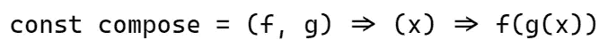

# JavaScript 中的‘Compose’和‘Pipe’是什么？

> 原文：<https://javascript.plainenglish.io/what-is-compose-and-pipe-in-javascript-142e11c4cf2b?source=collection_archive---------11----------------------->

## 为初学者简化 JavaScript 中“组合”和“管道”的概念。


在使用函数式编程时，您是否听说过两个术语，compose 和 pipe？理解起来复杂吗？对我来说，一开始很复杂。在本文中，我将为您简化这些概念。

## 构成

函数组合是一种将多个函数链接起来创建新函数的方法。这是一种通过将问题分解成更小的解决方案来解决问题的方法。



这里，函数 *f* 被应用于函数 *g* 的结果。正如我们看到的，函数组合是从右向左进行的。

假设我们想从网上商店购买一件商品。我们的第一步将是向购物车添加一个项目。然后，如果有折扣，它将被计算。第三步，我们将购买该项目。那我们的推车就空了。

因此，我们的第一个功能是将商品添加到购物车中。让我们创建这个函数:

```
const addItemToCart = (cart, item) => cart.concat([item]);
```

我们的第二个函数将计算折扣并将其应用于商品。

```
const calculateDiscount = (cart) => {
  const updatedCart = cart.map((item) => {
    const discount = (item.price * 20) / 100;
    return {
      item: item.name,
      price: (item.price - discount).toFixed(2),
    }
  })return updatedCart;
}
```

现在，跳过`buyItem`功能。让我们创建我们的`compose`函数。

```
const compose = (f, g) => (cart, item) => f(g(cart, item));
```

这是最终的代码。

```
const useCart = [];const compose = (f, g) => (cart, item) => f(g(cart, item));const addItemToCart = (cart, item) => cart.concat([item]);const calculateDiscount = (cart) => {
  const updatedCart = cart.map((item) => {
    const discount = (item.price * 20) / 100;
    return {
      item: item.name,
      price: (item.price - discount).toFixed(2),
    }
  })return updatedCart;
}const item = { name: 'Laptop', price: 1100.00 };
const purchaseItem = compose(calculateDiscount, addItemToCart);purchaseItem(useCart, item); // result [ { item: 'Laptop', price: 880.00 } ]
```

我已经跳过了需要清空购物车来演示前两个功能的部分。现在让我们制作`buyItem`函数，并对我们的`compose`函数做一些修改。

```
const compose = (f, g, h) => (cart, item) => f(g(h(cart, item)));const buyItem = (cart) => {
  cart = [];
  return cart;
}
```

这是最终的代码。

```
const useCart = [];const compose = (f, g, h) => (cart, item) => f(g(h(cart, item)));const addItemToCart = (cart, item) => cart.concat([item]);const calculateDiscount = (cart) => {
  const updatedCart = cart.map((item) => {
    const discount = (item.price * 20) / 100;
    return {
      item: item.name,
      price: (item.price - discount).toFixed(2),
    }
  })return updatedCart;
}const buyItem = (cart) => {
  cart = [];
  return cart;
}const item = { name: 'Laptop', price: 1100.00 };
const purchaseItem = compose(buyItem, calculateDiscount, addItemToCart);purchaseItem(useCart, item); // result []
```

酷吧？

## 管

*管*完全是*组成*，除了一件事，它从左到右**工作**。让我们把我们的*作曲*改成一个*管道*。

```
const pipe = (f, g, h) => (cart, item) => h(g(f(cart, item)));const purchaseItem = pipe(addItemToCart, calculateDiscount, buyItem);

purchaseItem(useCart, item); // result []
```

就这样，简单吧？

这只是改变了函数执行的顺序，我们可以获得相同的结果。

## 结论

现在，您可以设计接收数据并像制造传送带一样运行的函数，通过这些函数传递数据，直到数据到达输出。

*更多内容请看*[***plain English . io***](https://plainenglish.io/)*。报名参加我们的**[***免费周报***](http://newsletter.plainenglish.io/) *。关注我们关于* [***推特***](https://twitter.com/inPlainEngHQ) ， [***领英***](https://www.linkedin.com/company/inplainenglish/) *，以及* [***不和***](https://discord.gg/GtDtUAvyhW) *。**