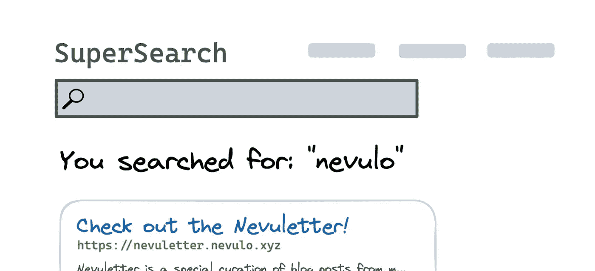
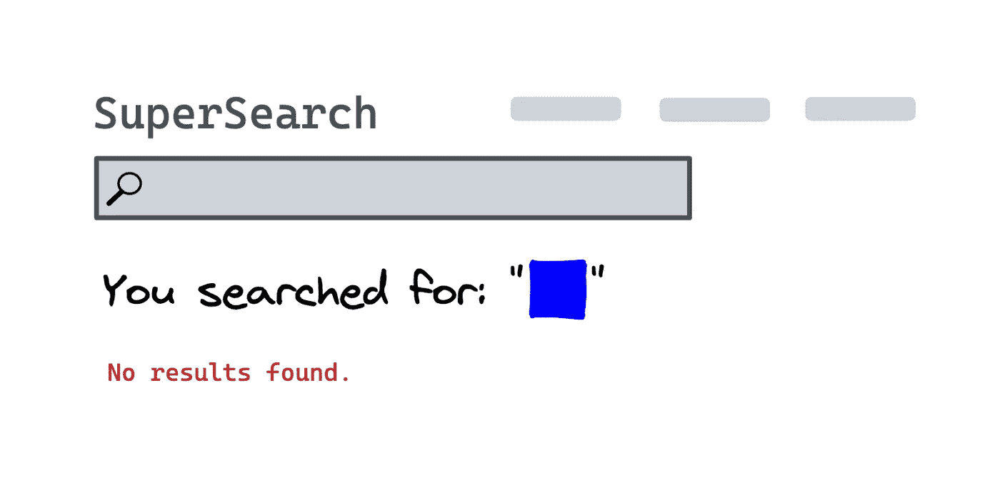

# 什么是跨站点脚本(XSS ),它是如何工作的？

> 原文：<https://javascript.plainenglish.io/what-is-cross-site-scripting-xss-and-how-does-it-work-696077fde647?source=collection_archive---------10----------------------->


Photo by [Nate Grant](https://unsplash.com/@nateggrant?utm_source=medium&utm_medium=referral) on [Unsplash](https://unsplash.com?utm_source=medium&utm_medium=referral)

⚠️:这篇文章纯粹是为了解释的目的——除非你得到批准，否则你不应该试图对网站进行任何类型的安全攻击。

## 什么是跨站脚本？

跨站脚本是一种在网站上执行的攻击，攻击者可以注入一些恶意代码或脚本，执行这些代码或脚本来修改网站的行为。

这最终是一个**安全漏洞**，如果你的网站接受并显示用户输入，但没有得到适当的保护，这将是非常危险的。

跨站脚本是一种古老的攻击，可以追溯到 90 年代，所以这个名字有点过时了。自那以后，代码注入的范围扩大了，所以“跨站点”现在已经不那么重要了——你通常可以直接在网站内执行大多数 XSS 攻击。

但这并没有降低它在今天的重要性。[开放 web 应用安全项目(OWASP)](https://owasp.org/) 策划了一份[2021 年十大 Web 应用安全风险清单](https://owasp.org/Top10/),“注入”(其中包括跨站脚本)发生*27.4 万次*。🤯

## XSS 的类型

跨站点脚本有两种主要类型:

*   *反射*(非持久)XSS，是恶意输入来自当前 HTTP 请求的地方，例如以[查询参数](https://developer.mozilla.org/en-US/docs/Web/API/URL/searchParams#examples)或头的形式。
*   恶意请求*反映*离开 web 服务器，而响应将攻击反映回用户的浏览器。仅适用于该请求，或任何提出相同请求的人。
*   *存储*(持久)XSS，恶意输入在这里得到**存储**在一个永久的地方，比如数据库。每当页面被请求时，恶意输入就会从数据库中被请求并包含在响应中，导致它被呈现为原始 HTML。

## 跨站脚本是如何实现的？

最终，没有单一的方法来执行 XSS 攻击，因为每个网站都有许多攻击媒介和考虑因素，可以改变所需的代码。

一个常见的例子是这样的:假设有一个网站有一个搜索框，向我显示我的搜索输入:

1.  我搜索“ **nevulo** ”，用我的查询向服务器发送请求(*通常是*通过查询参数，但是在请求的某个地方)
2.  我转到一个包含我的搜索结果的新网页，包括我使用的搜索词



1.  重要的是要理解 DOM 包含用户输入。

当你考虑到用户可以在输入中输入 [HTML](https://nevulo.xyz/blog/making-your-own-website) 代码时，问题就开始出现了，如果返回的内容没有经过[适当地净化](https://en.wikipedia.org/wiki/HTML_sanitization)(意味着任何用户输入都被剥离了 HTML)，它将不仅仅显示 HTML 代码，它还会呈现它*字面上的*。

浏览器不知道有什么不同——只要 HTML 有效，它就会执行它看到的任何 HTML。如果我输入:

```
<div style="background: blue; width: 32px; height: 32px;"></div>
```



结果显示我们搜索了一个蓝色方块。这是*反映 XSS* 的一个例子。

如果网站从这些请求参数中获取输入，并按原样返回包含您的输入的新页面，则呈现器不知道真实网站代码和注入代码之间的区别。

因此，无论您在这个易受攻击的网站的输入框中写什么代码，它都会显示输出，就像页面显示您的额外代码一样。

但是，这是危险的⛔️

## 为什么跨站脚本如此危险？

假设你刚刚建立了一个新的社交媒体平台，你的平台让用户能够在他们的个人公共墙上发布小块内容。我将解释*你如何*在站点中引入这个漏洞，但是现在，只要知道你的站点易受 XSS 攻击。

我会注册你的社交平台，因为它很棒。现在我已经有了我的帐号，我想把我的第一篇内容贴到我的墙上！但是，我有一个卑鄙的诡计。

当我去输入框张贴到我的墙上时，我要键入以下内容:

```
<script>
  alert("JavaScript");
</script>
```

还有帖子！任何访问我的个人资料的人都不会在我的墙上看到任何内容，他们只会在浏览器中看到一个警告框，上面写着“JavaScript”。这是*存储 XSS* 的一个例子。

XSS 是一个危险的漏洞，因为如果你可以在网站中注入任何有效的 HTML，你就可以注入像 T0 这样的恶意元素，这样你就可以在窗口环境中执行 JavaScript，这就是强大的力量。

您可以通过访问 JavaScript 进行的一些恶意操作包括:

*   窃取 cookies(可能包含会话数据或其他敏感信息)
*   通过修改 DOM(文档对象模型)来改变页面的外观
*   将用户重定向到另一个页面

如果你的网站易受攻击，所有这些例子以及更多的例子都会对你的用户构成严重威胁。

## 跨站脚本如何成为网站的漏洞？

有不同类型的 XSS 可以用来攻击网站，所以没有一个单一的方式引入漏洞。

反射 XSS 是最常见的攻击类型之一，当网站**接受用户输入**(通常是查询参数)时，它通常会成为大多数网站的一个漏洞，而用户输入*没有经过适当的清理*。然后，**用户输入被呈现在响应**中。

想象一下，如果一个网站有搜索功能，它可能看起来像这样:

1.  用户访问恶意创建的包含 HTML 代码的 URL，以在查询参数中执行 JavaScript。

*   `https://example.com/explore?search=<script>alert('JavaScript');</script>`

一个请求被发送到服务器，服务器将把`search`查询参数添加到最终的 HTML 中，不经过任何处理就返回给用户:

*   `<html> <body> <p><?php echo 'You searched for: ' . $_GET["search"]; ?></p> </body> </html>`

最终的 HTML 在浏览器中呈现，并且执行`script`标签，向用户显示一个警告。

**存储**另一方面，当一些用户输入(比如博客上的评论)被存储在一个永久的位置(比如数据库)时，就会发生 XSS，然后用户的内容被呈现在页面上。

如果输入没有得到适当的净化，并且它包含 HTML 代码，它将加载用户生成的内容并将内容呈现为 HTML。

存储的 XSS 可能看起来像这样:

1.  用户向服务器发送请求，以更新/创建将在某个页面上呈现的数据。这包含恶意的 HTML 输入。
2.  在某种程度上，用户发出请求，服务器用用户用原始 HTML 感染的相关数据进行响应，这些数据直接在 HTML 响应中使用，然后发送回用户。
3.  包含注入的 HTML 代码的最终页面呈现在用户的浏览器中，JavaScript 代码执行。

## 你如何防范 XSS 病毒？

在大多数网站上，您不希望用户输入原始的 HTML 代码，并将用户的输入作为要在您的页面上执行的代码返回。

如果您的网站接受用户输入，并以任何方式(通过输入框、查询参数等)显示给用户，下面是防止您的网站遭受 XSS 攻击的选项的非详尽列表:

## 验证用户输入

第一道防线可以给*一些*保证，用户不会输入你不想要的某些字符，比如 HTML 中使用的`<` `>`尖括号。

这显然是不可靠的，有很多方法可以在不严格使用尖括号的情况下输入 HTML。

但是，如果你只是开始存储某人的年龄，然后在他们的个人资料上显示给他们，最好在一开始就停止任何恶意输入，如果*你知道*存储的输入永远不需要使用 HTML 字符。

**验证必须出现在后端**，而不仅仅是前端。用户很容易绕过前端验证，向后端发送虚假/恶意数据。你的后端作为事实的来源，因为用户不能操纵你的后端逻辑。

## 在使用用户输入的地方转义输出

如果您要向用户返回一个 HTML 文档，其中的最终结果可以根据输入参数进行修改，那么在返回文档之前，您应该对文档中使用的任何用户输入进行转义。

```
<html>
	<body>
		<h1>Your name is <?php
		$new = htmlspecialchars($userInput, ENT_QUOTES);
		echo $new;
		?></h1>
	</body>
</html>
```

如果输入是:`<script>alert(1)</script>`

最终的输出看起来会像这样:`Your name is &lt;script&gt;alert(1)&lt;/script&gt;`

这比在用户浏览器中运行恶意代码要好得多！

通常，当转义内容时，您将通过一个函数传递您想要在页面上显示的用户输入，该函数将返回相同的输入，只是没有 HTML 中使用的任何特殊字符。

这将根据您使用的模板系统而有所不同(有些是默认自动完成的)。无论你使用什么样的模板系统，一定要查阅最近的一个避免用户输入的教程。

## 实施一项`Content-Security`政策

内容安全策略允许您指定从哪里加载或执行 JavaScript(和其他资源)。

因为 XSS 攻击依赖于攻击者能够在易受攻击的网站上运行脚本，要么直接在网页中注入脚本，要么让浏览器从不受信任的第三方下载脚本。

内容安全策略通过“指令”工作，这些指令允许您创建可信内容来源的允许列表，并指示浏览器仅执行或呈现来自这些来源的资源。

通过 HTTP 响应头向您的网站添加一个`Content-Security-Policy`,如下所示:

```
Content-Security-Policy: script-src 'self'
```

您还可以通过 HTML 文档中的`meta`标签指定`Content-Security-Policy`:

```
<meta http-equiv="Content-Security-Policy" content="script-src 'self'" />
```

在上面的策略中，有一个指令`script-src`控制一组与脚本相关的权限，并且`self`(当前页面)是唯一有效的源。默认情况下，它还会禁用使用内联脚本的能力，这是使用该策略的最大安全隐患之一。

这实际上意味着任何试图在您的站点中注入代码的攻击者都不会成功，并且会看到一个错误。

*更多内容请看*[***plain English . io***](https://plainenglish.io/)*。报名参加我们的* [***免费周报***](http://newsletter.plainenglish.io/) *。关注我们关于*[***Twitter***](https://twitter.com/inPlainEngHQ)*和*[***LinkedIn***](https://www.linkedin.com/company/inplainenglish/)*。加入我们的* [***社区不和谐***](https://discord.gg/GtDtUAvyhW) *。*