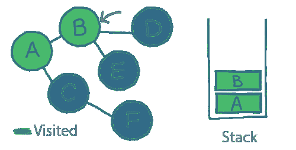

# 什么是深度优先搜索？

> 原文：<https://javascript.plainenglish.io/what-is-depth-first-search-5d221b676798?source=collection_archive---------7----------------------->

## 了解什么是深度优先搜索算法。

在[上一期](/what-is-a-breadth-first-search-f42652896d7c)中，我们谈到了“广度优先搜索”和“深度优先搜索”，这是我们在处理图形时最常用的两种算法。

上次，我们看了广度优先搜索(BFS)。

今天，我们将讨论另一个，深度优先搜索(DFS)。

# 我为什么要在乎？

作为你选择的语言的一部分，很多算法已经为你实现了。这意味着学习它们很有趣，但是你很少自己写。

图的遍历算法是不同的。

我们无时无刻不在使用图形，从在电子商务应用程序中链接相关产品，到在社交网络中映射人们之间的关系。

搜索一个图不仅在理论上有用，而且在实践中你几乎肯定也需要这样做。

# 在 5 分钟或更短时间内:

下面是一个图形数据结构:

图(A-F)中的“节点”称为“顶点”。每个顶点通过“边”连接到一个或多个其他顶点，边是节点之间的线。

但是一个图只有在我们可以用它做一些事情的时候才有用；我们可能想要找出某个元素是否存储在我们的图中，或者在两个元素之间需要多少“跳”。

这类问题被称为“图遍历”，深度优先搜索(或“DFS”)是一种算法。

让我们来看看。

# 深度优先搜索的工作原理

在[这一期](https://www.baseclass.io/newsletter/linear-data-structures)中，我们看了“堆栈”数据结构。

你会记得它是一种“先入后出”的数据结构；要添加到堆栈中的第一个项目将是要移除的最后一个项目:

堆栈是深度优先搜索的基础。

以下是该算法的总结:

*   选取任何未访问的连接节点，将其添加到堆栈中，并将其标记为“已访问”
*   从我们刚刚选择的节点，再次做同样的事情。
*   重复直到我们在没有未访问连接的节点处结束
*   从堆栈中弹出第一个项目，并从下一个项目开始重复整个过程
*   当堆栈为空时，我们就完成了！

这听起来比实际情况更令人困惑，所以让我们看一个例子。

# 实施 DFS

我们从选择一个地方开始，我们将选择`A`。

第一步是将`A`添加到堆栈中，并将其标记为‘visited’:

现在，我们需要重复以下步骤:

*   选取任何未访问的连接节点，将其添加到堆栈中，并将其标记为“已访问”
*   从我们刚刚选择的节点，再次做同样的事情。
*   重复直到我们在没有未访问连接的节点处结束

所以，让我们挑选一个连接的节点，然后开始。

`B`和`C`都连接到`A`。两个都没去过，接下来可以挑一个去参观。还是挑`B`吧。

从`B`出发，我们可以参观`A`、`D`或`E`。我们已经访问过`A`，所以我们忽略它。还是挑`D`吧。

我们将`D`添加到堆栈中，并将其标记为‘visited ’,就像我们之前做的那样:

从`D`开始，没有未访问的节点要访问。只连接到`B`，我们刚去过。

所以，现在是时候这样做了:

*   从堆栈中弹出第一个项目，并从下一个项目开始重复整个过程

我们将从堆栈中弹出`D`并返回到它下面的节点..也就是`B`。

现在我们回到了`B`，我们将再次做同样的事情...

有一个未被访问的节点—`E`—所以我们将访问它并将其添加到堆栈中:

没有未访问的邻居。当我们将它从堆栈中弹出时，我们会看到`B`也没有，所以我们也将它弹出:

这让我们再次回到了图表的顶端，到了`A`。

我相信你现在已经掌握了窍门；我们将继续挑选一个未访问的连通顶点，并将其添加到堆栈中。

以这种方式添加了`C`和`F`之后，堆栈看起来是这样的:

由于`F`没有未访问的连接，我们将其从堆栈中弹出。这同样适用于下一个项目- `C` -然后是`A`。

这就给我们留下了一个空栈，意味着我们完成了！

# DFS 的应用

当我们寻找一个我们知道可能在图表底部的项目时，DFS 算法是有用的。与广度优先搜索不同，DFS 会直接潜到图形的底部，然后再返回。

假设我们有一个家谱，我们正在寻找最年轻的成员。我们知道它们将位于树的底部，因此在这种情况下，DFS 可能是更好的选择。

如果你要搜索的项目可能在图的顶部，考虑“广度优先搜索”。当项目可能更接近底部时，考虑“深度优先搜索”

*我的* [*迅订户*](https://www.baseclass.io/newsletter) *先收到这个。*

*更多内容看* [***说白了。报名参加我们的***](http://plainenglish.io/)***[***免费周报***](http://newsletter.plainenglish.io/) *。在我们的* [***社区不和谐***](https://discord.gg/GtDtUAvyhW) *获得独家获取写作机会和建议。****